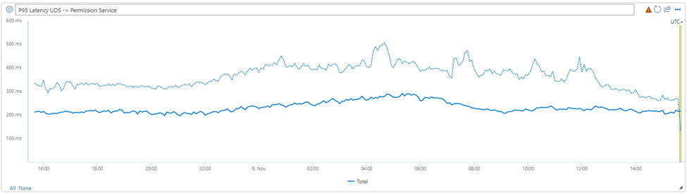

At Microsoft, we are constantly working on modernizing our services to make them faster, more efficient, and up to date with the latest technologies. In this blog post, we will cover one of Microsoft Teams' Services, Permission Service, how the migration to .NET 6 helped increase the performance by 100% and reduced latency by 30-45%!

Permissions Service is the backend service that ensures user's safety and privacy in key communication scenarios. The service acts as a decision engine and evaluates user and tenant policies to decide if a user is allowed to see someone's presence, add a user to a team or group chat, initiate a 1:1 chat, create a meeting, or call another user. Because the Permission Service is on the call path for these latency sensitive and high-volume user flows, the service has strict performance and latency requirements.

The Permission Service was built in 2013 to support Skype and since then it evolved to support a much larger scope with the launch of Microsoft Teams, Teams for Life, Azure Communication Services while leveraging the same core tech stack. Before the migration to .NET 6, our service was using .NET Framework 4.7.2, Azure's Classic Cloud Services, and the API was written with OWIN/Katana. Our service did not leverage HostBuilder, IOptions, ILogger pattern or Dependency Injection at all. This legacy tech stack was affecting our velocity of development. For example, with every new dependency, logger, or configuration we would add, we would need to pass it through constructors, which on a service this big was prone to human error and was a time-consuming operation.

In 2022, we joined the [organization-wide initiative](https://devblogs.microsoft.com/dotnet/microsoft-teams-infrastructure-and-azure-communication-services-journey-to-dotnet-6/) of migrating our service to .NET 6 (LTS version at the time). It was a fantastic opportunity to benefit from the performance increase of .NET 6, to reduce costs and to learn more about its current capabilities and apply them to our service.

## The Process

The process for migration started with understanding what our blocking dependencies, not compatible with the new SDK, would be and create a step-by-step plan. We reached out to other teams that went through the process of migration to .NET 6 to apply their learnings and avoid common mistakes.

This process took ~2 weeks and we identified the following key items of work:

- Update all projects to SDK style format.
- Modernize the codebase (this included onboarding to Host Builders, with dependency injection, `ILogger` and `IOptions` pattern…)
- Replace blocking dependencies with .NET 6 compatible and maintained alternatives.
- Set the build target of all projects to .NET 6.
- Replace OWIN/Katana with Kestrel and ASP.NET
- Update CI/CD to support the .NET 6 SDK.

## The Execution

The execution of the migration to .NET 6 took one dedicated engineer ~16 weeks of effort along with the support of two reviewers from the team. During the execution we had several learnings:

### More than just an SDK migration

The migration to .NET 6 was more than an SDK migration. Moving to .NET 6 allowed us to delete tens of thousands of lines of legacy code (about 50% of the codebase) because we were able to replace custom-implemented features with features now natively available in ASP.NET or .NET 6 (telemetry was one of the major areas for reduction in legacy code).

### Service needs to remain in a deployable state

Because we knew this migration was going to take some time, we needed to keep the service in a deployable state while working on the migration. Currently, we still depend on Azure Cloud Services and a Cloud Service project cannot have multi-targeting, it must either be .NET 6 or .NET Framework (Kubernetes is on our roadmap next).

We addressed this issue by running build pipeline scripts to change the target of our projects and create separate artifacts for release. We chose this solution because it would be transparent to the developer and easier to maintain, rather than having two different projects with the exact same code, but different SDK.

### Slight change, big issue: Connection Lease Timeout

With .NET 6, the [ServicePointManager is not recommended](https://learn.microsoft.com/dotnet/api/system.net.servicepointmanager). Therefore, we moved our HTTP clients to the [IHttpClientFactory pattern](https://learn.microsoft.com/dotnet/api/system.net.http.httpclient). However, we did not move our `ConnectionLeaseTimeout` configuration to the Sockets Http Handler. The resulted in Permission Service not reacting to DNS changes that caused issues when our service's dependencies were following an A/B deployment model. For example:

- Permission Service starts, connects to faulty instance of Service A
- Service A shifts traffic to non-faulty instance
- Permission Service does not react to this traffic shifting because the connections do not close.

We learned from this issue that we should always pay attention to documentation of each component we are migrating. This particular issue is well documented on the [HttpClient guidelines](https://learn.microsoft.com/dotnet/fundamentals/networking/http/httpclient-guidelines).

## An interesting observation during the rollout

Permission Service follows a partition-based deployment model. We deploy to 1% in all regions, then 5%, then 10%... and each step represents a single partition.

When rolling out the .NET 6 version of the service to the first partition, we saw an increase in CPU utilization.

That is weird… Shouldn't .NET 6 be more efficient?

After observing other metrics of our service, we found that this single partition was getting **5 times more traffic**.

Because this .NET 6 based partition was 2x more efficient than the others, it started stealing traffic from them, which we did not expect. This learning was a good first impression of .NET 6's performance and had no negative impact on the service.

To measure efficiency, we use the [Q-Factor](https://devblogs.microsoft.com/dotnet/microsoft-teams-infrastructure-and-azure-communication-services-journey-to-dotnet-6/). For Permission Service, we calculate it using the amount of work done by the service, the number of incoming requests, for example, divided by the CPU utilization. For this single partition, we were able to see an increase of 100%!

This will allow us to reduce our cores allocation and consequently the cost of running our service.

## The Results

The migration to .NET 6 provided improvements on many fronts:

### Output Latency

Our HTTP client implementation became faster and the farther the dependency would be, in network distance, the bigger the improvements. We saw up to 45% outgoing latency improvement in two test regions, both on average and 99th percentiles!

### Input Latency

We saw a ~30% overall reduction (average, 95th and 99th percentiles) in the latency for Permissions Service from when a request comes to when the response is sent.

Some services saw higher improvements on calling our service, with one partner observing 36% overall latency improvement.

## Summary

.NET 6 has brought us benefits, not only in terms of performance and costs, with ~50% improvement of CPU utilization, but it opened our eyes to other improvements we can work on. For example, its cross-platform capabilities will allow us to explore containerization on Linux, with [Microsoft's CBL-Mariner distribution](https://github.com/microsoft/CBL-Mariner), which we expect will give us 30% more efficient networking.

From a user's perspective, this migration resulted in faster chatting, calling, team creation, presence fetch and an overall faster Microsoft Teams, Skype, and ACS (Azure Communication Services), due to our ~30% latency reduction, and that's the biggest win of this project!
