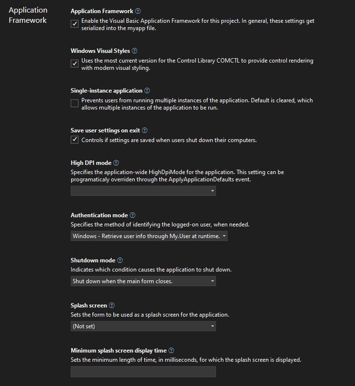
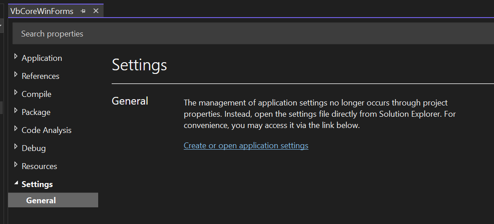
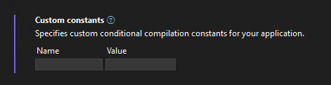
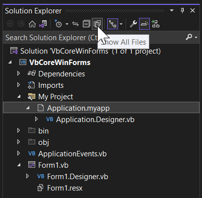
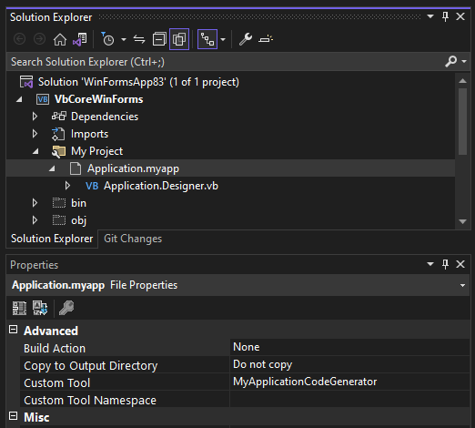
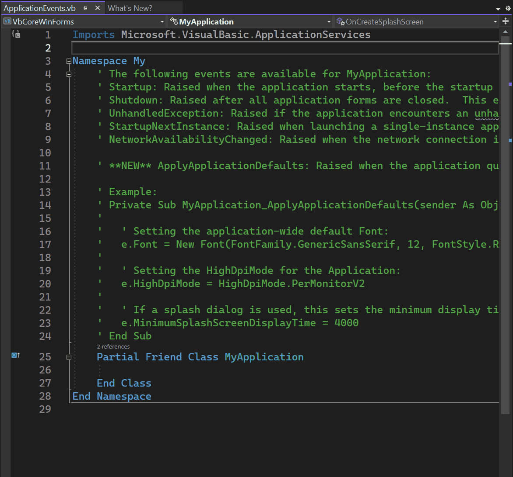

.NET from version .NET Core 3.1 up to .NET 7 has plenty of advantages over .NET
Framework: it provides performance improvements in almost every area, and those
improvements were an ongoing effort over each .NET version. The
latest improvements in [.NET
6](https://devblogs.microsoft.com/dotnet/performance-improvements-in-net-6/) and
[.NET
7](https://devblogs.microsoft.com/dotnet/performance_improvements_in_net_7/) are
really worth checking out.

Migrating your Windows Forms (WinForms) Visual Basic Apps to .NET 6/7+ also
allows to adopt modern technologies which are not (or are no longer) supported in .NET
Framework. [EFCore is one example](https://learn.microsoft.com/ef/core/): it is
a modern Entity Framework data access technology that enables .NET developers to
work with database backends using .NET objects. Although it is not natively
supported for VB by Microsoft, it is designed in a way that it is easy for the
community to build up on it and provide [code generation support for additional
languages like Visual Basic](https://github.com/efcore/EFCore.VisualBasic). In
that context there are also changes and improvements in the new WinForms
Out-of-Process Designer for .NET, [especially around Object Data
Sources](https://devblogs.microsoft.com/dotnet/databinding-with-the-oop-windows-forms-designer/).
For the WinForms .NET runtime, there are a series of improvements in different
areas which have been introduced with the latest releases of .NET:

* .NET 5 [introduced the `TaskDialog`
  control](https://devblogs.microsoft.com/dotnet/whats-new-in-windows-forms-runtime-in-net-5-0/#new-taskdialog-control),
  a series of [`ListView` control
  enhancements](https://devblogs.microsoft.com/dotnet/whats-new-in-windows-forms-runtime-in-net-5-0/#listview-enhancements),
  [`FileDialog` class
  enhancements](https://devblogs.microsoft.com/dotnet/whats-new-in-windows-forms-runtime-in-net-5-0/#filedialog-enhancement)
  and a noticeable [performance and memory usage improvement around
  GDI+](https://devblogs.microsoft.com/dotnet/whats-new-in-windows-forms-runtime-in-net-5-0/#performance-improvements).
  .NET (in .NET Core 3.1) also changed the default font for WinForms Forms
  and UserControls to Segoe UI, 9pt to let the typical WinForms UI have a more
  modern look and feel.

* .NET 6 built on that, and introduced the option to set the default font for
  the whole WinForms Application to what ever font you like. In the VB
  Application Framework, this is done now by an additional Application Event
  which we introduced in the .NET 6 time frame called
  [`ApplyApplicationDefaults`](https://learn.microsoft.com/dotnet/api/microsoft.visualbasic.applicationservices.windowsformsapplicationbase.applyapplicationdefaults?view=windowsdesktop-7.0). This event allows to set values for the
  [HighDpiMode](https://learn.microsoft.com/dotnet/api/microsoft.visualbasic.applicationservices.applyapplicationdefaultseventargs.highdpimode?view=windowsdesktop-7.0#microsoft-visualbasic-applicationservices-applyapplicationdefaultseventargs-highdpimode),
  the [application's default
  font](https://learn.microsoft.com/dotnet/api/microsoft.visualbasic.applicationservices.applyapplicationdefaultseventargs.font?view=windowsdesktop-7.0#microsoft-visualbasic-applicationservices-applyapplicationdefaultseventargs-font)
  and the [minimum splash dialog display
  time](https://learn.microsoft.com/dotnet/api/microsoft.visualbasic.applicationservices.applyapplicationdefaultseventargs.minimumsplashscreendisplaytime?view=windowsdesktop-7.0#microsoft-visualbasic-applicationservices-applyapplicationdefaultseventargs-minimumsplashscreendisplaytime).
  For more about the Application Events in the VB Application Framework see below.

* .NET 7 introduces [Command Binding for
  WinForms](https://devblogs.microsoft.com/dotnet/winforms-cross-platform-dotnet-maui-command-binding/),
  which makes it easier to apply a UI Controller architecture based on the MVVM
  pattern for WinForms Apps, and introduce Unit Tests to WinForms App. General
  improvements in WinForms in addition to that were [rendering in HighDPI per
  Monitor V2
  scenarios](https://devblogs.microsoft.com/dotnet/winforms-enhancements-in-dotnet-7/#high-dpi-and-scaling-improvements)
  and - counting for all versions from .NET 5 to .NET 7 - [repeatedly improved
  accessibility
  support](https://devblogs.microsoft.com/dotnet/winforms-enhancements-in-dotnet-7/#accessibility-improvements-and-fixes)
  with Microsoft UI Automation pattern work better with accessibility tools like
  Narrator, Jaws and NVDA.

## The new Visual Basic Application Framework Experience

In contrast to the project property Application Framework Designer experience in
earlier versions of Visual Studio and for .NET Framework, you will noticed that
the project properties UI in Visual Studio has changed. It's style is now in
parity with the project properties experience for other .NET project types: we
have invested into modernizing the experience for developers, focusing on
enhancing productivity and a modern look and feel.



We've added theming and search to the new experience. If this is your first time
you're working with the new project properties experience in Visual Studio, it's
a good idea to read up on the [the introductory
blog](https://devblogs.microsoft.com/visualstudio/revamped-project-properties-ui/).

In contrast to C# projects, Visual Basic Application Framework projects use a
special file for storing the Application Framework project settings: the
_Application.myapp_ file. We'll talk more about the technical details of how
this file connects the project settings to the VB project specific code
generation of the `My` namespace later, but one thing to keep in mind is how the
UI translates each property's value to this file:

* **Windows Visual Styles** is to determine if the application will use the most
  current version for the Control Library _comctl.dll_ to provide control
  rendering with modern visual styling. This setting translates to the value
  `EnableVisualStyles` of type `Boolean` inside of _Application.myapp_.

* **Single-instance application** is to determine if the application will prevent
users from running multiple instances of the application. This setting is
switched off by default, which allows multiple instances of the application to
be run concurrently. This setting translates to the value `SingleInstance` of
type `Boolean`.

* **Save user settings on exit** is to determine if the application settings are
  automatically saved when an app is about to shut down. The settings can be
  changed with the settings editor. In contrast to .NET Framework, a new Visual
  Basic Application Framework App doesn't contain a settings file by default,
  but you can easily insert one over the project properties, should you need
  one, and then [manage the settings
  interactively](https://learn.microsoft.com/visualstudio/ide/managing-application-settings-dotnet?view=vs-2022).

    

  Adding to the list of settings automatically generates respective code, which
  can be easily access over the [`My` object in the Visual Basic Application
  Framework at
  runtime](https://learn.microsoft.com/dotnet/visual-basic/language-reference/objects/my-settings-object).
  This settings translates to the value `SaveMySettingsOnExit` of type
  `Boolean`.

* **High DPI mode** is to identify the application-wide HighDpiMode for the
  application. Note that this setting can be programmatically overridden through
  the [`HighDpiMode`
  property](https://learn.microsoft.com/dotnet/api/microsoft.visualbasic.applicationservices.applyapplicationdefaultseventargs.highdpimode?view=windowsdesktop-7.0)
  of the `ApplyApplicationDefaultsEventArgs` of the [`ApplyApplicationDefaults`](https://learn.microsoft.com/dotnet/api/microsoft.visualbasic.applicationservices.windowsformsapplicationbase.applyapplicationdefaults?view=windowsdesktop-7.0)
  application event. Choose from the following setting:

  * **DPI unaware (0):** The application window does not scale for DPI changes and
    always assumes a scale factor of 100%. For higher resolutions, this will
    make text and fine drawings more blurry, but may impose the best setting for
    some apps which demand a high backwards compatibility in rendering content.
  * **DPI unaware GDI scaled (4):** similar to DPI unaware, but improves the
    quality of GDI/GDI+ based on content. Please note that this mode will _not_
    work as expected, when you have enabled [double
    buffering](https://learn.microsoft.com/dotnet/api/system.windows.forms.control.doublebuffered?view=windowsdesktop-7.0)
    for control rendering via [`OnPaint`](https://learn.microsoft.com/dotnet/api/system.windows.forms.control.onpaint?view=windowsdesktop-7.0) and related functionality.
  * **Per monitor (2):** Per-Monitor DPI allows individual displays to have their
    own DPI scaling setting. WinForms doesn't optimize for this mode, and
    Per-Monitor V2 should be used instead.
  * **Per monitor V2 (3):** Per-Monitor V2 offers more advanced scaling features
    such as improved support for mixed DPI environments, improved display
    enumeration, and support for dynamically scaling on-client area of windows.
    In WinForms common controls are optimized for this high dpi mode. Please
    note the events
    [Form.DpiChange](https://learn.microsoft.com/dotnet/api/system.windows.forms.form.dpichanged?view=windowsdesktop-7.0),
    [Control.DpiChangedAfterParent](https://learn.microsoft.com/dotnet/api/system.windows.forms.control.dpichangedafterparent?view=windowsdesktop-7.0)
    and
    [Control.DpiChangeBeforeParent](https://learn.microsoft.com/dotnet/api/system.windows.forms.control.dpichangedbeforeparent?view=windowsdesktop-7.0),
    when your app need to scale up or down content based on a changed DPI
    environment, for example, when the user of your app has dragged a Form from
    one monitor to another monitor with a different DPI setting.
  * **System aware (1):** The application queries for the DPI of the primary
    monitor once and uses this for the application on all monitors. When content
    in Forms is dragged from one monitor to another with a different HighDPI
    setting, content might become blurry. SystemAware is WinForm's most
    compatible high-dpi rendering mode for all supported controls.

* **Authentication mode** is to specify the method of identifying the logged-on
  user, when needed. The setting translates to the value `AuthenticationMode` as
  an enum value of type `Integer`:
  * 0: The `WindowsFormsApplicationBase(AuthenticationMode)` constructor does
    not automatically initialize the principal for the application's main
    thread. It's completely the developer's task, to manage authentication for
    the user.
  * 1: The `WindowsFormsApplicationBase(AuthenticationMode)` constructor
    initializes the principal for the application's main thread with the current
    user's Windows user info.

* **Shutdown mode** is to to indicate which condition causes the application to
  shut down. This setting translates to the value `ShutdownMode` as an enum
  value of type `Integer` (Note: Please also refer to the application event
  [ShutDown](https://learn.microsoft.com/dotnet/api/microsoft.visualbasic.applicationservices.windowsformsapplicationbase.shutdown?view=windowsdesktop-7.0)
  and the further remarks down below.):
  * 0: When the main form closes.
  * 1: Only after the last form closes.

* **Splash screen** represents the name of the form to be used as a splash screen
  for the application. Note that the file name does not need to include the
  extension (.vb). This setting translates to the value `SplashScreen` of type
  `String`.

    > **Note:** you will may be missing the settings for the Splash dialog up to
    > Visual Studio 2022 version 17.5. For a workaround, read the comments in
    > the section "A look behind the scenes". To recap: a "Splash" dialog is
    > typically displayed for a few seconds when an application is launched.
    > Visual Basic has an item template which you can use to add a basic splash
    > dialog to your project. It usually displays the logo or name of the
    > application, along with some kind of animation or visual effects, to give
    > users the impression that the application is loading or initializing. The
    > term "splash" in this context is used because the dialog is designed to
    > create a splash or impact on the user, drawing their attention to the
    > application while it loads.

* **Application Framework** is saved both in the _Application.myapp_ file and the
_.vbproj_ file:
  * _Application.myapp_ saves the setting `MySubMain` of type `Boolean` to
    identify if the Application Framework is enabled.
  * _.vbproj_ uses the setting `MyType` for identifying the usage of the
    Application Framework for a VB project. If the Application Framework is
    enabled, the value is _WindowsForms_; if the Application Framework is
    disabled, the value is _WindowsFormsWithCustomSubMain_.

* **Startup object** is the name of the form that will be used as the entry
point, without its filename extension. Note: this property is found in the
project property Settings under the _General_ section, and not in the
Application Framework section. This setting translates to the value `MainForm` of type
`String`, when the Application Framework is activated. The start object setting in
the _.vbproj_ file is ignored in that case - see also the comments below on this
topic.

### Custom constants new look



We are introducing a new custom constants-control in the modernized Project
Property Pages for VB Projects, that allows to encode the input to the format
key="value". Our goal is that users will be able to input their custom constants
in a more streamlined key-value pair format, thus enhancing their productivity.
Feedback is welcomed - if you have any comments or suggestions, feel free to
reach out to the [project system
team](https://github.com/dotnet/project-system/) by filing a new issue or
comment on existing ones.

## A look behind the scenes of the WinForms VB Application Framework

The way basic properties and behaviors of a WinForms app are controlled and configured is fundamentally different between C# and Visual Basic. In C#, every app
starts with a static method called `main` which can usually be found in a file
called _Program.cs_, and in that `main` method all the setting get applied.

That is different in Visual Basic. Since VB Apps in WinForms are based on the
Application Framework runtime, there are a few features, which aren't
intrinsically available to C# WinForms apps to begin with, like configuring to
automatically show Splash dialogs (see below) or ensure a single instance
application start. Since you configure most of the parts of your app
interactively in VB with the settings described above at design time, the actual
code which honors or ensures those settings later at runtime is mostly
code-generated and somewhat hidden behind the scenes. The starting point of a VB
app is therefore not so obvious. There are also a series of differences in .NET
Visual Basic apps when it comes to hooking up event code which is supposed to
run, for example when a VB WinForms app starts, ends, or runs into an unhandled
exception - just to name a few examples.

That all said, technically Visual Basic doesn't break any fundamental rules.
Under the hood, there is of course a `Shared Sub Main` when you activate the
Application Framework. You just do not write it yourself, and you don't see it,
because it is generated by the VB compiler and then automatically added to your
Start Form. This is done by activating the VB compiler switch
[`/main`](https://learn.microsoft.com/dotnet/visual-basic/reference/command-line-compiler/main).

At the same time, when you are activating the Application Framework, a series of
conditional compiler constants are defined. One of the constants is called
`_mytype`. If that constant is defined as `Windows` then the VB compiler
generates all the necessary infrastructure code to support the Application
Framework. If that constant is defined as `WindowsFormsWithCustomSubMain`
however, the VB compiler just generates the bare minimum infrastructure code and
doesn't apply any settings to the WinForms app on startup. The latter happens,
when you deactivate the Application Framework. This setting is stored in the
_vbproj_ project file, along with the Start Form. What's important to know
though in this context: only in the case of `WindowsFormsWithCustomSubMain`, so
with the Application Framework _deactivated_, is the Start Form definition
actually taken from the _vbproj_ file. When the Application Framework _is_
activated however then that is the case when the aforementioned
_Application.myapp_ file is used as the settings container. Note, that by
default you cannot find that file in the solution explorer.



You need to make sure first to show _all files_ for that project (see screenshot
above). Then you can open the _My Project_-folder and show that setting file in
the editor by double-clicking it in the solution explorer. The content of that
file looks something like this:

```xml
<?xml version="1.0" encoding="utf-16"?>
<MyApplicationData xmlns:xsi="http://www.w3.org/2001/XMLSchema-instance" xmlns:xsd="http://www.w3.org/2001/XMLSchema">
  <MySubMain>true</MySubMain>
  <MainForm>Form1</MainForm>
  <SingleInstance>false</SingleInstance>
  <ShutdownMode>0</ShutdownMode>
  <EnableVisualStyles>true</EnableVisualStyles>
  <AuthenticationMode>0</AuthenticationMode>
  <SaveMySettingsOnExit>true</SaveMySettingsOnExit>
  <HighDpiMode>3</HighDpiMode>
</MyApplicationData>
```

**Note:** Visual Studio 2022 before version 17.6 (Preview 3) won't have the
option to pick a Splash Dialog interactively, as mentioned above. We will have
an interactive designer for setting the splash form only from that version on
on. Up to then, you can manually patch the _Application.myapp_ file to trigger
the code generation for the Splash dialog. Insert the following line of code in
that file and save the changes.

```xml
<SplashScreen>SplashDialog</SplashScreen>
```

When you do this, make sure _not_ to include the filename extension (.vb) in
that definition, because otherwise the required code does not get generated.

### Application.myapp as the source for code generation

Now, if you take a closer look at that file's properties in the property
browser, you'll see that it is triggering a custom tool which is invoked
whenever that file is saved. 



And that custom tool generates VB code which you
can find under the _Application.myapp_ node in the Solution Explorer in
_Application.Designer.vb_. It does the following:

* It defines a `Friend Partial Class MyApplication`. With the Application
  Framework enabled, that class is inherited from
  [`WindowsFormsApplicationBase`](https://learn.microsoft.com/dotnet/api/microsoft.visualbasic.applicationservices.windowsformsapplicationbase?view=windowsdesktop-7.0).
  You don't see that `Inherits` statement here and the reason is that [the major
  part of that Class'
  definition](https://github.com/dotnet/roslyn/blob/main/src/Compilers/VisualBasic/Portable/Symbols/EmbeddedSymbols/VbMyTemplateText.vb)
  is injected by the Visual Basic compiler based on the earlier defined
  conditional constant `_myapp`.
* It generates the code to apply all the settings which were saved in
  _Application.myapp_ file.
* It creates code for a method which overrides
  [`OnCreateMainForm`](https://learn.microsoft.com/dotnet/api/microsoft.visualbasic.applicationservices.windowsformsapplicationbase.oncreatemainform?view=windowsdesktop-7.0).
  In that method, it assigns the Form, which is defined as the start form in the
  _Application.myapp_ file.

> **Warning**: The _Application.Designer.vb_ is not supposed to be edited, as it's
auto-generated. Any changes will be lost as soon as you make changes to _Application.myapp_. Instead, use the project properties UI.

Now, the class which is injected by the compiler is also responsible for
generating everything which the Visual Basic Application Framework provides you
via the `My` namespace. The `My` namespace simplifies access to frequently used
information about your WinForms app, your system, or simplifies access to
frequently used APIs. Part of the `My` namespace for an activated Application
Framework is the `Application` property, and its return type is of exactly that
type which is defined by the class generated based on your Application Settings
and then merged with the injected Visual Basic compiler file mentioned earlier.
So, if you access `My.Application` you are basically accessing a single instance
of the `My.MyApplication` type which the generated code defines.

With this context understood, we can move on to how two additional features of
the Application Framework work and can be approached. The first one is extending
the `My` namespace with additional function areas. We won't go too much into
them, because there are [detailed docs about the `My` namespace and how to
extend
it](https://learn.microsoft.com/dotnet/visual-basic/developing-apps/customizing-extending-my/extending-the-my-namespace).

An even more important concept to understand are the Application Events which are
provided by the Application Framework. Since there isn't a good way to intercept
the startup or shut down of an app (since that code gets generated
and sort of hidden inside the main Form) Application Events are the way to be
notified of certain application-global occurrences.  

Note in this context, that there is a small breaking change in the UI: while in
.NET Framework, you had to insert a code file named _ApplicationEvents.vb_ via
the Property Settings of the VB project, in a .NET Core App this file will be
there from the start when you've created a new Application Framework project.

To wire up the available Application events, you open that _ApplicationEvent.vb_
code file, and then you select ApplicationEvents from the Object drop-down list,
and the application event you want to write up from the events list:



As you can see, the _ApplicationEvent.vb_ code file again extends the `MyApplication` class - this time by the events handler you place there on demand. The options you have here are:

* [**`Startup`**](https://learn.microsoft.com/dotnet/api/microsoft.visualbasic.applicationservices.windowsformsapplicationbase.startup?view=windowsdesktop-7.0): raised when the application starts, before the start form is created.
* [**`Shutdown`**](https://learn.microsoft.com/dotnet/api/microsoft.visualbasic.applicationservices.windowsformsapplicationbase.shutdown?view=windowsdesktop-7.0): raised after all application forms are closed.  This event is not raised if the application terminates abnormally.
* [**`UnhandledException`**](https://learn.microsoft.com/dotnet/api/microsoft.visualbasic.applicationservices.windowsformsapplicationbase.unhandledexception?view=windowsdesktop-7.0): raised if the application encounters an unhandled exception.
* [**`StartupNextInstance`**](https://learn.microsoft.com/dotnet/api/microsoft.visualbasic.applicationservices.windowsformsapplicationbase.startupnextinstance?view=windowsdesktop-7.0): raised when launching a single-instance application and the application is already active.
* [**`NetworkAvailabilityChanged`**](https://learn.microsoft.com/dotnet/api/microsoft.visualbasic.applicationservices.windowsformsapplicationbase.networkavailabilitychanged?view=windowsdesktop-7.0): raised when the network connection is connected or disconnected.
* [**`ApplyApplicationDefaults`**](https://learn.microsoft.com/dotnet/api/microsoft.visualbasic.applicationservices.windowsformsapplicationbase.applyapplicationdefaults?view=windowsdesktop-7.0): raised when the application queries default values to be set for the application.

**Note:** More general information about the [Visual Basic Application Model](https://learn.microsoft.com/dotnet/visual-basic/developing-apps/development-with-my/overview-of-the-visual-basic-application-model) is provided through the Microsoft Learn Docs about this topic. Also note, that, on top of the extensibility of the `My` namespace, this [Application Model also has extensibility points](https://learn.microsoft.com/dotnet/visual-basic/developing-apps/customizing-extending-my/extending-the-visual-basic-application-model) which are also described in great detail by the respective docs.

## Summary

With the new and modernized project properties pages, WinForm's Application
Framework is ready for new, .NET 6,7,8+ based Visual Basic Apps to develop. It's
also the right time to think about modernizing your older .NET Framework based
VB Apps and bring them over to .NET 6,7,8+. WinForms and the .NET runtime
deliver countless new features and provide considerable performance improvements
for your apps in almost every area. Visual Basic and the Visual Basic
Application Framework are and continue to be first class citizens and are fully
supported in WinForms. Our plans are to continue modernizing around the VB App
Framework in the future without breaking code for existing projects.

And, as always: Feedback about the subject matter is really important to us, so
please let us know your thoughts and additional ideas! Please also note that the
WinForms .NET and the [Visual Basic Application Framework runtime](https://github.com/dotnet/winforms/tree/main/src/Microsoft.VisualBasic.Forms/src/Microsoft/VisualBasic/ApplicationServices) is open source,
and you can contribute! If you have general feature ideas, encountered bugs, or
even want to take on existing issues around the WinForms runtime and submit PRs,
have a look at the [WinForms Github repo](https://github.com/dotnet/winforms).
If you have suggestions around the WinForms Designer feel free to file new
issues there as well.

Happy coding!
