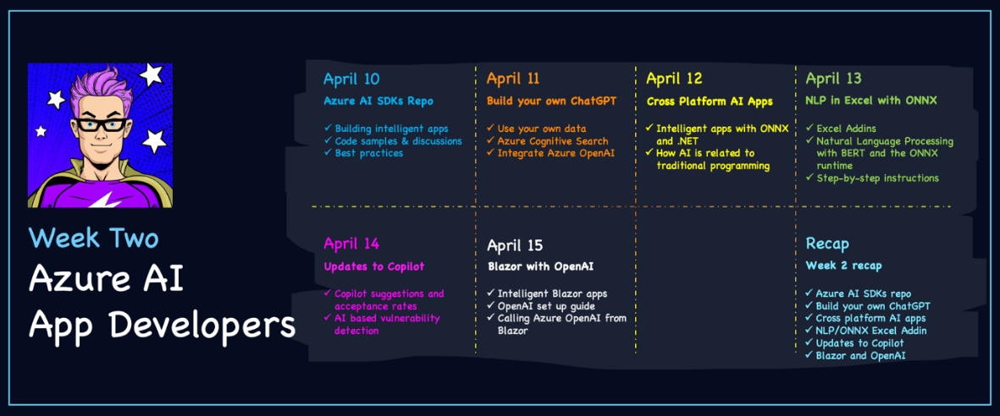

AI has been a hot topic for years, but recently we’ve seen the technology become accessible to a broad range of users. For example, it took less than a week for OpenAI’s ChatGPT to reach a million users, and it crossed the 100 million user mark in under two months. It’s a great example of how AI can be used to make our lives easier and more productive.

It’s also an exciting time to be a .NET developer building intelligent apps, it’s never been easier to integrate Azure AI services and build intelligent apps.

### Introduction to #30DaysOfAzureAI

April AI [#30DaysOfAzureAI](https://azureaidevs.github.io/test-hub/2023-aia) is a series of daily posts throughout April focused on Azure AI. Hear from our experts in the product teams, cloud advocacy, community and follow along at your own pace! Where relevant, the daily posts have accompanying Open-Source repositories, code samples, and other resources.

### AI April Intelligent App Developers Week

Week two of #30DaysOfAzureAI explores building intelligent apps using Azure AI services or embedding ML models trained by others.  

You may way to review the "[Azure AI Fundamentals](https://azureaidevs.github.io/test-hub/roadmap/30days#week-1-fundamentals)" content from week one of #30DaysOfAzureAI.

You can follow along on LinkedIn or Twitter, search for hashtag #30DaysOfAzureAI.

#### [April 10 – 👩‍💻 Build intelligent apps with Azure AI SDKs](https://azureaidevs.github.io/test-hub/2023-aia/day9)

Learn about .NET SDKs for app developers building intelligent apps calling Azure AI Services.

#### [April 12 – 👩‍💻 Cross-Platform AI with ONNX and .NET](https://azureaidevs.github.io/test-hub/2023-aia/day11)

Learn how to build cross-platform intelligent apps with .NET MAUI and the ONNX runtime.

#### [April 15 – 👩‍💻 Blazor apps and Azure OpenAI](https://azureaidevs.github.io/test-hub/2023-aia/day14)

Learn about building .NET web assemblies with Microsoft Blazor and how you can call upon the Azure OpenAI service to create a rich, interactive, and intelligent web app.  

 

Enjoy! 