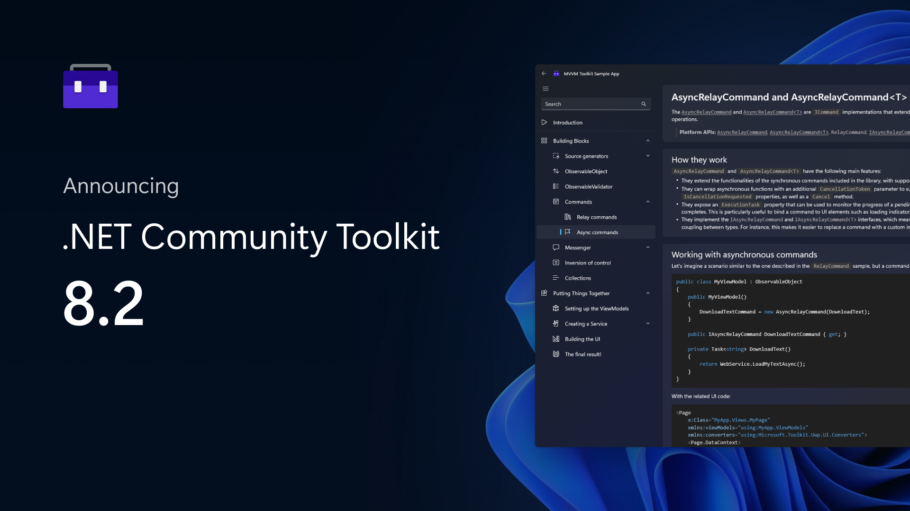
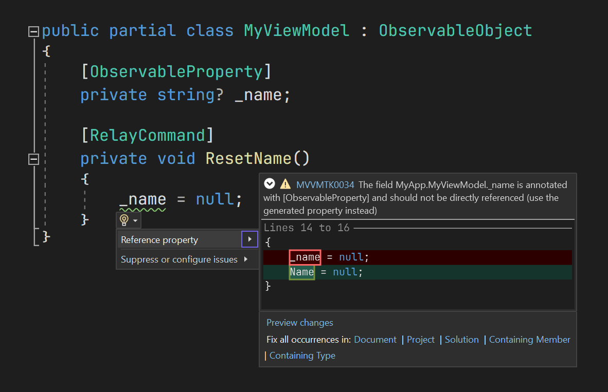

We're happy to announce the official launch of the 8.2 release of the .NET Community Toolkit! This new version includes performance improvements both at runtime and in the MVVM Toolkit source generators, new code fixers to enhance your productivity, new user requested features and much more!

[](https://aka.ms/toolkit/dotnet/)

As always, we deeply appreciate all the feedback received both by teams here at Microsoft using the Toolkit, as well as other developers in the community. All the issues, bug reports, comments and feedback continue to be extremely useful for us to plan and prioritize feature work across the entire .NET Community Toolkit. Thank you to everyone contributing to this project and helping make the .NET Community Toolkit better! 🎉

## What's in the .NET Community Toolkit? 👀

The .NET Community Toolkit includes the following libraries:

- `CommunityToolkit.Common`
- `CommunityToolkit.Mvvm` (aka "Microsoft MVVM Toolkit")
- `CommunityToolkit.Diagnostics`
- `CommunityToolkit.HighPerformance`

These components are also widely used in several inbox apps that ship with Windows, such as the Microsoft Store and the Photos app! 🚀

> For more details on the history of the .NET Community Toolkit, [here is a link to our previous 8.0.0 announcement post](https://devblogs.microsoft.com/dotnet/announcing-the-dotnet-community-toolkit-800/).

Here is a breakdown of the main changes that are included in this new 8.2 release of the .NET Community Toolkit.

## Custom attributes for `[RelayCommand]` 🤖

Following up on the work done in the [8.1.0 release](https://devblogs.microsoft.com/dotnet/announcing-the-dotnet-community-toolkit-810/), and [as suggested on GitHub](https://github.com/CommunityToolkit/dotnet/issues/599), the new 8.2.0 release of the MVVM Toolkit includes support for custom attributes when using `[RelayCommand]`. Once again, we leveraged the native `field:` and `property:` C# syntax to indicate targets of custom attributes. With this, you now have full control over attributes for all generated members when using `[RelayCommand]` to generate an MVVM command.

For instance, this is particularly useful when using a viewmodel that needs to support JSON serialization, and you need to explicitly ignore the generated property. You can use the new `field:` and `property:` support as follows:

```csharp
[RelayCommand]
[property: JsonIgnore]
private void DoWork()
{
    // Do some work here...
}
```

This will then generate the following members behind the scenes:

```csharp
private RelayCommand? _doWorkCommand;

[JsonIgnore]
public IRelayCommand DoWorkCommand => _doWorkCommand ??= new RelayCommand(DoWork);
```

As you'd expect, the generated `DoWorkCommand` property has the specified attribute over it! And of course, this supports attributes with any number of constructor and named parameters as well. You can also use either just `field:`, `property:`, or any combination of the two 🙌

> You can find all of our docs on the new source generators [here](https://learn.microsoft.com/dotnet/communitytoolkit/mvvm/generators/overview), and if you prefer a video version, [James Montemagno](https://twitter.com/JamesMontemagno) has also done several videos on them, such as [this one](https://www.youtube.com/watch?v=AXpTeiWtbC8&t=600s).

## New `[ObservableProperty]` change hooks ⚗️

A relatively common scenario in MVVM is to have some "selected item" observable property, representing eg. the currently selected user, or nested viewmodel. When the value of this property changes, it's not uncommon to have to also make some adjustments to the old and new instances. For example, setting some "selected" property, or subscribing to an event, and so on.

Previously, this was a scenario where using `[ObservableProperty]` wasn't ideal, as it didn't have the necessary infrastructure to easily inject such logic to perform the necessary state changes on the old and new values being set. To fix this, starting from the 8.2 release of the MVVM Toolkit there are two new property change hooks being generated for all `[ObservableProperty]` fields.

For instance, consider code as follows:

```csharp
[ObservableProperty]
private DocumentViewModel _selectedDocument;
```

This will now generate code like this:

```csharp
public DocumentViewModel SelectedDocument
{
    get => _selectedDocument;
    set
    {
        if (!EqualityComparer<DocumentViewModel>.Default.Equals(_selectedDocument, value))
        {
            DocumentViewModel? oldValue = _selectedDocument;
            OnNameChanging(value);
            OnNameChanging(oldValue, value);
            OnPropertyChanging();
            _selectedDocument = value;
            OnNameChanged(value);
            OnNameChanged(oldValue, value);
            OnPropertyChanged();
        }
    }
}

partial void OnSelectedDocumentChanging(DocumentViewModel value);
partial void OnSelectedDocumentChanged(DocumentViewModel value);

partial void OnSelectedDocumentChanging(DocumentViewModel? oldValue, DocumentViewModel newValue);
partial void OnSelectedDocumentChanged(DocumentViewModel? oldValue, DocumentViewModel newValue);
```

Note the two new "OnPropertyNameChanging" and "Changed" methods being generated, now also taking the previous value. These two provide easy to use hooks to use to inject code that's triggered on each property change event, and which can modify both the old and new values being set. For instance, these can be used as follows:

```csharp
partial void OnSelectedDocumentChanging(DocumentViewModel? oldValue, DocumentViewModel newValue)
{
    if (oldValue is not null)
    {
        oldValue.IsSelected = false;
    }

    newValue.IsSelected = true;
}
```

That's all that's needed! The selected viewmodel will now always be correctly reported as being selected. You no longer need to fallback to using a manual property in similar scenarios, `[ObservableProperty]` now has built-in support for this too! 🪄

> Note: the MVVM Toolkit will automatically detect whether you're using any of these methods in order to optimize the codegen as much as possible. Additionally, the calls to methods that are not implemented will just be removed by the Roslyn compiler, so the whole feature is completely pay for play!

## MVVM Toolkit code fixers 📖

In the previous release of the MVVM Toolkit, we added two new diagnostic analyzers, which will produce a warning when incorrectly accessing a field marked with `[ObservableProperty]` and when declaring a type with `[ObservableProperty]` and similar attributes when using inheritance is available. In the 8.2 release, these two analyzers also include built-in code fixers!

That is, whenever either of them is producing a warning, you can now just hover on the IntelliSense light bulb, select the code fix and automatically apply all necessary changes to get your code back in the right shape! They also support bulk fixes, so you can fix all of your errors with a single click! ✨

[](https://aka.ms/toolkit/dotnet/)

Here you can see the new code fixer UI in Visual Studio, featuring a preview of the change as well as options to apply the fix to the target scope for you.

## MVVM Toolkit source generator optimizations 🛫

As with every release, the MVVM Toolkit 8.2 also includes some performance improvements to its source generators. This time, the focus was on optimizing the incremental pipelines to minimize memory use and ensure no unnecessary objects would be kept alive across concurrent executions. Here's some PRs that were made to improve this:
- **Move remaining diagnostics to analyzers** ([#581](https://github.com/CommunityToolkit/dotnet/pull/581)): two more diagnostics in the MVVM Toolkit have been moved to a diagnostic analyzer, which can run concurrently and out of process. This removes some Roslyn symbols from the incremental pipeline and improves the overall generator performance.
- **Resolve symbols early in analyzers** ([#587](https://github.com/CommunityToolkit/dotnet/pull/587)): all necessary analyzer symbols are now resolved during the initial callback setup, which speeds up callback executions in each compilation instance.

## Other changes and improvements 🚀

- **Fix build error from VB.NET projects** ([#592](https://github.com/CommunityToolkit/dotnet/pull/592)): the MVVM Toolkit was causing build errors from VB.NET projects due to some incorrect MSBuild properties. This has now been fixed.
- **Fix forwarded double attribute parameters** ([#603](https://github.com/CommunityToolkit/dotnet/pull/603)): forwarded attributes over `[ObservableProperty]` were incorrectly mapping integer values of `float` and `double` types to be `int` instead. These will now be forwarded correctly by preserving the original type.
- **Fix source generators processing nested/generic types** ([#606](https://github.com/CommunityToolkit/dotnet/pull/606)): resolved an issue that was causing several source generators to fail when using Roslyn 4.0 and generic types.
- **Add `ArrayPoolBufferWriter<T>.DangerousGetArray()` API** ([#616](https://github.com/CommunityToolkit/dotnet/pull/616)): this new API enables easy interop between `ArrayPoolBufferWriter<T>` and legacy APIs that require a `T[]` array as a parameter (as opposed to a `Span<T>`/`Memory<T>`).
- **Drop `System.Linq` from `CommunityToolkit.Diagnostics`** ([#622](https://github.com/CommunityToolkit/dotnet/pull/622)): following up on the investigation done in [runtime/#82607](https://github.com/dotnet/runtime/issues/82607), the `Diagnostics` package has now completely dropped all `System.Linq` references. This improves the trimming support for the assembly and allows saving more binary size in published builds (especially with NativeAOT).
- **Support partial methods with `[RelayCommand]`** ([#633](https://github.com/CommunityToolkit/dotnet/pull/633)): the `[RelayCommand]` attribute will now work correctly if added over either the definition or implementation part of a partial method.
- **Support open generic types in `ToTypeString`** ([#639](https://github.com/CommunityToolkit/dotnet/pull/639)): the `Type.ToTypeString()` extension will now correctly handle open generic types. For instance, `typeof(List<>).ToTypeString()` will now return `"System.Collections.Generic.List<>"`.
- **Emit `[MemberNotNull]` in `[ObservableProperty]` setters** ([#646](https://github.com/CommunityToolkit/dotnet/pull/646)): whenever applicable (ie. when the attribute is available and the property type is not nullable), the `[ObservableProperty]` generator will now also generate the necessary nullability annotations to ensure that setting the generated property will correctly mark the fields as being initialized as well. This solves the issue of fields showing a nullability warning even if the generated property was being set.
- **Complete XML docs over generated members** ([#653](https://github.com/CommunityToolkit/dotnet/pull/653)): all generated types and members are now decorated with full XML docs, so that inspecting code produced by the MVVM Toolkit source generators should be a bit easier to understand than before.

> Note: there is a known issue with source generators in older versions of Roslyn that might cause IntelliSense to sometimes not work correctly for generated members (see [#493](https://github.com/CommunityToolkit/dotnet/issues/493), and related [Roslyn tracking issue](https://github.com/dotnet/roslyn/issues/67123)). This should be mostly fixed in VS 2022 17.6 and above (or, whenever Roslyn 4.6 is used, including through other IDEs such as VS Code and Rider). If you do hit this issue, make sure to update your tooling to the latest version available.

## Other changes ⚙️

You can see the full changelog for this release from the [GitHub release page](https://github.com/CommunityToolkit/dotnet/releases/tag/v8.2.0).

## Get started today! 🎉

You can find all source code in our [GitHub repo](https://aka.ms/toolkit/dotnet/), some handwritten docs on [MS learn](https://aka.ms/toolkit/docs/), and complete API references in the .NET API browser website. If you would like to contribute, feel free to open issues or to reach out to let us know about your experience! To follow the conversation on Twitter, use the #CommunityToolkit hashtag. All your feedbacks greatly help in shape the direction of these libraries, so make sure to share them!

Happy coding! 💻