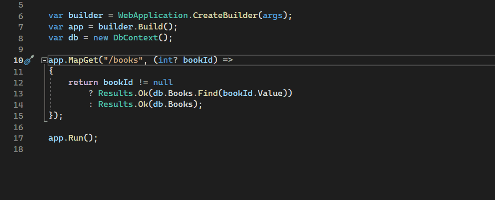
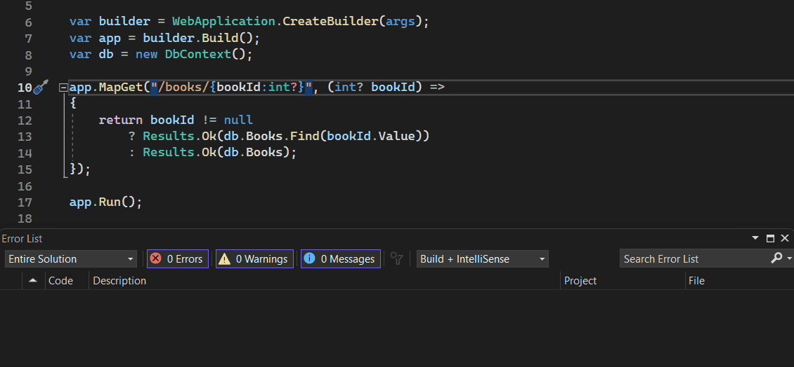
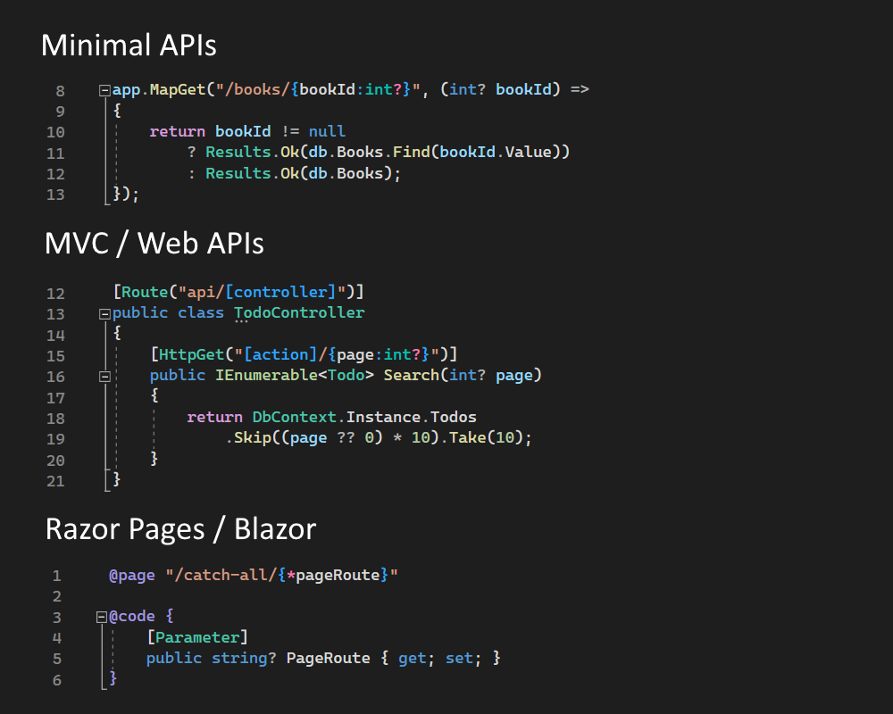

ASP.NET Core is built on routing. Minimal APIs, Web APIs, Razor Pages, and Blazor all use routes to customize how HTTP requests map to your code.

In .NET 8 we're investing in a suite of new features to make routing easier to learn and use. These include:

* Route syntax highlighting
* Autocomplete of parameter and route names
* Autocomplete of route constraints
* Route analyzers and fixers
* Support for Minimal APIs, Web APIs, and Blazor

Grouped all together, we call these new features route tooling. Deep tooling integration around routes is new ground for the ASP.NET Core team, and we're excited about the productivity improvements route tooling brings to ASP.NET Core developers.

## Route syntax highlighting

ASP.NET Core has a stable, well-defined syntax for routing. It supports a variety of features:

* Parameters - `/product/{id}`
* Parameter constraints - `/product/{id:int}`
* Parameter defaults - `/{page=Home}`
* Optional parameters - `/files/{filename}.{ext?}`
* Catch-all parameters - `/blog/{*slug}`
* Token replacement - `/api/[controller]/[action]`

Different parts of routes are now highlighted in the IDE, making routes easier to understand. Syntax highlighting and an analyzer that alerts you to route syntax errors on build should make routes much easier for developers to use.


## Autocomplete of parameter and route names

A popular ASP.NET Core feature is route value binding. When a method and route parameter's name match on Minimal and Web APIs, the value is automatically passed to the method.

Route tooling adds autocompletion to speed up writing your APIs and reduce typos between route and method parameter names.



## Autocomplete of route constraints

ASP.NET Core includes [18 built-in route constraints](https://learn.microsoft.com/aspnet/core/fundamentals/routing#route-constraints). Route constraints limit what values a route accepts. For example, `/products/{id:int}` limits `id` to only accept integers.

A small sample of route constraints:

* `int` - Matches any integer
* `bool` - Matches `true` or `false`
* `datetime` - Matches a valid `DateTime` value
* `minlength(value)` - String must be at least the specified number of characters
* `maxlength(value)` - String must be no more than the specified number of characters
* `alpha` - String must consist of one or more alphabetical characters
* `regex(expression)` - String must match the regular expression

There's great documentation for constraints, but looking up docs is still a pain. Route tooling fixes that by adding constraint autocompletion. A list of constraints is now available in the IDE.

## Route analyzers and fixers

We've thought hard about common problems developers run into when using routes, and we've added many new analyzers and fixes to address those issues and make routing easier to use.

New analyzers and fixers include:

### Route syntax analyzer

As you write and compile your app, route syntax errors are reported in real-time. Some common syntax mistakes include:

* Forgetting to close a parameter with `}`: `/products/{id:alpha`
* Multiple route parameters with the same name: `/api/{version}/product/{version}`
* Segments after a catch-all parameter: `/blog/{*slug}/{date}`

Receiving feedback as you write a route is a powerful feature. Before, running your app was the only way to test whether a route worked. Trial and error isn't a great or productive experience. Trial and error is especially frustrating to developers learning routing for the first time.

We're excited about the productivity boost real-time routing feedback will provide to developers!



### Mismatched parameter optionality analyzer and fixer

Routing supports optional parameters. For example, `/blog/archive/{date?}` matches `/blog/archive` and `/blog/archive/2023-4-1`.

If an optional parameter is bound to a non-nullable method parameter, such as `DateTime` in the example above, there isn't anything to bind to the parameter. `DateTime` must have a value, so ASP.NET Core throws an error.

The mismatched parameter optionality analyzer detects and warns of this situation. A fixer automatically modifies the method parameter to be nullable:

```csharp
app.MapGet("/blog/archive/{date?}", (DateTime? date) =>
{
    return (date == null) ? GetAllBlogPosts() : GetBlogPostsByDate(date.Value);
});
```

### Ambiguous Minimal API and Web API route analyzer

Suppose multiple routes match the same URL. ASP.NET Core doesn't know which route to use and throws an error. Writing ambiguous routes is an easy mistake, especially if you're new to routing.

```csharp
app.MapGet("/product/{name}", (string name) => ...);
app.MapGet("/product/{id}", (int id) => ...);
```

The preceding Minimal API looks like it works because the route parameter names and API types are different. Actually, these routes are functionally the same and will create an ambiguous match.

The ambiguous route analyzer detects common ambiguous matches and provides a warning. The fix in this situation is to add route constraints:

```csharp
app.MapGet("/product/{name:alpha}", (string name) => ...);
app.MapGet("/product/{id:int}", (int id) => ...);
```

## Supports Minimal APIs, Web APIs, and Blazor

Minimal APIs, Web APIs, Razor Pages, Blazor, and more use routes. Route tooling supports all the places you use routes in ASP.NET Core.



Route tooling is built on Roslyn, and features automatically light up depending on your IDE.

## Try it now

Route tooling is out now in .NET 8 previews. Try it today:

1. Download the latest [.NET 8 preview](https://dotnet.microsoft.com/next).
2. Launch [Visual Studio 2022](https://visualstudio.microsoft.com/vs/) and create a new website with the ASP.NET Core Empty template for .NET 8.0.
3. Open `Program.cs` and start adding new minimal APIs. For example, `app.MapGet("/product/{id:int}", (int id) => ...)`.

Let us know what you think about these new features by filing issues on [GitHub](https://github.com/dotnet/aspnetcore/issues/new).

Thanks for trying out ASP.NET Core and route tooling!
