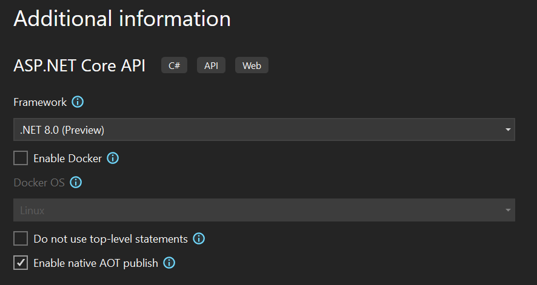
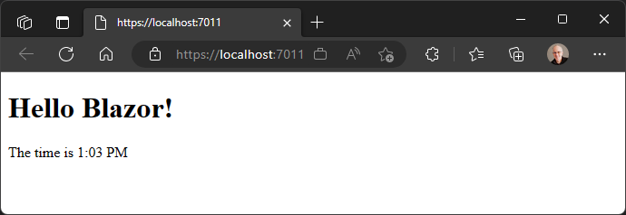

[.NET 8 Preview 3 is now available](https://devblogs.microsoft.com/dotnet/announcing-dotnet-8-preview-3) and includes many great new improvements to ASP.NET Core.

Here's a summary of what's new in this preview release:

- ASP.NET Core support for native AOT
- Server-side rendering with Blazor
- Render Razor components outside of ASP.NET Core
- Sections support in Blazor
- Monitor Blazor Server circuit activity
- SIMD enabled by default for Blazor WebAssembly apps
- Request timeouts
- Short circuit routes

For more details on the ASP.NET Core work planned for .NET 8 see the full [ASP.NET Core roadmap for .NET 8](https://aka.ms/aspnet/roadmap) on GitHub.

## Get started

To get started with ASP.NET Core in .NET 8 Preview 3, [install the .NET 8 SDK](https://dotnet.microsoft.com/next).

If you're on Windows using Visual Studio, we recommend installing the latest [Visual Studio 2022 preview](https://visualstudio.com/preview). Visual Studio for Mac support for .NET 8 previews isn’t available at this time.

## Upgrade an existing project

To upgrade an existing ASP.NET Core app from .NET 8 Preview 2 to .NET 8 Preview 3:

- Update the target framework of your app to `net8.0`.
- Update all Microsoft.AspNetCore.\* package references to `8.0.0-preview.3.*`.
- Update all Microsoft.Extensions.\* package references to `8.0.0-preview.3.*`.

See also the full list of [breaking changes](https://docs.microsoft.com/dotnet/core/compatibility/8.0#aspnet-core) in ASP.NET Core for .NET 8.

## ASP.NET Core support for native AOT

In .NET 8 Preview 3, we're very happy to introduce native AOT support for ASP.NET Core, with an initial focus on cloud-native API applications. It's now possible to [publish an ASP.NET Core app with native AOT](https://learn.microsoft.com/aspnet/core/fundamentals/native-aot), producing a self-contained app that's ahead-of-time (AOT) compiled to native code.

Native AOT apps can have a smaller deployment size, start up very quickly, and use less memory. The application can be run on a machine that doesn't have the .NET runtime installed. The benefit of native AOT is most significant for workloads with many deployed instances, such as cloud infrastructure and hyper-scale services.

### Benefits of using native AOT with ASP.NET Core
Publishing and deploying a native AOT app can provide the following benefits:

- **Reduced disk footprint:** When publishing using native AOT, a single executable is produced containing the program along with the subset of code from external dependencies that the program uses. Reduced executable size can lead to:
  - Smaller container images, for example in containerized deployment scenarios.
  - Reduced deployment time due to smaller images.
- **Reduced startup time:** Native AOT applications can show reduced start-up times, in part due to the removal of JIT compilation. Reduced start-up means:
  - The app is ready to service requests quicker.
  - Improved deployment with container orchestrators that manage transitions from one version of the app to another.
- **Reduced memory demand:** Native AOT apps can have reduced memory demands depending on the work being performed by the app. Reduced memory consumption can lead to greater deployment density and improved scalability.

As an example, we ran a simple ASP.NET Core API app in our benchmarking lab to compare the differences in app size, memory use, startup time, and CPU load, published with and without native AOT:

Publish kind | Startup time (ms) | App size (MB)
------------ | ----------------: | ------------:
Default | 169 | 88.5
Native AOT | 34 | 11.3

The table above shows that publishing the app as native AOT dramatically improves startup time and app size. Startup time was reduced by **80%**! And app size was reduced by **87%**!

You can explore these and more metrics on our [public benchmarks dashboard](https://msit.powerbi.com/view?r=eyJrIjoiYTZjMTk3YjEtMzQ3Yi00NTI5LTg5ZDItNmUyMGRlOTkwMGRlIiwidCI6IjcyZjk4OGJmLTg2ZjEtNDFhZi05MWFiLTJkN2NkMDExZGI0NyIsImMiOjV9&pageName=ReportSectiond12fbb3dbabb493336cd).

### ASP.NET Core and native AOT compatibility

Not all features in ASP.NET Core are compatible with native AOT. Similarly, not all libraries commonly used in ASP.NET Core are compatible with native AOT. .NET 8 represents the start of work to enable native AOT in ASP.NET Core, with an initial focus on enabling support for apps using Minimal APIs or gRPC, and deployed in cloud-native environments. Your feedback will help guide our efforts during .NET 8 previews and beyond, to ensure we focus on the places where the benefits of native AOT can have the largest impact.

Native AOT applications come with a few fundamental compatibility requirements. The key ones include:

- No dynamic loading (for example, `Assembly.LoadFile`)
- No runtime code generation via JIT (for example, `System.Reflection.Emit`)
- No C++/CLI
- No built-in COM (only applies to Windows)
- Requires trimming, which has [limitations](https://learn.microsoft.com/dotnet/core/deploying/trimming/incompatibilities)
- Implies compilation into a single file, which has [known incompatibilities](https://learn.microsoft.com/dotnet/core/deploying/single-file/overview?tabs=cli#api-incompatibility)
- Apps include required runtime libraries (just like self-contained apps, increasing their size as compared to framework-dependent apps)

Reflection is a commonly used feature of .NET, allowing for runtime discovery and inspection of type information, dynamic invocation, and code generation. While reflection over type information is supported in native AOT, the trimming performed often can't statically determine that a type has members that are only accessed via reflection, and are thus removed, leading to runtime exceptions. Developers can annotate their code with instructional attributes, such as [`[DynamicallyAccessedMembers]`](https://learn.microsoft.com/dotnet/api/system.diagnostics.codeanalysis.dynamicallyaccessedmembersattribute?view=net-8.0) to indicate that members are dynamically accessed and should be left untrimmed.

Developers should also be aware that it's not always immediately obvious that code is relying on reflection's runtime code generation capabilities and thus can introduce native AOT incompatibilties, e.g. methods like [`Type.MakeGenericType`](https://learn.microsoft.com/dotnet/api/system.type.makegenerictype) rely on capabilities not available in native AOT. [Roslyn source generators](https://learn.microsoft.com/dotnet/csharp/roslyn-sdk/source-generators-overview) allow code to be generated at compile time with similar type discovery and inspection capabilities as runtime-based reflection, and are a useful alternative when preparing for native AOT compatibility.

The following table summarizes ASP.NET Core feature compatibility with native AOT:

| Feature | Fully Supported | Partially Supported | Not Supported |
| - | - | - | - |
| gRPC | <span aria-hidden="true">✅</span><span class="visually-hidden">Fully supported</span> | | |
| Minimal APIs | | <span aria-hidden="true">✅</span><span class="visually-hidden">Partially supported</span> | |
| MVC | | | <span aria-hidden="true">❌</span><span class="visually-hidden">Not supported</span> |
| Blazor | | |<span aria-hidden="true">❌</span><span class="visually-hidden">Not supported</span> |
| SignalR | | | <span aria-hidden="true">❌</span><span class="visually-hidden">Not supported</span> |
| Authentication | | | <span aria-hidden="true">❌</span><span class="visually-hidden">Not supported</span> (JWT soon) |
| CORS | <span aria-hidden="true">✅</span><span class="visually-hidden">Fully supported</span> | | |
| Health checks | <span aria-hidden="true">✅</span><span class="visually-hidden">Fully supported</span> | | |
| Http logging | <span aria-hidden="true">✅</span><span class="visually-hidden">Fully supported</span> | | |
| Localization | <span aria-hidden="true">✅</span><span class="visually-hidden">Fully supported</span>| | |
| Output caching | <span aria-hidden="true">✅</span><span class="visually-hidden">Fully supported</span> | | |
| Rate limiting | <span aria-hidden="true">✅</span><span class="visually-hidden">Fully supported</span> | | |
| Request decompression | <span aria-hidden="true">✅</span><span class="visually-hidden">Fully supported</span> | | |
| Response caching | <span aria-hidden="true">✅</span><span class="visually-hidden">Fully supported</span> | | |
| Response compression | <span aria-hidden="true">✅</span><span class="visually-hidden">Fully supported</span> | | |
| Rewrite | <span aria-hidden="true">✅</span><span class="visually-hidden">Fully supported</span> | | |
| Session | | |<span aria-hidden="true">❌</span><span class="visually-hidden">Not supported</span> |
| SPA | | |<span aria-hidden="true">❌</span><span class="visually-hidden">Not supported</span> |
| Static files | <span aria-hidden="true">✅</span><span class="visually-hidden">Fully supported</span> | | |
| WebSockets | <span aria-hidden="true">✅</span><span class="visually-hidden">Fully supported</span> | | |

During .NET 8, you can keep track of [current known issues regarding ASP.NET Core and native AOT compatibility here](https://github.com/dotnet/core/issues/8288).

It is important to test your application thoroughly when moving to a native AOT deployment model to ensure that functionality observed during development (when the app is untrimmed and JIT-compiled) is preserved in the native executable. When building your application, keep an eye out for AOT warnings. An application that produces AOT warnings during publishing is not guaranteed to work correctly. If you don't get any AOT warnings at publish time, you should be confident that your application will work consistently after publishing for AOT as it did during your F5 / `dotnet run` development workflow.

### Minimal APIs and native AOT

In order to make Minimal APIs compatible with native AOT, we're introducing the Request Delegate Generator (RDG). The RDG is a [source generator](https://learn.microsoft.com/dotnet/csharp/roslyn-sdk/source-generators-overview) that performs similar work to the `RequestDelegateFactory` (RDF), turning the various `MapGet()`, `MapPost()`, etc., calls in your application into `RequestDelegate`s associated with the specified routes, but rather than doing it in-memory in your application when it starts, it does it at compile-time and generates C# code directly into your project. This removes the runtime generation of this code, and ensures the types used in your APIs are rooted in your application code in a way that is statically analyzable by the native AOT tool-chain, ensuring that required code is not trimmed away. We're working to ensure that as many as possible of the Minimal API features you enjoy today are supported by the RDG and thus compatible with native AOT.

The RDG is enabled automatically in your project when you enable publishing with native AOT. You can also manually enable RDG even when not using native AOT by setting `<EnableRequestDelegateGenerator>true</EnableRequestDelegateGenerator>` in your project file. This can be useful when initially evaluating your project's readiness for native AOT, or potentially to reduce the startup time of your application.

Minimal APIs is optimized for receiving and returning JSON payloads using `System.Text.Json`, and as such the compatibility requirements for JSON and native AOT apply too. This requires the use of the [`System.Text.Json` source generator](https://learn.microsoft.com/dotnet/standard/serialization/system-text-json/source-generation). All types accepted as parameters to or returned from request delegates in your Minimal APIs must be configured on a `JsonSerializerContext` that is registered via ASP.NET Core's dependency injection, e.g.:

```csharp
// Register the JSON serializer context with DI
builder.Services.ConfigureHttpJsonOptions(options =>
{
    options.SerializerOptions.AddContext<AppJsonSerializerContext>();
});

...

// Add types used in your Minimal APIs to source generated JSON serializer content
[JsonSerializable(typeof(Todo[]))]
internal partial class AppJsonSerializerContext : JsonSerializerContext
{

}
```

### gRPC and native AOT

gRPC supports native AOT in .NET 8. Native AOT enables publishing gRPC client and server apps as small, fast native executables. Learn more about [gRPC and native AOT](https://learn.microsoft.com/aspnet/core/grpc/native-aot?view=aspnetcore-8.0) in the related docs.

### Libraries and native AOT

Many of the common libraries you enjoy using in your ASP.NET Core projects today will have some compatibility issues when used in a project targeting native AOT. Popular libraries often rely on the dynamic capabilities of .NET reflection to inspect and discover types, conditionally load libraries at runtime, and generate code on the fly to implement their functionality. As stated earlier, these behaviors can cause compatibility issues with native AOT, and as such, these libraries will need to be updated in order to work with native AOT by using tools like [Roslyn source generators](https://learn.microsoft.com/dotnet/csharp/roslyn-sdk/source-generators-overview).

Library authors wishing to learn more about preparing their libraries for native AOT are encouraged to start by [preparing their library for trimming](https://learn.microsoft.com/dotnet/core/deploying/trimming/prepare-libraries-for-trimming) and learning more about the [native AOT compatibility requirements](https://learn.microsoft.com/dotnet/core/deploying/native-aot/#limitations-of-native-aot-deployment).

### Getting started with native AOT deployment in ASP.NET Core

Native AOT is a publishing option. AOT compilation happens when the app is published. A project that uses Native AOT publishing will use JIT compilation when debugging or running as part of the developer inner-loop, but there are some observable differences:

- Some features that aren't compatible with native AOT are disabled and throw exceptions at runtime.
- A source analyzer is enabled to highlight project code that isn't compatible with Native AOT. At publish time, the entire app, including NuGet packages, is analyzed for compatibility again.

Native AOT analysis during publish includes all code from the app and the libraries the app depends on. Review native AOT warnings and take corrective steps. It's a good idea to test publishing apps frequently to discover issues early in the development lifecycle.

The [following prerequisites](https://learn.microsoft.com/dotnet/core/deploying/native-aot/#prerequisites) need to be installed before publishing .NET projects with native AOT.

On Windows, install [Visual Studio 2022](https://visualstudio.microsoft.com/vs/), including Desktop development with C++ workload with all default components.

On Linux, install the compiler toolchain and developer packages for libraries that the .NET runtime depends on.

- Ubuntu (18.04+)
    ```sh
    sudo apt-get install clang zlib1g-dev
    ```
- Alpine (3.15+)
    ```sh
    sudo apk add clang build-base zlib-dev
    ```

Note that at this time, cross-platform native AOT publishing is not supported, meaning you need to perform the publish on the same platform type as the intended target, e.g. if targeting a deployment to Linux, perform the publish on Linux.

Native AOT published ASP.NET Core apps can be deployed and run anywhere native executables can. Containers are a popular choice for this. Native AOT published .NET applications have the same platform requirements as .NET self-contained applications, and as such should set [`mcr.microsoft.com/dotnet/runtime-deps`](https://mcr.microsoft.com/product/dotnet/runtime-deps/about) as their base image.

### Native AOT-ready project templates



In this preview, there are two native AOT-enabled project templates to help get you started trying out ASP.NET Core with native AOT.

The "ASP.NET Core gRPC Service" project template has been updated to include a new "Enable native AOT publish" option that, when selected, configures the new project to publish as native AOT. This is done by setting `<PublishAot>true</PublishAot>` in the project's .csproj file.

There is also a brand new "ASP.NET Core API" project template, that produces a project more directly focused on cloud-native, API-first scenarios. This also has the "Enable native AOT publish" option, and differs from the existing "Web API" project template in the following ways:

- Uses Minimal APIs only, as MVC is not yet native AOT compatible
- Uses the new `WebApplication.CreateSlimBuilder` API to ensure only the essential features are enabled by default, minimzing the app's deployed size
- Configured to listen on HTTP only, as HTTPS traffic is commonly handled by an ingress service in cloud-native deployments
- Does not include a launch profile for running under IIS or IIS Express
- Enables the JSON serializer source generator when "Enable native AOT publish" is specified during project creation
- Includes a sample "Todos API" instead of the weather forecast sample
- Configured to use [Workstation GC](https://learn.microsoft.com/dotnet/standard/garbage-collection/workstation-server-gc) in order to minimize memory use. Note this aspect is temporary as we work on [GC improvements in .NET 8 intended to provide more dynamic scaling of memory use based on application load](https://github.com/dotnet/runtime/issues/79658). Learn more about [memory use and GC in ASP.NET Core apps here](https://learn.microsoft.com/aspnet/core/performance/memory).

You can create a new API project configured to publish as native AOT using the dotnet CLI:

```sh
$ dotnet new api -aot
```

Here is the content of *Program.cs* in a project created with the new "ASP.NET Core API" template:

```csharp
using System.Text.Json.Serialization;
using MyApiApplication;

var builder = WebApplication.CreateSlimBuilder(args);
builder.Logging.AddConsole();

builder.Services.ConfigureHttpJsonOptions(options =>
{
    options.SerializerOptions.AddContext<AppJsonSerializerContext>();
});

var app = builder.Build();

var sampleTodos = TodoGenerator.GenerateTodos().ToArray();

var todosApi = app.MapGroup("/todos");
todosApi.MapGet("/", () => sampleTodos);
todosApi.MapGet("/{id}", (int id) =>
    sampleTodos.FirstOrDefault(a => a.Id == id) is { } todo
        ? Results.Ok(todo)
        : Results.NotFound());

app.Run();

[JsonSerializable(typeof(Todo[]))]
internal partial class AppJsonSerializerContext : JsonSerializerContext
{

}
```

### Native AOT call to action

Native AOT deployment is not suitable for every application, but in the scenarios where the benefits that native AOT offers are compelling, it can have a huge impact. While it's still early, we'd love for you try out native AOT support for ASP.NET Core in .NET 8 Preview 3, and share any feedback you have by leaving a comment here, or [logging an issue on GitHub](https://github.com/dotnet/aspnetcore/issues/new). Be sure to read the [current known issues regarding ASP.NET Core and native AOT compatibility](https://github.com/dotnet/core/issues/8288).

In future previews, we're working to enable more features of ASP.NET Core and supporting technologies with native AOT, including JWT authentication, options validation, ADO.NET data access for SQLite and PostgreSQL, and OpenTelemetry. We're also working on improving the Visual Studio experience for configuring and working on ASP.NET Core projects targeting native AOT.

## Server-side rendering with Blazor components

This preview adds initial support for server-side rendering with Blazor components. This is the beginnings of the Blazor unification effort to enable using Blazor components for all your web UI needs, client-side and server-side. This is an early preview of the functionality, so it's still somewhat limited, but our goal is to enable using reusable Blazor components no matter how you choose to architect your app.

Server-side rendering (SSR) is when the server generates HTML in response to a request. Apps that use SSR load fast because all of the hard work of rendering the UI is being done on the server without the need to download a large JavaScript bundle. ASP.NET Core has existing support for SSR with MVC and Razor Pages, but these frameworks lack a component model for building reusable pieces of web UI. That's where Blazor comes in! We're adding support for building server-rendered UI using Blazor components that can then also be extended to the client to enable rich interactivity.

In this preview you can use Blazor components to do server-side rendering without the need for any .cshtml files. The framework will discover routable Blazor components and set them up as endpoints. There's no WebAssembly or WebSocket connections involved. You don't need to load any JavaScript. Each request is handled independently by the Blazor component for the corresponding endpoint.

To try out server-side rendering with Blazor:

1. Create a new empty ASP.NET Core web app:

    ```console
    dotnet new web -o WebApp1
    cd WebApp1
    ```

1. Add a simple Razor component to the project:

    ```console
    dotnet new razorcomponent -n MyComponent
    ```

1. Update MyComponent.razor to make it a proper HTML page with a route:

    ```razor
    @page "/"
    @implements IRazorComponentApplication<MyComponent>

    <!DOCTYPE html>
    <html lang="en">
    <body>
        <h1>Hello Blazor!</h1>
        <p>The time is @DateTime.Now.ToShortTimeString()</p>
    </body>
    </html>
    ```

    You'll also need to implement the `IRazorComponentApplication` interface on this component, which is currently used to aid in discovering component endpoints within the app. This design is likely to change in a later update, but for now this interface is required.

1. In Program.cs setup the Razor component services by calling `AddRazorComponents()`.

    ```csharp
    builder.Services.AddRazorComponents();
    ```

1. Map endpoints for you components by calling `MapRazorComponents<TComponent>()`. You'll need to add a using directive for your component:

    ```csharp
    @using WebApp1
    ...
    app.MapRazorComponents<MyComponent>();
    ```

    Routable components will be automatically discovered within the assembly `MyComponent` resides in. Again, note that `TComponent` must currently implement `IRazorComponentApplication`, but this design is likely to change in a later update.

1. Run the app and browse to the app root to see your component rendered:

    

If you take a look at what's happening on the network in the browser dev tools, you'll notice that you don't see any WebSocket connections or WebAssembly being downloaded. It's just a single request returning fully rendered HTML from the server. This also means there isn't any support for interactivity yet. For example, if you add a button with an `@onclick` handler it won't do anything when clicked because there's nothing setup to execute the handler. Integration with client interactivity using Blazor Server or Blazor WebAssembly is forthcoming.

All of the routing to the Blazor component endpoints is being done with ASP.NET Core endpoint routing. The Blazor router currently isn't involved at all. This means that if you want to use a layout then you'll need to manually apply it using the the `@layout` directive. A convenient way to do this is using a *_Imports.razor* file, which will apply directives to an entire folder . We're looking at integrating the Blazor router with endpoint routing to make this experience a bit more seamless.

We've also added `RazorComponentResult` and `RazorComponentResult<T>` types that implement `IResult` for rendering Razor components. These result types can be returned from a manually configured endpoint:

```csharp
app.MapGet("/my-component", () => new RazorComponentResult<MyComponent>());
```

You can also return them from an MVC controller action if you want to leverage Blazor components from an existing MVC app:

```csharp
public class HomeController : Controller
{
    public IResult MyComponent()
    {
        return new RazorComponentResult<MyComponent>();
    }
}
```

You can find a complete [sample](https://github.com/dotnet/aspnetcore/tree/main/src/Components/Samples/BlazorUnitedApp) of the default Blazor project template implemented purely with server-side rendering (but without client-side interactivity) in the ASP.NET Core GitHub repo.

This is just the beginnings of server-side rendering support with Blazor in .NET 8. You can expect plenty of improvements and enhancements in upcoming preview releases. Stay tuned!

## Render Razor components outside of ASP.NET Core

A convenient side-effect of the work to enable server-side rendering with Blazor components is that you can now render Blazor components outside the context of an HTTP request. You can render Razor components as HTML directly to a string or stream independently of the ASP.NET Core hosting environment. This is convenient for scenarios where you want to generate HTML fragments, like for a generated email, or even for generating static site content.

For example, here's how you render a Razor component to an HTML string from a console app:

1. Create a new console app project:

    ```console
    dotnet new console -o ConsoleApp1
    cd ConsoleApp1
    ```

1. Add package references to Microsoft.AspNetCore.Components.Web and Microsoft.Extensions.Logging:

    ```console
    dotnet add package Microsoft.AspNetCore.Components.Web --prerelease
    dotnet add package Microsoft.Extensions.Logging --prerelease
    ```

1. Update your console app project to use the Razor SDK:

    ```xml
    <Project Sdk="Microsoft.NET.Sdk.Razor">
    ...
    </Project>
    ```

1. Add a Razor component to the project that you want to render:

    ```console
    dotnet new razorcomponent -n MyComponent
    ```

1. Update *Program.cs* to create an `HtmlRender` and render your component by calling `RenderComponentAsync`. You'll need to setup dependency injection and logging first. Also note that any calls to `RenderComponentAsync` must be made in the context of calling `InvokeAsync` on a component dispatcher. A component dispatcher is readily available from the `HttmlRender.Dispatcher` property.

    ```csharp
    using Microsoft.AspNetCore.Components;
    using Microsoft.AspNetCore.Components.Web;
    using Microsoft.Extensions.DependencyInjection;
    using Microsoft.Extensions.Logging;
    using ConsoleApp1

    IServiceCollection services = new ServiceCollection();
    services.AddLogging();

    IServiceProvider serviceProvider = services.BuildServiceProvider();
    ILoggerFactory loggerFactory = serviceProvider.GetRequiredService<ILoggerFactory>();

    await using var htmlRenderer = new HtmlRenderer(serviceProvider, loggerFactory);
    var html = await htmlRenderer.Dispatcher.InvokeAsync(async () =>
    {
        var parameters = ParameterView.Empty;
        var output = await htmlRenderer.RenderComponentAsync<MyComponent>(parameters);
        return output.ToHtmlString();
    });

    Console.WriteLine(html);
    ```

    Alternatively, you can write the HTML to a `TextWriter` by calling `output.WriteHtmlTo(textWriter)`.

The task returned by `RenderComponentAsync` will complete when the component has fully rendered, including completing any async lifecycle methods. If you want to observe the rendered HTML earlier you can call `BeginRenderComponentAsync` instead. You can then wait for the component rendering to complete by awaiting `WaitForQuiescenceAsync` on the returned `HtmlComponent` instance.

## Sections support in Blazor

The new `SectionOutlet` and `SectionContent` components in Blazor add support for specifying outlets for content that can be filled in later. Sections are often used to define placeholders in layouts that are then filled in by specific pages. Sections are referenced either by a unique name, or using a unique object ID.

For example, try adding a `SectionOutlet` to the top row of the `MainLayout` component in the default Blazor template. You'll need to first add a using directive for `Microsoft.AspNetCore.Components.Sections`, which is easiest to do in the root *_Imports.razor* file:

```razor
@using Microsoft.AspNetCore.Components.Sections
...
<div class="top-row px-4">
    <SectionOutlet SectionName="TopRowSection" />
    <a href="https://docs.microsoft.com/aspnet/" target="_blank">About</a>
</div>
```

Pages can then specify what content to display in the `TopRowSection` using the `SectionContent` component. For example, in *Counter.razor* you might add another button to the top row that can increment the counter, like this:

```razor
<SectionContent SectionName="TopRowSection">
    <button class="btn btn-primary" @onclick="IncrementCount">Click me</button>
</SectionContent>
```

## Monitor Blazor Server circuit activity

You can now monitor inbound circuit activity in Blazor Server apps using the new `CreateInboundActivityHandler` method on `CircuitHandler`. Inbound circuit activity is any activity sent from the browser to the server, like UI events or JavaScript-to-.NET interop calls.

For example, you can use a circuit activity handler to detect if the client is idle, like this:

```csharp
public sealed class IdleCircuitHandler : CircuitHandler, IDisposable
{
    readonly Timer timer;
    readonly ILogger logger;

    public IdleCircuitHandler(IOptions<IdleCircuitOptions> options, ILogger<IdleCircuitHandler> logger)
    {
        timer = new Timer();
        timer.Interval = options.Value.IdleTimeout.TotalMilliseconds;
        timer.AutoReset = false;
        timer.Elapsed += CircuitIdle;
        this.logger = logger;
    }

    private void CircuitIdle(object? sender, System.Timers.ElapsedEventArgs e)
    {
        logger.LogInformation(nameof(CircuitIdle));
    }

    public override Func<CircuitInboundActivityContext, Task> CreateInboundActivityHandler(Func<CircuitInboundActivityContext, Task> next)
    {
        return context =>
        {
            timer.Stop();
            timer.Start();
            return next(context);
        };
    }

    public void Dispose()
    {
        timer.Dispose();
    }
}

public class IdleCircuitOptions
{
    public TimeSpan IdleTimeout { get; set; } = TimeSpan.FromMinutes(5);
}

public static class IdleCircuitHandlerServiceCollectionExtensions
{
    public static IServiceCollection AddIdleCircuitHandler(this IServiceCollection services, Action<IdleCircuitOptions> configureOptions)
    {
        services.Configure(configureOptions);
        services.AddIdleCircuitHandler();
        return services;
    }

    public static IServiceCollection AddIdleCircuitHandler(this IServiceCollection services)
    {
        services.AddScoped<CircuitHandler, IdleCircuitHandler>();
        return services;
    }
}
```

In a future update we plan to [add APIs for evicting idle circuits](https://github.com/dotnet/aspnetcore/issues/17866) so they no longer consume server resources unnecessarily.

Circuit activity handlers also provide a way to access scoped Blazor services from other non-Blazor dependency injection (DI) scopes, like scopes created using `IHttpClientFactory`. There is an [existing pattern](https://learn.microsoft.com/aspnet/core/blazor/fundamentals/dependency-injection#access-blazor-services-from-a-different-di-scope) for accessing circuit scoped services from other DI scopes, but it requires using a custom base component type. With circuit activity handlers we can use a better approach:

```csharp
public class CircuitServicesAccessor
{
    static readonly AsyncLocal<IServiceProvider> blazorServices = new();

    public IServiceProvider? Services
    {
        get => blazorServices.Value;
        set => blazorServices.Value = value;
    }
}

public class ServicesAccessorCircuitHandler : CircuitHandler
{
    readonly IServiceProvider services;
    readonly CircuitServicesAccessor circuitServicesAccessor;

    public ServicesAccessorCircuitHandler(IServiceProvider services, CircuitServicesAccessor servicesAccessor)
    {
        this.services = services;
        this.circuitServicesAccessor = servicesAccessor;
    }

    public override Func<CircuitInboundActivityContext, Task> CreateInboundActivityHandler(Func<CircuitInboundActivityContext, Task> next)
    {
        return async context =>
        {
            circuitServicesAccessor.Services = services;
            await next(context);
            circuitServicesAccessor.Services = null;
        };
    }
}

public static class CircuitServicesServiceCollectionExtensions
{
    public static IServiceCollection AddCircuitServicesAccessor(this IServiceCollection services)
    {
        services.AddScoped<CircuitServicesAccessor>();
        services.AddScoped<CircuitHandler, ServicesAccessorCircuitHandler>();
        return services;
    }
}
```

You can then access the circuit scoped services by injecting the `CircuitServicesAccessor` where it's needed. For example, here's how you can access the `AuthenticationStateProvider` from a `DelegatingHandler` setup using `IHttpClientFactory`:

```csharp
public class AuthenticationStateHandler : DelegatingHandler
{
    readonly CircuitServicesAccessor circuitServicesAccessor;

    public AuthenticationStateHandler(CircuitServicesAccessor circuitServicesAccessor)
    {
        this.circuitServicesAccessor = circuitServicesAccessor;
    }

    protected override async Task<HttpResponseMessage> SendAsync(HttpRequestMessage request, CancellationToken cancellationToken)
    {
        var authStateProvider = circuitServicesAccessor.Services.GetRequiredService<AuthenticationStateProvider>();
        var authState = await authStateProvider.GetAuthenticationStateAsync();

        // ...

        return await base.SendAsync(request, cancellationToken);
    }
}
```

## SIMD enabled by default for Blazor WebAssembly apps

WebAssembly fixed-width SIMD (Single Instruction, Multiple Data) support is now available with all major browsers and we've enabled it by default for ahead-of-time (AOT) compiled Blazor WebAssembly apps. SIMD can improve the throughput of vectorized computations by performing an operation on multiple pieces of data, in parallel, using a single instruction.

## Request timeouts

In this preview release, we've also added a new middleware for supporting request timeouts. You can set request timeouts for individual endpoints, controllers, or dynamically per request.

To apply request timeouts, first add the request timeout services:

```csharp
builder.Services.AddRequestTimeouts();
```

You can then apply request timeouts using middleware by calling `UseRequestTimeouts()`:

```csharp
app.UseRequestTimeouts();
```

To apply request timeouts to a particular endpoint call `WithRequestTimeout(timeout)` or add `[RequestTimeout(timeout)]` to the controller or action.

The timeouts are cooperative; when they expire, the `HttpContext.RequestAborted` cancellation token will trigger but the request will not be forcibly aborted. It's up to the application to monitor the token and decide how to end the request processing.

Thank you [@Kahbazi](https://github.com/Kahbazi) for contributing this feature!

## Short circuit routes

When routing matches an endpoint it typically lets the rest of the middleware pipeline run before invoking the endpoint logic. If that's not necessary or desirable, there's a new option that will cause routing to invoke the endpoint logic immediately and then end the request. This can be used to efficiently respond to requests that don't require additional features like authentication, CORS, etc., such as requests for *robots.txt* or *favicon.ico*.

```csharp
app.MapGet("/", () => "Hello World").ShortCircuit();
```

You can also use the `MapShortCircuit` method to setup endpoints that send a quick 404 or other status code for matched resources that you don't want to further process.

```csharp
app.MapShortCircuit(404, "robots.txt", "favicon.ico");
```

This was another great feature contribution from [@Kahbazi](https://github.com/Kahbazi). Thank you!

## Give feedback

We hope you enjoy this preview release of ASP.NET Core in .NET 8. Let us know what you think about these new improvements by filing issues on [GitHub](https://github.com/dotnet/aspnetcore/issues/new).

Thanks for trying out ASP.NET Core!
