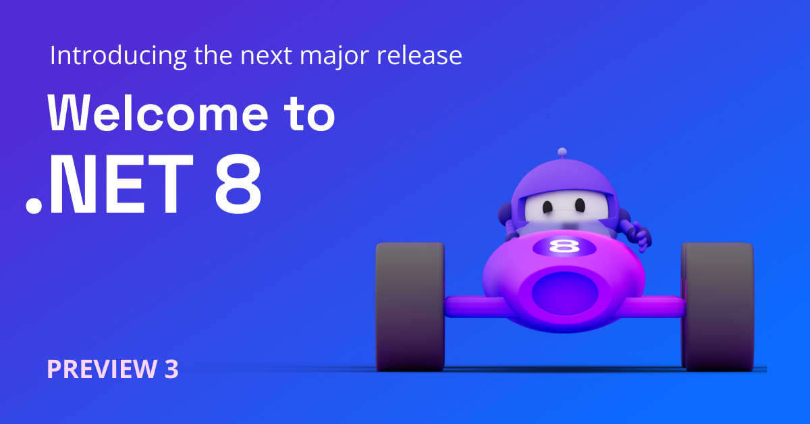

[.NET 8 Preview 3](https://dotnet.microsoft.com/next) is now available. It includes changes to build paths, workloads, Microsoft.Extensions, and containers. It also includes performance improvements in the JIT, for Arm64, and dynamic PGO. If you missed the March preview, you may want to read the [Preview 2](https://devblogs.microsoft.com/dotnet/announcing-dotnet-8-preview-2/) post.

You can [download .NET 8 Preview 3](https://dotnet.microsoft.com/download/dotnet/8.0) for Linux, macOS, and Windows.

* [Installers and binaries](https://dotnet.microsoft.com/download/dotnet/8.0)
* [Container images](https://github.com/dotnet/dotnet-docker/blob/main/documentation/supported-tags.md)
* [Release notes](https://github.com/dotnet/core/tree/main/release-notes/8.0)
* [Known issues](https://github.com/dotnet/core/blob/main/release-notes/8.0/known-issues.md)
* [GitHub issue tracker](https://github.com/dotnet/core/issues)

Check out what's new in [C#](https://devblogs.microsoft.com/dotnet/csharp-12-previews-primary-constructors-for-classes-and-structs), [ASP.NET Core](https://devblogs.microsoft.com/dotnet/asp-net-core-updates-in-dotnet-8-preview-3), [EF Core](https://devblogs.microsoft.com/dotnet), and [.NET MAUI](https://devblogs.microsoft.com/dotnet/announcing-dotnet-maui-8-preview-3) in the Preview 3 release. Stay current with [What's New in .NET 8](https://learn.microsoft.com/dotnet/core/whats-new/dotnet-8). [.NET Docs](https://learn.microsoft.com/dotnet/fundamentals/) will be updated throughout the release.

.NET 8 has been tested with 17.6 Preview 3. If you want to try .NET 8 with the Visual Studio family of products, we recommend that you use the [preview channel builds](https://visualstudio.com/preview). Visual Studio for Mac support for .NET 8 isn’t yet available.

Let's take a look at some new features.

[](https://dotnet.microsoft.com/next)

## SDK

There were several improvements made to the SDK, as well as a breaking change. For more information about the breaking change, see [.NET SDK No Longer Changes Encoding Upon Exit](https://github.com/dotnet/docs/issues/34471).

The improvements made to the .NET SDK were the following:

### Simplified output path

.NET applications can be built in many different ways, and as a result, users of the platform have gotten familiar with a very deep and complex set of output paths for different build artifacts. Folders like `bin`, `obj`, `publish`, and the many different permutations and arrangements of those are muscle memory for many .NET developers. Similarly strong is the concept of per-project directories for these outputs.  However, over time we've gotten feedback from both new and long-standing .NET users that this layout is:

* Difficult to use because the layout can change drastically via relatively simple MSBuild changes.
* Difficult for tools to anticipate because the per-project layout makes it hard to be sure that you've gotten the outputs for every project.

To address both of these challenges and make the build outputs easier to use and more consistent, the .NET SDK has [introduced an option](https://github.com/dotnet/sdk/pull/29599) that creates a more unified, simplified output path structure.

The new output path focuses on:

* Gathering all of the build outputs in a common location.
* Separating the build outputs by project under this common location.
* Flattening the overall build output layouts to a maximum of three levels deep.

To opt into the new output path layout, you need to set the `UseArtifactsOutput` property in a `Directory.Build.props` file. The easiest way to get started is to run `dotnet new buildprops` in the root of your repository, open the generated `Directory.Build.props` file, and then add the following to the `PropertyGroup` in that file:

```xml
<UseArtifactsOutput>true</UseArtifactsOutput>
```

From this point on, build output for all projects will be placed into the `.artifacts` directory in the repository root. This is configurable - just set the `ArtifactsPath` property in your `Directory.Build.props` file to any directory you prefer. If you don't want to use `.artifacts` as the default, we'd love to hear that feedback on [the design discussion](https://github.com/dotnet/designs/pull/281).

The layout of the `.artifacts` directory will be of the form `<ArtifactsPath>\<Type of Output>\<Project Name>\<Pivots>`, where:

* `Type of Output` is used to group different categories of build outputs like binaries, intermediate/generated files, published applications, or NuGet packages, and
* `Pivots` is used to flatten out all of the different options that are used to differentiate builds, like `Configuration` and `RuntimeIdentifier`.
* `.artifacts\bin\debug` - The build output path for a simple project when you run `dotnet build`.
* `.artifacts\obj\debug` - The intermediate output path for a simple project when you run `dotnet build`.
* `.artifacts\bin\MyApp\debug_net8.0` - The build output path for the `net8.0` build of a multi-targeted project.
* `.artifacts\publish\MyApp\release_linux-x64` - The publish path for a simple app when publishing for `linux-x64`.
* `.artifacts\package\release` - The folder where the release `.nupkg` will be created for a project.

We think that this unified output structure addresses concerns that we've heard from users and gives us a foundation we can build on for the future. The `Type of Output` and `Pivots` sections enable us to add new kinds of outputs or builds without drastically changing the layout in the future. Anchoring all of the outputs in a single folder makes it easier for tools to include, ignore, or manipulate the build outputs.

### `dotnet workload clean` command

Over the course of several .NET SDK and Visual Studio updates, it's possible for workload packs (the actual units of functionality, tools, and templates that a workload is comprised of) to be left behind. This can happen for a number of reasons, but in every case it's confusing for end users. Some users go so far as to manually delete workload directories from their SDK install locations, which the SDK team really doesn't recommend! Instead of that drastic measure, in this preview we've [implemented a new command](https://github.com/dotnet/sdk/pull/30266) to help clean up leftover workload packs.

The new command is:

```bash
dotnet workload clean
```

Next time you encounter issues managing workloads, consider using `dotnet workload clean` to safely restore to a known-good state before trying again.

`clean` has two modes of operation, which are discussed next.

#### `dotnet workload clean`

Runs workload [garbage collection](https://github.com/dotnet/designs/blob/main/accepted/2021/workloads/workload-installation.md#workload-pack-installation-records-and-garbage-collection) for either file-based or MSI-based workloads. Under this mode, garbage collection behaves as normal, cleaning only the orphaned packs themselves.

It will clean up orphaned packs from uninstalled versions of the .NET SDK or packs where installation records for the pack no longer exist. It will only do this for the given SDK version or older. If you have a newer SDK version installed, you will need to repeat the command.

If Visual Studio is installed and has been managing workloads as well, `dotnet workload clean` will list all Visual Studio Workloads installed on the machine and warn that they must be uninstalled via Visual Studio instead of the .NET SDK CLI. This is to provide clarity as to why some workloads are not cleaned/uninstalled after running `dotnet workload clean`.

#### `dotnet workload clean --all`

Unlike `workload clean`, `workload clean --all` runs garbage collection irregularly, meaning that it cleans every existing pack on the machine that isn't from Visual Studio and is of the current SDK workload installation type (either file-based or MSI-based).

Because of this, it also removes all workload installation records for the running .NET SDK feature band and below. `workload clean` doesn't yet remove installation records, as the manifests are currently the only way to map a pack to the workload ID, but the manifest files may not exist for orphaned packs.

## Runtime

The following improvements were made in the runtime and libraries.

### ValidateOptionsResultBuilder

The ValidateOptionsResultBuilder makes it easier to create of a [`ValidateOptionsResult`](https://learn.microsoft.com/dotnet/api/microsoft.extensions.options.validateoptionsresult) object, which is required to implement [`IValidateOptions.Validate(String, TOptions)`](https://learn.microsoft.com/dotnet/api/microsoft.extensions.options.ivalidateoptions-1.validate). This builder allows you to accumulate multiple errors, so you can see all the issues at once and address them accordingly. With this new tool, you'll save time and effort by streamlining the validation process.

Here's the usage example:

```csharp
ValidateOptionsResultBuilder builder = new();
builder.AddError("Error: invalid operation code");
builder.AddResult(ValidateOptionsResult.Fail("Invalid request parameters"));
builder.AddError("Malformed link", "Url");

// Build ValidateOptionsResult object has accumulating multiple errors.
ValidateOptionsResult result = builder.Build();

// Reset the builder to allow using it in new validation operation.
builder.Clear();
```

### Introducing the configuration binding source generator

[Application configuration in ASP.NET Core](https://learn.microsoft.com/aspnet/core/fundamentals/configuration/?view=aspnetcore-7.0) is performed using one or more configuration providers. Configuration providers read data (as key-value pairs) from a variety of sources such as settings files (for example, `appsettings.json`), environment variables, Azure Key Vault etc.

At the core of this mechanism is [`ConfigurationBinder`](https://learn.microsoft.com/dotnet/api/microsoft.extensions.configuration.configurationbinder?view=dotnet-plat-ext-7.0), an extension class that provides `Bind` and `Get` methods that map configuration values ([`IConfiguration`](https://learn.microsoft.com/dotnet/api/microsoft.extensions.configuration.iconfiguration?view=dotnet-plat-ext-7.0) instances) to strongly-typed objects. `Bind` takes an instance, while `Get` creates one on behalf of the caller. The current approach uses reflection which causes issues for trimming and Native AOT.

In .NET 8, we are [using a source generator](https://github.com/dotnet/runtime/pull/82179) that generates reflection-free and AOT-friendly binding implementations. The generator probes for [Configure](https://learn.microsoft.com/dotnet/api/microsoft.extensions.dependencyinjection.optionsconfigurationservicecollectionextensions.configure?view=dotnet-plat-ext-7.0#microsoft-extensions-dependencyinjection-optionsconfigurationservicecollectionextensions-configure-1(microsoft-extensions-dependencyinjection-iservicecollection-microsoft-extensions-configuration-iconfiguration)), [Bind](https://learn.microsoft.com/dotnet/api/microsoft.extensions.configuration.configurationbinder.bind?view=dotnet-plat-ext-7.0), and [Get](https://learn.microsoft.com/dotnet/api/microsoft.extensions.configuration.configurationbinder.get?view=dotnet-plat-ext-7.0) calls that we can retrieve type info from.

The following example shows code that invokes the binder:

```cs
using Microsoft.AspNetCore.Builder;
using Microsoft.Extensions.Configuration;
using Microsoft.Extensions.DependencyInjection;

WebApplicationBuilder builder = WebApplication.CreateBuilder(args);
IConfigurationSection section = builder.Configuration.GetSection("MyOptions");

// !! Configure call - to be replaced with source-gen'd implementation
builder.Services.Configure<MyOptions>(section);

// !! Get call - to be replaced with source-gen'd implementation
MyOptions options0 = section.Get<MyOptions>();

// !! Bind call - to be replaced with source-gen'd implementation
MyOptions options1 = new MyOptions();
section.Bind(myOptions1);

WebApplication app = builder.Build();
app.MapGet("/", () => "Hello World!");
app.Run();

public class MyOptions
{
    public int A { get; set; }
    public string S { get; set; }
    public byte[] Data { get; set; }
    public Dictionary<string, string> Values { get; set; }
    public List<MyClass> Values2 { get; set; }
}

public class MyClass
{
    public int SomethingElse { get; set; }
}
```

When the generator is enabled in a project, the generated methods are implicitly picked by the compiler, over the pre-existing reflection-based framework implementations. To enable the source generator, download the latest preview version of the [Microsoft.Extensions.Configuration.Binder](https://www.nuget.org/packages/Microsoft.Extensions.Configuration.Binder). The generator is off by default. To use it, add the following property to your project file:

```csproj
<PropertyGroup>
    <EnableMicrosoftExtensionsConfigurationBinderSourceGenerator>true</EnableMicrosoftExtensionsConfigurationBinderSourceGenerator>
</PropertyGroup>
```

In preview 4, we'll add the enabling mechanism to the .NET SDK, so that the NuGet package reference isn't required to use the source generator.

### Native code generation

The following improvements were made to the JIT compiler:

#### Arm64

The following optimizations were made for the Arm64 architecture:

- [PR#83089](https://github.com/dotnet/runtime/pull/83089) converts `OR(condition, condition)` to `CCMP`. It lets the JIT emit `CCMP` on arm64 for bitwise-or between relational comparisons.
- [PR #83176](https://github.com/dotnet/runtime/pull/83176) optimized `x < 0` and `x >= 0` for arm64 and gave good improvements ([here](https://github.com/dotnet/perf-autofiling-issues/issues/14422), [here](https://github.com/dotnet/perf-autofiling-issues/issues/14416) and [here](https://github.com/dotnet/perf-autofiling-issues/issues/14430)).
- [PR #82924](https://github.com/dotnet/runtime/pull/82924) optimized overflow checks for certain scenarios during division.

#### Profile guided optimization

[Profile guided optimization](https://devblogs.microsoft.com/dotnet/conversation-about-pgo/) has been improved in this release.

- [runtime #82775](https://github.com/dotnet/runtime/pull/82775) enabled interlocked profiling for basic block counts.
- The profile synthesis is supported in [runtime #82926](https://github.com/dotnet/runtime/pull/82926), [runtime #83068](https://github.com/dotnet/runtime/pull/83068), [runtime #83185](https://github.com/dotnet/runtime/pull/83185), and [runtime #83567](https://github.com/dotnet/runtime/pull/83567).
- [runtime #83002](https://github.com/dotnet/runtime/pull/83002) enabled more intrinsics in Tier0, e.g., `get_IsValueType`.

#### General Optimizations

The following general performance changes were made:

- [runtime #79381](https://github.com/dotnet/runtime/pull/79381) extends emitter peephole optimization and eliminated `mov` in more scenarios.
- [runtime #82793](https://github.com/dotnet/runtime/pull/82793) folded unreachable cases for `switch` in early phase of JIT, `importer`, and improved throughput up to 0.06%.
- [runtime #82917](https://github.com/dotnet/runtime/pull/82917) added `System.Runtime.CompilerServices.Unsafe.BitCast` for efficient type reinterpretation.
- [runtime #81635](https://github.com/dotnet/runtime/pull/81635) defers expansion of runtime lookups so that they can be better optimized.
- [runtime #83274](https://github.com/dotnet/runtime/pull/83274) unifies unrolling limits and chooses sensible (generally larger) values.

## Containers

We're continuing to improve the capabilities and experience of using .NET in containers. In this release, we're focused on security and targeting multiple architectures.

For recent updates, see [Secure your .NET cloud apps with rootless Linux Containers](https://devblogs.microsoft.com/dotnet/securing-containers-with-rootless/) and [SDK Containers – Support for Authentication and Cross-architecture Builds](https://devblogs.microsoft.com/dotnet/updates-to-container-support-in-the-dotnet-sdk/).

To learn about a recent tagging-related change, see [Breaking change: Multi-platform .NET 8 tags no longer support Windows containers](https://github.com/dotnet/dotnet-docker/discussions/4549).

### Building multi-platform container images

It is now common to use both Arm64 and x64 machines on a regular basis. x64 machines have been around for decades, however, Arm64 dev machines (like Apple Macs) and [Arm64 cloud nodes](https://learn.microsoft.com/azure/aks/use-multiple-node-pools#add-an-arm64-node-pool) are relatively new. Docker supports using and building [multi-platform images](https://docs.docker.com/build/building/multi-platform/) that work across multiple environments. We've developed a new pattern that enables you to mix and match architectures with the .NET images you build.

Imagine you're on an Apple Mac and want to target an x64 cloud service in Azure. You can build the image by using the `--platform` switch as follows.

```bash
docker build --pull -t app --platform linux/amd64 .
```

Using the new pattern, you'd update just one line in your Dockerfile (the build stage):

```dockerfile
FROM --platform=$BUILDPLATFORM mcr.microsoft.com/dotnet/sdk:8.0-preview-alpine AS build
```

That line enables the SDK to run on the local machine architecture, which will make it run faster and compatibly (since .NET doesn't support QEMU). This line didn't require a change in .NET but is a useful Docker feature.

We also updated the SDK (in Preview 3) to support `$TARGETARCH` values and to add the `-a` argument on restore. You can see that in the following example.

```dockerfile
RUN dotnet restore -a $TARGETARCH

# copy everything else and build app
COPY aspnetapp/. .
RUN dotnet publish -a $TARGETARCH --self-contained false --no-restore -o /app
```

This approach enables producing more optimized apps in a way that integrates well with the Docker `--platform` values.

This [sample](https://github.com/dotnet/dotnet-docker/blob/main/samples/aspnetapp/Dockerfile.alpine-non-root) demonstrates the pattern. You can also try it if you clone that repo.

[Improving multi-platform container support](https://devblogs.microsoft.com/dotnet/improving-multiplatform-container-support/) goes into much more detail on this topic.

### Environment Variable for non-root user UID value

We've added an environment variable for the UID for the non-root user that we added in Preview 1. We realized that the [Kubernetes `runAsNonRoot` test](https://kubernetes.io/docs/concepts/security/pod-security-standards/#restricted) required that the container user be set via UID not name. At the same time, we wanted to avoid developers needing to apply a special number across (collectively) thousands of Dockerfiles. Instead, we're exposing that value -- `64198` -- in an environment variable.

You can see that used in this [Dockerfile](https://github.com/dotnet/dotnet-docker/blob/e5bc76bca49a1bbf9c11e74a590cf6a9fe9dbf2a/samples/aspnetapp/Dockerfile.alpine-non-root#L27):

```dockerfile
USER $APP_UID
```

That's the pattern we recommend for .NET 8.

When you build a container image when `USER` is defined like that, you will see the following in container metadata.

```bash
$ docker inspect app | jq .[-1].Config.User
"64198"
```

You can see how this environment variable is defined.

```bash
$ docker run --rm -it mcr.microsoft.com/dotnet/runtime bash -c "export | grep APP"
declare -x APP_UID="64198"
$ docker run --rm -it mcr.microsoft.com/dotnet/runtime cat /etc/passwd | tail -n 1
app:x:64198:64198::/home/app:/bin/sh
```

We will go into more detail on this pattern in a post on Kubernetes soon.

## Community spotlight (Erik Ejlskov Jensen)

.NET is powered by community and a worldwide team of amazing contributors. Our community spotlight this month shines on Erik Ejlskov Jensen, known to many as [@ErikEJ](https://github.com/ErikEJ). Erik contributes code, helps triage issues and reviews pull requests. He is the maintainer of the popular [EF Power Tools](https://github.com/ErikEJ/EFCorePowerTools) Visual Studio extension that provides tools to manage and reverse-engineer databases, generate migrations and visualize the data model.


In Erik's own words:

_"Hi, I’m Erik Ejlskov Jensen, a Principal Consultant at Delegate A/S and live near Copenhagen in Denmark. I have been fortunate enough to have been awarded Microsoft MVP for 14 years in a row for my community contributions. I mainly work with data0driven .NET applications using SQL Server/Azure SQL Database._

_Back in 2005, I worked at a small Danish company that specialized in Windows Mobile development, and I soon got deeply engaged in the SQL Server Compact embedded database that was part of that platform. Soon I was helping others on the MSDN forums with that product, and I launched an open source Visual Studio extension to help SQL Compact developers. It was hosted on a Microsoft owned open source web site named CodePlex._

_One of the first big Microsoft projects to embrace open source on CodePlex was Entity Framework (Classic) in 2013, and it included and provider for SQL Server Compact that I was using in some of my work. The provider was not as feature complete as I desired, and since it was now open source, I amazingly got some pull requests against it accepted. The team running the EF6 project at the time was very welcoming and helpful, and encouraged community feedback, also based on my SQL Server experience. Many of the team members then are still working on the EF Core project today._

_When the Entity Framework (EF) Core project was launched in 2016, I immediately dug in and created a provider for SQL Server Compact for EF Core 1 and 2._

__Editor's note:__ check out the [SQLite and SQL Server Compact Toolbox](https://marketplace.visualstudio.com/items?itemName=ErikEJ.SQLServerCompactSQLiteToolbox)</quote>

_In 2017 I launched the EF Core Power Tools Visual Studio extension, and I contributed several features to EF Core reverse engineering, partly for selfish reasons so I could improve EF Core Power Tools. Since then, I have regularly been providing feedback, documentation updates and pull requests for bug fixes and new features. It is always a pleasure interacting with the EF Core team, who all are extremely professional and experienced in open source software development, not least the 'expectation alignment' part."_

Know somebody who is contributing to .NET that we should feature in future posts? Nominate them at [https://aka.ms/net8contributor](https://aka.ms/net8contributor).

## Summary

.NET 8 Preview 3 contains exciting new features and improvements that would not be possible without the hard work and dedication of a diverse team of engineers at Microsoft and a passionate open-source community. We want to extend our [sincere thanks to everyone who has contributed to .NET 8 so far](https://dotnet.microsoft.com/thanks), whether it was through code contributions, bug reports, or providing feedback.

Your contributions have been instrumental in the making .NET 8 Previews, and we look forward to continuing to work together to build a brighter future for .NET and the entire technology community.

Curious about what is coming? [Go see for yourself what's next in .NET!](https://dotnet.microsoft.com/next)
