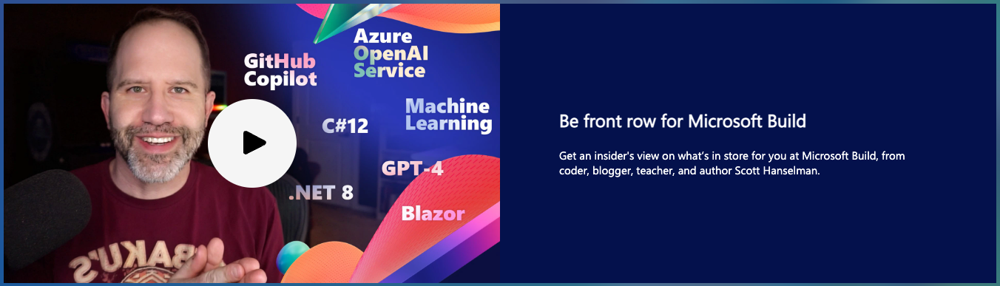
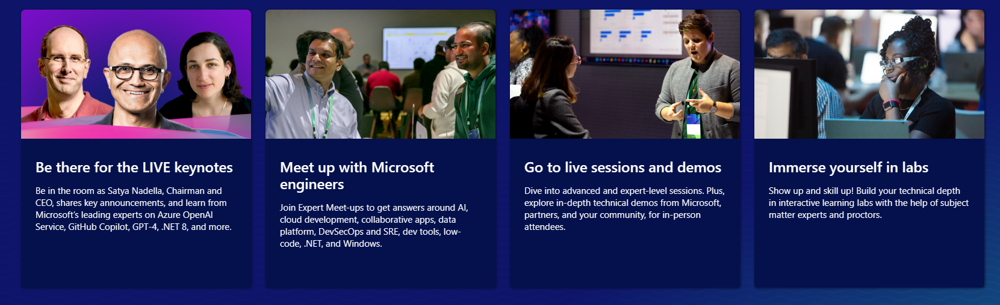

Are you ready for Build 2023? Microsoft's premier developer conference is just around the corner, and there are several exciting .NET sessions that you won't want to miss!

This year Microsoft Build is both virtual and in-person in Seattle, Washington! You will be able to watch many sessions live online, but if you are joining us in person this year, the .NET team will be there with in-person only sessions, meet the experts, demo areas, workshps, and more!

## .NET Sessions at Build

Be sure to browse all of the Build [sessions online](https://build.microsoft.com/sessions?filter=additionalTrack%2FlogicalValue%3E.NET), but here is a sampling of some of the .NET sessions that will offer a detailed dive into what we're currently developing for .NET 8, with a strong technical focus.

[All things client and mobile app development with .NET](https://build.microsoft.com/sessions/52f77215-c8fa-49eb-844b-46ad4b006987?source=sessions "BRK204H - All things client and mobile app development with .NET")
Code, test, ship, and continuously improve your mobile and desktop applications with the latest release of .NET Multi-platform App UI (MAUI). From the latest UI controls and native platform integrations on Android, iOS, macOS, and Windows to sharing more code with web technologies like Blazor, Angular, and ReactJS, learn how can achieve more with .NET MAUI, Visual Studio, and Microsoft Azure.

[Cloud-native development with .NET 8](https://build.microsoft.com/sessions/92aa8923-2720-49a4-81a3-d117f08488fe?source=sessions "BRK201H - Cloud-native development with .NET 8")
Join us to learn about .NET for cloud-native development. Discover updates in .NET 8.0 with new libraries for high-performance services on any cloud. Native AOT makes apps smaller and faster. .NET's Open Telemetry support provides end-to-end visibility. See demos of .NET 8.0 and the future of cloud-native development, plus a special announcement. Don't miss out!

[Deep dive into .NET performance and native AOT](https://build.microsoft.com/sessions/28588f70-fb54-447a-b778-7ef02c8ffdf8?source=sessions "BRK205H - Deep dive into .NET performance and native AOT")
Join us for a deep dive into .NET performance and native AOT compilation, as we explore the latest advancements and goals for .NET 8. We cover various tools and techniques involved in optimizing .NET apps, including reducing allocations, minimizing startup time, and exploring minimal container constraints. Learn how to build highly performant .NET apps that can run on any platform and meet the demands of modern cloud-native environments.

[What’s new in C# 12 and beyond](https://build.microsoft.com/sessions/7bdbc522-10ed-4114-a0f1-afd45acbf7ee?source=sessions "BRK203H - What’s new in C# 12 and beyond")
Take a tour of upcoming language features in C#. While still very much in the works, C# 12 is starting to take shape. We touch on some of the longer-term work that the language design team is focused on.

[What's new in .NET 8 for Web, frontends, backends, and futures?](https://build.microsoft.com/sessions/da223f08-abb2-4f38-87de-0856ffa22317?source=sessions "BRK200H - What's new in .NET 8 for Web, frontends, backends, and futures?")
Join this session to explore new features in .NET 8 for web frontends, backends, and future development. Discover how .NET 8 enhances web app development with better performance, new APIs, and modern development support. Get guidance on leveraging these tools for scalable, efficient cloud apps. Suitable for both experienced and new .NET developers, this session offers valuable insights into the latest developments in .NET 8 for web development.

[Kickstart your .NET modernization journey with the RWA pattern](https://build.microsoft.com/sessions/c4fe357e-2bb2-4201-a956-ca35c3497e06?source=sessions "BRK202H - Kickstart your .NET modernization journey with the RWA pattern")
The reliable web app pattern helps migrate web apps to the cloud with high performance, security, reliability, and operations. Based on the Azure Well-Architected Framework, it sets a strong foundation for future modernization in Microsoft Azure. Learn how to optimize cost and performance with minimal changes from on-premises to Azure. Join us to improve your web app's reliability in Azure with best practices.

## Live Q&As with the .NET Teams

In addition to full sessions at Build there will be live Q&A sessions if ou are attending in-person. This give you the opportunity to chat and get your questions answered live. 

* [ASP.NET Core and Blazor futures](https://build.microsoft.com/sessions/4cfe374e-a9a0-4a82-a9b6-890bd90df931?source=sessions)
* [What's new in .NET Multi-platform App UI (MAUI)](https://build.microsoft.com/sessions/2215f254-3fc3-4529-aa2f-3578b3bfdac9?source=sessions)
* [Reliable web app pattern for .NET](https://build.microsoft.com/sessions/7d64fe67-44f9-4a57-ad0c-7ad256d5abc7?source=sessions)
* [.NET Application Migration to the cloud](https://build.microsoft.com/sessions/e26fcc5a-dc48-4467-9042-a83854456e6d?source=sessions)
* [.NET Languages](https://build.microsoft.com/sessions/d17eb062-58dc-4b08-a798-21974061e890?source=sessions)

## Attend the Expert Meet-Up

If you're attending Build in person, don't miss the chance to engage in deep technical conversations with Microsoft Experts, community experts, and creators. This is a great opportunity to get your questions answered and network with peers while connecting with the vibrant .NET community.

There are various areas where you can interact with different experts, including:

* **ASP.NET Core (Razor, MVC, Blazor)** - Learn how to build fast, secure web apps for the cloud and more with .NET
* **Backend APIs** - Discuss backend APIs that are secure, fast, and scale for any application
* **Cloud native & Cloud first** - Find out about microservices, minimal web APIs, and containerized apps
* **Mobile and Desktop** - Discuss creating cross-platform, native apps for Windows, macOS, iOS and Android
* **Machine Learning / AI** - Discuss how to integrate AI and ML into your existing .NET apps
* **Data / EF Core** - Talk about developing apps that access many different DBs with .NET
* **C#, F#, Visual Basic** - Ask questions about features on any of the .NET languages
* **Modernization** - Find out about modernizing your apps without significantly alternating the code
* **Distributed Systems** - Talk about scalable and fault tolerant systems
* **Game Development** - Discuss creating games for PC, Mac, consoles, mobile, & VM/AR with .NET

## Hangout with Scott Hanselman

There's also a featured session with Scott Hanselman that you'll want to bookmark:

[Developer joy with Scott Hanselman and friends](https://build.microsoft.com/sessions/7ed9bb72-b4f4-4490-9b26-911d1ac263d1?source=/speakers/0cfc3644-3749-4d44-abeb-29ca7dfc89d0 "BRK291HFS - Developer joy with Scott Hanselman and friends")
Windows is the best platform for developers. Developing should be a joy, and your environment should do everything it can to make you most successful. Join Hanselman and friends as we explore the last half-decade of developer innovation in Windows and offer a sneak peek into what's coming soon to make Windows even more powerful for devs of all kinds.

## Register Today!

Ready to register for Build 2023? Don't miss out on these exciting sessions and more! Check out the link below to register today for hanging with us in-person at Build or virtually online!

[cta-button align='center' text='Register for Build 2023' url='https://www.microsoft.com/build'  color='#5c33b8']

And don't forget to watch this [video from Scott Hanselman](https://www.linkedin.com/video/live/urn:li:ugcPost:7050226677544587264/) to get a sneak peek of what's in store for Build 2023.

We can't wait to see you there!
