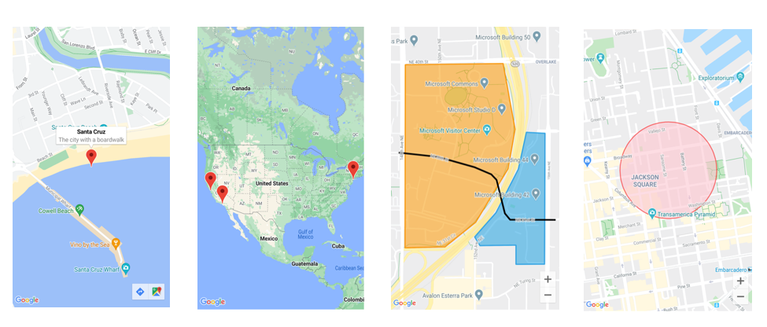
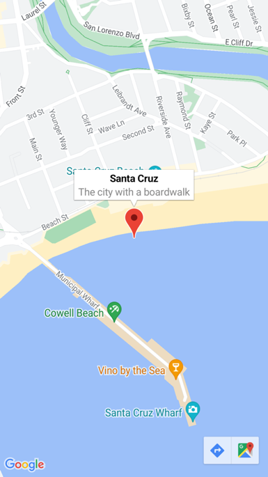
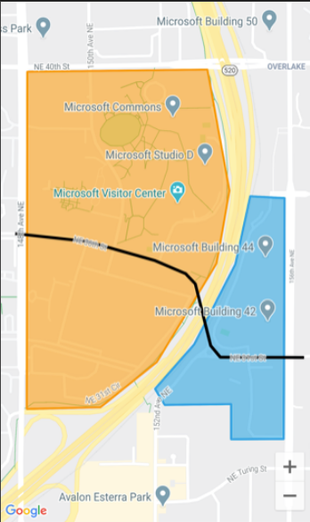

Did you know that [.NET MAUI](https://dot.net/maui) features a full `Map` control for iOS, Android, and MacCatalyst apps? It came with the launch of .NET 7 and it allows you to not only display a map with pins, but it also allows for full drawing with polygons, polylines, and circles! Lets take a look today at the `Map` control, how to display pins, and how to draw outlines and walking paths on the Microsoft campus in Redmond!

 

## Pins on a Map

The [`Map`](https://learn.microsoft.com/dotnet/api/microsoft.maui.controls.maps.map) controls in .NET MAUI offers a wide arrange of customization of how to display the map. One of the basic elements that people place on a map is a [`Pin`](https://learn.microsoft.com/dotnet/api/microsoft.maui.controls.maps.pin) that displays a marker with text. The  `Pins` property on the `Map` control is an `IList` that we can populate dynamically to put as many pins on the map. This can be accomplished in XAML:

```xaml
<ContentPage ...
             xmlns:maps="clr-namespace:Microsoft.Maui.Controls.Maps;assembly=Microsoft.Maui.Controls.Maps"
             xmlns:sensors="clr-namespace:Microsoft.Maui.Devices.Sensors;assembly=Microsoft.Maui.Essentials">
    <maps:Map x:Name="map">
        <x:Arguments>
            <MapSpan>
                <x:Arguments>
                    ...
                </x:Arguments>
            </MapSpan>
        </x:Arguments>
        <maps:Map.Pins>
            <maps:Pin Label="Santa Cruz"
                      Address="The city with a boardwalk"
                      Type="Place">
                <maps:Pin.Location>
                    <sensors:Location>
                        <x:Arguments>
                            <x:Double>36.9628066</x:Double>
                            <x:Double>-122.0194722</x:Double>
                        </x:Arguments>
                    </sensors:Location>
                </maps:Pin.Location>
            </maps:Pin>
        </maps:Map.Pins>
    </maps:Map>
</ContentPage>
```

You can specify the pins directly in the XAML or you can use data binding to a list of `Pin` using the `ItemsSource` property similar to a `ListView` or `CollectionView`.

You can also do this directly in C# code:

```csharp
using Microsoft.Maui.Controls.Maps;
using Microsoft.Maui.Maps;

//...

var pin = new Pin
{
  Label = "Santa Cruz",
  Address = "The city with a boardwalk",
  Type = PinType.Place,
  Location = new Location(36.9628066, -122.0194722)
};

map.Pins.Add(pin);
```



Better yet, you can add events to the `Pin` to see when it was clicked or when the info window was clicked with the `MarkerClicked` and `InfoWindowClicked` events on the `Pin`.

## Drawing Elements on a Map

Now, let's get into some fun and actually draw some lines and polygons on a map! The `MapElements` property on a `Map` takes in a list of [`MapElement`](https://learn.microsoft.com/dotnet/api/microsoft.maui.controls.maps.mapelement) that can be drawn on the map. Built into .NET MAUI are three elements:

* [Circle](https://learn.microsoft.com/dotnet/api/microsoft.maui.controls.maps.circle): A circle drawn from a center point with a specified radius
* [Polygon](https://learn.microsoft.com/dotnet/api/microsoft.maui.controls.maps.polygon): A fully enclosed shape. The first & last points are automatically connected.
* [Polyline](https://learn.microsoft.com/dotnet/api/microsoft.maui.controls.maps.polyline): A series of points connected by drawn lines

With these three elements you can do just about anything on a map! Like drawing an overlay over the Microsoft Campus in Redmond with a line showing the walkway between the East and West campus:



First, let's draw two `Polygon` elements that represent our West and East campus. Each of them will take in a list of `Location` on the `Geopath` property that will define the outline points. The `Polygon` will automatically connect each of these points together with a `Stroke` that you can define and a full background `FillColor`. All of this can be created directly in XAML with our without data binding or directly in C# like I prefer when dealing with maps.

```csharp
var msWest = new Polygon
{
    StrokeColor = Color.FromArgb("#FF9900"),
    StrokeWidth = 8,
    FillColor = Color.FromArgb("#88FF9900"),
    Geopath =
    {
        new Location(47.6458676, -122.1356007),
        new Location(47.6458097, -122.142789),
        new Location(47.6367593, -122.1428104),
        new Location(47.6368027, -122.1398707),
        new Location(47.6380172, -122.1376177),
        new Location(47.640663, -122.1352359),
        new Location(47.6426148, -122.1347209),
        new Location(47.6458676, -122.1356007)
    }
};


var msEast = new Polygon
{
    StrokeColor = Color.FromArgb("#1BA1E2"),
    StrokeWidth = 8,
    FillColor = Color.FromArgb("#881BA1E2"),
    Geopath =
    {
        new Location(47.6368678, -122.137305),
        new Location(47.6368894, -122.134655),
        new Location(47.6359424, -122.134655),
        new Location(47.6359496, -122.1325521),
        new Location(47.6424124, -122.1325199),
        new Location(47.642463, -122.1338932),
        new Location(47.6406414, -122.1344833),
        new Location(47.6384943, -122.1361248),
        new Location(47.6372943, -122.1376912),
        new Location(47.6368678, -122.137305),
    }
};
```

With our two `Polygon` regions defined now, all we need to do is create a `Polyline` to represent the bridge that connects the two parts of the campus. A `Polyline` is extremely similar to a `Polygon`, but it does not automatically "connect" the start and end points, and there is no background fill. It is simply points on a map that are connected by a line. 

```csharp
var interstateBridge = new Polyline
{
    StrokeColor = Colors.Black,
    StrokeWidth = 12,
    Geopath =
    {
        new Location(47.6381401, -122.1317367),
        new Location(47.6381473, -122.1350841),
        new Location(47.6382847, -122.1353094),
        new Location(47.6384582, -122.1354703),
        new Location(47.6401136, -122.1360819),
        new Location(47.6403883, -122.1364681),
        new Location(47.6407426, -122.1377019),
        new Location(47.6412558, -122.1404056),
        new Location(47.6414148, -122.1418647),
        new Location(47.6414654, -122.1432702)
    }
};
```

Now it is time to load these elements into our `Map` control's `MapElements` property and of course zoom the map to the position above the campus:

```csharp
map.MapElements.Add(msWest);
map.MapElements.Add(msEast);
map.MapElements.Add(interstateBridge);

map.MoveToRegion(MapSpan.FromCenterAndRadius(
                new Location(47.640663, -122.1376177), Distance.FromMiles(1)));
```

There you have it! Our map is now fully displaying our two regions and a line that represent the bridge walkway between the campus! You can always add and remove as many `MapElement`s as you would like!

## Learn More

There is so much more to learn about the `Map` control! I recently did a short [overview video](https://www.youtube.com/watch?v=jkEWltr6Aq0) that I highly recommend watching:

<iframe width="752" height="423" src="https://www.youtube.com/embed/jkEWltr6Aq0" title="Cross-platform Maps with .NET MAUI" frameborder="0" allow="accelerometer; autoplay; clipboard-write; encrypted-media; gyroscope; picture-in-picture; web-share" allowfullscreen></iframe>

Additionally, read through the entire [documention](https://learn.microsoft.com/dotnet/maui/user-interface/controls/map) where you will find the full source code for this sample and so much more!