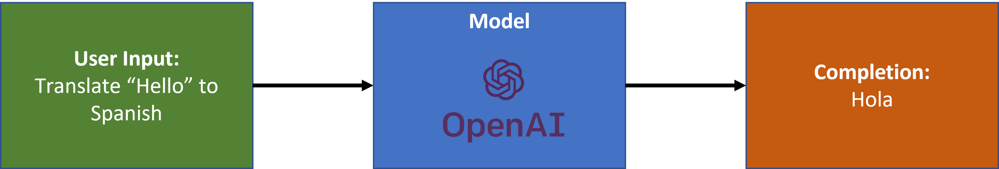

Welcome to this blog series on OpenAI and .NET!

If you're new here, check out our [first post](https://devblogs.microsoft.com/dotnet/getting-started-azure-openai-dotnet/) where we introduce the series and show you how to get started using OpenAI in .NET.

The focus of this post is on completions. Let's get started!

## What are completions?

Completions are the responses generated by a model like GPT.

The types of responses you can generate include:

### Text

**Input**

Translate "Hello" to Spanish.

**Output**

"Hola"

### Code

**Input**

Create a C# function that adds two integers

**Output** 

```csharp
int Add(int x, int y)
{
    return x + y
}
```

### Images

**Input**

A snug pug in a rug

**Output**


In this post, the focus is on text and code completions. 

## How are completions generated?

There are a few parts needed to generate a completion:

- Model
- User input (prompt)



You can think of a model as a stateful function. A model is a system that's been developed to identify patterns in data using algorithms. The model's capabilities depend on the data and algorithms used to build the model. For more details on the different types of models and their capabilities, see the [Azure OpenAI Service models documentation](https://learn.microsoft.com/azure/cognitive-services/openai/concepts/models).

The algorithms used to build OpenAI models like GPT are neural networks known as transformers. More specifically, models like GPT are often referred to as Large Language Models (LLMs) because of their size (large) and type of problems they're designed to solve (language). 

The technical details of LLMs are beyond the scope of this post. However, if you're interested in learning more, check out the article [What is ChatGPT Doing...And Why Does It Work](https://writings.stephenwolfram.com/2023/02/what-is-chatgpt-doing-and-why-does-it-work/) as well as the paper [Language models are few-shot learners](https://openai.com/research/language-models-are-few-shot-learners). 

The user input, also known as a prompt, is what guides the model and provides instructions about what you want the model to output. For more precise results, a prompt contains the following content:

- Context
- Task / Query

Given the following prompt:

> Summarize this for a second-grade student:
> 
> Jupiter is the fifth planet from the Sun and the largest in the Solar System. It is a gas giant with a mass one-thousandth that of the Sun, but two-and-a-half times that of all the other planets in the Solar System combined. Jupiter is one of the brightest objects visible to the naked eye in the night sky, and has been known to ancient civilizations since before recorded history. It is named after the Roman god Jupiter.[19] When viewed from Earth, Jupiter can be bright enough for its reflected light to cast visible shadows,[20] and is on average the third-brightest natural object in the night sky after the Moon and Venus.

It can be broken down into:

- **Context:** Jupiter is the fifth planet from the Sun and the largest in the Solar System. It is a gas giant with a mass one-thousandth that of the Sun, but two-and-a-half times that of all the other planets in the Solar System combined. Jupiter is one of the brightest objects visible to the naked eye in the night sky, and has been known to ancient civilizations since before recorded history. It is named after the Roman god Jupiter.[19] When viewed from Earth, Jupiter can be bright enough for its reflected light to cast visible shadows,[20] and is on average the third-brightest natural object in the night sky after the Moon and Venus.
- **Task/Query:** Summarize this for a second-grade student:

The resulting completion should look similar to the following:

> Jupiter is the fifth planet from the Sun and the biggest in our Solar System. It is very bright in the night sky and has been known since ancient times. It is named after the Roman god Jupiter. It is usually the third brightest object in the night sky after the Moon and Venus.

The important part here is the task/query since that's what guides the model to produce a specific kind of output. For example, if I were to change the task/query to "What is Jupiter's mass compared to the sun?", I can expect to produce a completion similar to "Jupiter has a mass one-thousandth that of the Sun, or 0.001 solar masses."

As you can see, when you pair a model like GPT with a well-formed prompt, they form an effective foundation to build all types of applications using AI. 

## How much text can I provide in my prompt?

The size of your prompt is measured in tokens. Generally, GPT models break words into “tokens”. While common multi-syllable words are often a single token, less common words are broken in syllables. Each model has a token limit. For more details, see the [Azure OpenAI Service models documentation](https://learn.microsoft.com/azure/cognitive-services/openai/concepts/models). 

To count the number of tokens in your prompt, use the [Microsoft.ML.Tokenizers](https://www.nuget.org/packages/Microsoft.ML.Tokenizers/) NuGet package.

See the [Tokenization sample](https://aka.ms/openai-dotnet-tokenization) for mode details.

## How do I get started generating my own completions?

Now that you know what completions are and how they're generated, it's time to start generating your own. To get started:

1. Sign up or request access with [OpenAI](https://platform.openai.com/signup/) or [Azure OpenAI Service](https://learn.microsoft.com/azure/cognitive-services/openai/overview#how-do-i-get-access-to-azure-openai).
1. Use your credentials to start experimenting with the [OpenAI .NET samples](https://aka.ms/openai-dotnet-samples).

## What's next

In the next post, we'll go into more detail on the topic of prompt engineering, which is the process of optimizing your prompts to produce more precise answers. 

## We want to hear from you

Help us learn more about how you're looking to use AI in your applications. Take a few minutes to complete this [survey](https://aka.ms/dotnet-oai-survey-2).

Are there any topics you're interested in learning more about? Let us know in the comments.