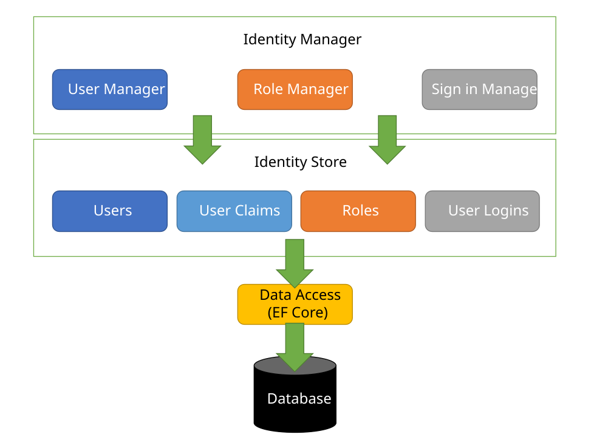
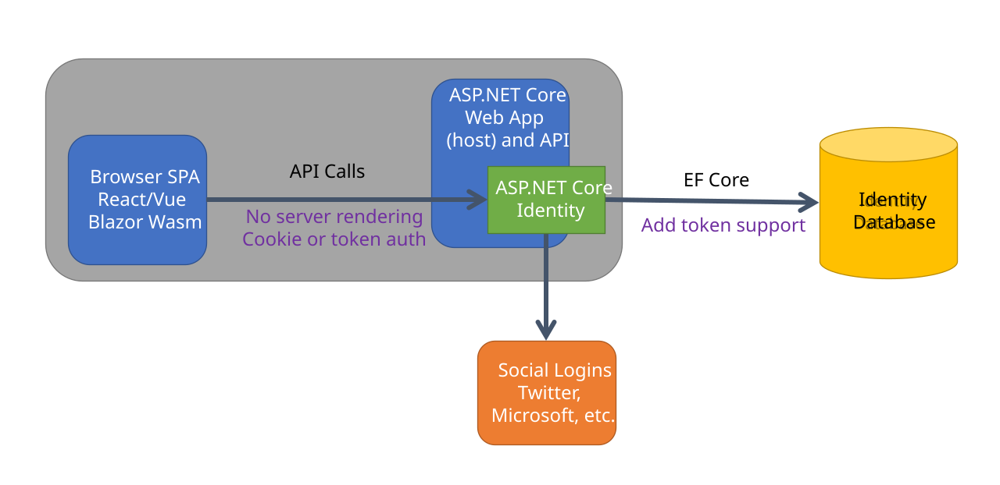

The ASP.NET Core team is improving authentication, authorization, and identity management (collectively referred to as "auth") in .NET 8. New APIs will make it easier to customize the user login and identity management experience. New endpoints will enable token-based authentication and authorization in Single Page Applications (SPA) with no external dependencies. We will also improve our guidance and documentation to make it easier to discover and implement identity management solutions.

## Background

Developers who enable auth in their ASP.NET Core applications are faced with multiple choices:

- ASP.NET Core provides the built-in [ASP.NET Core Identity](https://learn.microsoft.com/aspnet/core/security/authentication/identity) solution to manage customer login and authorization.
- [Azure Active directory (Azure AD)](https://azure.microsoft.com/products/active-directory/) is the Azure cloud-hosted solution that provides fine-grained access control and supports advanced scenarios such as authorizing resources for APIs "by an app, on behalf of a user."
- A variety of third-party solutions are available in the form of packages, containers, and cloud services.

ASP.NET Core Identity is our self-contained out-of-the-box solution. It includes:

- The **Identity Manager** that provides APIs for working with users (including claims and logins) and roles.
- **Identity Store** interfaces for persisting identity information (users, claims, login providers and roles).
- A default implementation of the identity store for relational databases. You have the option to create your own custom implementation of the identity store.
- An authentication system (**SignInManager**).
- A UI for user management (**Identity UI**).

Today there are limitations to using ASP.NET Core Identity in SPA apps. The traditional way to customize the identity-related pages forces your app to revert to server-rendered web pages. We rely on external (third-party) packages to support token-based auth.

We have heard your feedback and are working on a solution to support more scenarios out-of-the-box with no external dependencies. This gives you the flexibility to get started with a solution right away while maintaining the freedom to choose other options. We recently shared our [plan for auth on GitHub](https://github.com/dotnet/aspnetcore/issues/42158#issuecomment-1481742187) to overwhelmingly positive feedback and are grateful for the opportunity to work with such a supportive and engaged community.

## IdentityServer and SPA templates

To address customer feedback, the availability of additional options, and drive simplicity whenever possible, we plan to remove the dependency on Duende's IdentityServer from our SPA templates in .NET 8.  

For context, we began shipping IdentityServer4 to support JSON Web Token (JWT) security in Single Page Applications (SPA) as part of our Angular, React, and Blazor WebAssembly templates in .NET Core 3.1. The project was open source at the time. In 2020, the IdentityServer project maintainers [founded Duende](https://blog.duendesoftware.com/posts/20201001_helloduende/) to support their efforts to grow IdentityServer and changed to a commercial license. We chose to [continue shipping IdentityServer](https://devblogs.microsoft.com/dotnet/asp-net-core-6-and-authentication-servers/) in our templates for several reasons (read the blog post for details) and made the licensing requirement clear in our templates.

IdentityServer remains a great option for self-hosting a standards-compliant [Open ID Connect](https://openid.net/connect/) and [OAuth 2.0](https://oauth.net/2/) solution. Duende provides their [own template](https://docs.duendesoftware.com/identityserver/v6/overview/packaging/#templates) to integrate with ASP.NET Core Identity. In addition to IdentityServer, which remains free if you qualify for the [community edition](https://duendesoftware.com/products/communityedition), there are many other self-hosting options available including the open source [OpenIddict](https://documentation.openiddict.com/) project and container-based [Keycloak](https://www.keycloak.org/).

We believe this change will provide more freedom to choose the right identity management solution for your app.

To make it easier for you to discover and choose from the available options, our template will link to a documentation page that clarifies your choices. The document will list and link to the templates, tutorials, or samples that enable you to add auth whether it is through our own services, such as Azure AD, or a third-party product like Duende's IdentityServer.

## Improved auth for self-hosted solutions

Many users don't want or require the complexity and overhead of maintaining an OAuth/OpenID Connect server. Your apps simply need the capability to verify the user's identity via login and secure access to resources based on permissions. Support for role-based access and simple identity management has been built into to the ASP.NET Core Identity platform since it was released. Self-hosted identity management is enabled when you choose the "Individual Accounts" option for authentication in our templates or use the `--auth` option from `dotnet new` on the command line. You can also [scaffold identity in an existing project](https://learn.microsoft.com/aspnet/core/security/authentication/scaffold-identity) that doesn't have it. Visual Studio will scaffold the required code to generate and maintain a database of users and manage logins and permissions via roles. ASP.NET Core Identity provides a cookie-based authentication experience out of the box.

We listened to your feedback and identified two areas to improve in ASP.NET Core 8:

1. **Extend existing cookie-based auth to support customization in SPA apps.** Cookie-based auth works well for smaller, single domain solutions. To customize the experience, you must override the default server-rendered Identity pages we use to render the UI for identity management. This results in an inconsistent experience for customers when they transition from a single-page web app experience to a server-rendered one. The team will add API endpoints that enable developers to use a single-page app experience for their custom UI.

2. **Modernize existing identity to support token-based auth.** SPA app frameworks like React, Angular, and Blazor WebAssembly continue to grow in adoption and capabilities. Although our existing cookie-based solution works, the industry has evolved and token-based auth solutions are far more flexible these days and that's what is required for auth-enabled SPA apps. We've had many users ask for a simple solution that doesn't require third party dependencies or licensing. We plan to extend the existing identity platform to enable token-based authentication. This would mostly mirror the capabilities and functionality of the existing cookie-based solution and encapsulate the auth data in a token rather than a cookie and enable it to work in scenarios where cookies are not optimal or appropriate.

<blockquote>It is important to note the SPA-related enhancements are targeted for solutions that run on a single domain and do not have requirements to authenticate to cloud resources or third-party APIs. Azure AD, IdentityServer or other third-party solutions are preferred options for applications with those requirements.</blockquote>

## Easier discovery and learning

Our existing documentation covers features like [ASP.NET Core Identity](https://learn.microsoft.com/aspnet/core/security/authentication/identity), the [Microsoft Identity Platform](https://learn.microsoft.com/azure/active-directory/develop/v2-overview), and [Azure AD](https://learn.microsoft.com/azure/active-directory/fundamentals/active-directory-whatis). Most of the existing documentation is focused on products, technologies, and features. We hear your feedback that you would like more guidance and scenario-based documentation. Our goal for .NET 8 is that you have a single starting point to learn about available options for .NET Auth documentation that consolidates links to supporting tutorials and samples and more importantly provides specific guidance. For example, a standalone SPA app with no external dependencies has different requirements when compared to a business app with a database backend, third-party secured API dependencies and social logins. We will work with our customers to identify common scenarios like "secure an existing API endpoint" and provide end-to-end documentation that covers those needs.

At the same time, the [Microsoft Entra](https://www.microsoft.com/security/business/microsoft-entra) and .NET teams are working closely together to not only provide better documentation and samples, but also improve the clients, SDKs and tools to reduce the steps, code, configuration and concepts needed to successfully add Azure AD to your application.

## Next steps

We are in the process of implementing these changes and will communicate when they are ready for you to try out. In the meantime, we welcome your feedback and insights to help make auth better for everyone. You can do this by [filing issues](https://github.com/dotnet/aspnetcore/issues/new/choose) that describe the problems you are facing, [up-voting existing issues](https://github.com/dotnet/aspnetcore/issues?q=is%3Aissue+is%3Aopen+label%3Aarea-security) to help us prioritize what will be most impactful. We also welcome issues and pull-requests against our [ASP.NET Core documentation](https://github.com/dotnet/aspnetcore.docs) to help us improve it. Here is the link to the [plan for auth on GitHub](https://github.com/dotnet/aspnetcore/issues/42158#issuecomment-1481742187).
