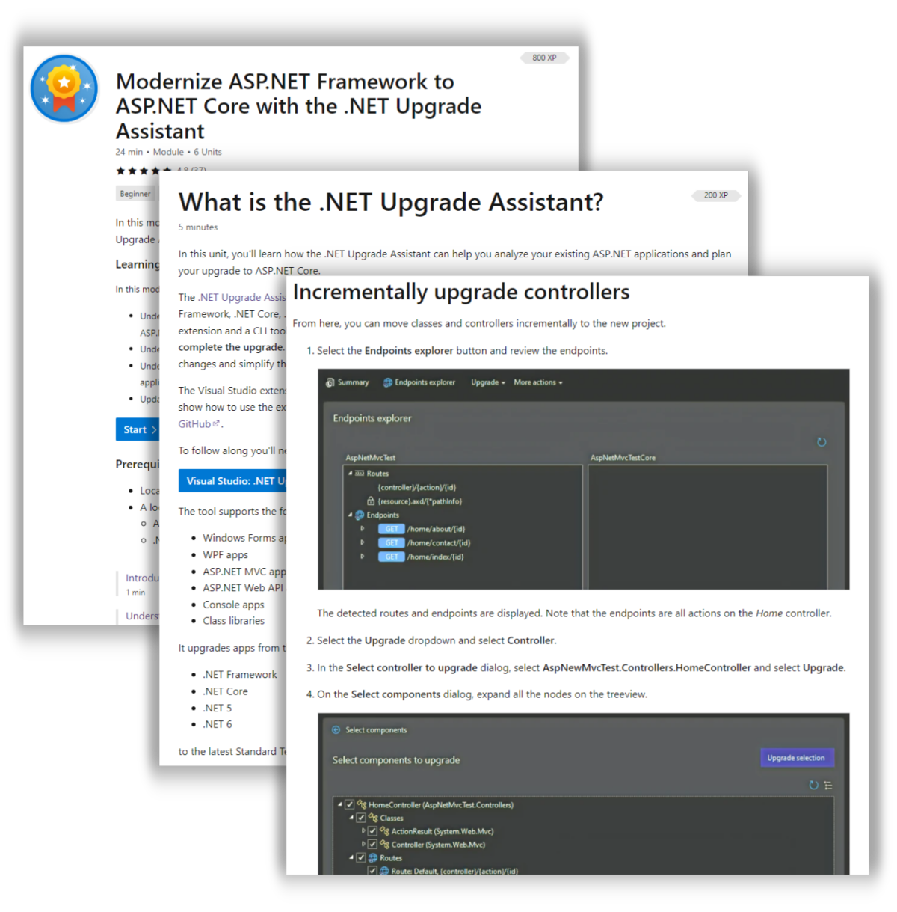

There are a lot of great reasons to update your .NET apps to the latest and greatest versions of .NET. You can take advantage of new features, get better performance, and improve security. But how do you know where to start? What are the best practices for modernizing your apps? And how do you know if you're doing it right?

Fortunately, we've got a lot of great resources based on real world experience working with customers to modernize their apps. In this post, we'll share some top resources to help you modernize your .NET apps.

## Why upgrade?

If you've got working code and limited hours, you might be wondering why you should upgrade your .NET apps. Here are some of the top reasons:

### Take advantage of huge performance improvements

Performance has been a major focus in .NET 7. We've made a lot of improvements to the runtime, the JIT, the GC, and in all of the application workloads. We've written [a lot of blog posts on .NET performance improvements](https://devblogs.microsoft.com/dotnet/category/performance/) because it's a core focus for us, and a key value for you. By updating your applications, you get two big performance benefits: faster execution, and better efficiency. These offer substantial customer experience improvements for your customers, and significant cost benefits for application owners.

### Use new features and paradigms in your applications

Each release of .NET includes a lot of new features - new APIs, support for new standards, language features, updated platform support, and more. Newer releases include support for modern application paradigms like [microservices](https://dotnet.microsoft.com/learn/aspnet/microservices-architecture), serverless, and modern CI/CD.

### Enable new development and deployment opportunities with cross-platform support

Moving from .NET Framework to modern .NET unlocks an entire new world of cross-platform support. You can develop and run your apps on Windows, Linux, and macOS, and you can deploy them to the cloud or on-premises.

If you're on a previous version of .NET Core, upgrading to the current release gives you additional cross-platform support, including [enhanced support for Linux and containers] as well as first tier support for additional [support for Apple M1](https://github.com/dotnet/runtime/issues/43313/) and [ARM64](https://devblogs.microsoft.com/dotnet/arm64-performance-improvements-in-dotnet-7/).

## Now is a great time to upgrade, thanks to the Upgrade Assistant!

Our team supports a lot of large customers who have significant upgrade challenges - large applications with decades of code, complex build and deployment pipelines, and a lot of dependencies on third party libraries. We've learned a lot from these customers, and we've built a tool based on what we've learned: the [.NET Upgrade Assistant](https://dotnet.microsoft.com/platform/upgrade-assistant). Originally we shipped the .NET Upgrade Assistant as a CLI tool; based on your feedback, we now provide [a unified upgrade experience for every project type inside of Visual Studio](https://devblogs.microsoft.com/dotnet/upgrade-assistant-now-in-visual-studio/). We've updated our training material and created new video content to help you get started with the Visual Studio Upgrade Assistant extension.

## Get a quick start with our two hour Let's Learn .NET video

This two hour video is a great place to get started. [Olia Gavrysh](https://devblogs.microsoft.com/dotnet/author/olga-gavrysh/) and [Mike Rousos](https://devblogs.microsoft.com/dotnet/author/mikerou/) walk you through the basics of modernizing your .NET apps:

- Why upgrade?
- Supported workloads and paths
- The Visual Studio Upgrade Assistant extension
- Walkthrough upgrading an ASP.NET MVC 5 (.NET Framework) app to .NET 7
- Using the Upgrade Planner
- Desktop and Xamarin upgrades
- Top resources

<iframe width="752" height="423" src="https://www.youtube.com/embed/JwKkff93rCA" title="Let's Learn .NET: Modernization" frameborder="0" allow="accelerometer; autoplay; clipboard-write; encrypted-media; gyroscope; picture-in-picture; web-share" allowfullscreen></iframe>

## Go hands on with our updated Learn Module

We've updated the [Modernize ASP.NET Framework to ASP.NET Core with the .NET Upgrade Assistant](https://learn.microsoft.com/training/modules/modernize-aspnet-framework-to-core/) module on Microsoft Learn to show the latest guidance on using the Visual Studio Upgrade Assistant extension. This module walks you through the process of upgrading the same ASP.NET MVC 5 application that we used in the Let's Learn .NET video.

## Deep dive video series on ASP.NET app modernization

[Mike Rousos](https://devblogs.microsoft.com/dotnet/author/mikerou/) shares his experience working with customers to modernize their ASP.NET apps. In this [18 part video series](https://aka.ms/modernize-aspnet-videos), he walks you through the process of upgrading a [more complex ASP.NET MVC 5 (.NET Framework) app](https://github.com/mjrousos/UpgradeSample) to ASP.NET Core 7, using all the latest tools including the Visual Studio Upgrade Assistant extension, [YARP based incremental migration](https://learn.microsoft.com/aspnet/core/migration/inc/overview), and the [Upgrade Planner](https://apisof.net/upgrade-planner). This walkthrough shows some more advanced issues that you might encounter when upgrading your apps, such as sharing session state, static resources, and authentication over the course of an incremental migration that may span weeks or months.

1. [.NET Migration Overview](https://youtu.be/zHgYDZK3MrA)
1. [Why Upgrade to .NET?](https://youtu.be/zHgYDZK3MrA)
1. [Getting Started with .NET Upgrade Assistant](https://youtu.be/zHgYDZK3MrA)
1. [Analyzing a Solution with .NET Upgrade Planner](https://youtu.be/zHgYDZK3MrA)
1. [Upgrade Analysis with .NET Upgrade Assistant](https://youtu.be/zHgYDZK3MrA)
1. [Upgrading a Project with .NET Upgrade Assistant](https://youtu.be/zHgYDZK3MrA)
1. [Intro to the Upgrade Assistant Visual Studio Extension](https://youtu.be/zHgYDZK3MrA)
1. [Creating a New Project with the Upgrade Assistant Visual Studio Extension](https://youtu.be/zHgYDZK3MrA)
1. [Migrating an Endpoint with the Upgrade Assistant Visual Studio Extension](https://youtu.be/zHgYDZK3MrA)
1. [Migrating a Class Library with System.Web Dependencies](https://youtu.be/zHgYDZK3MrA)
1. [Using System.Web Adapters to Share Session State in ASP.NET Upgrade Scenarios](https://youtu.be/zHgYDZK3MrA)
1. [Using System.Web Adapters to Share Authentication in ASP.NET Upgrade Scenarios](https://youtu.be/zHgYDZK3MrA)
1. [Sharing Authentication Cookies in ASP.NET Upgrade Scenarios](https://youtu.be/zHgYDZK3MrA)
1. [Migrating static content from ASP.NET to ASP.NET Core](https://youtu.be/zHgYDZK3MrA)
1. [Deploying an Incrementally Migrated ASP.NET App to Azure App Service](https://youtu.be/zHgYDZK3MrA)
1. [ASP.NET to ASP.NET Core Migration Wrap-Up](https://youtu.be/zHgYDZK3MrA)
1. [Upgrading from WCF to CoreWCF](https://youtu.be/zHgYDZK3MrA)
1. [Deep Dive into System.Web Adapters](https://youtu.be/zHgYDZK3MrA)

<iframe width="752" height="423" src="https://www.youtube.com/embed/videoseries?list=PLdo4fOcmZ0oWiK8r9OkJM3MUUL7_bOT9z" title="On .NET - Migrating from ASP.NET to ASP.NET Core" frameborder="0" allow="accelerometer; autoplay; clipboard-write; encrypted-media; gyroscope; picture-in-picture; web-share" allowfullscreen></iframe>

## Resources for Xamarin upgrades

It's a great time to update & migrate your Xamarin.iOS and Xamarin.Android apps to the latest version of .NET so you can take advantage of the latest features of .NET 7 including C# 11 and the new project system. [James Montemagno](https://devblogs.microsoft.com/xamarin/author/jamesmontemagno/) recently posted some top [Tips & Tricks on Upgrading Xamarin.iOS & Xamarin.Android to .NET for iOS & Android](https://devblogs.microsoft.com/xamarin/upgrade-xamarin-ios-android-to-dotnet6-dotnet7/). We've also posted some updated [docs on how to upgrade from Xamarin to .NET](https://learn.microsoft.com/dotnet/maui/migration/?view=net-maui-7.0).

## Summary

We know that modernizing your .NET applications can be challenging, and we've worked hard to share our experience and best practices with you. We hope these resources help you modernize your .NET apps.
