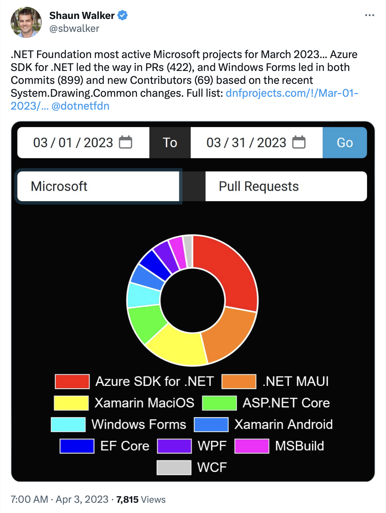
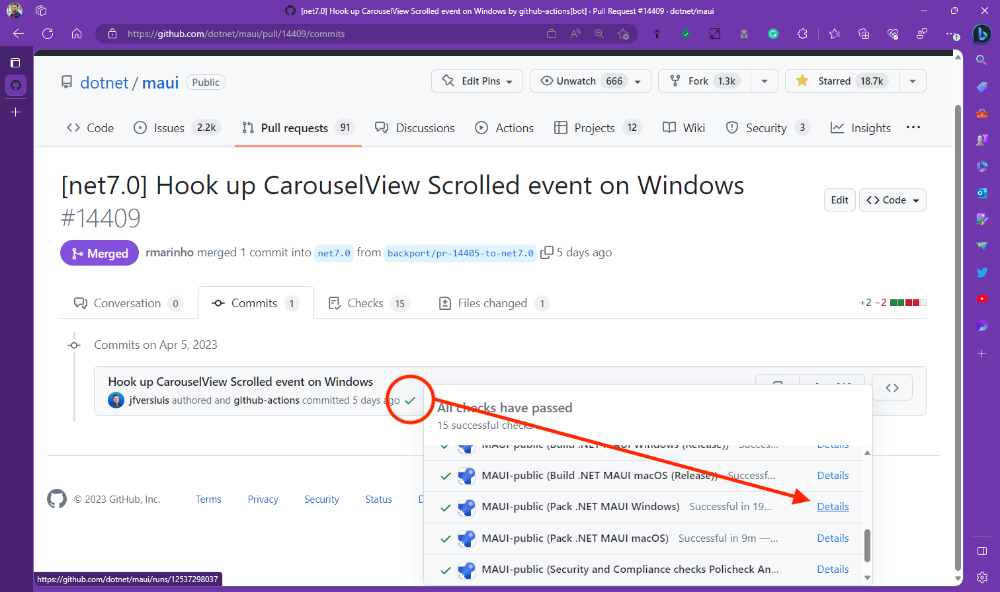
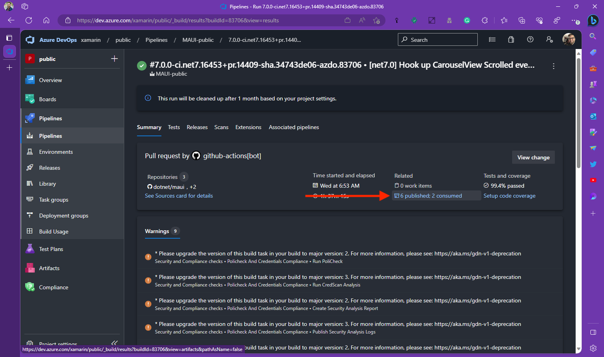
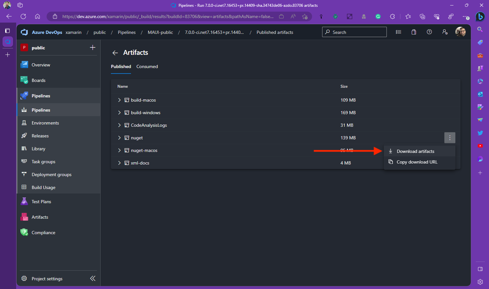

The third preview of .NET Multi-platform App UI (MAUI) in .NET 8 is now available. This release we are focusing on improving the quality of the UI controls, layout, and memory management. Also new in .NET 8 we are introducing NuGet packages for your flexibility to preview future builds and lock your applications to a specific version.

.NET MAUI is one of the [most active projects](https://www.dnfprojects.com/!/Mar-01-2023/Mar-31-2023/microsoft/pr) in the .NET Foundation. When you combine Android, iOS, and .NET MAUI together, it's far and away the most active for issues and pull requests. In less than a year .NET MAUI usage has grown 450%. Our goal in .NET 8 is to make you even more successful using .NET to build apps for Android, iOS, macOS, and Windows with .NET MAUI.



## Improving Quality

The main focus for our .NET 8 release is improving the quality and stability of the entire product. We have been prioritizing the highest impact issues on the most used controls. Those receiving the most attention have been layout, `CollectionView`, `Shell`, and drawing (shapes, shadows, clipping). 

Thus far in .NET 8 we have now resolved 303 issues and merged 713 pull requests. We'd like to say a huge thank you to the over 50 contributors that have taken part in making .NET MAUI successful!


Among some of the most high-impact improvements touch on keyboard with `Entry` and `Editor` interactions ([#13499](https://github.com/dotnet/maui/pull/13499)), `Grid` helper methods ([#13408](https://github.com/dotnet/maui/pull/13408)), and `Shell` lifecycle events ([#13177](https://github.com/dotnet/maui/pull/13177)).


Those are just a few highlights. For complete details, check out the [release notes](https://github.com/dotnet/maui/releases).

## Improving Memory Management

You need and expect .NET MAUI apps to make efficient use of memory so they remain performant and safely operate for extended periods of time. In .NET 8 we've been on the hunt for memory leaks, and one of our senior engineers, [Jonathan Peppers](https://github.com/jonathanpeppers), has been documenting the progress. He found that when navigating forward and back repeatedly the memory would grow ~2.45KB each time. By implementing a `WeakList<T>` to keep track of references, he was able to make sure the memory is properly released.

Other areas improved include `Button` ([#14280](https://github.com/dotnet/maui/pull/14280)), `Page` and `Layout` ([#14108](https://github.com/dotnet/maui/pull/14108)), `Window`([#14073](https://github.com/dotnet/maui/pull/14073)), `Shadow` ([#13960](https://github.com/dotnet/maui/pull/13960)), `Clip` ([#13806](https://github.com/dotnet/maui/pull/13806)), `Background` brush ([#13656(https://github.com/dotnet/maui/pull/13656)]), `BindableLayout` ([#13550](https://github.com/dotnet/maui/pull/13550)), and [more](https://github.com/dotnet/maui/pulls?q=is%3Apr+memory+is%3Aclosed). Additional work is underway to improve memory management in `CollectionView` ([#14329](https://github.com/dotnet/maui/pull/14329)). 

Several of these have been backported to .NET 7.

## NuGet Packages

While .NET MAUI continues to be a .NET workload that you install via Visual Studio or the `dotnet` command line, you can now layer specific versions of NuGet packages into your project. This is great for:

- reviewing a pull request
- previewing unreleased or experimental builds
- pinning a project to specific version

From any pull request and branch at dotnet/maui you can navigate to the Azure build pipeline by clicking the green checkmark and locating the build artifacts.





Download the NuGet artifacts and extract them to a local directory. Within Visual Studio set a NuGet source path to that same directory, or use a `nuget.config` file. Then within your project's `csproj` file you can specify the version of that build:

```xml
<PropertyGroup>
    <MauiVersion>8.0.0-ci.net8.11560</MauiVersion>
</PropertyGroup>
```

Additional work is happening to improve your workloads experience in general. For more details, [read up on GitHub](https://github.com/dotnet/sdk/issues/30008).

## Getting Started

To begin previewing .NET MAUI in .NET 8 today, [install .NET 8 Preview 3](https://learn.microsoft.com/dotnet/core/install/) on Linux, macOS, or Windows. Once installed, run the workload installation command from your favorite CLI. 

```console
dotnet workload install maui
```

Full Visual Studio 2022 support for .NET 8 previews will come in a future release. For a more complete look at the .NET 8 roadmap for .NET MAUI, check out [themesof.net](https://themesof.net/roadmap?product=.NET&release=8.0&q=area%3AMAUI).

### Feedback Welcome

We'd love to hear your feedback. As you encounter issues in the release or have suggestions, please [open an issue on GitHub](https://github.com/dotnet/maui/issues/new/choose).
