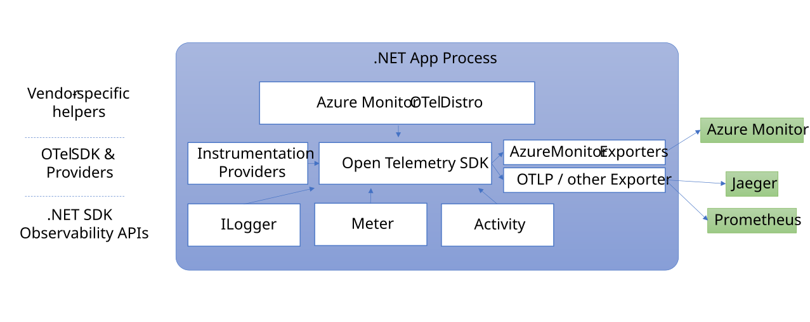

Our goal is to make Azure the most observable cloud. To that end, we are refactoring Azure’s native observability platform to be based on OpenTelemetry, an industry standard for instrumenting applications and transmitting telemetry.

These investments include plans to retrofit the Azure Monitor ingress and all our Azure SDKs to use OTLP for traces and metrics, making it possible to use any language OpenTelemetry supports on Azure. As part of these investments, we have strong support for observability in .NET, where telemetry can be collected using the OpenTelemetry SDK for .NET.

One advantage of OpenTelemetry is that it’s vendor-neutral. For example, the exporter model enables the data to be used with a variety of APM systems, including open-source projects such as Prometheus, Grafana, Jaeger & Zipkin, and commercial products such as Azure’s native monitoring solution, Azure Monitor. 

When it comes to Azure’s native observability solution, Azure Monitor, we want to make it as easy as possible for you to enable OpenTelemetry. The “Azure Monitor OpenTelemetry Distro” is your one-stop-shop to power Azure Monitor. While we are currently focused on lighting up Application Insights, we plan to expand this Distro to cover other scenarios within Azure Monitor in the future, such as piping special purpose logs/events to your own custom-defined table in Log Analytics.

OpenTelemetry and .NET can have different terminology for the same things – Open Telemetry is a cross platform standard where vendors create "distros" for multiple languages. While distro is often thought of in the context of Linux, in this case, the term “distro” is equivalent to library or package that bundles together OpenTelemetry components. For .NET this Distro is shipped as the Nuget Package *Azure.Monitor.OpenTelemetry.AspNetCore* and is backed by a [github project](https://github.com/Azure/azure-sdk-for-net/tree/main/sdk/monitor/Azure.Monitor.OpenTelemetry.AspNetCore).

## Introducing ILogger Correlation

Before we get into the details of the Azure Monitor OpenTelemetry Distro, we want to catch you up on how far OpenTelemetry has come on .NET:
- In March 2021, we announced that OpenTelemetry Tracing APIs would be [part of .NET 5](https://devblogs.microsoft.com/dotnet/opentelemetry-net-reaches-v1-0/#library-authors).
- In June 2021, we announced that OpenTelemetry metrics API would be [part of .NET 6](https://devblogs.microsoft.com/dotnet/announcing-net-6-preview-5/#libraries-support-for-opentelemetry-metrics). 

With the help of the OpenTelemetry SDK, logging using ILogger now supports the automatic capturing of Activity IDs for correlation to traces, so all three signal types are now available for full end-to-end observability. The video shows how to see this correlation in Application Insights.


## How to make OpenTelemetry easier to use on Azure?

One of the challenges for observability solutions like Azure Monitor is making it easy for customers to get started with OpenTelemetry.

There’s an initial learning curve where application developers must teach themselves the basics of OpenTelemetry, consider which instrumentation libraries they need, assess which configurations matter to their scenario, and determine whether any vendor-specific processors are required for interoperability with their existing APM.

Setting all this up requires learning lots of new concepts, and developers are forced to keep track of several moving parts.

In addition, OpenTelemetry provides a rich API surface with dozens of instrumentation libraries to enable the wide range of observability scenarios customers may need. We received feedback from developers that they want a simpler entry point to follow that enables the best practices for monitoring their ASP.NET core web applications with Azure.

## Introducing the Azure Monitor OpenTelemetry Distro

To make this enablement easier, the distro includes helper methods that enable Azure Monitor Experiences including Application Insights with just a single line of code.

```csharp
var builder = WebApplication.CreateBuilder(args);

builder.Services.AddOpenTelemetry().UseAzureMonitor();

var app = builder.Build();

app.Run();
```

With the single line of code, the Distro includes everything you need for a first-class Azure experience, including:

*	Popular instrumentation libraries for auto-collection of traces, metrics, and logs
*	Correlated traces when using Application Insights SDKs in other parts of your service
*	Azure Active Directory (AAD) Authentication
*	Application Insights Standard Metrics
*	Automatic detection of Azure Resources to auto-populate key experiences.

In the months to come, we plan to add more features to the Distro including [Live Metrics](https://learn.microsoft.com/azure/azure-monitor/app/live-stream). With OpenTelemetry semantic conventions reaching stability, Azure SDK instrumentation will provide insights into your app's communication with Azure Services. This will bring observability to messaging scenarios.

As we adapt our backend systems, you’ll get the full benefits of OpenTelemetry including exemplars and histograms. Over time, we hope to contribute back some of these unique Azure-Specific features to OpenTelemetry so they are part of the broader community, but our commitment is to get the best to our customers as soon as possible via the Distro.

In addition to ASP.NET core, we are also releasing Azure Monitor OpenTelemetry Distros in JavaScript (Node.js) and Python. We have had an OpenTelemetry-based Java Distro in production for several years, and it's been encouraging to see strong adoption of Java Observability on Azure Monitor.

## Open and Extensible Design

Even though this is a "vendor-specific wrapper", our design is open and extensible. Our goal is ease-of-use; not vendor-lock. It follows the layered approach for telemetry APIs in .NET.



For example, let’s say down the road you want to add a second exporter. You can instantiate one alongside Azure Monitor Exporter. You can also add community instrumentation libraries not already bundled in with the Distro to expand data collection.

## When to use the Distro versus the Exporter?

For the majority of ASP.NET Core customers, we anticipate the distro will be attractive because monitoring can quickly become complicated, and we want to take the guess work out of it. However, there will be some customers who want to touch all the knobs and levers, and for these customers the Azure Monitor exporter is still available as a standalone component. For all other application types besides ASP.NET Core, the [exporter](https://learn.microsoft.com/azure/azure-monitor/app/opentelemetry-enable?tabs=net) remains our recommended solution for now.

## How do I get started?

Getting started with the distro is simple. It’s only a few steps documented on Azure Monitor Application Insights [OpenTelemetry Enablement Official Docs](https://learn.microsoft.com/azure/azure-monitor/app/opentelemetry-enable). Check it out and let us know what you think. Join the chat at the bottom of the page, open an issue on [Github](https://github.com/Azure/azure-sdk-for-net/tree/main/sdk/monitor/Azure.Monitor.OpenTelemetry.AspNetCore), or send us some feedback at OTel@microsoft.com.
