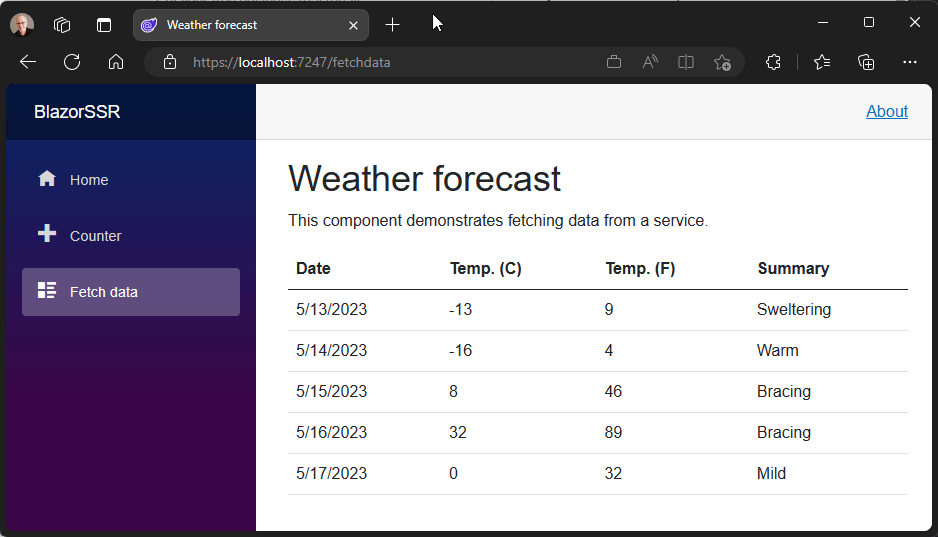
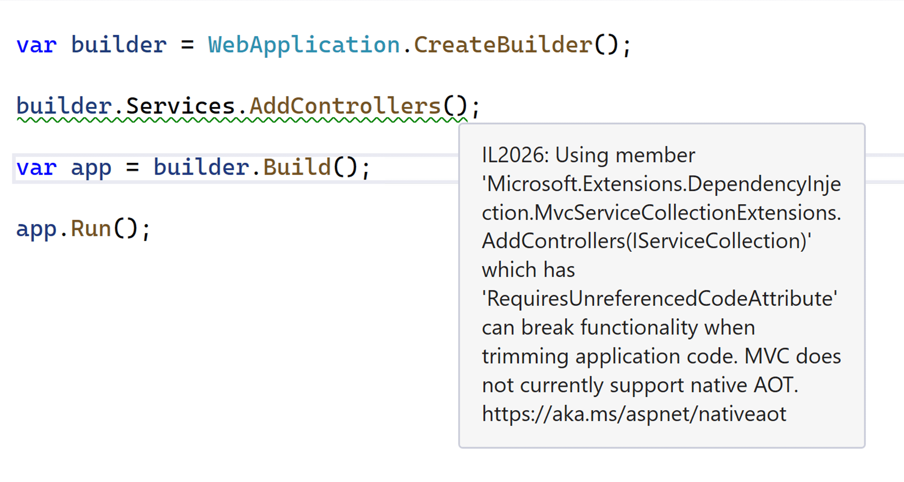
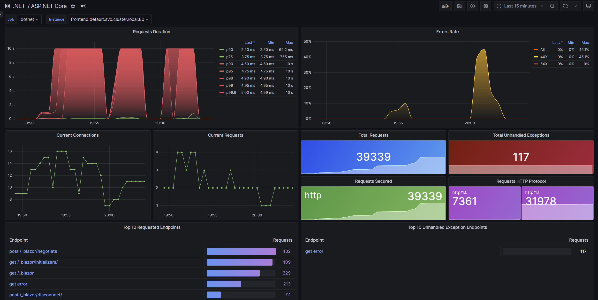

[.NET 8 Preview 4 is now available](https://devblogs.microsoft.com/dotnet/announcing-dotnet-8-preview-4) and includes many great new improvements to ASP.NET Core.

Here's a summary of what's new in this preview release:

- [Blazor](#blazor)
    - Streaming rendering with Blazor components
    - Handling form posts with Blazor SSR
    - Route to named elements in Blazor
    - Webcil packaging for Blazor WebAssembly apps
- [API authoring](#api-authoring)
    - Expanded support for form binding in minimal APIs
    - API project template includes `.http` file
- [Native AOT](#native-aot)
    - Logging and exception handling in compile-time generated minimal APIs
    - ASP.NET Core top-level APIs annotated for trim warnings
    - Reduced app size with configurable HTTPS support
    - Worker Service template updates
    - Additional default services configured in the slim builder
    - API template JSON configuration changes
    - Support for JSON serialization of compiler-generated `IAsyncEnumerable` unspeakable types
- [Authentication and authorization](#auth)
    - Identity API endpoints
    - Improved support for custom authorization policies with `IAuthorizationRequirementData`
- [ASP.NET Core metrics](#metrics)

For more details on the ASP.NET Core work planned for .NET 8 see the full [ASP.NET Core roadmap for .NET 8](https://aka.ms/aspnet/roadmap) on GitHub.

## Get started

To get started with ASP.NET Core in .NET 8 Preview 4, [install the .NET 8 SDK](https://dotnet.microsoft.com/next).

If you're on Windows using Visual Studio, we recommend installing the latest [Visual Studio 2022 preview](https://visualstudio.com/preview). Visual Studio for Mac support for .NET 8 previews isn’t available at this time.

## Upgrade an existing project

To upgrade an existing ASP.NET Core app from .NET 8 Preview 3 to .NET 8 Preview 4:

- Update the target framework of your app to `net8.0`.
- Update all Microsoft.AspNetCore.\* package references to `8.0.0-preview.4.*`.
- Update all Microsoft.Extensions.\* package references to `8.0.0-preview.4.*`.

See also the full list of [breaking changes](https://docs.microsoft.com/dotnet/core/compatibility/8.0#aspnet-core) in ASP.NET Core for .NET 8.

<a id="blazor"></a>
## Blazor

### Streaming rendering with Blazor components

You can now stream content updates on the response stream when using server-side rendering (SSR) with Blazor in .NET 8. Streaming rendering can improve the user experience for server-side rendered pages that need to perform long-running async tasks in order to render fully.

For example, to render a page you might need to make a long running database query or an API call. Normally all async tasks executed as part of rendering a page must complete before the rendered response can be sent, which can delay loading the page. Streaming rendering initially renders the entire page with placeholder content while async operations execute. Once the async operations completes, the updated content is sent to the client on the same response connection and then patched by Blazor into the DOM. The benefit of this approach is that the main layout of the app renders as quickly as possible and the page is updated as soon as the content is ready.

To enable streaming rendering, you'll first need to add the new Blazor script.

```html
<script src="_framework/blazor.web.js" suppress-error="BL9992"></script>
```

Note that if you're adding this script to a Blazor component, like your layout component, you'll need to add the `suppress-error="BL9992"` attribute to avoid getting an error about using script tags in components.

Then, to enable streaming rendering for a specific component, use the `[StreamRendering(true)]` attribute. Typically this is done using the `@attribute` Razor directive:

```razor
@page "/fetchdata"
@using BlazorSSR.Data
@inject WeatherForecastService ForecastService
@attribute [StreamRendering(true)]

<PageTitle>Weather forecast</PageTitle>

<h1>Weather forecast</h1>

@if (forecasts is null)
{
    <p><em>Loading...</em></p>
}
else
{
    // Render weather forecasts
}

@code {
    private string message;

    protected override async Task OnInitializedAsync()
    {
        forecasts = await ForecastService.GetForecastAsync(DateOnly.FromDateTime(DateTime.Now));
    }
}
```

The component will now initially render without waiting for any async tasks to complete using placeholder content ("Loading..."). As the async tasks complete, the updated content is streamed to the response and then patched by Blazor into the DOM.



### Handling form posts with Blazor SSR

You can now use Blazor components to handle form posts with server-side rendering.

To enable handling form submissions from the server, you first need to setup a model binding context using the `CascadingModelBinder` component. An easy way to do this is in the main layout of your app:

```razor
<CascadingModelBinder>
    @Body
</CascadingModelBinder>
```

To define a form in Blazor you use the existing `EditForm` component and the corresponding input components, like `InputText`, `InputSelect`, etc.

The `EditForm` component will render a standard HTML `form` element, so you can use the `method` attribute to specify if the form should send POST request. The `EditForm` event handlers are not supported with GET requests.

When the form is submitted, the request will be routed to the corresponding page and then handled by the form with the matching form handler name as specified by the `handler` query string parameter. You can specify the form handler name for an `EditForm` using the `FormHandlerName` attribute. If there's only one form on the page, then you don't need to specify a name. You can then handle the form submission using the `EditForm` events.

Support for model binding and validating the request data hasn't been implemented yet (it's coming!), but you can manually handle the request data using the `FormDataProvider` service. The `FormDataProvider.Entries` property provides access to the form data and the `FormDataProvider.Name` property specifies the intended form handler.

Here's what a simple server-side rendered form in Blazor looks like:

```razor
@inject FormDataProvider FormData

<EditForm method="POST" Model="exampleModel" OnValidSubmit="HandleSubmit">
    <InputText @bind-Value="exampleModel.Name" />
    <button type="submit">Submit</button>
</EditForm>

@code {
    ExampleModel exampleModel = new();

    protected override void OnInitialized()
    {
        // Manually model bind the form data using the FormDataProvider service
        if (FormData.Entries.TryGetValue("Name", out var nameValues))
        {
            exampleModel.Name = nameValues.First();
        }
    }

    void HandleSubmit()
    {
        // Handle the submitted form data
    }

    public class ExampleModel
    {
        public string? Name { get; set; }
    }
}
```

### Route to named elements in Blazor

Blazor now supports using client-side routing to navigate to a specific HTML element on a page using standard URL fragments. If you specify an identifier for an HTML element using the standard `id` attribute, Blazor will correctly scroll to that element when the URL fragment matches the element identifier.

### Webcil packaging for Blazor WebAssembly apps

You can now try out the new Webcil package with Blazor WebAssembly apps. [Webcil](https://github.com/dotnet/runtime/blob/main/docs/design/mono/webcil.md) is web-friendly packaging of .NET assemblies that removes any content specific to native Windows execution to avoid issues when deploying to environments that block the download or use of .dll files.

To enable use of Webcil for your Blazor WebAssembly apps, add the `WasmEnableWebcil` property to your project file:

```xml
<PropertyGroup>
    <WasmEnableWebcil>true</WasmEnableWebcil>
</PropertyGroup>
```

If you encounter issues with using .webcil files in your environment, please let us know by [creating an issue on GitHub](https://github.com/dotnet/runtime/issues/new).

<a id="api-authoring"></a>
## API authoring

### Expanded support for form binding in minimal APIs

This preview introduces expanded support for binding to form types in minimal APIs. 
Form-based parameters are now inferred without the need of the `FromForm` attribute. 
Support for form-based parameters includes: `IFormCollection`, `IFormFile`, and `IFormFileCollection`. OpenAPI metadata is inferred for form parameters to support integration with Swagger UI.

The code sample below showcases implementing a minimal API that handles file uploads by leveraging inferred binding from the `IFormFile` type.

```csharp
var app = WebApplication.Create();

string GetOrCreateFilePath(string fileName, string filesDirectory = "uploadFiles")
{
    var directoryPath = Path.Combine(app.Environment.ContentRootPath, filesDirectory);
    Directory.CreateDirectory(directoryPath);
    return Path.Combine(directoryPath, fileName);
}

async Task UploadFileWithName(IFormFile file, string fileSaveName)
{
    var filePath = GetOrCreateFilePath(fileSaveName);
    await using var fileStream = new FileStream(filePath, FileMode.Create);
    await file.CopyToAsync(fileStream);
}

app.MapPost("/upload", async (IFormFile file) => {
    var fileSaveName = Guid.NewGuid().ToString("N") + Path.GetExtension(file.FileName);
    await UploadFileWithName(file, fileSaveName);
    return TypedResults.Ok("File uploaded successfully!");
});

app.Run();
```

This feature is supported in minimal APIs that use runtime-based code generation _and_ in minimal APIs leveraging [the new compile-time code generation for Native AOT scenarios](https://devblogs.microsoft.com/dotnet/asp-net-core-updates-in-dotnet-8-preview-3/#minimal-apis-and-native-aot).

Note: It's important to be defensive against [XSRF attacks](https://learn.microsoft.com/aspnet/core/security/anti-request-forgery?view=aspnetcore-7.0) when implementing forms in an application. This [code sample](https://gist.github.com/captainsafia/6b1f57026af53ae73bb5a2e58a68c4b8) outlines how to use the anti-forgery services in ASP.NET to support the generation and validation of anti-forgery tokens in minimal APIs.

<a id="api=authoring"></a>
### API project template includes `.http` file

The API project template (generated via `dotnet new api`) now includes an `.http` file that can be used to send requests to the endpoints defined within the application from [the new HTTP editor in Visual Studio](https://devblogs.microsoft.com/visualstudio/web-api-development-in-visual-studio-2022/).

```text
@MyApi_HostAddress = http://localhost:5233

GET {{MyApi_HostAddress}}/todos/
Accept: application/json

###

GET {{MyApi_HostAddress}}/todos/1
Accept: application/json

###
```

<a id="native-aot"></a>
## Native AOT

### Logging and exception handling in compile-time generated minimal APIs

Minimal APIs generated at runtime support automatically logging (or throwing exceptions in Development environments) when parameter binding fails. In this preview, we introduce the same support for APIs generated at compile-time via the [Request Delegate Generator (RDG)](https://devblogs.microsoft.com/dotnet/asp-net-core-updates-in-dotnet-8-preview-3/#minimal-apis-and-native-aot).

Consider the following API endpoints where we've enabled using the RDG by setting `<EnableRequestDelegateGenerator>true</EnableRequestDelegateGenerator>`:

```csharp
var app = WebApplication.Create();

app.MapGet("/hello/{name}", (string name)
    => $"Hello {name}!");
app.MapGet("/age", (DateTime birthDate)
    => $"You're about {DateTime.Now.Year - birthDate.Year} years old!");

app.Run();
```

Sending the following request will throw a `BadHttpRequestException` since the required `name` parameter is not provided in the route or query string.

```console
curl "http://localhost:5056/hello"
Microsoft.AspNetCore.Http.BadHttpRequestException: Required parameter "string name" was not provided from route or query string.
   ....
   at Microsoft.AspNetCore.Diagnostics.DeveloperExceptionPageMiddlewareImpl.Invoke(HttpContext context)
```

Similarly, sending a request to the `/age` endpoint with an unparsable `birthDate` value will throw an exception.

```console
curl "http://localhost:5056/age?birthDate=invalidDate"
Microsoft.AspNetCore.Http.BadHttpRequestException: Failed to bind parameter "DateTime birthDate" from "invalidDate".
   ...
   at Microsoft.AspNetCore.Diagnostics.DeveloperExceptionPageMiddlewareImpl.Invoke(HttpContext context)
```

### ASP.NET Core top-level APIs annotated for trim warnings

To help developers understand which features are incompatible with Native AOT, we've annotated the main entry points to subsystems that do not work reliably with Native AOT. When these methods are called from an application with Native AOT enabled, developers will get a warning. For example, the following code snippet will produce a warning at the invocation of `AddControllers` to indicate that this API is not trim-safe.



### Reduced app size with configurable HTTPS support

In Preview 4, we've further reduced Native AOT binary size for apps that don't need HTTPS or HTTP/3 support. This is quite common for apps that run behind a TLS termination proxy (e.g. hosted on Azure).

When you use the new `WebApplication.CreateSlimBuilder`, by default this functionality won't be included. It can be re-added by calling `builder.WebHost.UseKestrelHttpsConfiguration()` or `builder.WebHost.UseQuic()`, respectively.

As a result of these and other changes, we can update our [table](https://devblogs.microsoft.com/dotnet/asp-net-core-updates-in-dotnet-8-preview-3/#benefits-of-using-native-aot-with-asp-net-core) from Preview 3:

We ran a simple ASP.NET Core API app in our benchmarking lab to compare the differences in app size, memory use, startup time, and CPU load, published with and without native AOT:

Publish kind | Startup time (ms) | App size (MB)
------------ | ----------------: | ------------:
Default | 169 | 88.5
Native AOT - Preview 3 | 34 | 11.3
Native AOT - Preview 4 | 32 | 9.3

Note the **2 MB drop** in app size.

You can explore these and more metrics on our [public benchmarks dashboard](https://aka.ms/aspnet/nativeaot/benchmarks).

### Worker Service template updates

The Worker Service templates in ASP.NET Core (available via `dotnet new worker`) now include support for the `--aot` flag to enable creating a worker service project with AOT publishing enabled.

```console
dotnet new worker -o WorkerWithAot --aot
```

The templates have also been updated to leverage the simplified `HostApplicationBuilder` for configuring the application host.

```csharp
using WorkerWithAot;

var builder = Host.CreateApplicationBuilder(args);
builder.Services.AddHostedService<Worker>();

var host = builder.Build();
host.Run();
```

### Additional default services configured in the slim builder

The `WebApplication.CreateSlimBuilder` API, introduced in .NET 8 Preview 3, initializes the essential features in an app to minimize its deployed size. In .NET 8 Preview 4, we've update the `SlimBuilder` to include the following features for an improved development experience, while still maintaining a total app size below 10 MB.

- JSON file configuration for *appsettings.json* and *appsettings.{EnvironmentName}.json*
- User secrets configuration
- Console logging
- Logging configuration

<a id="auth"></a>
## Authentication and Authorization

### API template JSON configuration changes

We introduced the new API project template in .NET 8 Preview 3. In Preview 4, projects created with this template using the `--aot` option, have changed to insert the app's source-generated `JsonSerializationContext` into the beginning of the `JsonSerializerOptions.TypeInfoResolverChain`. The previously generated code used the now-obsolete `JsonSerializerOptions.AddContext<T>` API and any project created with the Preview 3 version of the template should be updated to call the new API.

You can read more about the new `JsonSerializerOptions.TypeInfoResolverChain` API in the [.NET 8 Preview 4 blog post](https://devblogs.microsoft.com/dotnet/announcing-dotnet-8-preview-4).


### Support for JSON serialization of compiler-generated `IAsyncEnumerable<T>` unspeakable types

Support for JSON serialization of `IAsyncEnumerable<T>` implementations implemented by the C# compiler is now supported, opening up their use in ASP.NET Core projects configured to publish native AOT. This is useful in scenarios where your route handler returns the result of calling an API that utilizes `IAsyncEnumerable<T>` and `yield return` to asynchonously return an enumeration, e.g. materializing rows from a database query ([example](https://github.com/aspnet/Benchmarks/blob/7058cf6424321ecf5cc1442f8e1a0a06fdd5a19f/src/BenchmarksApps/TodosApi/TodoApi.cs#L16-L17)).

You can read more about the JSON serializer support for unspeakable types in the [.NET 8 Preview 4 blog post](https://devblogs.microsoft.com/dotnet/announcing-dotnet-8-preview-4).

### Identity API endpoints

We're excited to introduce `MapIdentityApi<TUser>()` which is an extension method adds two new API endpoints (`/register` and `/login`). The main goal of the `MapIdentityApi` is to make it easy for developers to use ASP.NET Core Identity for authentication in JavaScript-based single page apps (SPA) or Blazor apps. Instead of using the default UI provided by ASP.NET Core Identity, which is based on Razor Pages, `MapIdentityApi` adds JSON API endpoints that are more suitable for SPA apps and non-browser apps.

In addition to user registration and login, the identity API endpoints will support features like two-factor authentication and email verification in upcoming previews. You can find a list of planned features in the issues labeled [feature-token-identity](https://github.com/dotnet/aspnetcore/issues?q=is%3Aopen+label%3Afeature-token-identity+sort%3Aupdated-desc) on the ASP.NET Core GitHub repository.

The following shows the `Program.cs` of an ASP.NET Core app that uses `MapIdentityApi` to enable both opaque bearer token and cookie authentication. To individually enable cookie or token authentication, you can call the existing `AddCookie` or the new `AddBearerToken` `AuthenticationBuilder` extension methods directly. Both are done for you by the `AddIdentityEndpoints` method below:

```csharp
// usings ... 

var builder = WebApplication.CreateBuilder(args);

builder.Services.AddAuthorization();

builder.Services.AddDbContext<ApplicationDbContext>(
    options => options.UseSqlite(builder.Configuration["ConnectionString"]));

builder.Services.AddIdentityEndpoints<IdentityUser>()
    .AddEntityFrameworkStores<ApplicationDbContext>();

var app = builder.Build();

app.MapGroup("/identity").MapIdentityApi<IdentityUser>();

app.MapGet("/requires-auth", (ClaimsPrincipal user) => $"Hello, {user.Identity?.Name}!").RequireAuthorization();

app.Run();

// public class ApplicationDbContext : IdentityDbContext<IdentityUser> ...
```

On the client, you can call the `/register` endpoint as follows assuming `httpClient`, `username` and `password` are already initialized in a .NET console app:

```csharp
// Email confirmation will be added later.
// The request body is: { "username": "<username>", "password": "<password>" }
await httpClient.PostAsJsonAsync("/identity/register", new { username, password });
```

And you can sign in and get an opaque bearer token using the `/login` endpoint:

```csharp
// 2fa flow will be added later.
// The request body is: { "username": "<username>", "password": "<password>" }
var loginResponse = await httpClient.PostAsJsonAsync("/identity/login", new { username, password });

// loginResponse is similar to the "Access Token Response" defined in the OAuth 2 spec
// {
//   "token_type": "Bearer",
//   "access_token": "...",
//   "expires_in": 3600
// }
// refresh token is likely to be added later
var loginContent = await loginResponse.Content.ReadFromJsonAsync<JsonElement>();
var accessToken = loginContent.GetProperty("access_token").GetString();

httpClient.DefaultRequestHeaders.Authorization = new("Bearer", accessToken);
Console.WriteLine(await httpClient.GetStringAsync("/requires-auth"));
```

Or, if you want to get a cookie instead, you can set `?cookieMode=true` in the `/login` query string:

```csharp
// HttpClientHandler.UseCookies is true by default on supported platforms.
// The request body is: { "username": "<username>", "password": "<password>" }
await httpClient.PostAsJsonAsync("/identity/login?cookieMode=true", new { username, password });

Console.WriteLine(await httpClient.GetStringAsync("/requires-auth"));
```

We're looking forward to getting your feedback on our early work to improve the identity experience for SPA and mobile applications.

### Improved support for custom authorization policies with `IAuthorizationRequirementData`

Prior to this preview, adding a parameterized authorization policy to an endpoint required writing a lot of code.

- Implementing an `AuthorizeAttribute` for each policy
- Implementing an `AuthorizationPolicyProvider` to process a custom policy from a string-based contract
- Implementing an `AuthorizationRequirement` for the policy
- Implementing an `AuthorizationHandler` for each requirement

A partial implementation of a custom parameterized policy is below. The [unabbreviated version](https://gist.github.com/captainsafia/309e408cb5e2c2e5acd44d2e19f7f88e) contains the complete code.

```csharp
var builder = WebApplication.CreateBuilder();

builder.Services.AddAuthentication().AddJwtBearer();
builder.Services.AddAuthorization();
builder.Services.AddSingleton<IAuthorizationPolicyProvider, MinimumAgePolicyProvider>();
builder.Services.AddSingleton<IAuthorizationHandler, MinimumAgeAuthorizationHandler>();

var app = builder.Build();

app.MapControllers();

app.Run();

[ApiController]
[Route("api/[controller]")]
public class GreetingsController : Controller
{
    [MinimumAgeAuthorize(16)]
    [HttpGet("hello")]
    public string Hello(ClaimsPrincipal user) => $"Hello {(user.Identity?.Name ?? "world")}!";
}

class MinimumAgeAuthorizeAttribute : AuthorizeAttribute { }

class MinimumAgePolicyProvider : IAuthorizationPolicyProvider { }

class MinimumAgeRequirement : IAuthorizationRequirement { }

class MinimumAgeAuthorizationHandler : AuthorizationHandler<MinimumAgeRequirement> { }
```

This preview introduces the `IAuthorizationRequirementData` interface which allows the attribute definition to also specify the requirements associated with the authorization policy. By leveraging this change, we can reimplement our custom authorization policy with fewer lines of code. The [unabbreviated version](https://gist.github.com/captainsafia/7c54e92d12df695ff0908e989fb8531f) contains the complete code.

```csharp
var builder = WebApplication.CreateBuilder();

builder.Services.AddAuthentication().AddJwtBearer();
builder.Services.AddAuthorization();
builder.Services.AddSingleton<IAuthorizationHandler, MinimumAgeAuthorizationHandler>();

var app = builder.Build();

app.MapControllers();

app.Run();

[ApiController]
[Route("api/[controller]")]
public class GreetingsController : Controller
{
    [MinimumAgeAuthorize(16)]
    [HttpGet("hello")]
    public string Hello(ClaimsPrincipal user) => $"Hello {(user.Identity?.Name ?? "world")}!";
}

class MinimumAgeAuthorizeAttribute : AuthorizeAttribute, IAuthorizationRequirement, IAuthorizationRequirementData
{
    public MinimumAgeAuthorizeAttribute(int age) => Age =age;
    public int Age { get; }

    public IEnumerable<IAuthorizationRequirement> GetRequirements()
    {
        yield return this;
    }
}

class MinimumAgeAuthorizationHandler : AuthorizationHandler<MinimumAgeAuthorizeAttribute>
{
    protected override Task HandleRequirementAsync(AuthorizationHandlerContext context, MinimumAgeAuthorizeAttribute requirement) { ... }
}
```

<a id="metrics"></a>
## ASP.NET Core metrics

Metrics are measurements reported over time and are most often used to monitor the health of an app and to generate alerts. For example, a counter that reports failed HTTP requests could be displayed in dashboards or generate alerts when failures pass a threshold.

This preview adds new metrics throughout ASP.NET Core using [System.Diagnostics.Metrics](https://learn.microsoft.com/dotnet/core/diagnostics/compare-metric-apis#systemdiagnosticsmetrics). Metrics is a modern API for reporting and collecting information about your apps.

Metrics offers a number of improvements compared to existing event counters:

- New kinds of measurements with counters, gauges and histograms
- Powerful reporting with multi-dimensional values
- Integration into the wider cloud native eco-system by aligning with OpenTelemetry standards

Metrics have been added for [ASP.NET Core hosting, Kestrel and SignalR](https://github.com/dotnet/aspnetcore/issues/47536). Expect more APIs across .NET to get metrics in the future.

If you're interested in trying out metrics, we've put together [Grafana](https://grafana.com/) dashboards that report ASP.NET Core metrics collected by [Prometheus](https://prometheus.io/). You can get the dashboards at the [aspnetcore-grafana repository](https://github.com/JamesNK/aspnetcore-grafana) and import them into your own Grafana environment.



## Give feedback

We hope you enjoy this preview release of ASP.NET Core in .NET 8. Let us know what you think about these new improvements by filing issues on [GitHub](https://github.com/dotnet/aspnetcore/issues/new).

Thanks for trying out ASP.NET Core!
