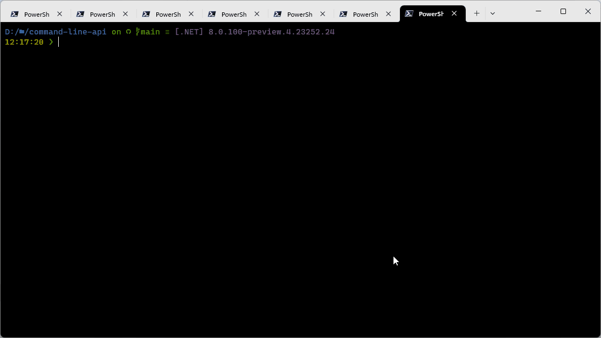
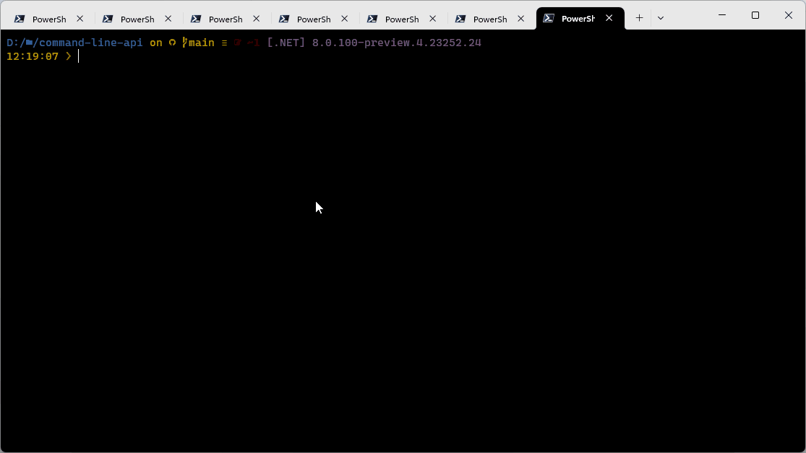
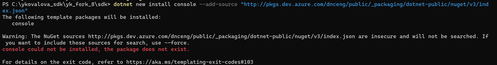
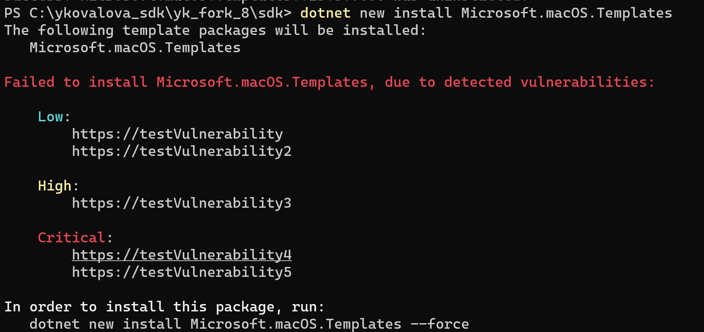
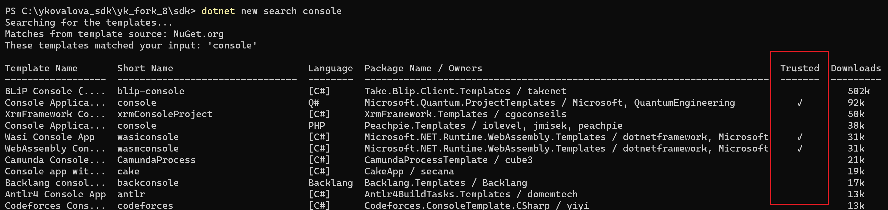
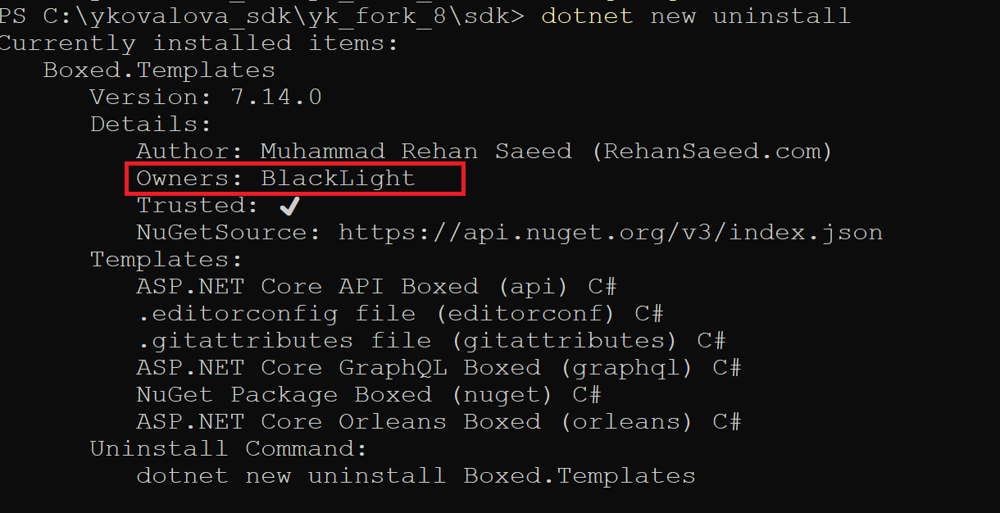
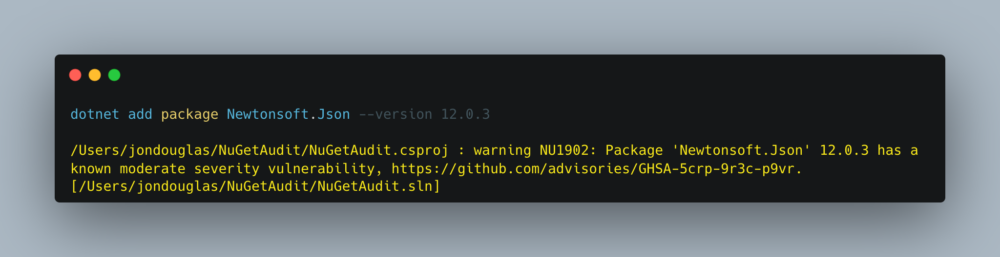
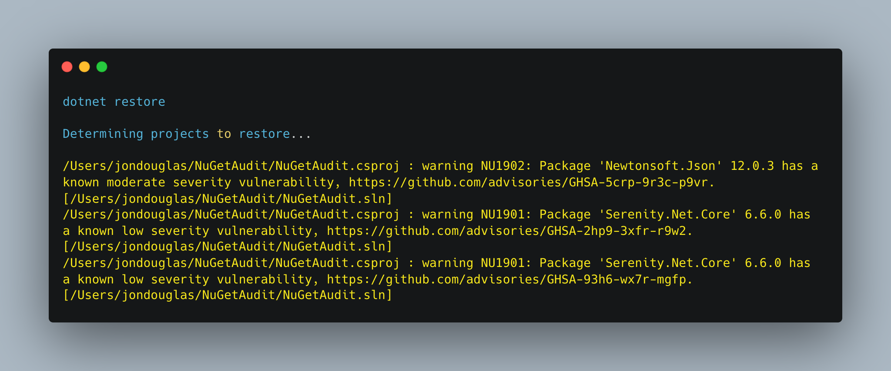

We're excited to share all the new features and improvements in [.NET 8 Preview 4](https://dotnet.microsoft.com/next)! This release is a follow-up to the [Preview 3 release](https://devblogs.microsoft.com/dotnet/announcing-dotnet-8-preview-3/). You'll continue to see many more features show up with these monthly releases. .NET 6 and 7 users will want to follow this release closely since we have focused on making it a straightforward upgrade path.

You can [download .NET 8 Preview 4](https://dotnet.microsoft.com/download/dotnet/8.0) for Linux, macOS, and Windows.

* [Installers and binaries](https://dotnet.microsoft.com/download/dotnet/8.0)
* [Container images](https://github.com/dotnet/dotnet-docker/blob/main/documentation/supported-tags.md)
* [Release notes](https://github.com/dotnet/core/tree/main/release-notes/8.0)
* [Known issues](https://github.com/dotnet/core/blob/main/release-notes/8.0/known-issues.md)
* [GitHub issue tracker](https://github.com/dotnet/core/issues)

Microsoft Build 2023 is coming! The .NET team will be hosting a number of sessions, from technical deep dives to Q&As with team. [Join the .NET Team at Microsoft Build 2023!](https://devblogs.microsoft.com/dotnet/microsoft-build-2023-and-dotnet/)

Check out what's new in [ASP.NET Core](https://devblogs.microsoft.com/dotnet/asp-net-core-updates-in-dotnet-8-preview-4) and [EF Core](https://devblogs.microsoft.com/dotnet/announcing-ef8-preview-4) in the Preview 4 release. Stay current with what's new and coming in [What's New in .NET 8](https://learn.microsoft.com/dotnet/core/whats-new/dotnet-8). It will be kept updated throughout the release.

Lastly, .NET 8 has been tested with 17.7 Preview 1. We recommend that you use the [preview channel builds](https://visualstudio.com/preview) if you want to try .NET 8 with the Visual Studio family of products. Visual Studio for Mac support for .NET 8 isn’t yet available. If you're sticking to the stable channel, go check out the latest features and improvements with the [Visual Studio 17.6 release](https://aka.ms/vs/v176GA).

Now, let's take a look at some new .NET 8 features.

[](https://dotnet.microsoft.com/next)

## MSBuild: New, modern terminal build output

* https://github.com/dotnet/msbuild/issues/8370

We often get feedback from users that the default MSBuild output (internally known as the console logger) is difficult to parse. It's pretty static, often is a wall of text, and it emits errors as they are triggered during the build instead of logically showing them as part of the project being built. We think these are all great feedback, and are happy to introduce our first iteration on a newer, more modern take on MSBuild output logging. We're calling it Terminal Logger, and it has a few main goals:

* Logically group errors with the project they belong with
* Present projects/builds in a way that users think of the build (especially multi-targeted projects)
* Better differentiate the TargetFrameworks a project builds for
* Continue to provide at-a-glance information about the outputs of a project
* Provide information about what the build is doing _right now_ over the course of a build.

Here's what it looks like:



The new output can be enabled using `/tl`, optionally with one of the following options:
* `auto` - the default, which checks if the terminal is capable of using the new features and isn't using a redirected standard output before enabling the new logger,
* `on` - overrides the environment detection mentioned above and forces the new logger to be used
* `off` - overrides the environment detection mentioned above and forces the previous console logger to be used

Once enabled, the new logger shows you the restore phase, followed by the build phase. During each phase, the currently-building projects are at the bottom of the terminal, and each building project tells you both the MSBuild Target currently being built, as well as the amount of time spent on that target. We hope this information makes builds less mysterious to users, as well as giving them a place to start searches when they want to learn more about the build! As projects are fully built, a single 'build completed' section is written for each build that captures 

* The name of the built project
* The Target Framework (if multitargeted!)
* The status of that build
* The primary output of that build (hyperlinked for quick access)
* And finally any diagnostics generated by the build _for that project_

There weren't any diagnostics for that example - let's look at another build of the same project where a typo has been introduced:



Here you can clearly see the project and typo error outlined.

We think that this layout fits the modern feel of .NET and makes use of the capabilities of modern terminals to tell users more about their builds. We hope you'll try it out and provide us feedback on how it works for you, as well as other information you'd like to see here. We hope to use this logger as the foundation for a new batch of UX improvements for MSBuild - including aspects like progress reporting and structured errors in the future!  As you use it, please give us feedback via [this survey](https://aka.ms/msbuild/terminal-logger-survey), or via the [Discussions](https://github.com/dotnet/msbuild/discussions) section of the MSBuild repository. We look forward to hearing from you all!

This work was inspired and begun by Eduardo Villalpando, our intern for the Winter season, who dug into the problem and really helped blaze a trail for the rest of us to follow. It wouldn't have been possible without his help and enthusiasm for the problem!

## SDK: Simplified output path updates

* https://github.com/dotnet/designs/pull/281
* https://github.com/dotnet/sdk/pull/31955

In [preview 3](https://devblogs.microsoft.com/dotnet/announcing-dotnet-8-preview-3/#simplified-output-path) we announced the new simplified output path layout for .NET SDK projects and asked you for your feedback and experiences using the new layout. Thank you for doing so! Your feedback spawned many discussions and based on what we heard from everyone trialing the changes we've made the following updates to the feature:

* The default path for the new layout is changing from `.artifacts` to `artifacts`
* We're removing the ability to use the feature from Project files instead of Directory.Build.props
* We're making it easier to get started with the feature by including the required properties as an option on the `buildprops` template for `dotnet new`

I want to go into the thought process that led us to these changes. You all _overwhelmingly_ supported removing the `.` from the folder name, mostly for visiblity on unix-systems, where `.` usually signifies a 'hidden' file or folder. So we knew we wanted to make that change. However, there were two main reasons we didn't want to use `artifacts` as the root path initially - 

* .gitignore support
* .NET SDK file globbing hurdles

We didn't want people to suddenly have to deal with changes to their `.gitignore` files just to try out the feature, but after some research we discovered that some future-facing, enterprising contributor (thanks @sayedihashimi!) already made sure that `artifacts` is in all of the common templates for `.gitignore` files. This means that we didn't have to worry about users checking in binaries unexpectedly. 

We also didn't want to accidentally include the `artifacts` outputs in the default glob patterns that the .NET SDK uses to find the source files to build in a project. If we changed the root path from `.artifacts` to `artifacts` and let users use the new features from the Project-file level, then we would _also_ have to go change all of the default includes that make SDK project files so succinct. This seemed very error prone, and frankly a pit of failure in the user experience. As a result, we've tightened the requirements to use the feature - you now _must_ opt into the feature via Directory.Build.props file. This has the side effect of making the feature more stable. Before this change, the inferred root folder location would change when a Directory.Build.props file was created. Now, because a Directory.Build.props must exist, the location of the Artifacts path should remain stable.

To try out the new version of the feature, we've made it easier to generate the correct Directory.Build.props file: just run `dotnet new buildprops --use-artifacts` and we'll generate all you need. The generated Directory.Build.props file looks like this:

```xml
<Project>
  <!-- See https://aka.ms/dotnet/msbuild/customize for more details on customizing your build -->
  <PropertyGroup>
    <ArtifactsPath>$(MSBuildThisFileDirectory)artifacts</ArtifactsPath>
  </PropertyGroup>
</Project>
```

Please go try out these changes and continue to let us know what you think at [our survey for the feature](https://aka.ms/dotnet/sdk/simplified-output-path-survey).

## Template Engine: secure experience with packages from Nuget.org

In .NET 8 we're integrating several of NuGet.org's security-related features into the Template Engine, especially in the `dotnet new` experience.

### Improvements

* Prevent downloading packages from `http:\\` feeds, but allow overrides with the `--force` flag

The NuGet team has a plan of record for gradually moving over to a secure-by-default stance. You can read more about their plan, and the timelines involved, in the [HTTPS Everywhere](https://devblogs.microsoft.com/nuget/https-everywhere/) blog post. In support of that goal, we're going to start erroring by default when a non-HTTPS source is used. This can be overriden with `--force` for the .NET 8 time frame, but the current plan is to remove this flag for the .NET 9 time frame, in line with the HTTPS Everywhere timeline.



* Notify a customer if a template package has any vulnerabilities on install/update/outdated checks, and require `--force` to install vulnerable versions


* Add data to the search and uninstall commands that shows if a template is installed from a package that has [prefix reserved](https://learn.microsoft.com/nuget/nuget-org/id-prefix-reservation) in NuGet.org


* Add information about the template package owner. The [ownership](https://learn.microsoft.com/nuget/nuget-org/id-prefix-reservation) is verified by nuget portal and can be considered a trustworthy characteristic. 


## NuGet: signed package verification on Linux

Starting with .NET 8 Preview 4 SDK, NuGet will [verify signed packages ](https://learn.microsoft.com/nuget/reference/signed-packages-reference) on Linux by default.  Verification remains enabled on Windows and disabled on macOS.

For most Linux users, [verification should just work transparently](https://github.com/dotnet/sdk/blob/main/src/Layout/redist/trustedroots/README.md).  However, users with an existing root certificate bundle located at `/etc/pki/ca-trust/extracted/pem/objsign-ca-bundle.pem` may see trust failures accompanied by [NU3042](https://learn.microsoft.com/nuget/reference/errors-and-warnings/nu3042).

Users can opt out of verification by setting the environment variable `DOTNET_NUGET_SIGNATURE_VERIFICATION` to `false`. Please give your [feedback to help the NuGet team improve the experience on Linux!](https://github.com/NuGet/Home/issues)

For more information, see https://github.com/dotnet/core/issues/7688.

## NuGet: Auditing package dependencies for security vulnerabilities

* https://github.com/NuGet/Home/issues/8087
* https://github.com/NuGet/Home/pull/12310

`dotnet restore` will produce a report of security vulnerabilities with the affected package name, the severity of the vulnerability, and a link to the advisory for more details when you opt-in to NuGet security auditing.

## Enabling security auditing

At any time you wish to receive security audit reports, you can opt-in to the experience by setting the following MSBuild property in a `.csproj` or MSBuild file being evaluated as part of your project:

```xml
<NuGetAudit>true</NuGetAudit>
```

Additionally, ensure that you have the NuGet.org central registry defined as one of your package sources to retrieve the known vulnerability dataset:

```xml
<packageSources>
    <add key="nuget.org" value="https://api.nuget.org/v3/index.json" protocolVersion="3" />
</packageSources>
```

## dotnet add package

When you try to add a package that has a known vulnerability, `dotnet restore` will be run implicitly and let you know through a warning.



## dotnet restore

When you restore your packages through `dotnet restore`, you will see warnings for each affected package and advisory.



## Warning codes

| Warning Code | Severity |
|--------------|----------|
| NU1901 | low |
| NU1902 | moderate |
| NU1903 | high |
| NU1904 | critical |

## Setting a security audit level

You can set the `<NuGetAuditLevel>` MSBuild property to the desired level in which auditing will fail. Possible values are `low`, `moderate`, `high`, and `critical`. For example if you only want to see `moderate`, `high`, and `critical` advisories, you can set the following:

```xml
<NuGetAuditLevel>moderate</NuGetAuditLevel>
```

## Libraries: UTF8 improvements

With .NET 8 Preview 4, we've introduced the new `IUtf8SpanFormattable` interface, which like its `ISpanFormattable` cousin, can be implemented on a type to enable writing out a string-like representation of that type to a destination span. Whereas `ISpanFormattable` targets UTF16 and `Span<char>`, `IUtf8SpanFormattable` targets UTF8 and `Span<byte>`.  It's also been implemented on all of the primitive types (plus others), with the exact same shared logic (thanks to static abstract interfaces) whether targeting `string`, `Span<char>`, or `Span<byte>`, which means it has full support for all formats (including the "B" binary specifier that's also new in .NET 8 Preview 4) and all cultures. This means you can now format directly to UTF8 from `Byte`, `Complex`, `Char`, `DateOnly`, `DateTime`, `DateTimeOffset`, `Decimal`, `Double`, `Guid`, `Half`, `IPAddress`, `IPNetwork`, `Int16`, `Int32`, `Int64`, `Int128`, `IntPtr`, `NFloat`, `SByte`, `Single`, `Rune`, `TimeOnly`, `TimeSpan`, `UInt16`, `UInt32`, `UInt64`, `UInt128`, `UIntPtr`, and `Version`.

In addition, the new `Utf8.TryWrite` methods now provide a UTF8-based counterpart to the existing `MemoryExtensions.TryWrite` UTF16-based methods.  These methods rely on the [interpolated string handler support introduced in .NET 6 and C# 10](https://devblogs.microsoft.com/dotnet/string-interpolation-in-c-10-and-net-6/), such that you can use interpolated string syntax to format a complex expression directly into a span of UTF8 bytes, e.g.

```C#
static bool FormatHexVersion(short major, short minor, short build, short revision, Span<byte> utf8Bytes, out int bytesWritten) =>
    Utf8.TryWrite(utf8Bytes, CultureInfo.InvariantCulture, $"{major:X4}.{minor:X4}.{build:X4}.{revision:X4}", out bytesWritten);
```

The implementation recognizes `IUtf8SpanFormattable` on the format values and uses their implementations to write their UTF8 representations directly to the destination span.

The implementation also utilizes the new `Encoding.TryGetBytes` method, which along with its `Encoding.TryGetChars` counterpart, supports encoding/decoding into a destination span as long as the span is long enough to hold the resulting state, and returning false rather than throwing an exception if it's not.

We expect more UTF8 improvements, including but not limited to improvements to the performance of this functionality, to show up in subsequent .NET 8 previews.

## Introducing Time abstraction 

The introduction of the **TimeProvider** abstract class adds time abstraction, which enables time mocking in test scenarios. This functionality is also supported by other features that rely on time progression, such as `Task.Delay` and `Task.Async`. This means that even Task operations can be easily mocked using the time abstraction. The abstraction supports essential time operations such as retrieving local and UTC time, obtaining a timestamp for performance measurement, and creating timers. 

```C#
public abstract class TimeProvider
{
    public static TimeProvider System { get; }
    protected TimeProvider() 
    public virtual DateTimeOffset GetUtcNow()
    public DateTimeOffset GetLocalNow()
    public virtual TimeZoneInfo LocalTimeZone { get; }
    public virtual long TimestampFrequency { get; }
    public virtual long GetTimestamp()
    public TimeSpan GetElapsedTime(long startingTimestamp)
    public TimeSpan GetElapsedTime(long startingTimestamp, long endingTimestamp)
    public virtual ITimer CreateTimer(TimerCallback callback, object? state,TimeSpan dueTime, TimeSpan period)
}

public interface ITimer : IDisposable, IAsyncDisposable
{
    bool Change(TimeSpan dueTime, TimeSpan period);
}

public partial class CancellationTokenSource : IDisposable
{
    public CancellationTokenSource(TimeSpan delay, TimeProvider timeProvider)
}

public sealed partial class PeriodicTimer : IDisposable
{
    public PeriodicTimer(TimeSpan period, TimeProvider timeProvider) 
}

public partial class Task : IAsyncResult, IDisposable
{
    public static Task Delay(System.TimeSpan delay, System.TimeProvider timeProvider)
    public static Task Delay(System.TimeSpan delay, System.TimeProvider timeProvider, System.Threading.CancellationToken cancellationToken)
    
    public Task WaitAsync(TimeSpan timeout, TimeProvider timeProvider)
    public Task WaitAsync(TimeSpan timeout, TimeProvider timeProvider, CancellationToken cancellationToken) 
}

public partial class Task<TResult> : Task
{
    public new Task<TResult> WaitAsync(TimeSpan timeout, TimeProvider timeProvider)
    public new Task<TResult> WaitAsync(TimeSpan timeout, TimeProvider timeProvider, CancellationToken cancellationToken) 
}
```

Furthermore, we have made the abstraction available in .NET 8.0 and created a netstandard 2.0 library called Microsoft.Bcl.TimeProvider. This enables the use of the abstraction on supported versions of the .NET Framework and earlier versions of .NET.

```C#
namespace System.Threading.Tasks
{
    public static class TimeProviderTaskExtensions
    {
        public static Task Delay(this TimeProvider timeProvider, TimeSpan delay, CancellationToken cancellationToken = default) 
        public static Task<TResult> WaitAsync<TResult>(this Task<TResult> task, TimeSpan timeout, TimeProvider timeProvider, CancellationToken cancellationToken = default)
        public static Tasks.Task WaitAsync(this Task task, TimeSpan timeout, TimeProvider timeProvider, CancellationToken cancellationToken = default)
        public static CancellationTokenSource CreateCancellationTokenSource(this TimeProvider timeProvider, TimeSpan delay)
    }
}
```

### Usage Examples

```C#
//  Get System time
DateTimeOffset utcNow= TimeProvider.System.GetUtcNow();
DateTimeOffset localNow = TimeProvider.System.GetLocalNow();

// Create a time provider that work with a time zone different than the local time zone 
private class ZonedTimeProvider : TimeProvider
{
    private TimeZoneInfo _zoneInfo;
    public ZonedTimeProvider(TimeZoneInfo zoneInfo) : base()
    {
        _zoneInfo = zoneInfo ?? TimeZoneInfo.Local;
    }
    public override TimeZoneInfo LocalTimeZone { get => _zoneInfo; }
    public static TimeProvider FromLocalTimeZone(TimeZoneInfo zoneInfo) => new ZonedTimeProvider(zoneInfo);
}

// Create a time using a time provider 
ITimer timer = timeProvider.CreateTimer(callBack, state, delay, Timeout.InfiniteTimeSpan);

// Measure a period using the system time provider 
long providerTimestamp1 = TimeProvider.System.GetTimestamp();
long providerTimestamp2 = TimeProvider.System.GetTimestamp();
var period = GetElapsedTime(providerTimestamp1, providerTimestamp2);
```

https://github.com/dotnet/runtime/issues/36617

## System.Runtime.Intrinsics.Vector512<T> and AVX-512

SIMD support has been a staple in .NET for many years, since we [first introduced](https://devblogs.microsoft.com/dotnet/update-to-simd-support/) support back in .NET Framework. In .NET Core 3.0, we [expanded](https://devblogs.microsoft.com/dotnet/hardware-intrinsics-in-net-core/) that support to include the platform specific hardware intrinsics APIs for x86/x64. We expanded that again with support for Arm64 in .NET 5 and then by introducing the cross platform hardware intrinsics in .NET 7. .NET 8 is no exception and is continuing to further our support by introducing `System.Runtime.Intrinsics.Vector512<T>` and its acceleration on x86/x64 hardware with AVX-512 support.

`AVX-512` itself brings along several key features of which Preview 4 adds support for the first three. The last is still a work in progress that we hope to share more details around at a future date:

* Support for 512-bit vector operations
* Support for an additional 16 SIMD registers
* Support for additional instructions available for 128-bit, 256-bit, and 512-bit vectors
* Support for masked vector operations

If you have hardware that supports the functionality, then `Vector512.IsHardwareAccelerated` will now report `true`. We've also exposed several platform specific classes under the `System.Runtime.Intrinsics.X86` namespace including `Avx512F` (Foundational), `Avx512BW` (Byte and Word), `Avx512CD` (Conflict Detection), `Avx512DQ` (Doubleword and Quadword), and `Avx512Vbmi` (Vector Byte Manipulation Instructions). These follow the same general shape/layout as other ISAs in that they expose an `IsSupported` property and an `X64` nested class for instructions only available to 64-bit processes. Additionally, we now have a `VL` nested class in each that exposes the `Avx512VL` (Vector Length) extensions for the corresponding instruction set.

Because of the second and third key features listed above, even if you don't explicitly use `Vector512` or `Avx512F` specific instructions in your code, you will likely still benefit from this feature. This is because the JIT is able to take advantage of the features implicitly when using `Vector128<T>` or `Vector256<T>`, which includes all the places in the BCL that use hardware intrinsics internally, such as most operations exposed by `Span<T>` and `ReadOnlySpan<T>`, many of the math APIs exposed for the primitive types, and much more.

This feature has had many [Pull Requests](https://github.com/dotnet/runtime/pulls?q=is%3Apr+label%3Aarch-avx512+is%3Aclosed+) go into it and it is the result of the work of many, particularly https://github.com/anthonycanino, https://github.com/DeepakRajendrakumaran, and https://github.com/jkrishnavs.

## Native AOT improvements

We've updated the default `console` template and added support for AOT out of the box. It's now possible to invoke `dotnet new console --aot` to create a project that is configured for AOT compilation. The project configuration added by `--aot` has three effects:

* Publishing the project with e.g. `dotnet publish` or with Visual Studio will generate a native self-contained executable with native AOT.
* It will enable Roslyn-based compatibility analyzers for trimming, AOT, and single file that will mark potentially problematic parts of your project (if there are any) in your editor of choice.
* It will enable debug-time emulation of AOT so that when debugging your project without AOT compilation, you get a similar experience to AOT. This makes sure that e.g. use of Reflection.Emit in a NuGet package that wasn't annotated for AOT (and was therefore missed by the compatibility analyzer) won't surprise you when you try to publish the project with AOT for the first time.

We also continue improving fundamentals like runtime throughput, memory use, and size on disk with Native AOT. In Preview 4 we're adding a way to communicate an [optimization preference](https://learn.microsoft.com/dotnet/core/deploying/native-aot/optimizing) such as Speed or Size. The default settings try to strike the right balance between these two, but we're now also introducing a way to specify which way to make tradeoffs.

For example, optimizing the result of `dotnet new console --aot` for size on x64 Windows results in following savings in Preview 4:

|             | Default | Optimize for Size |
|-------------|---------|-------------------|
| Hello World |  1.20 MB |           1.07 MB |

The above is the size of a fully self-contained application that includes the runtime (including GC) and all necessary class libraries.

In Preview 4, we observed that optimizing for speed produces 2-3% improvements in throughput for real world workloads.

## Linux distro version support

We [previously announced](https://github.com/dotnet/core/issues/8133#issuecomment-1432611595) that we were updating our [supported Linux distro versions for .NET 8](https://github.com/dotnet/core/blob/main/release-notes/8.0/supported-os.md#linux). These changes are included in Preview 4, specifically the `glibc` version .NET 8 targets.

.NET 8 is [built targeting Ubuntu 16.04](https://github.com/dotnet/runtime/issues/83428), for all architectures. That's primarily important for defining the minimum `glibc` version for .NET 8. .NET 8 will fail to start on distro versions that include an older `glibc`, such as Ubuntu 14.04 or Red Hat Enterprise Linux 7.

We are also in the process of updating the .NET 8 Linux build to use [clang 16](https://www.phoronix.com/news/LLVM-16.0-Released). We expect that change to be included in Preview 5. We won't make a separate announcement for that change.

There are no other significant changes. We will continue to support .NET on Linux on Arm32, Arm64, and x64 architectures.

## System.Text.Json: Populating read-only members

Starting with .NET 8 Preview 4, System.Text.Json introduces the ability to deserialize onto read-only properties or fields.

We've also introduced option which allows developers to enable it for all properties which are capable of populating - for example custom converters might not be compatible with this feature:

```csharp
JsonSerializerOptions options = new()
{
  PreferredObjectCreationHandling = JsonObjectCreationHandling.Populate
};
```

For existing applications which would like to use this feature but compatibility is a concern this can also be enabled granularly by placing `[JsonObjectCreationHandling(JsonObjectCreationHandling.Populate)]` attribute on type which properties are to be populated.

For example, to enable populating for all properties of a specific class:

```csharp
using System.Text.Json;
using System.Text.Json.Serialization;

JsonSerializerOptions options = new()
{
    WriteIndented = true,
    // Instead of granular control we could also enable this globally like this:
    // PreferredObjectCreationHandling = JsonObjectCreationHandling.Populate
};

CustomerInfo customer = JsonSerializer.Deserialize<CustomerInfo>("""{"Person":{"Name":"John"},"Company":{"Name":"John and Son"}}""", options)!;

Console.WriteLine(JsonSerializer.Serialize(customer, options));

class PersonInfo
{
    // there is nothing here to be populated since string cannot be re-used
    public required string Name { get; set; }
    public string? Title { get; set; }
}

class CompanyInfo
{
    public required string Name { get; set; }
    public string? Address { get; set; }
    public string? PhoneNumber { get; set; }
    public string? Email { get; set; }
}

// notes:
// - attribute does not apply to the `CustomerInfo` class itself: i.e. properties of type `CustomerInfo` wouldn't be auto-populated
//     - automatic rules like these can be implemented with contract customization
// - attribute do apply to `Person` and `Company` properties
// - attribute can also be placed on individual properties
[JsonObjectCreationHandling(JsonObjectCreationHandling.Populate)]
class CustomerInfo
{
    private const string NA = "N/A";

    // note how neither of these have setters
    public PersonInfo Person { get; } = new PersonInfo() { Name = "Anonymous", Title = "Software Developer" };
    public CompanyInfo Company { get; } = new CompanyInfo() { Name = NA, Address = NA, PhoneNumber = NA, Email = NA };
}
```

The output of above is identical output to that which would be achieved by global option:

```json
{
  "Person": {
    "Name": "John",
    "Title": "Software Developer"
  },
  "Company": {
    "Name": "John and Son",
    "Address": "N/A",
    "PhoneNumber": "N/A",
    "Email": "N/A"
  }
}
```

for comparison previously we'd see our input but since there was no settable property `Person` or `Company` to deserialize into we'd ignore input completely and output would only show default values:

```json
{
  "Person": {
    "Name": "Anonymous",
    "Title": "Software Developer"
  },
  "Company": {
    "Name": "N/A",
    "Address": "N/A",
    "PhoneNumber": "N/A",
    "Email": "N/A"
  }
}
```

### Other notes for populating read-only members

- For more information see original issue with the design: https://github.com/dotnet/runtime/issues/78556
- Structs can also be populated but population happens by first creating a copy and then setting it back to the property and therefore such properties also require a setters
- Populating of collections happens in additive manner - existing collection with all its content is treated as original object and therefore all existing elements are preserved - this behavior can be changed with contract customization and/or deserialization callbacks

## System.Text.Json Improvements

### `JsonSerializer.IsReflectionEnabledByDefault`

* https://github.com/dotnet/runtime/pull/83844

The `JsonSerializer` class exposes a number of serialization and deserialization methods that accept an optional `JsonSerializerOptions` parameter. If left unspecified, these methods will default to using the reflection-based serializer. In the context of trimmed/Native AOT applications, this default can create issues with respect to application size: even if the user takes care to pass a source generated `JsonSerializerOptions` value, it will still result in the reflection components being rooted by the trimmer.

System.Text.Json now ships with the `System.Text.Json.JsonSerializer.IsReflectionEnabledByDefault` feature switch that controls default behavior of the `JsonSerializer` methods. Setting the switch to `false` at publish time now avoids accidental rooting of reflection components. It should be noted that with the switch disabled this code

```C#
JsonSerializer.Serialize(new { Value = 42 });
```

will now fail with a `NotSupportedException`. A configured `JsonSerializerOptions` will need to be passed explicitly for the method to work.

Furthermore, the value of the feature switch is reflected in the `JsonSerializer.IsReflectionEnabledByDefault` property which is treated as a link-time constant. Library authors building on top of System.Text.Json can rely on the property to configure their defaults without accidentally rooting reflection components:

```C#
static JsonSerializerOptions GetDefaultOptions()
{
    if (JsonSerializer.IsReflectionEnabledByDefault)
    {
        // This branch has a dependency on DefaultJsonTypeInfo
        // but will get trimmed away by the linker if the feature switch is disabled.
        return new JsonSerializerOptions
        {
              TypeInfoResolver = new DefaultJsonTypeInfoResolver(),
              PropertyNamingPolicy = JsonNamingPolicy.KebabCase,
        }
    }

    return new() { PropertyNamingPolicy = JsonNamingPolicy.KebabCaseLower } ;
}
```

### `JsonSerializerOptions.TypeInfoResolverChain`

* https://github.com/dotnet/runtime/issues/83095

When shipped in .NET 7, the contract customization feature added support for chaining source generators by means of the `JsonTypeInfoResolver.Combine` method:

```C#
var options = new JsonSerializerOptions
{
    TypeInfoResolver = JsonTypeInfoResolver.Combine(ContextA.Default, ContextB.Default, ContextC.Default);
};
```

Based on feedback we've received, this approach has a couple of usability issues:

1. It necessitates specifying all chained components at one call site -- resolvers cannot be prepended or appended to the chain after the fact.
2. Because the chaining implementation is abstracted behind a `IJsonTypeInfoResolver` implementation, there is no way for users to introspect the chain or remove components from it.

The `JsonSerializerOptions` class now includes a `TypeInfoResolverChain` property that is complementary to `TypeInfoResolver`:

```C#
namespace System.Text.Json;

public partial class JsonSerializerOptions
{
    public IJsonTypeInfoResolver? TypeInfoResolver { get; set; }
    public IList<IJsonTypeInfoResolver> TypeInfoResolverChain { get; }
}
```

The options instance as defined in the original example can now be manipulated as follows:

```C#
options.TypeInfoResolverChain.Count; // 3
options.TypeInfoResolverChain.RemoveAt(0);
options.TypeInfoResolverChain.Count; // 2
```

It should be noted that the `TypeInfoResolver` and `TypeInfoResolverChain` properties are always kept in sync, so a change to one property will force an update to the other.

### Obsoleting `JsonSerializerOptions.AddContext`

* https://github.com/dotnet/runtime/issues/83280

The [`JsonSerializerOptions.AddContext`](https://learn.microsoft.com/dotnet/api/system.text.json.jsonserializeroptions.addcontext?view=net-8.0) has been superseded by the `TypeInfoResolver` and `TypeInfoResolverChain` properties, so it is now being marked as obsolete.

### Unspeakable type support

* https://github.com/dotnet/runtime/issues/82457

Compiler-generated or "unspeakable" types have been challenging to support in weakly typed source gen scenaria. In .NET 7, the following application

```C#
object value = Test();
JsonSerializer.Serialize(value, MyContext.Default.Options);

async IAsyncEnumerable<int> Test()
{
    for (int i = 0; i < 10; i++)
    {
        await Task.Delay(1000);
        yield return i;
    }
}

[JsonSerializable(typeof(IAsyncEnumerable<int>))]
internal partial class MyContext : JsonSerializerContext {}
```

fails with the error

```text
Metadata for type 'Program+<<<Main>$>g__Test|0_5>d' was not provided by TypeInfoResolver of type 'MyContext'
```

Which is because the compiler-generated type `Program+<<<Main>$>g__Test|0_5>d` cannot be explicitly specified by the source generator.

Starting with Preview 4, System.Text.Json will perform run-time nearest-ancestor resolution to determine the most appropriate supertype with which to serialize the value (in this case, `IAsyncEnumerable<int>`).

### `JsonSerializerOptions.TryGetTypeInfo`

* https://github.com/dotnet/runtime/pull/84411

Preview 4 now includes a `Try-` variant of the [`GetTypeInfo`](https://learn.microsoft.com/dotnet/api/system.text.json.jsonserializeroptions.gettypeinfo?view=net-8.0) method which returns false if no metadata for the specified type has been found.

## Codegen

### Consecutive Registers Allocation

In this preview release, we have introduced a new feature in our register allocator called "consecutive register" allocation. Before we delve into the details of what it entails and why it was necessary, let's first review what register allocation is and how it works in RyuJIT.

The register allocation algorithm used in RyuJIT is based on a "Linear Scan" approach. It scans the program to identify the lifetime of all variables, referred to as "intervals" in the literature, and assigns a single register to each variable at each use. To determine the best register to assign at a given point, the algorithm needs to identify which variables are live at that point and do not overlap with other variables. It then selects a register from a set of available free registers, using heuristics to determine the best register set at the point of allocation. If no registers are available because they are all assigned to intervals, the algorithm identifies the best register that can be "spilled" and assigned at that location. Spilling involves storing the value of a register on the stack and retrieving it later when needed, which is an expensive operation that the register allocator tries to minimize.

Arm64 has two instructions, [TBL](https://developer.arm.com/documentation/dui0801/g/A64-SIMD-Vector-Instructions/TBL--vector-) and [TBX](https://developer.arm.com/documentation/dui0801/g/A64-SIMD-Vector-Instructions/TBX--vector-), which are used for table vector lookup. These instructions take a "tuple" as one of their operands, which can contain 2, 3, or 4 entities. In [PR# 80297](https://github.com/dotnet/runtime/pull/80297), we added two sets of APIs, VectorTableLookup and VectorTableLookupExtension, under the AdvSimd namespace for these instructions. However, these instructions require that all entities in the tuple are present in consecutive registers. To better understand this requirement, let's look at an example.

```c#
public static Vector128<byte> Test(float f)
{
        var a = Produce1();
        var b = Produce2();
        var c = a + b;      
        var d = c + a;      
        var e = d + b;     
        d = AdvSimd.Arm64.VectorTableLookup((d, e, e, b), c); 
}
```

Here is the generated code for the method.

```asm
            movz    x0, #0xD1FFAB1E      // code for helloworld:Produce1():System.Runtime.Intrinsics.Vector128`1[ubyte]
            movk    x0, #0xD1FFAB1E LSL #16
            movk    x0, #0xD1FFAB1E LSL #32
            ldr     x0, [x0]
            blr     x0
            str     q0, [fp, #0x20]	// [V01 loc0]
            movz    x0, #0xD1FFAB1E      // code for helloworld:Produce2():System.Runtime.Intrinsics.Vector128`1[ubyte]
            movk    x0, #0xD1FFAB1E LSL #16
            movk    x0, #0xD1FFAB1E LSL #32
            ldr     x0, [x0]
            blr     x0
            ldr     q16, [fp, #0x20]	// [V01 loc0]
            add     v17.16b, v16.16b, v0.16b
            str     q17, [fp, #0x10]	// [V03 loc2]
            add     v16.16b, v17.16b, v16.16b
            add     v18.16b, v16.16b, v0.16b
            mov     v17.16b, v18.16b
            mov     v19.16b, v0.16b
            ldr     q20, [fp, #0x10]	// [V03 loc2]
            tbl     v16.16b, {v16.16b, v17.16b, v18.16b, v19.16b}, v20.16b
            add     v0.16b, v0.16b, v16.16b

```

In the given example, VectorTableLookup() takes a tuple consisting of 4 vectors d, e, e, and b, which are passed in consecutive registers v16 through v19. Even though the 2nd and 3rd value are the same variable e, they are still passed in different registers v17 and v18. This introduces the complexity of finding not only multiple free (or busy) registers (2, 3, or 4) for instructions tbl and tbx, but also consecutive registers. In order to accommodate this new requirement, our algorithm had to be updated at various stages, such as checking ahead of time if consecutive registers are free when assigning a register to the first entity of the tuple, ensuring that assigned registers are consecutive if the variables are already assigned registers and they are not consecutive, and adding stress testing scenarios to handle alternate registers when available.
In [PR #85189](https://github.com/dotnet/runtime/pull/85189), @MihaZupan used the VectorTableLookup in ProbabilisticMap’s IndexOf method and got 30% improvement. 

### Optimized ThreadStatic field access

Accessing fields that are marked with `ThreadStatic` had to go through the helper calls which would access the thread local storage (TLS) of current thread and module before accessing the field data. In [PR #82973](https://github.com/dotnet/runtime/pull/82973), we inlined all that code and with that, the field’s value can be retrieved without going into the helper. This improves the performance of field access by 10X. 

### Arm64

We continued improving the code quality of Arm64 and our friends @SwapnilGaikwad and @a74nh at Arm made some good contributions in this release.

- In [PR #84350](https://github.com/dotnet/runtime/pull/84350), pairs of "str wzr" were optimized and replaced with "str xzr".
- In [PR #84135](https://github.com/dotnet/runtime/pull/84135), peephole optimizations of ldp/stp were enable for SIMD registers.
- In [PR #83458](https://github.com/dotnet/runtime/pull/83458), a load was replaced with cheaper mov instruction when possible.
- In [PR #79283](https://github.com/dotnet/runtime/pull/79283), conditions in if clause were combined with compare chains.
- In [PR #82031](https://github.com/dotnet/runtime/pull/82031), started using cinc instead of csel when possible.
- In [PR #84667](https://github.com/dotnet/runtime/pull/84667), Combine 'neg' and 'cmp' to 'cmn'
- In [PR #84605](https://github.com/dotnet/runtime/pull/84605), Combine cmp and shift ops into a single cmp op
- In [PR #83694](https://github.com/dotnet/runtime/pull/83694), Add IsVNNeverNegative (improved all arches, but had big impact on ARM64)

Until now, the load/store pair peephole optimization was not performed if one of the values is from local variable. [PR #84399](https://github.com/dotnet/runtime/pull/84399) fixed that limitation and enabled the peephole optimization broadly.

 `>>>` operator is optimized to ShiftRightLogical intrinsics on Arm64 in [PR#85258](https://github.com/dotnet/runtime/pull/85258).

### Community PRs (Many thanks to JIT community contributors!)

- @SingleAccretion contributed [20 PRs]( https://github.com/dotnet/runtime/pulls?q=is%3Apr+is%3Amerged+label%3Aarea-CodeGen-coreclr+closed%3A2023-03-21..2023-04-25++-milestone%3A7.0.x+author%3Asingleaccretion) in Preview 4. Much of this work focused on internal cleanup and simplifying of the concepts required to be understood by everyone working on the JIT. For example, many node types in the JIT’s internal IR were completely removed in favor of more regular or simpler representations.
- @Ruihan-Yin added a macro on zmm registers on LinearScan::buildPhysRegRecords, [PR#83862](https://github.com/dotnet/runtime/pull/83862).
- Please refer CodeGen Arm64 section for the contributions from @a74nh and @SwapnilGaikwad.

### Code vectorization

JIT/NativeAOT can now unroll and auto-vectorize various memory operations such as comparison, copying and zeroing with SIMD (including AVX-512 instructions on x64!) if it can determinate their sizes in compile time:

- [PR#83255](https://github.com/dotnet/runtime/pull/83255) made stackalloc zeroing 2-3X faster with SIMD
- [PR#83638](https://github.com/dotnet/runtime/pull/83638), [PR#83740](https://github.com/dotnet/runtime/pull/83740) and [PR#84530](https://github.com/dotnet/runtime/pull/84530) enabled auto-vectorization for various "copy buffer" like operations.
- [PR#83945](https://github.com/dotnet/runtime/pull/83945) did the same for comparisons including SequenceEqual and StartsWith for all types of primitives.
A good example of a pattern JIT can now auto-vectorize is the following snippet:

```csharp
bool CopyFirst50Items(ReadOnlySpan<int> src, Span<int> dst) => 
    src.Slice(0, 50).TryCopyTo(dst);
```csharp
```asm
; Method CopyFirst50Items
       push     rbp
       vzeroupper 
       mov      rbp, rsp
       cmp      edx, 50 ;; src.Length >= 50 ?
       jb       SHORT G_M1291_IG05
       xor      eax, eax
       cmp      r8d, 50 ;; dst.Length >= 50 ?
       jb       SHORT G_M1291_IG04
       vmovdqu  zmm0, zmmword ptr [rsi]
       vmovdqu  zmm1, zmmword ptr [rsi+40H]
       vmovdqu  zmm2, zmmword ptr [rsi+80H]
       vmovdqu  xmm3, xmmword ptr [rsi+B8H]
       vmovdqu  zmmword ptr [rcx], zmm0
       vmovdqu  zmmword ptr [rcx+40H], zmm1
       vmovdqu  zmmword ptr [rcx+80H], zmm2
       vmovdqu  xmmword ptr [rcx+B8H], xmm3
       mov      eax, 1
G_M1291_IG04:
       pop      rbp
       ret      
G_M1291_IG05:
       call     [System.ThrowHelper:ThrowArgumentOutOfRangeException()]
       int3     
; Total bytes of code: 96
```

Here JIT used 3 ZMM (AVX-512) registers to perform memmove-like operation inlined (even if src and dst overlap). A similar codegen will be generated for compile-time constant data e.g. utf8 literals:

```csharp
bool WriteHeader(Span<int> dst) => "text/html"u8.CopyTo(dst);
bool StartsWithHeader(Span<int> dst) => dst.StartsWith("text/html"u8);
```

### General Optimizations

- [PR#83911](https://github.com/dotnet/runtime/pull/83911) Static initializations are now cheaper in NativeAOT.
- [PR#84213](https://github.com/dotnet/runtime/pull/84213) and [PR#84231](https://github.com/dotnet/runtime/pull/84231) improved bound check elimination for `arr[arr.Length - cns]` and `arr[index % arr.Length]` patterns.
- Forward substitution optimization is enabled for more cases such as small types, [PR#83969](https://github.com/dotnet/runtime/pull/83969).
- Improved some cases of spills during register allocation with [PR#85251](https://github.com/dotnet/runtime/pull/85251).
- [PR#84427](https://github.com/dotnet/runtime/pull/84427) improved the scalability of PGO instrumentation
- We continued to improve JIT loop optimization capabilities. In preview 4, we improved reachability sets computation, [PR#84204](https://github.com/dotnet/runtime/pull/84204).

## Community spotlight ([Lachlan Ennis](https://github.com/elachlan))


My name is Lachlan Ennis and I am a Full Stack Software Developer at Expert1 writing software for small/medium sized finance companies in Australia.I live in the city of Brisbane in Queensland, Australia. I graduated from QUT (Queensland University of Technology) with a Bachelors in Information Technology, but learnt most of my coding skills on the job. We write out software primarily in .NET using MSSQL. We also use Winforms for our products.

My first contributions to .NET were in dotnet/msbuild, where I used code analysis to improve code quality and performance. This helped msbuild get closer in line with dotnet/runtime with its coding standards and enabled code analysis rules. I then moved to working on winforms when I stumbled on an issue discussing the interop layer of winforms and how to improve it. I had previously done some minor work in msbuild around some interop and saw how difficult it could be. I suggested that Winforms use CsWin32 as it used source generators to create the PInvokes as well as friendly overloads. This then led down a rabbit hole of raised issues and PRs in Microsoft/CsWin32 and Microsoft/Win32Metadata to get the required APIs made available for Winforms.

After working on the interop changes I moved to the issue queue to help investigate the backlog. Often the issues need someone to drive the investigation until there is enough information for the winforms team to take over, or if it's obvious enough a PR to fix the issue. I also helped build on the community effort to null annotate the winforms code base.

Working on dotnet open source software has really helped expand my knowledge in dotnet, C#, and winforms. The Winforms team has been incredibly helpful in that regard with thorough reviews and advice in PRs and issues.

## Summary

.NET 8 Preview 4 contains exciting new features and improvements that would not be possible without the hard work and dedication of a diverse team of engineers at Microsoft and a passionate open source community. We want to extend our [sincere thanks to everyone who has contributed to .NET 8 so far](https://dotnet.microsoft.com/thanks), whether it was through code contributions, bug reports, or providing feedback.

Your contributions have been instrumental in the making .NET 8 Previews, and we look forward to continuing to work together to build a brighter future for .NET and the entire technology community.

Curious about what is coming? [Go see what's next in .NET!](https://dotnet.microsoft.com/next)
