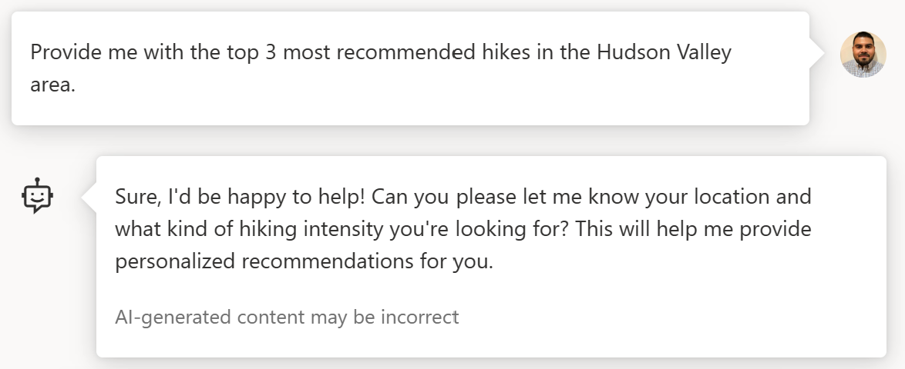
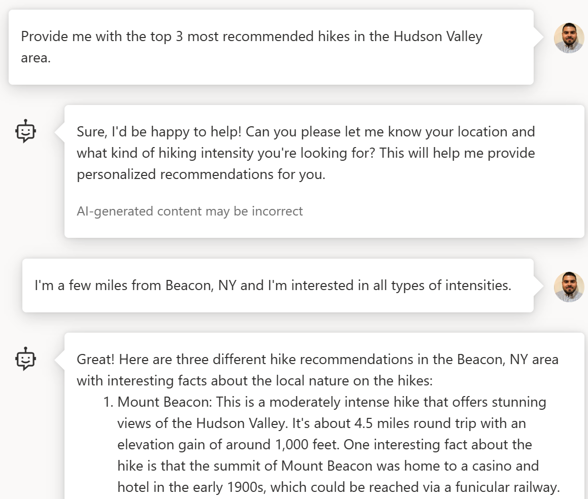
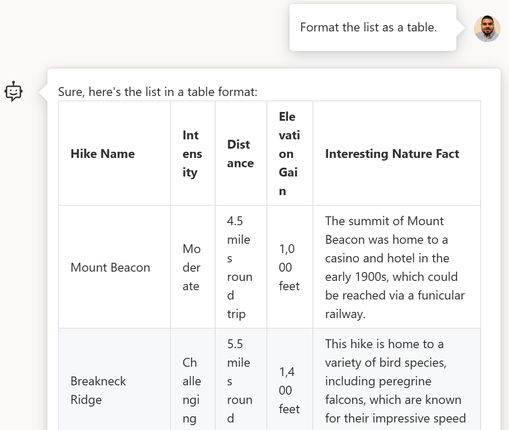

Welcome back to this blog series on OpenAI and .NET!

If you’re new here, check out our [first post](https://devblogs.microsoft.com/dotnet/getting-started-azure-openai-dotnet/) where we introduce the series and show you how to get started using OpenAI in .NET.

The focus of this post is on ChatGPT and how you can use OpenAI models in conversational interfaces using .NET. Let’s get started!

## What is ChatGPT?

The ChatGPT is a language model optimized for conversational interfaces. As opposed to traditional GPT-3 models, ChatGPT enables you to have multi-turn conversations with GPT models making it easier for you to ask follow-up questions.

ChatGPT models can be used for the same types of tasks as other GPT models which include:

- Create a digital assistant (chatbot) to answer questions about your business
- Extract key insights and ask questions about a document
- Summarize information from documents
- Debug code
- and many more...

## ChatGPT prompts and completions

In previous posts, we introduced the concepts of [prompts](https://devblogs.microsoft.com/dotnet/gpt-prompt-engineering-openai-azure-dotnet/) and [completions](https://devblogs.microsoft.com/dotnet/get-started-with-open-ai-completions-with-dotnet/).

For the most part, the guidance in those articles is still applicable to ChatGPT. However, the two key components that distinguish ChatGPT from other GPT models are roles and chat history.

### ChatGPT roles

Roles help ChatGPT add additional information in the context of a conversation. The roles ChatGPT uses are:

- **System**: The system message provides the initial context and guidance for the model. It provides instructions on context the model can reference when generating a response, what it should and shouldn't answer, and how to format responses.
- **Assistant**: Messages containing the completions or responses generated by the model.
- **User**: Messages composed by the user. These are the tasks and queries you provide.

Let's say you want to use ChatGPT to identify and recommend hikes in your area.

**System message**

These are the initial set of guidelines for the model. A sample system message for a hiking assistant might look like the following:

> You are a hiking enthusiast who helps people discover fun hikes in their area. You are upbeat and friendly. You introduce yourself when first saying hello. When helping people out, you always ask them for this information to inform the hiking recommendation you provide:
>
> 1. Where they are located
> 2. What hiking intensity they are looking for
>
> You will then provide three suggestions for nearby hikes that vary in length after you get that information. You will also share an interesting fact about the local nature on the hikes when making a recommendation.

**Assistant & User messages**

The following screenshot is what a sample chat with a ChatGPT powered digital hiking assistant might look like.

The messages on the right are the messages I compose. These have the **user** role.

The responses generated by the model are on the left and these have the **assistant** role.

One of the things you'll notice is that the responses and interactions with the model are guided not only by the user messages, but also by the initial system message.

### Chat history

Generally, when working with GPT-3 models the prompts and responses are one-off. Therefore, if you want to ask follow-up or additional questions you have to find a way to embed it into the context of a prompt. With ChatGPT you can leverage the chat history as additional context.

Using the same hiking assistant example, here are a few examples where chat history is being used as context for additional follow-ups:

1. When I ask for Hudson Valley hike recommendations, as instructed by the system message, the assistant follows up with questions to provide more personalized recommendations. It uses the previous messages its history to ask for clarification on the Hudson Valley area and intensity.

    

1. The chat history contains the list of initial recommendations. When I ask the assistant to format the list as a table, it leverages the previous messages in the chat history to source the information it needs to populate the table.

    

## Get started using ChatGPT

Now that you know what ChatGPT is, it's time to start building your own chat solutions. To get started:

1. Sign up or request access with [OpenAI](https://platform.openai.com/signup/) or [Azure OpenAI Service](https://learn.microsoft.com/azure/cognitive-services/openai/overview#how-do-i-get-access-to-azure-openai).
1. Use your credentials to start experimenting with the [OpenAI .NET samples](https://aka.ms/openai-dotnet-samples).

## What’s next

In the next post, we'll go over how you can use OpenAI models to build intelligent applications in .NET that leverage your documents and knowledge-bases.

## We want to hear from you

Help us learn more about how you’re looking to use AI in your applications. Please take a few minutes to complete a short survey.

[cta-button align='center' text='Take the survey' url='https://aka.ms/dotnet-oai-survey-4'  color='#5c33b8']

Are there any topics you’re interested in learning more about? Let us know in the comments.

## Additional tips

The system message and chat history all count towards your token limit. Make sure to keep track of how many tokens you're using in your conversation. Check out the [tokenization sample](https://aka.ms/openai-dotnet-tokenization) for guidance on getting token counts. 

## Additional resources

If you'd like to learn more about ChatGPT, check out the following articles:

- [How to work with the ChatGPT models](https://learn.microsoft.com/azure/cognitive-services/openai/how-to/chatgpt?pivots=programming-language-chat-completions)
- [Introducing ChatGPT](https://openai.com/blog/chatgpt)
- [What Is ChatGPT Doing…and Why Does It Work?](https://writings.stephenwolfram.com/2023/02/what-is-chatgpt-doing-and-why-does-it-work/). 