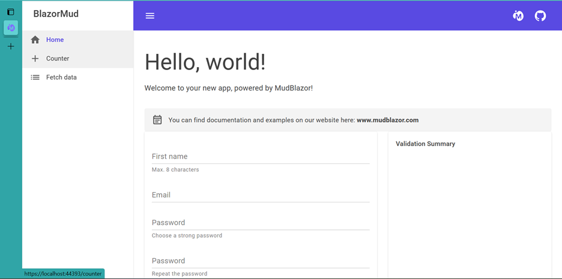
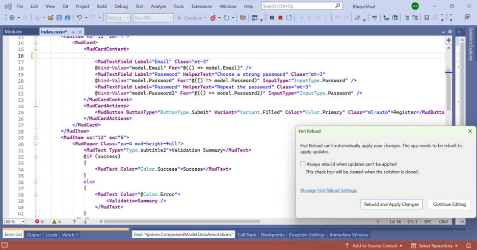
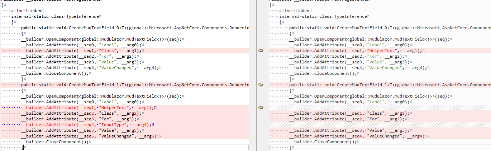
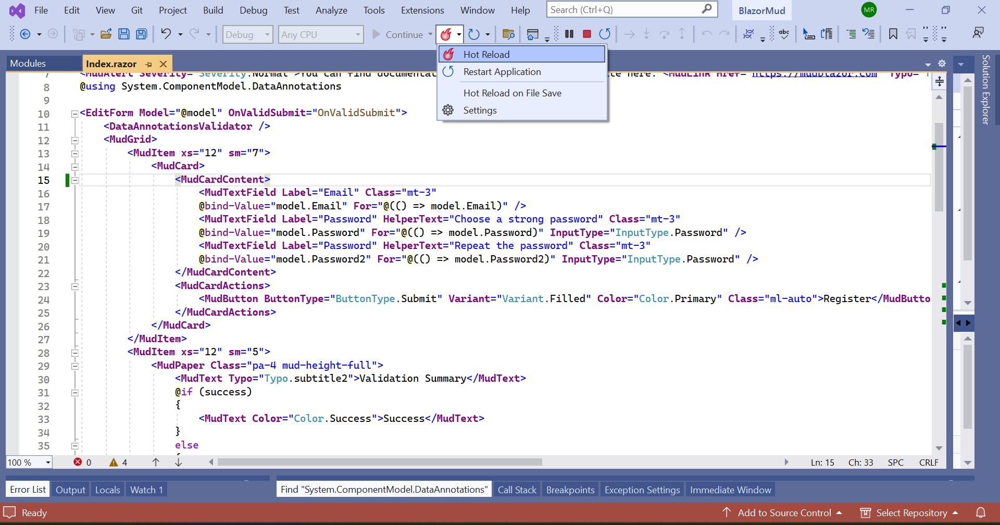
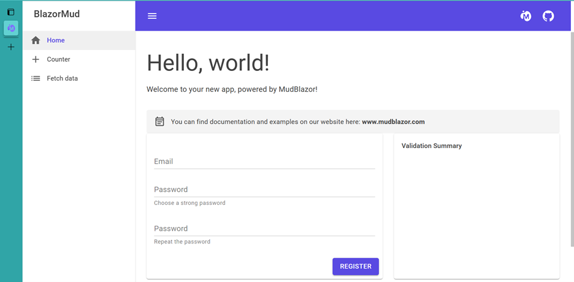

Hot Reload is a powerful .NET feature that lets you edit your code while your app is running, and implements those changes without completely rebuilding your app. Hot Reload supports many of the common edits .NET developers make, but we always look at adding new capabilities with each new .NET version. After making a change to your code, the compiler analyzes the edit to see if the runtime supports it. If the change is unsupported, the compiler or Visual Studio tells you that your app needs to be restarted for the change to take effect - we call this a "Rude Edit". Decreasing the amount of Rude Edits is one of the ways we make Hot Reload more versatile for all our .NET developers - which is why we're excited to announce that in .NET 8, Hot Reload supports modifying Generics!

## Supported Generic Scenarios

The supported generic scenarios for Hot Reload are:

+ Add new (static, instance) method to a (non)generic type.
+ Add new (static instance) generic method to a (non)generic type.
+ Edit existing (static, instance) method on a (non)generic type.
+ Edit existing (static, instance) generic method on a (non)generic type.

To test out these features yourself, you can download the latest Visual Studio 17.7 preview or the latest .NET 8 preview. Hot Reload is available for use anywhere you use .NET.

### Example 1 - Add new static generic method to a non-generic type

Adding a generic method to a non-generic type is supported in Hot Reload as of .NET 8.

```aspx-csharp
using System;
public class AddGenericMethod1
{
    //The edit is removing the comment below
    //static void Foo<T>()
    //{
    //   Console.WriteLine(1);
    //}

    public static void Main()
    {
        Foo<int>();
        Console.WriteLine(2);
    }
}
```

### Example 2 - Add new instance generic method to generic type

This could be in a running console app. A new generic method is added to type G by removing the commented code. Hot Reload can now integrate the new method into the console app without completely reloading it.

```aspx-csharp
using System;
public class AddGenericMethodOnGenericType
{
    class G<T>
    {
        public static string AsString<U>(U u)
        {
            var s = u.ToString();
            Console.WriteLine(s);
            return s;
        }
        // The edit is removing the two comment groups below
        // Comment group 1
        // public string AsString2<U>(U u)
        // {
        //     var s = u.ToString();
        //     Console.WriteLine(""-"");
        //     return s;
        // }
    }
    public static void Main()
    {
        G<string>.AsString<int>(1);
        G<int>.AsString<string>(""2"");
        // Comment group 2
        // G<string>.AsString2<int>(1);
        // G<int>.AsString2<string>(""2"");
        Console.WriteLine(3);
    }
}
```

### Example 3 - Real World Example

This is an example of editing an existing static generic method.

The following issue was filed in GitHub: [Blazor Hot Reload generic](https://github.com/dotnet/aspnetcore/issues/46100). Start by creating a Blazor webpage.  You can see that there are four lines on the webpage: first name, email, password and verify password. This code, `<MudTextField Label="First name" HelperText="Max. 8 characters" @bind-Value="model.Username" For="@(() => model.Username)"/>`, creates the First Name line with the helper text underneath that says Max 8 characters. Before generics were supported in .NET 8, if you removed the code and then used Hot Reload to attempt to refresh the webpage, an error would tell you to restart the entire webpage for the change to take effect.  We call this error a "Rude Edit". The Rude Edit happened because behind the scenes, some code changes in Blazor result in changes to generated generic methods.  Now that Hot Reload supports modifying generics in .NET 8, you can remove the same code, use Hot Reload to refresh your app, by pressing the Hot Reload icon,  and the updates are seen right away.  There are now only three lines on the webpage: email, password and verify password.

### Want More?

Try this feature out today using .NET 8 Preview 4 and Visual Studio preview 17.7 and let us know what other Rude Edits you want us to tackle via Help > Send Feedback > Suggest a Feature in Visual Studio, or on our [GitHub](https://github.com/dotnet/runtime/issues/new/choose)!
