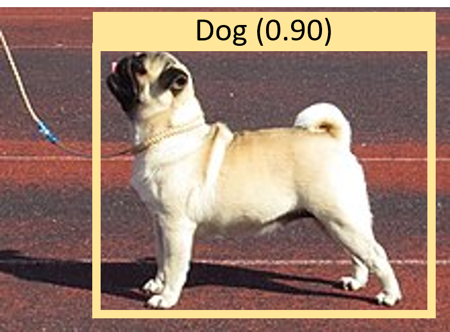
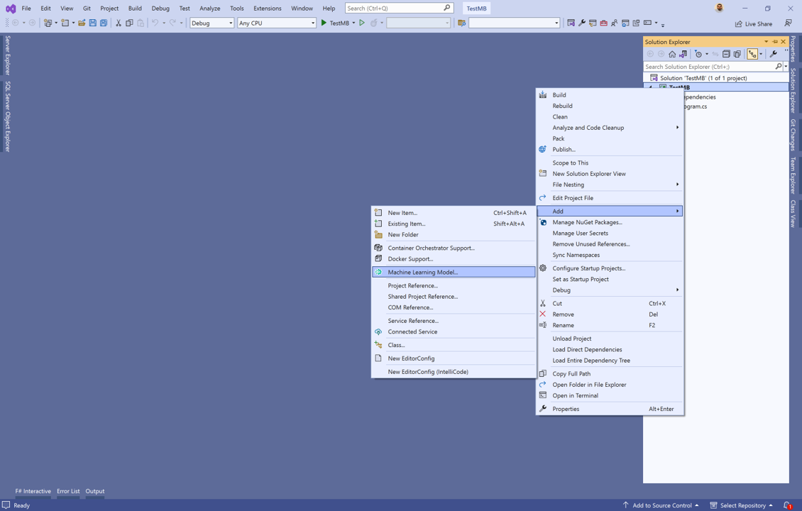
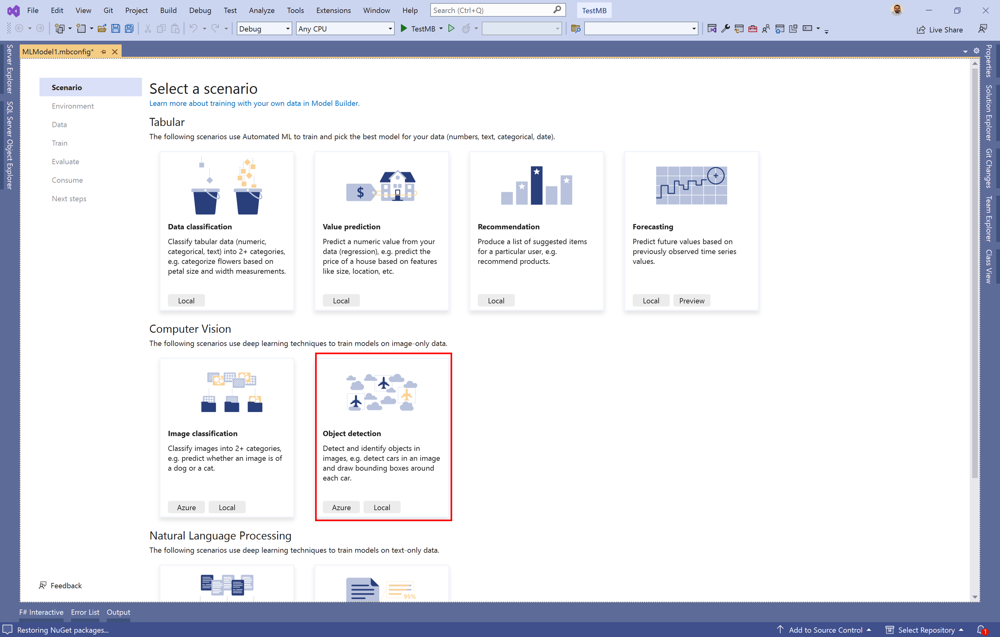
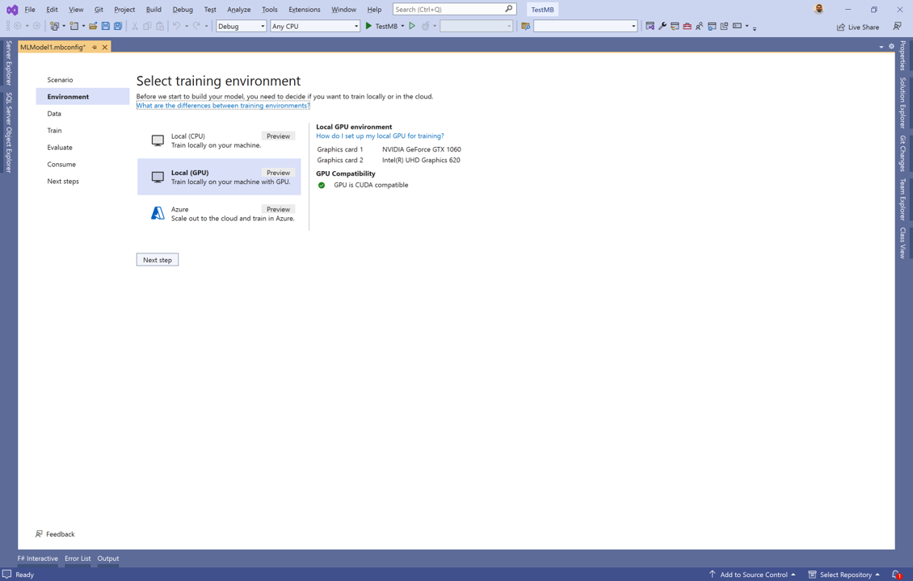
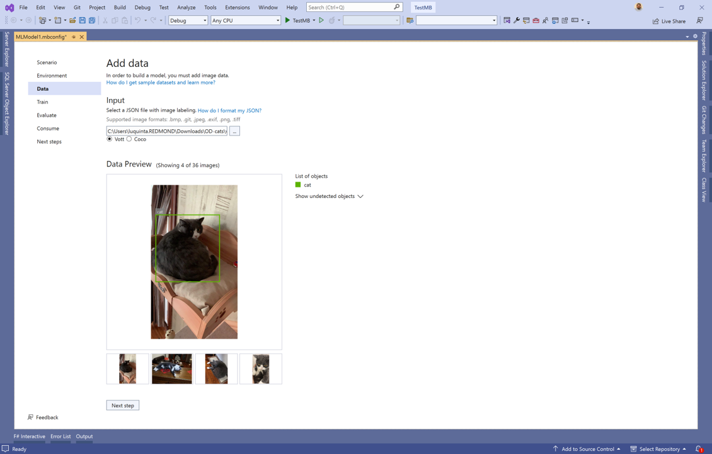
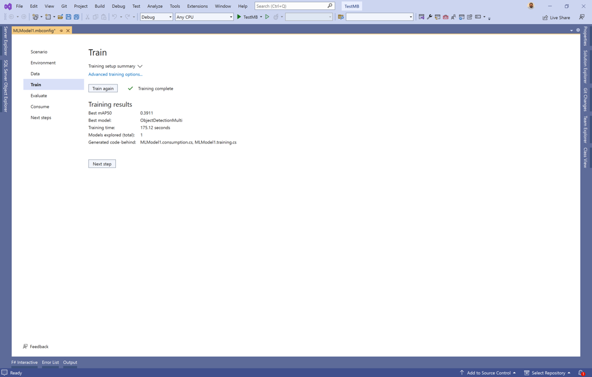
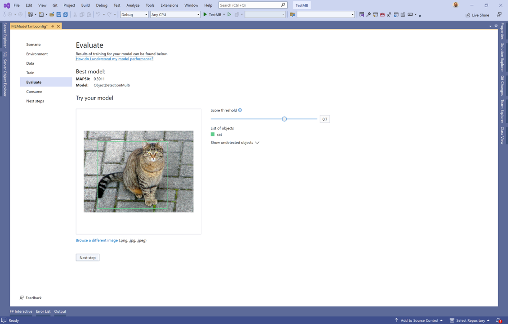

[ML.NET](https://dot.net/ml) is an open-source, cross-platform machine learning framework for .NET developers that enables integration of custom machine learning models into .NET apps.

A new version of Model Builder is now available which includes support for object detection using your local CPU or GPU. 

Download or update to the latest version of [Model Builder](https://marketplace.visualstudio.com/items?itemName=MLNET.ModelBuilder2022) and try it out!

## What is object detection?

Object detection is a computer vision problem. While closely related to image classification, object detection performs image classification at a more granular scale. Object detection both locates and categorizes entities within images. Use object detection when images contain multiple objects of different types.

Some use cases for object detection include:

- Workplace safety
- Object counting
- Activity recognition
- Robotics
- Self-driving cars

## Object detection in Model Builder

We're excited to announce you can now train object detection models in Model Builder using your local CPU or GPU.

The local object detection scenario in Model Builder is powered by the Object Detection API in ML.NET.

Similar to other deep learning APIs in ML.NET like [Text Classification](https://devblogs.microsoft.com/dotnet/introducing-the-ml-dotnet-text-classification-api-preview/) and [Sentence Similarity](https://devblogs.microsoft.com/dotnet/sentence-similarity-mlnet-model-builder/), the Object Detection API is a high-level abstraction where you only need to provide your data and a few parameters to help guide the model training process. 

Under the covers, the Object Detection API leverages some of the latest techniques from Microsoft Research and is backed by a Transformer-based neural network architecture built with TorchSharp. For more details on the underlying model, see the [Searching the Space of Vision Transformer](https://arxiv.org/pdf/2111.14725.pdf) paper. 

We've made the process of getting started with the Object Detection API even easier by integrating it into tools like Model Builder.

If you don't have a GPU or need more powerful compute than the one available on your device, you also have the option of using Azure.

## Get started with object detection locally

Download or update to the latest version of [Model Builder](https://marketplace.visualstudio.com/items?itemName=MLNET.ModelBuilder2022)

1. Start Model Builder by right-clicking a .NET project and choose **Add > Machine Learning Model**

    

1. Choose the **Object Detection** scenario.

    

1. Choose one of the local environments or Azure. We strongly recommend using a GPU if you have one. For more details on using GPUs in Model Builder, see the [Model Builder GPU guidance](https://learn.microsoft.com/dotnet/machine-learning/how-to-guides/install-gpu-model-builder).

    
  
1. Add your data. Model Builder supports both the VoTT and COCO formats.

    

1. Train your model. This may take a few minutes depending on how much data you have and the hardware you're using to train your model.

    

1. Try out a few images to see whether the model is working as expected.

    

At this point, you can move to the next steps and use your model inside of your .NET applications.

For more details, check out the [Model Builder object detection tutorial](https://learn.microsoft.com/dotnet/machine-learning/tutorials/object-detection-model-builder)

## Acknowledgements

We'd like to thank our Microsoft Research and TorchSharp partners for helping us deliver these new scenarios and capabilities in ML.NET.

Thanks to Ambrosio Blanco, Yaoyao Chang, Niklas Gustaffson, Han Hu, Yangyu Huang, Hang Li, Qingtao Li, Zhe Liu, Houwen Peng, Chi Wang, Quifeng Yin, Yilei Yang, and many others.

## Additional resources

Learn more about ML.NET, Model Builder, and the ML.NET CLI in [Microsoft Docs](https://learn.microsoft.com/dotnet/machine-learning/).

If you run into any issues, feature requests, or feedback, please file an issue in the [ML.NET](https://github.com/dotnet/machinelearning/issues) and [Model Builder](https://github.com/dotnet/machinelearning-modelbuilder/issues) repos.

Join the [ML.NET Community Discord](https://aka.ms/virtual-mlnet-community-discord) or #machine-learning channel on the [.NET Development Discord](https://aka.ms/dotnet-discord).
