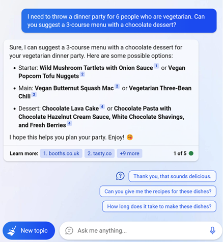
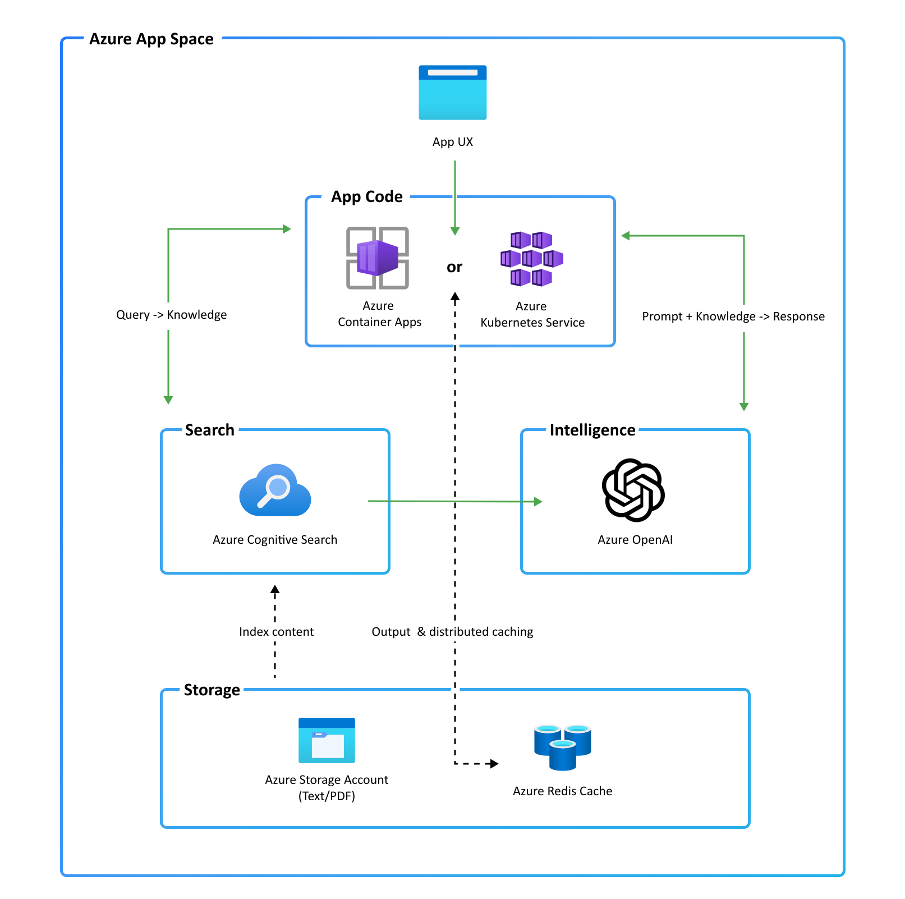
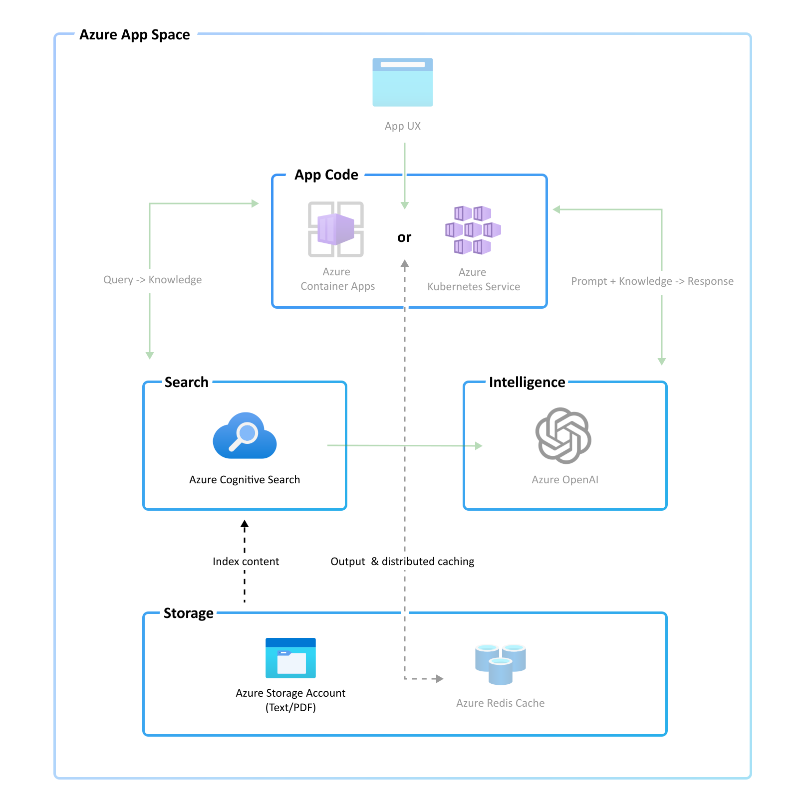
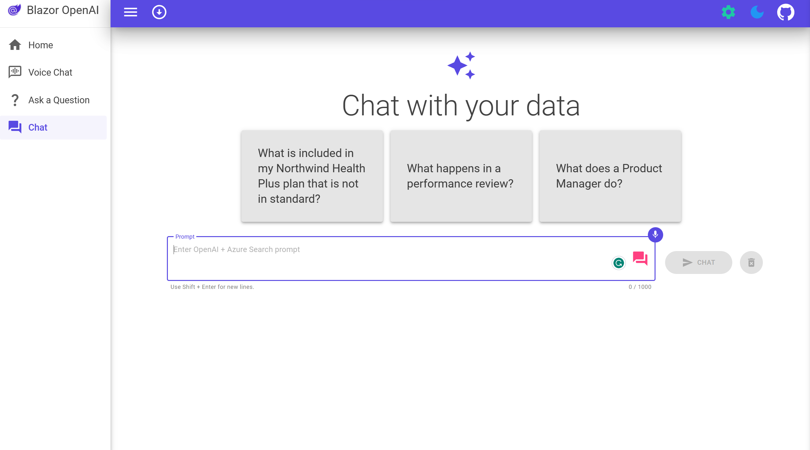
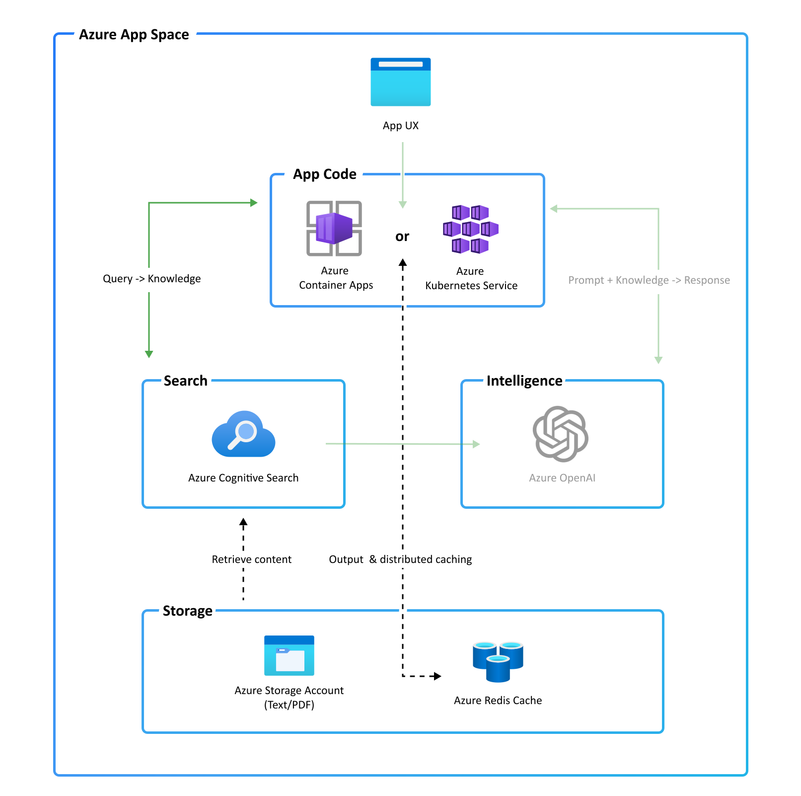
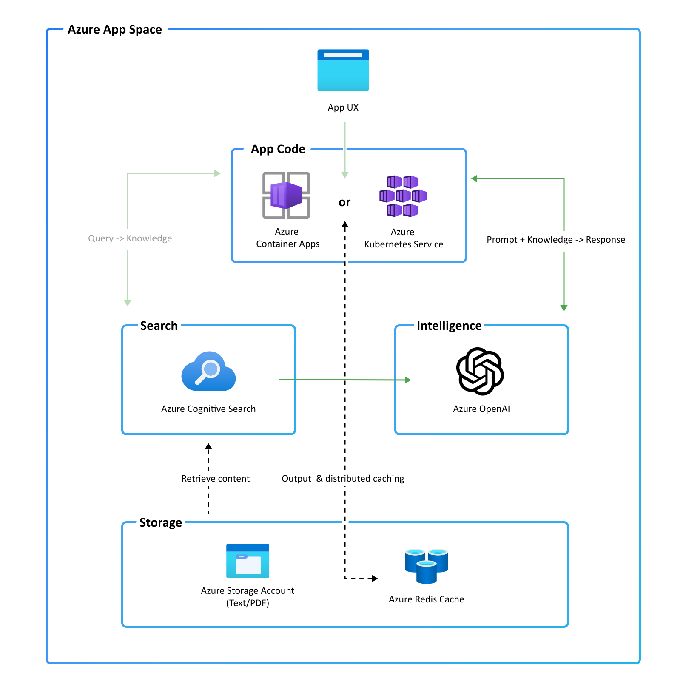
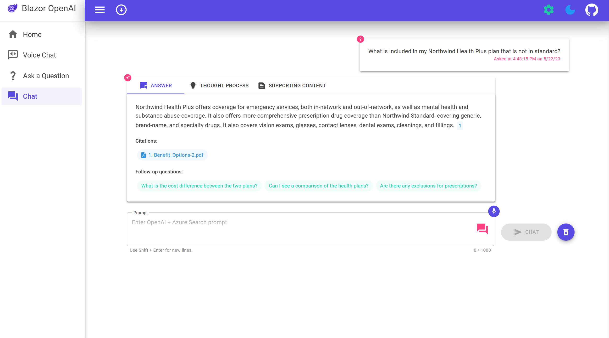

With ChatGPT, you can unleash the full potential of AI in your .NET applications and create amazing user experiences with natural language. ChatGPT is more than just a tool; it’s a game-changer for how we access and analyze data. Whether you use Azure, SQL Server, or any other data source, you can easily integrate ChatGPT into your .NET projects and start building intelligent apps today.

In this post, I’ll provide a quick overview of what intelligent applications are. Then, using a sample application, I’ll show how using a combination of Azure services like [Azure OpenAI Service](https://learn.microsoft.com/azure/cognitive-services/openai/overview) and [Azure Cognitive Search](https://learn.microsoft.com/azure/search/search-what-is-azure-search), you can build your own intelligent .NET applications.

## TLDR

Do you learn best from experience? Head over the repo and jump right in!

[cta-button align='center' text='Build Your Own .NET Intelligent App' url='https://aka.ms/dotnet-ai-app'  color='#5c33b8']

## What are intelligent applications? 

Intelligent applications are AI-powered applications that transform users’ productivity, automate processes, and derive insights.

Bing Chat is an example of an intelligent application.



AI is at the core of Bing Chat. Bing Chat uses AI to take in complex queries, summarize relevant information from various sources, and generates responses. 

## Build intelligent apps with .NET

Now that you have a sense of what intelligent applications are, let’s look at a sample application built with .NET, Azure, and ChatGPT.

[video src="./dotnet-openai-chat-app.mp4"]

Let’s say you have an internal enterprise knowledgebase which contains information about job roles, health care plans, and other business documents.
 
Your users may already be able to search through this knowledgebase, but searching for answers to specific questions by filtering through all the documents in the search results can be time-consuming. 

Using AI models like ChatGPT, you can transform your user’s productivity by summarizing the information contained in those documents and extracting key insights.  

### Application architecture

The [source code](https://aka.ms/dotnet-ai-app) for the application is on GitHub. The following are the core components that make up the application. 



#### User interface

The application’s chat interface is a [Blazor WebAssembly](https://learn.microsoft.com/aspnet/core/blazor/?WT.mc_id=dotnet-35129-website&view=aspnetcore-7.0#blazor-webassembly) static web application. This interface is what accepts user queries, routes request to the application backend, and displays generated responses. If you’re working with client applications on mobile or desktop, .NET MAUI would be a good option for this component as well. 

#### Application backend

The application backend is an [ASP.NET Core Minimal API](https://learn.microsoft.com/aspnet/core/fundamentals/minimal-apis/overview?view=aspnetcore-7.0). The backend hosts the Blazor static web application and what orchestrates the interactions among the different services. Services used in this application include:

- **Azure Cognitive Search** - indexes documents from the data stored in an Azure Storage Account. This makes the documents searchable. 
- **Azure OpenAI Service** - provides the ChatGPT models to generate responses. Additionally, [Semantic Kernel](https://learn.microsoft.com/semantic-kernel/whatissk) is used in conjunction with the Azure OpenAI Service to orchestrate the more complex AI workflows.
- **[Azure Redis Cache](https://learn.microsoft.com/azure/azure-cache-for-redis/cache-overview)** - caches responses. Doing so reduces latency when generating responses to similar questions and helps manage costs because you don’t have to make another request to Azure OpenAI Service.

#### Resource provisioning and developer environments

With all the services mentioned, the process of getting started may seem difficult. However, we’ve streamlined that process using the [Azure Developer CLI](https://learn.microsoft.com/azure/developer/azure-developer-cli/overview). If you don’t want to commit to installing any of the dependencies, we can help you there as well. Just open the repository in [GitHub Codespaces](https://github.com/features/codespaces) and use the Azure Developer CLI to provision your services. 

### Using ChatGPT on your documents

Now that you know the components that make up this app, let’s see how they work together in the context of a chat.

Before you chat with your documents, you’ll want to have a knowledgebase you can query. Chances are, you might already have one. For this sample application, we’ve kept it simple. There are a set of PDF documents in the application’s data directory. To load them into Azure Storage and index them in Azure Cognitive Search, we’ve built a C# console application.



The C# console application does the following:

1.	Uses Azure Form Recognizer to extract the text from each of the documents.
2.	Splits the documents into smaller excerpts. (chunking)
3.	Creates a new PDF document for each of the excerpts.
4.	Uploads the excerpt to an Azure Storage Account.
5.	Creates an index in Azure Cognitive Search.
6.	Adds the documents to the Azure Cognitive Search index.

Why are the PDFs split into chunks? 

OpenAI models like ChatGPT have token limits. For more information on token limits see the [Azure OpenAI Service quotas and limits reference guide](https://learn.microsoft.com/azure/cognitive-services/openai/quotas-limits#quotas-and-limits-reference). 

In this example, the knowledgebase building process is manual. However, based on your needs you may opt to run this as an event-driven job whenever a new document is added to the Azure Storage Account or in batches as a background job. 

Another pattern worth mentioning involves the use of embeddings to encode semantic information about your data. These embeddings are typically stored in vector databases. For a quick introduction to embeddings, see the [Azure OpenAI embeddings documentation](https://learn.microsoft.com/azure/cognitive-services/openai/concepts/understand-embeddings). That pattern is not the main one used in this sample and beyond the scope of this post. However, in future posts, we'll cover those topics in more detail, so stay tuned! 

### Chat with your data

Once you have your knowledgebase set up, it’s time to chat with it. 



Querying the knowledgebase starts off with the user entering a question in the Blazor web app. The user query is then routed to the ASP.NET Core Minimal Web API.

Inside the web api, the `chat` endpoint handles the request. 

```csharp
api.MapPost("chat", OnPostChatAsync);
```

To handle the request, we apply a pattern known as Retrieval Augmented Generation which does the following:

1.	Queries the knowledgebase for relevant documents
2.	Uses the relevant documents as context to generate a response

#### Querying the knowledgebase



The knowledgebase is queried using Azure Cognitive Search. Azure Cognitive Search though doesn’t understand the natural language provided by the user. Fortunately, we can use ChatGPT to help translate the natural language into a query. 

Using Semantic Kernel, we create a method that defines a prompt template and adds the chat history and user question as additional context to generate an Azure Cognitive Search query.

```csharp
private ISKFunction CreateQueryPromptFunction(ChatTurn[] history)
{
    var queryPromptTemplate = """
        Below is a history of the conversation so far, and a new question asked by the user that needs to be answered by searching in a knowledge base about employee healthcare plans and the employee handbook.
        Generate a search query based on the conversation and the new question.
        Do not include cited source filenames and document names e.g info.txt or doc.pdf in the search query terms.
        Do not include any text inside [] or <<>> in the search query terms.
        If the question is not in English, translate the question to English before generating the search query.

        Chat History:
        {{$chat_history}}

        Question:
        {{$question}}

        Search query:
        """;

    return _kernel.CreateSemanticFunction(queryPromptTemplate,
        temperature: 0,
        maxTokens: 32,
        stopSequences: new[] { "\n" });
}
```

That method is then used to compose the query generation prompt. 

```csharp
var queryFunction = CreateQueryPromptFunction(history);
var context = new ContextVariables();
context["chat_history"] = history.GetChatHistoryAsText();
context["question"] = userQuestion;
```

When you run the Semantic Kernel function, it provides the composed prompt to the Azure OpenAI Service ChatGPT model which generates the query. 

```csharp
var query = await _kernel.RunAsync(context, cancellationToken, queryFunction);
```

Given the question *“What is included in my Northwind Health Plus plan that is not in standard?”*, the generated query might look like *Northwind Health Plus plan coverage*

Once your query is generated, use the Azure Cognitive Search client to query the index containing your documents.

```csharp
var documentContents = await _searchClient.QueryDocumentsAsync(query.Result, overrides, cancellationToken);
```

At this point, Azure Cognitive Search will return results containing the documents most relevant to your query. Results might look like the following:

> Northwind_Health_Plus_Benefits_Details-108.pdf: You must provide Northwind Health Plus with a copy of the EOB for the Primary Coverage, as well as a copy of the claim that you submitted to your Primary Coverage. This will allow us to determine the benefits that are available to you under Northwind Health Plus. It is important to note that Northwind Health Plus does not cover any expenses that are considered to be the responsibility of the Primary Coverage.  
> 
> Benefit_Options-3.pdf: The plans also cover preventive care services such as mammograms, colonoscopies, and other cancer screenings. Northwind Health Plus offers more comprehensive coverage than Northwind Standard. This plan offers coverage for emergency services, both in-network and out-of-network, as well as mental health and substance abuse coverage. Northwind Standard does not offer coverage for emergency services, mental health and substance abuse coverage, or out-of-network services 

#### Generating a response

Now that you have documents with relevant information to help answer the user question, it’s time to use them to generate an answer. 



We start off by using Semantic Kernel to create a function that composes a prompt containing chat history, documents, and follow-up questions. 

```csharp
private const string AnswerPromptTemplate = """
    <|im_start|>system
    You are a system assistant who helps the company employees with their healthcare plan questions, and questions about the employee handbook. Be brief in your answers.
    Answer ONLY with the facts listed in the list of sources below. If there isn't enough information below, say you don't know. Do not generate answers that don't use the sources below. If asking a clarifying question to the user would help, ask the question.
    For tabular information return it as an html table. Do not return markdown format.
    Each source has a name followed by colon and the actual information, always include the full path of source file for each fact you use in the response. Use square brakets to reference the source. Don't combine sources, list each source separately.
    ### Examples
    Sources:
    info1.txt: deductibles depend on whether you are in-network or out-of-network. In-network deductibles are $500 for employees and $1000 for families. Out-of-network deductibles are $1000 for employees and $2000 for families.
    info2.pdf: Overlake is in-network for the employee plan.
    reply: In-network deductibles are $500 for employees and $1000 for families [info1.txt][info2.pdf] and Overlake is in-network for the employee plan [info2.pdf].
    ###
    {{$follow_up_questions_prompt}}
    {{$injected_prompt}}
    Sources:
    {{$sources}}
    <|im_end|>
    {{$chat_history}}
    """;

private const string FollowUpQuestionsPrompt = """
    Generate three very brief follow-up questions that the user would likely ask next about their healthcare plan and employee handbook.
    Use double angle brackets to reference the questions, e.g. <<Are there exclusions for prescriptions?>>.
    Try not to repeat questions that have already been asked.
    Only generate questions and do not generate any text before or after the questions, such as 'Next Questions'
    """;
```

Are we hard-coding answers in the prompt? 

We’re not. The examples in the prompt serve as guidelines for the model to generate the answer. This is known as few-shot learning. 

```csharp
private ISKFunction CreateAnswerPromptFunction(string answerTemplate, RequestOverrides? overrides) =>
    _kernel.CreateSemanticFunction(answerTemplate,
        temperature: overrides?.Temperature ?? 0.7,
        maxTokens: 1024,
        stopSequences: new[] { "<|im_end|>", "<|im_start|>" });

ISKFunction answerFunction;
var answerContext = new ContextVariables();

answerContext["chat_history"] = history.GetChatHistoryAsText();
answerContext["sources"] = documentContents;
answerContext["follow_up_questions_prompt"] = ReadRetrieveReadChatService.FollowUpQuestionsPrompt;

answerFunction = CreateAnswerPromptFunction(ReadRetrieveReadChatService.AnswerPromptTemplate, overrides);

prompt = ReadRetrieveReadChatService.AnswerPromptTemplate;
```

When you run the Semantic Kernel function, it provides the composed prompt to the Azure OpenAI Service ChatGPT model which generates the response. 

```csharp
var ans = await _kernel.RunAsync(answerContext, cancellationToken, answerFunction);
```

After some formatting, the answer is returned to the web app and displayed. The result might look similar to the following:



In order to build more trust in the responses, the response includes citations, the full prompt used to generate the response, and supporting content containing the documents from the search results. 

## Build your own intelligent apps

We’re excited for the future of intelligent applications in .NET.

Check out the application source code on GitHub and use it as a template to start building intelligent applications with your own data. 

[cta-button align='center' text='Build Your Own .NET Intelligent App' url='https://aka.ms/dotnet-ai-app'  color='#5c33b8']

## We want to hear from you!

Are you interested in building or currently building intelligent apps? Take a few minutes to complete this survey.

[cta-button align='center' text='Take the survey' url='https://aka.ms/dotnet-build-oai-survey'  color='#5c33b8']

## Additional resources

- [Get started with OpenAI in .NET](https://devblogs.microsoft.com/dotnet/getting-started-azure-openai-dotnet/)
- [Get Started with OpenAI Completions with .NET](https://devblogs.microsoft.com/dotnet/get-started-with-open-ai-completions-with-dotnet/)
- [Level up your GPT game with prompt engineering](https://devblogs.microsoft.com/dotnet/gpt-prompt-engineering-openai-azure-dotnet/)
- [Get started with ChatGPT in .NET](https://devblogs.microsoft.com/dotnet/get-started-chatgpt-azure-dotnet/)
