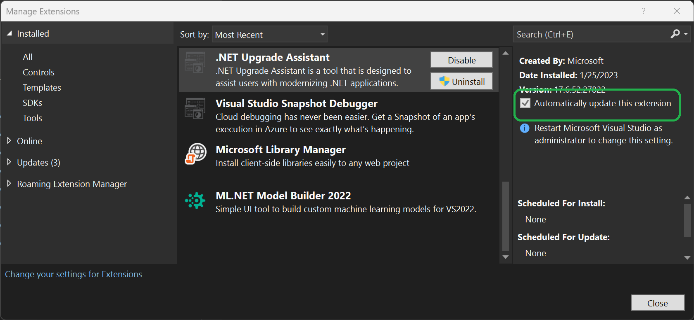
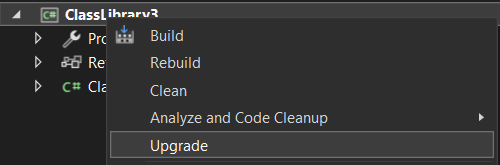
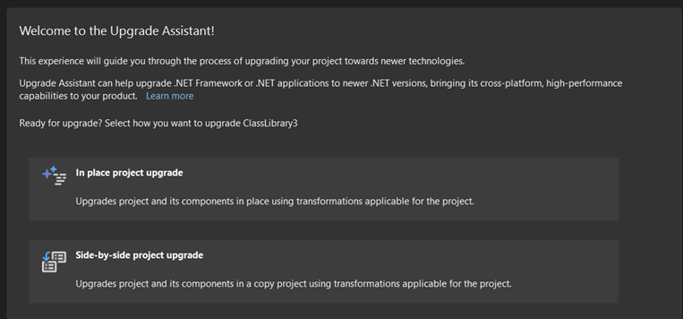
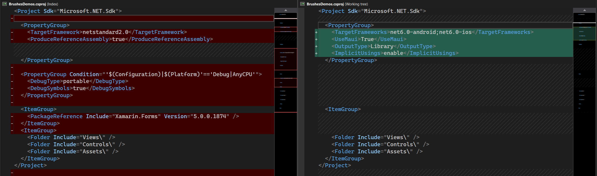
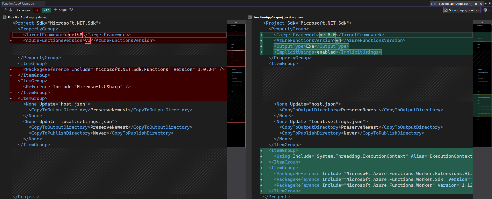
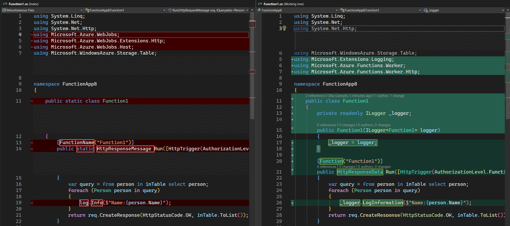

We are happy to announce that we have released a new version of [.NET Upgrade Assistant](https://marketplace.visualstudio.com/items?itemName=ms-dotnettools.upgradeassistant) in Visual Studio that makes your upgrades to the latest .NET framework even easier!

The .NET Upgrade Assistant is a tool that helps you upgrade your application to the latest .NET and migrate from the older platforms such as Xamarin Forms and UWP to newer offerings. We [released the Visual Studio extension for this tool in February](https://devblogs.microsoft.com/dotnet/upgrade-assistant-now-in-visual-studio/) and now a new version is out with many improvements and new features.
Make sure you have automatic updates turned on for this tool to get the best experience. In **Visual Studio** | **Extensions** | **Manage Extensions** find **.NET Upgrade Assistant** in **Installed** and ensure the **Automatically update this extension** is checked. Run Visual Studio as administrator to make this change if needed.

## What's new in this version

We are excited that this new release adds support for new scenarios for different platforms, frameworks, and more! Here are some of the new enhancements:

- Support for .NET 8.
- Upgrades from Xamarin.Forms to .NET MAUI.
- Upgrades for Azure Functions.
- Upgrades from UWP to WinUI.
- Support for ARM64.

## Updates and Enhancements

This version also includes several enhancements that developers have been asking for and improve the overall experience when using the .NET Upgrade Assistant:

- Improved the way Upgrade Assistant updates NuGet packages.
- Upgraded **Incremental** scenario to use YARP 2.0.
- Improved error handling, now all failures and warnings can be seen in the Progress View for each project component.
- Many infrastructural updates to the engine of the tool that improved performance and overall quality of upgrades.
- Support for SDK-style projects that are using `System.Web`. Before, web projects that were manually converted to SDK-style but still were using `System.Web` could not be upgraded incrementally and were treated like Core-family projects. Now Upgrade Assistant treats them as .NET Framework projects and allows to upgrade them incrementally, which is the best way to upgrade web applications from .NET Framework to the latest .NET.
- WinForms – added handling for the cases when certain APIs from the old version are not supported in the new .NET version.
- ASP.NET - added improvements to how projects are getting upgraded behind the scenes.

## More about updates to .NET 6, 7, 8

In the previous version of Upgrade Assistant, when you chose to upgrade from .NET Core or later to .NET 6, 7 or 8, Upgrade Assistant was just upgrading the target framework. Now it also upgrades all packages your application is referencing to a cohesive set of packages corresponding to the target .NET.

Here is how the package upgrades work:

- For standard .NET runtime or ASP.NET Core packages the version will be set to the latest matching target framework 6, 7, or 8. For example, if you are upgrading your app to .NET 6, you'll get the corresponding .NET 6 release package version, and if you are upgrading to .NET 8, your packages will be updated to the latest pre-release versions.

- For all other packages the tool checks if this package already supports target framework, in that case the package remains unchaged. If not, the tool will check if the latest version of the package support the target framework to wich the app is upgraded. In case even the latest package version does not support the target framework, this package will be removed.

Another new feture is support for Preview upgrades: now you can upgrade from the older Preview version to the most recent one.

## Upgrades from Xamarin.Forms to .NET MAUI

Now you can upgrade your existing Xamarin.Forms applications to Xamarin's successor - .NET MAUI.

In comparison to Xamarin.Forms, .NET MAUI has many benefits and improvements such as:

- **single project** to simplify asset management, NuGet management, and leverage multi-targeting.
- **multi-window support** for desktop & tablet scenarios
- **rebuilt layout** to improve maintainability, performance, and correct many quirks present in Xamarin.Forms.
- **App Builder** To standardize app bootstrapping with common .NET pattern

- **decoupled platform from cross-platform controls**
- Layered renderer pattern over new handlers
- Refactored Shell implementations

and many more. You can read the [.NET MAUI documentation](https://learn.microsoft.com/dotnet/maui/what-is-maui) for more details.

To upgrade your Xamarin.Forms app to .NET MAUI:

1. In Visual Studio, in **Solution Explorer** right-click on one of your projects and choose **Upgrade**. You need to have [Upgrade Assistant Visual Studio extension](https://marketplace.visualstudio.com/items?itemName=WebToolsTeam.aspnetprojectmigrations) installed to see the **Upgrade** option. You can start with any of the projects in your solution; you will need to upgrade all of them to make your app build.

    

1. You will see the main page with a few options for your upgrade.

    

    Choose **In place** if you want your original project to be upgraded or **Side-by-side** if you want to create a new MAUI project next to your original one and leave the original one unchanged.

1. Follow along with the upgrade steps. Unless you have reasons to upgrade some parts of your project gradually, leave everything checked that the tool suggests and upgrade.

1. Repeat it for every project of your solution.

1. After the upgrades are complete you'll see that the tool modified your project files, updated the references and made other required changes. Build and run your applications. If there are any other errors, you'll need to fix them manually.
    

> Note: for `.xaml` file transformations the Upgrade Assistant includes basic namespace replacements. More comprehensive .xaml file transformations require Visual Studio 17.6.

## Upgrades for Azure Functions

Azure Functions is a serverless compute platform that enables you to run code without provisioning or managing infrastructure. There are four major versions of Azure Functions: 1.x, 2.x, 3.x, and 4.x. Each version has its own set of features and capabilities.

- **Version 1.x** is the oldest version of Azure Functions. It is no longer supported and should not be used for new development.

- **Version 2.x** was released in 2017. It is a major upgrade from version 1.x and includes a number of new features, such as support for multiple languages, improved performance, and a more flexible deployment model.

- **Version 3.x** was released in 2018. It is a minor update to version 2.x and includes a few new features, such as support for Azure Durable Functions and improved integration with Azure Event Grid.

- **Version 4.x** was released in 2020. It is a major upgrade from version 3.x and includes a number of new features, such as support for .NET 6, improved performance, and a more secure architecture.

Also different versions of Azure Functions are supported in different .NET versions. The following table summarizes the key differences between the different versions of Azure Functions:

| Feature | Version 1.x | Version 2.x | Version 3.x | Version 4.x |
|--------------|-----------|------------|------------|------------|
| Supported .NET | .NET Framework 4.6.1 or later | .NET Core 2.1 or later | .NET Core 3.1 or later  | .NET 6 or later |
| Supported languages | C#, JavaScript, Python, PowerShell | C#, JavaScript, Python, PowerShell, Java | C#, JavaScript, Python, PowerShell, Java | C#, JavaScript, Python, PowerShell, Java, Go |
| Performance | Good  | Better | Best | Best |
| Deployment model | Isolated | Isolated | Isolated | Isolated or shared |
| Features | Basic | Advanced | Advanced | Advanced |
| Support | End of life | Active | Active | Active |

When you are upgrading your Azure Functions project to the latest .NET, the tool will automatically upgrade the version of Azure Functions to **v4** isolated since it is the best and recommended version.

  

You can upgrade your Azure Functions project the same way as any other project, by right-clicking on the project in the **Solution Explorer**, clicking on the **Upgrade** option and following along with the upgrade steps in the tool.

Besides updating project file to tharget the latest .NET version and Azure Functions version, the body of the functions is also getting updated to use the new APIs.

  

You can read more about Azure Functions in the [documentation](https://learn.microsoft.com/azure/azure-functions/migrate-version-1-version-4?tabs=v4%2Cazure-cli%2Cwindows&pivots=programming-language-csharp).

## What’s next

Next, we are going to focus on improving the quality of the upgrades, stabilizing the tool, addressing existing bugs and your feedback.

We will also work on updating the existing CLI tool to talk to the same engine as Visual Studio extension. This way CLI tool will have all the new features that VSIX has, so you can choose between Visual Studio and CLI experience.

## Learn how to upgrade

We have lots of materials to help you with your upgrade process:
- [Blog about Upgrade Assistant Visual Studio extension](https://devblogs.microsoft.com/dotnet/upgrade-assistant-now-in-visual-studio/)
- [Video - how to use Visual Studio extension](https://youtu.be/3mPb4KAbz4Y)
- [Tutorial for CLI tool](https://dotnet.microsoft.com/platform/upgrade-assistant/tutorial/intro)
- [Video series on Upgrade Assistant and ASP.NET](https://www.youtube.com/playlist?list=PLdo4fOcmZ0oWiK8r9OkJM3MUUL7_bOT9z)
- [Upgrading Azure Functions](https://learn.microsoft.com/azure/azure-functions/migrate-version-1-version-4?tabs=v4%2Cazure-cli%2Cwindows&pivots=programming-language-csharp)

## Give us feedback!

Please give us your feedback so we can build the right tools for you by filling out this [brief survey](https://www.surveymonkey.com/r/CX67DS8).

You can also [file issues or feature requests from Visual Studio](https://learn.microsoft.com/visualstudio/ide/suggest-a-feature) by choosing **Help** | **Send Feedback**. Ensure to mention "Upgrade Assistant vsix" in the title.