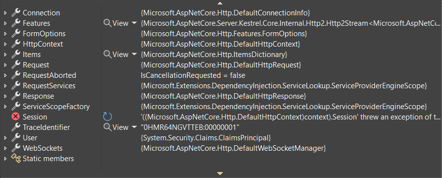
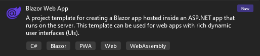
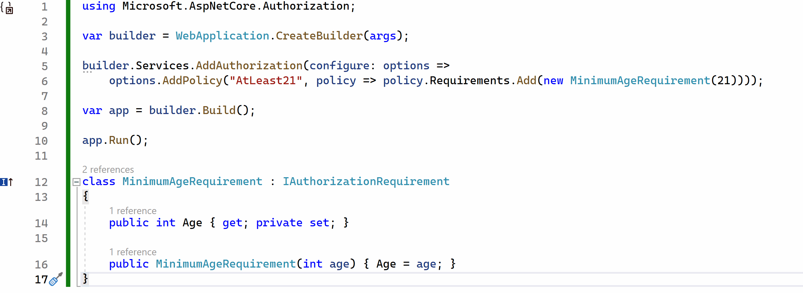

[.NET 8 Preview 5 is now available](https://devblogs.microsoft.com/dotnet/announcing-dotnet-8-preview-5) and includes many great new improvements to ASP.NET Core.

Here's a summary of what's new in this preview release:

- Improved ASP.NET Core debugging experience
- [Servers & middleware](#servers)
    - `IHttpSysRequestTimingFeature`
    - SNI hostname in `ITlsHandshakeFeature`
    - `IExceptionHandler`
- [Blazor](#blazor)
    - New Blazor Web App project template
    - Blazor router integration with endpoint routing
    - Enable interactivity for individual components with Blazor Server
    - Improved packaging of Webcil files
    - Blazor Content Security Policy (CSP) compatibility
- [API authoring](#api-authoring)
    - Support for generic attributes
- [SignalR](#signalr)
    - SignalR seamless reconnect
- [Native AOT](#native-aot)
    - Support for `AsParameters` and automatic metadata generation in compile-timed generated minimal APIs
- [Authentication and authorization](#auth)
    - Authentication updates in ASP.NET Core SPA templates
    - New analyzer for recommended `AuthorizationBuilder` usage

For more details on the ASP.NET Core work planned for .NET 8 see the full [ASP.NET Core roadmap for .NET 8](https://aka.ms/aspnet/roadmap) on GitHub.

## Get started

To get started with ASP.NET Core in .NET 8 Preview 5, [install the .NET 8 SDK](https://dotnet.microsoft.com/next).

If you're on Windows using Visual Studio, we recommend installing the latest [Visual Studio 2022 preview](https://visualstudio.com/preview). If you're using Visual Studio Code, you can try out the new [C# Dev Kit](https://devblogs.microsoft.com/visualstudio/announcing-csharp-dev-kit-for-visual-studio-code/). Visual Studio for Mac support for .NET 8 previews isn’t available at this time.

## Upgrade an existing project

To upgrade an existing ASP.NET Core app from .NET 8 Preview 4 to .NET 8 Preview 5:

- Update the target framework of your app to `net8.0`.
- Update all Microsoft.AspNetCore.\* package references to `8.0.0-preview.5.*`.
- Update all Microsoft.Extensions.\* package references to `8.0.0-preview.5.*`.

See also the full list of [breaking changes](https://docs.microsoft.com/dotnet/core/compatibility/8.0#aspnet-core) in ASP.NET Core for .NET 8.

## Improved ASP.NET Core debugging experience

.NET 8 preview 5 introduces significant improvements to ASP.NET Core debugging. We've added [debug customization attributes](https://learn.microsoft.com/visualstudio/debugger/using-the-debuggerdisplay-attribute) to make finding important information on types like `HttpContext`, `HttpRequest`, `HttpResponse` and `ClaimsPrincipal` easier in your IDE's debugger.

**.NET 7**



**.NET 8**


We want to keep improving ASP.NET Core debugging. If you have suggestions about other commonly used or hard-to-debug types, let us know in the comments or on [the aspnetcore GitHub repo](https://github.com/dotnet/aspnetcore/issues/48205).

<a id="servers"></a>

## Servers & middleware

### `IHttpSysRequestTimingFeature`

The new `IHttpSysRequestTimingFeature` interface exposes detailed timestamp data related to request processing when using the HTTP.sys server.

Previously, HTTP.sys request information was provided via the `IHttpSysRequestInfoFeature`. With the addition of `IHttpSysRequestTimingFeature`, we're moving towards more well-defined APIs that provide better access to request timing data.

```csharp
namespace Microsoft.AspNetCore.Server.HttpSys
{
    public interface IHttpSysRequestTimingFeature
    {
        ReadOnlySpan<long> Timestamps { get; }
        bool TryGetTimestamp(HttpSysRequestTimingType timestampType, out long timestamp);
        bool TryGetElapsedTime(HttpSysRequestTimingType startingTimestampType, HttpSysRequestTimingType endingTimestampType, out TimeSpan elapsed);
    }
}
```

The `Timestamps` property gives access to all HTTP.sys timing timestamps. The timestamps are obtained using the `QueryPerformanceCounter` and the timestamp frequency can be determined via `QueryPerformanceFrequency`.

The `TryGetTimestamp` method retrieves the timestamp for the provided timing type, while `TryGetElapsedTime` method gives the elapsed time between two specified timings.

This enhancement provides developers with:

- More granular insight into the various stages of request processing.
- Precise performance diagnostics capabilities.
- Improved access to and control over HTTP.sys request timing data.

We're eager to see how this advanced access to HTTP.sys timing information helps optimize your applications and refine your diagnostics experience.

### SNI hostname in `ITlsHandshakeFeature`

The Server Name Indication (SNI) hostname is now exposed in the `ITlsHandshakeFeature` interface.

```csharp
/// <summary>
/// Gets the host name from the "server_name" (SNI) extension of the client hello if present.
/// See <see href="https://www.rfc-editor.org/rfc/rfc6066#section-3">RFC 6066</see>.
/// </summary>
string? HostName => null;
```

SNI is part of the TLS handshake process and allows clients to specify the hostname they're attempting to connect to. This enables servers that host multiple virtual hosts or domains to present the correct security certificate during the handshake process. Normally SNI is only handled within the TLS stack and used to select the matching certificate, but by exposing it, other components in the application can use that information for diagnostics, rate limiting, routing, billing, etc.

Exposing the hostname is particularly useful for large-scale services managing thousands of SNI bindings. With this feature, you gain valuable insights into the chosen SNI during the TLS handshake, thereby significantly improving your debugging capabilities during customer escalations. This increased transparency allows for faster problem resolution and enhanced service reliability.

Thanks to [karimsalem1](https://github.com/karimsalem1) for contributing this feature!

### `IExceptionHandler`

The [exception handler middleware](https://learn.microsoft.com/aspnet/core/fundamentals/error-handling#exception-handler-page) is an existing component used to catch un-expected request processing exceptions and return a user-friendly error page without leaking implementation details. `IExceptionHandler` is a new interface for services that can be resolved and invoked by the exception handler middleware. It gives the developer a callback that allows handling known exceptions in a central location.

`IExceptionHandler`'s are registered by calling `IServiceCollection.AddExceptionHandler<T>`.  Multiple can be added, and they'll be called in the order registered. If an exception handler handles a request, it can return `true` to stop processing. If an exception isn't handled by any exception handler, then control falls back to the old behavior and options from the middleware. Different metrics and logs will be emitted for handled versus unhandled exceptions.

```csharp
public interface IExceptionHandler
{
    ValueTask<bool> TryHandleAsync(HttpContext httpContext, Exception exception, CancellationToken cancellationToken);
}
```

<a id="signalr"></a>

## SignalR

### SignalR seamless reconnect

This preview includes early support for "seamless reconnects" in SignalR. This feature aims to reduce the perceived downtime of clients that have a temporary hiccup in their network connection, due to switching network connections, driving through a tunnel, etc. It achieves this by temporarily buffering data on the server and client and ack-ing messages sent by both sides, as well as recognizing when a connection is returning and replaying messages that may have been sent while the connection was down.

Because the feature is still being designed, there isn't any configuration yet and support is limited to .NET clients using WebSockets.

To opt-in to the feature, update your .NET client code to enable the option:
```csharp
var hubConnection = new HubConnectionBuilder()
    .WithUrl("<hub url>",
             options =>
             {
                options.UseAcks = true;
             })
    .Build();
```

In future previews there will likely be options to disable the feature from the server-side, configuration for how much buffering will occur, and timeout limits. Additionally, support will be added for other transports and clients.

Please provide feedback and follow along with the progress of the feature at https://github.com/dotnet/aspnetcore/issues/46691.

<a id="blazor"></a>

## Blazor

### New Blazor Web App project template

In this preview we're introducing a new Blazor project template: the Blazor Web App template. This new template provides a single starting point for using Blazor components to build any style of web UI, both server-side rendered and client-side rendered. It combines the strengths of the existing Blazor Server and Blazor WebAssembly hosting models with the new Blazor capabilities we're adding in .NET 8: server-side rendering, streaming rendering, enhanced navigation & form handling, and the ability to add interactivity using either Blazor Server or Blazor WebAssembly on a per component basis. Not all of these features are enabled yet in this preview, but the new Blazor Web App template provides a convenient way to try out these new features as they become available.

You can create a new Blazor Web App from the command line by running:

```console
dotnet new blazor -o BlazorWebApp
```

The new Blazor Web App project template is also available in Visual Studio:



The Blazor Web App template is set up for server-side rendering of Razor components by default. In *Program.cs* the call to `AddRazorComponents()` adds the related services and then `MapRazorComponents<App>()` discovers the available components and specifies the root component for the app.

**Program.cs**

```csharp
using BlazorWebApp;

var builder = WebApplication.CreateBuilder(args);

// Add services to the container.
builder.Services.AddRazorComponents();

var app = builder.Build();

// ...

app.MapRazorComponents<App>();

app.Run();
```

The root `App` component in the Blazor Web App template defines the root HTML content, sets up the Blazor router, and adds the *blazor.web.js* script. The previously required  `IRazorComponentApplication` interface is no longer needed.

**App.razor**

```razor
<!DOCTYPE html>
<html lang="en">

<head>
    <meta charset="utf-8" />
    <meta name="viewport" content="width=device-width, initial-scale=1.0, maximum-scale=1.0, user-scalable=no" />
    <title>BlazorWebApp1</title>
    <base href="/" />
    <link href="css/bootstrap/bootstrap.min.css" rel="stylesheet" />
    <link href="css/app.css" rel="stylesheet" />
    <link rel="icon" type="image/png" href="favicon.png" />
    <link href="BlazorWebApp1.styles.css" rel="stylesheet" />
    <HeadOutlet />
</head>

<body>

    <Router AppAssembly="@typeof(App).Assembly">
        <Found Context="routeData">
            <RouteView RouteData="@routeData" DefaultLayout="@typeof(MainLayout)" />
            <FocusOnNavigate RouteData="@routeData" Selector="h1" />
        </Found>
        <NotFound>
            <PageTitle>Not found</PageTitle>
            <LayoutView Layout="@typeof(MainLayout)">
                <p role="alert">Sorry, there's nothing at this address.</p>
            </LayoutView>
        </NotFound>
    </Router>

    <script src="_framework/blazor.web.js" suppress-error="BL9992"></script>
</body>
</html>
```

### Blazor router integration with endpoint routing

The Blazor `Router` component now integrates with endpoint routing to handle both server and client-side routing. This means routing to components with server-side rendering works just like it does with client-side rendering. It also means you can now use the `Router` to specify a default layout.

The new Blazor Web App template includes a couple of sample pages with routes. *Index.razor* defines the home page for the app and contains just some basic markup. *ShowData.razor* uses streaming rendering to display some weather forecast data. The `Router` component integrates with endpoint routing to route requests to these pages.

Note that each page navigation currently requires a full page load. By default the app isn't set up for client routing, and we haven't added support for enhanced page navigation yet. Enhanced navigation is coming soon in a future .NET 8 preview.

### Enable interactivity for individual components with Blazor Server

In .NET 8 Preview 5 we can now enable interactivity for individual components using the Blazor Server rendering mode. You can enable interactivity with Blazor Server using the `AddServerComponents` extension method, and then enable interactivity for specific components using the new `[RenderModeServer]` attribute.

The new Blazor Web App template isn't set up by default for any type of interactivity, Blazor Server or Blazor WebAssembly, so there's no `Counter` component. But we can add a `Counter` component and set it up for interactivity ourselves.

To add a page with a `Counter` component:

1. Create a counter page by adding a *Pages/Counter.razor* file with the following content:

    ```razor
    @page "/counter"

    <PageTitle>Counter</PageTitle>

    <h1>Counter</h1>

    <p role="status">Current count: @currentCount</p>

    <button class="btn btn-primary" @onclick="IncrementCount">Click me</button>

    @code {
        private int currentCount = 0;

        private void IncrementCount()
        {
            currentCount++;
        }
    }
    ```

1. Update *Shared/NavMenu.razor* to add a link for the counter page:

    ```razor
    <div class="nav-item px-3">
        <NavLink class="nav-link" href="counter">
            <span class="oi oi-plus" aria-hidden="true"></span> Counter
        </NavLink>
    </div>
    ```

You can now browse to the counter page, but the counter button doesn't work yet because the page is only being server-side rendered.

To setup interactivity for the `Counter` component using Blazor Server:

1. In *Program.cs* add the services for Blazor Server interactivity:

    ```csharp
    builder.Services.AddRazorComponents()
        .AddServerComponents();
    ```

1. In *Pages/Counter.razor* add the `[RenderModeServer]` attribute:

    ```razor
    @attribute [RenderModeServer]
    ```

Now when you browse to the counter page it should be interactive. A Blazor Server connection is established when you browse to the page. When you click the `Counter` button the `onclick` event is fired, which increments the count.

If you want to create a Blazor Web App that is already set up with an interactive `Counter` you can do that from the command line by passing the `--use-server` option:

```console
dotnet new blazor --use-server -o BlazorWebApp
```

The `--use-server` option is not yet available when creating a Blazor Web App from Visual Studio, but we expect to add it there soon.

In this preview release, once the Blazor Server connection and circuit is established it sticks around even when you leave the counter page. We expect to improve how the lifetime of circuits are managed in a future update. Also, while some of the APIs for the Blazor WebAssembly render mode have been added in this preview (like the `[RenderModeWebAssembly]` attribute), support for running interactively on WebAssembly isn't fully implemented yet. That will come in a future update too.

### Improved packaging of Webcil files

[Webcil](https://github.com/dotnet/runtime/blob/main/docs/design/mono/webcil.md) is new web-friendly packaging format for .NET assemblies that is designed to enable using Blazor WebAssembly in restrictive network environments. In .NET 8 Preview 5 we've improved the Webcil format by adding a standard WebAssembly wrapper. This means that Webcil files are now just WebAssembly files that have the standard .wasm extension.

Webcil is now the default packaging format when you publish a Blazor WebAssembly app. If you wish to disable the use of Webcil, you may do so by setting `<WasmEnableWebcil>false</WasmEnableWebcil>` in your project file.

### Blazor Content Security Policy (CSP) compatibility

Blazor WebAssembly no longer requires enabling the `unsafe-eval` script source when specifying a Content Security Policy (CSP).

<a id="api-authoring"></a>

## API authoring

### Support for generic attributes

Attributes that previously required a `System.Type` parameter are now available in cleaner generic variants. This is made possible by support for [generic attributes](https://learn.microsoft.com/dotnet/csharp/whats-new/csharp-11#generic-attributes) in C# 11. For example, the syntax for annotating the response type of an action can be modified as follows:

```csharp
[ApiController]
[Route("api/[controller]")]
public class TodosController : Controller
{
  [HttpGet("/")]
  // Before: [ProducesResponseType(typeof(Todo), StatusCodes.Status200OK)]
  [ProducesResponseType<Todo>(StatusCodes.Status200OK)]
  public Todo Get() => new Todo(1, "Write a sample", DateTime.Now, false);
}
```

Generic variants are supported for the following attributes:

- `[ProducesResponseType<T>]`
- `[Produces<T>]`
- `[MiddlewareFilter<T>]`
- `[ModelBinder<T>]`
- `[ModelMetadataType<T>]`
- `[ServiceFilter<T>]`
- `[TypeFilter<T>]`

<a id="native-aot"></a>

## Native AOT

### Support for `AsParameters` and automatic metadata generation in compile-timed generated minimal APIs

In .NET 8 Preview 3 we introduced [compile-time code generation for minimal APIs](https://devblogs.microsoft.com/dotnet/asp-net-core-updates-in-dotnet-8-preview-3/#minimal-apis-and-native-aot) to support Native AOT scenarios. In this preview, minimal APIs generated at compile-time now include support for parameters decorated with the `AsParameters` attribute and support automatic metadata inference for request and response types.

For example, in the sample below, the generated code will:

- Bind a `projectId` parameter from the query
- Bind a `Todo` parameter from the JSON body
- Annotate the endpoint metadata to indicate that it accepts a JSON payload
- Annotate the endpoint metadata to indicate that it returns a `Todo` as a JSON payload

```csharp
var app = WebApplication.Create();

app.MapPost("/todos", ([AsParameters] CreateTodoArgs payload) => 
{
    if (payload.TodoToCreate is not null)
    {
        return payload.TodoToCreate;
    }
    return new Todo(0, "New todo", DateTime.Now, false);
});

app.Run();

record CreateTodoArgs(int ProjectId, Todo? TodoToCreate);
record Todo(int Id, string Name, DateTime CreatedAt, bool IsCompleted);
```

This behavior matches that of the run-time code generation for minimal APIs.

<a id="auth"></a>

## Authentication and authorization

### Authentication updates in ASP.NET Core SPA templates

The ASP.NET Core React and Angular project templates no longer have a dependency on the Duende IdentityServer. Instead, these templates now handle authentication for individual user accounts using the default ASP.NET Core Identity UI and cookie authentication. This makes it possible to create secure single page app (SPA) projects without the complexity of configuring and managing a full-featured OpenID Connect (OIDC) server. For projects that still require full OIDC support, you can use the Duende [project templates for setting up Duende IdentityServer with ASP.NET Core Identity](https://docs.duendesoftware.com/identityserver/v5/quickstarts/5_aspnetid/).

### New analyzer for recommended `AuthorizationBuilder` usage

In .NET 7 we introduced support for an `AddAuthorizationBuilder` API that allowed users to register authorization services and configure authorization policies with a much terser invocation pattern. In this preview, we introduce a new Roslyn analyzer to support updating to the terser syntax with the new `AddAuthorizationBuilder` API when applicable.



Thanks to community member, [David Acker](https://github.com/david-acker), for contributing this new analyzer!

## Give feedback

We hope you enjoy this preview release of ASP.NET Core in .NET 8. Let us know what you think about these new improvements by filing issues on [GitHub](https://github.com/dotnet/aspnetcore/issues/new).

Thanks for trying out ASP.NET Core!
