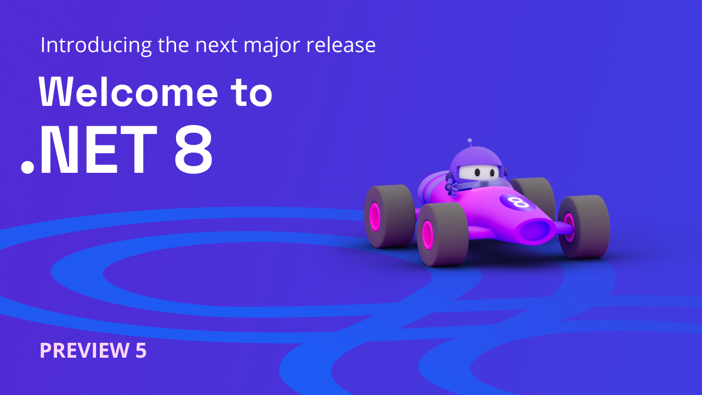

We're excited to share all the new features and improvements in [.NET 8 Preview 5](https://dotnet.microsoft.com/next)! This release is a follow-up to the [Preview 4 release](https://devblogs.microsoft.com/dotnet/announcing-dotnet-8-preview-4/). You'll continue to see many more features show up with these monthly releases. .NET 6 and 7 users will want to follow this release closely since we have focused on making it a straightforward upgrade path.

You can [download .NET 8 Preview 5](https://dotnet.microsoft.com/download/dotnet/8.0) for Linux, macOS, and Windows.

* [Installers and binaries](https://dotnet.microsoft.com/download/dotnet/8.0)
* [Container images](https://github.com/dotnet/dotnet-docker/blob/main/documentation/supported-tags.md)
* [Release notes](https://github.com/dotnet/core/tree/main/release-notes/8.0)
* [Known issues](https://github.com/dotnet/core/blob/main/release-notes/8.0/known-issues.md)
* [GitHub issue tracker](https://github.com/dotnet/core/issues)

Check out what's new in [ASP.NET Core](https://devblogs.microsoft.com/dotnet/asp-net-core-updates-in-dotnet-8-preview-5) in the Preview 5 release. Stay current with what's new and coming in [What's New in .NET 8](https://learn.microsoft.com/dotnet/core/whats-new/dotnet-8). It will be kept updated throughout the release.

Microsoft Build 2023 was a huge success in big part to .NET developers like you! The .NET team saw huge turnout for our sessions, where we talked about some of the most exciting features in .NET 8 and answered questions from attendees. [Join the .NET Team at Microsoft Build 2023!](https://devblogs.microsoft.com/dotnet/microsoft-build-2023-and-dotnet/)

Now, let's take a look at some new .NET 8 features.

[](https://dotnet.microsoft.com/next)

## SDK: Enhancements to Metrics APIs

Preview 5 brings a number of improvements and updates to metrics APIs that covers additional use cases.

### Dependency Injection (DI) Friendly metrics APIs

The team is excited to introduce the `IMeterFactory` interface, which can be registered in DI containers and used to create Meter objects in an isolated manner.

```C#
            // service is the DI IServiceCollection 
            // Register the IMeterFactory to the DI container using the default meter factory implementation. 
            services.AddMetrics();
```

Consumers can now use the code below to create a meter factory and use it to easily create a new Meter object.

```C#
            IMeterFactory meterFactory = serviceProvider.GetRequiredService<IMeterFactory>();

            MeterOptions options = new MeterOptions("MeterName")
            {
                 Version = "version",
            };

            Meter meter = meterFactory.Create(options);
```

### Enabling the creation of Meters and Instruments with Tags

Meters and Instruments [can also be created](https://github.com/dotnet/runtime/pull/86740) with attached key-value pair tags. This feature allows aggregators of published metric measurements to differentiate the aggregated values based on these tags.

```C#
            MeterOptions options = new MeterOptions("name")
            {
                Version = "version",
                
                // Attach these tags to the created meter
                Tags = new TagList() { { "MeterKey1", "MeterValue1" }, { "MeterKey2", "MeterValue2" } }
            };

            Meter meter = meterFactory.Create(options);
            
            Instrument instrument = meter.CreateCounter<int>("counter", null, null, new TagList() { { "counterKey1", "counterValue1" } });
            instrument. Add(1);
```

## SDK: Source Link is part of the .NET SDK!

The .NET SDK now includes Source Link to power-up the IDE experience when inspecting Sourcelinked NuGet Packages. The goal is that by bundling Source Link into the SDK instead of requiring a separate PackageReference, more packages will include this information by default. We believe this will create better IDE experiences for developers all-up!

Source Link is a language- and source-control agnostic system for providing first-class source debugging experiences for binaries. The goal of the project is to let anyone build [NuGet libraries to provide source debugging](https://github.com/dotnet/designs/blob/main/accepted/2020/diagnostics/debugging-with-symbols-and-sources.md) for their users with little to no extra effort. Source Link is supported by Microsoft and is enabled by libraries such as .NET Core and Roslyn.

Visual Studio and many other editors support reading Source Link information from symbols while debugging. Editors can download and display the appropriate commit-specific source for users, such as from [raw.githubusercontent](https://raw.githubusercontent.com/dotnet/roslyn/681cbc414542ffb9fb13ded613d26a88ea73a44b/src/VisualStudio/Core/Def/Implementation/ProjectSystem/AbstractProject.cs), which enables breakpoints and all other sources debugging experience on arbitrary NuGet dependencies.


The shipped implementation of Source Link includes providers for git, GitHub, GitLab, Azure Repositories, and BitBucket, but there are even more providers available on NuGet. 

You can find more information about Source Link at [the Learn docs](https://learn.microsoft.com/dotnet/standard/library-guidance/sourcelink), and read more about the available settings [the repo documentation](https://github.com/dotnet/sourcelink/blob/35c1276c489edc04b1dac541ca0483814cdd759d/docs/README.md#basic-settings).

## SDK: New .NET Libraries analyzers

[Analyzers](https://learn.microsoft.com/dotnet/fundamentals/code-analysis/overview) are like coding partners built into SDK and the Interactive Development Environment (IDE) that recognize issues and suggest corrections as you write code. Starting from .NET 8 Preview 1, our team has added several analyzers and code fixers that help developers verify correct and/or more performant usage of .NET Library APIs. We are thrilled to mention that most of these analyzers have been implemented by our community members. We would like to extend a big thank you to all our contributors for their hard work and dedication.

| Analyzer proposal and the contributor | Description | Category | Severity | Help Link |
| -- | ---------------------- | -- | -- | -- |
| [Pass constants to parameters marked as [ConstantExpected] ](https://github.com/dotnet/runtime/issues/33771) by @wzchua | CA1856 fires when the `ConstantExpected` attribute isn't applied correctly on the parameter.  CA1857 fires when a parameter is annotated with the `ConstantExpected` attribute, but the argument provided isn't a constant. A constant should be used for optimal performance. | Performance | CA1856: Error CA1857: Warning | CA1856, CA1857 |
| [Using StartsWith instead of IndexOf == 0](https://github.com/dotnet/runtime/issues/78608) by @Youssef1313 | It's more efficient and clearer to call `String.StartsWith` than to call `String.IndexOf` and compare the result with zero to determine whether a string starts with a given prefix. | Performance | Info | [CA1858](https://learn.microsoft.com/dotnet/fundamentals/code-analysis/quality-rules/ca1858) |
| [Recommend use of concrete types to maximize devirtualization potential](https://github.com/dotnet/runtime/issues/51193) by @geeknoid | This rule recommends upgrading the type of specific local variables, fields, properties, method parameters, and method return types from interface or abstract types to concrete types when possible. Using concrete types leads to higher quality generated code by minimizing virtual or interface dispatch overhead and enabling inlining. | Performance | Info | [CA1859](https://learn.microsoft.com/dotnet/fundamentals/code-analysis/quality-rules/ca1859) |
| [Prefer .Length/Count/IsEmpty over Any()](https://github.com/dotnet/runtime/issues/75933) by @CollinAlpert | It's more efficient and clearer to use Length, Count, or IsEmpty than to call `Enumerable.Any` extension method to determine whether a collection type has any elements | Performance | Info | [CA1860](https://learn.microsoft.com/dotnet/fundamentals/code-analysis/quality-rules/ca1860)
| [Extract array of const to static readonly field](https://github.com/dotnet/runtime/issues/33794) @steveberdy	| Constant arrays passed as arguments aren't reused when called repeatedly, which implies a new array is created each time. If the passed array isn't mutated within the called method, consider extracting it to a static readonly field to improve performance. | Performance | Info | [CA1861](https://learn.microsoft.com/dotnet/fundamentals/code-analysis/quality-rules/ca1861)
| [Do not use OfType() with impossible types](https://github.com/dotnet/runtime/issues/33770) by @fowl2 | `Enumerable.Cast<T>` and `Enumerable.OfType<T>` require compatible types to function expectedly. `Enumerable.Cast<T>` will throw `InvalidCastException` at runtime for elements of incompatible types. `Enumerable.OfType<T>` will never succeed with elements of incompatible types, resulting in an empty sequence. Widening and user defined conversions aren't supported with generic types. | Reliability | Warning | CA2021 |	
| [Convert argument null checks to ArgumentNullException.ThrowIfNull](https://github.com/dotnet/runtime/issues/68326) by @stephentoub | Throw helpers are simpler and more efficient than an if block constructing a new exception instance. With this analyzer four analyzers added for: `ArgumentNullException`, `ArgumentException`, `ArgumentOutOfRangeException` and `ObjectDisposedException` throw helpers| Maintainability | Info | CA1510, CA1511, CA1512, CA1513 |

 We plan to continue adding more analyzers to .NET 8 to help developers write better code and we are hoping for even more community contributions. This is a great opportunity for the community to add a new complete feature to .NET 8 SDK.

If you are interested in contributing, please check out our [list of analyzers that are ready for development](https://github.com/dotnet/runtime/issues/78442) and marked `up for grabs`.

## SDK: Linux self-contained

The Linux distribution-built (source-build) SDK can now build self-contained applications that utilizes source-build runtime packages. Distribution specific runtime package will be bundled with the source-build SDK. During self-contained deployment, this bundled runtime package will be referenced and thereby enabling the feature for the user. Please note that there are no changes for the MS-built SDK. 

Thanks to our Red Hat partners, especially [@tmds](https://github.com/tmds), for their valuable contributions towards this feature.  

## SDK: Self-contained no longer default

Since .NET 6, specifying a runtime during publish has resulted in the following warning:

```text
> warning NETSDK1179: One of '--self-contained' or '--no-self-contained' options are required when '--runtime' is used.
```

[For .NET 8, this will finally go away](https://github.com/dotnet/sdk/pull/30038). Going forward, `-r/--runtime` will no longer imply `--self-contained` for apps targeting `net8.0` and higher Target Frameworks. If you intend that behavior, you'll either need to 

- add the CLI option explicitly, or 
- add the `<SelfContained>true</SelfContained>` property to your project files
 
Apps targeting `net7.0` or lower remain unaffected. You can read more about this change in the [breaking change notice](https://learn.microsoft.com/dotnet/core/compatibility/sdk/8.0/runtimespecific-app-default) we've posted.

We're making this change because we believe that targeting specific platforms is an independent decision from bundling the runtime for that platform. Defaulting more apps to framework-dependent deployments means that the runtime the app runs on can be safely updated without requiring a rebuild or redeployment. It also results in smaller app sizes than self-contained deployments.

## Alpine ASP.NET Docker Composite Images

We are now offering a new ASP.NET Docker image that uses a newer variant of [ready-to-run (R2R)](https://devblogs.microsoft.com/dotnet/conversation-about-ready-to-run/) compilation called "composite". Composite R2R images are built by compiling multiple MSIL assemblies into a single R2R output binary. Composite images can have a combination of benefits: reduction of JIT time, reduced startup performance, and reduction of R2R image size. 

Composite images have have tighter version coupling. This means the final app run cannot use different versions of framework (such as [System.Reflection.Metadata](https://www.nuget.org/packages/System.Reflection.Metadata) and/or ASP.NET binaries than are embedded into the composite one. This limitation is why we are producing a new image flavor. It is possible that your apps won't work with composite, as currently constructed.

This new container image is new. We decided to start with a new Alpine-based variant. Alpine images are often chosen due to smaller size, which aligns with the goal of this project. We may expand support to other images types, such as our distroless images, in future

### Where can we get the composite images?

As of now, the composite images are available as preview in under the `mcr.microsoft.com/dotnet/nightly/aspnet` repo. The tags are listed with the `-composite` suffix in the [official nightly Dotnet Docker page](https://hub.docker.com/_/microsoft-dotnet-nightly-aspnet).

## Runtime host determines RID-specific assets without RID graph by default

When running an application with [Runtime (RID)](https://learn.microsoft.com/dotnet/core/rid-catalog)-specific assets, the host determines which assets are relevant for the platform on which it's running. This applies to both the application itself and the resolution logic used by [AssemblyDependencyResolver](https://learn.microsoft.com/dotnet/api/system.runtime.loader.assemblydependencyresolver). By default in .NET 8, this determination will no longer use the RID graph, but will rely on a known list of RIDs based on how the runtime itself was built.

The RID graph has proven to be costly to maintain, difficult to understand, and generally fragile. This change is part of a longer-term goal to [simplify our RID model](https://github.com/dotnet/designs/pull/260).

You can read more about this change in the [breaking change notice](https://learn.microsoft.com/dotnet/core/compatibility/deployment/8.0/rid-asset-list).

## Codegen

[Dynamic Profile Guided Optimization (PGO)](https://devblogs.microsoft.com/dotnet/conversation-about-pgo/) is now enabled by default, which means that special configuration settings are no longer needed. We anticipate performance for a broad class of applications will improve by anywhere from 5% to 500% (with 15% as a reasonable expectation), depending on the nature of the application bottlenecks. In our local benchmark suite of approximately 4600 tests, 23% improved by 20% or more.

* [Akka.Net](https://petabridge.com/blog/dotnet7-pgo-performance-improvements/)
* [Azure Active Directory Gateway](https://devblogs.microsoft.com/dotnet/azure-active-directorys-gateway-is-on-net-6-0/)
* [Microsoft Graph](https://devblogs.microsoft.com/dotnet/microsoft-graph-dotnet-6-journey/)

Customer experience with PGO in past releases has been uniformly positive. If you are new to Dynamic PGO, however, we look forward to hearing about your experiences as well (good or bad).

If necessary, you can opt out of Dynamic PGO via

`<TieredPGO>false</TieredPGO>`

in your `.csproj` or via similar settings in the runtime config or environment.

### Optimized ThreadStatic field access for GC-type

Field accesses that are marked as [`ThreadStaticLocal` are now optimized for primitive types](https://github.com/dotnet/runtime/pull/82973). With [PR#85619](https://github.com/dotnet/runtime/pull/85619), we have optimized reference type field access as well. These changes have led some really good improvements in a number of benchmarks: ([133 on windows/arm64](https://github.com/dotnet/perf-autofiling-issues/issues/17925), [23 on windows/x64](https://github.com/dotnet/perf-autofiling-issues/issues/17801), [16](https://github.com/dotnet/perf-autofiling-issues/issues/17908), [13](https://github.com/dotnet/perf-autofiling-issues/issues/17798), [11](https://github.com/dotnet/perf-autofiling-issues/issues/17855) improvements).

### Arm64

Preview 5 also brings a number of few peephole optimizations:
- With [PR#85032]( https://github.com/dotnet/runtime/pull/85032), we enabled peephole optimization to replace `str` pair with `stp`.
- With [PR#85657]( https://github.com/dotnet/runtime/pull/85657), we enabled peephole optimization of replacing pair of `ldr/str` with `ldp/stp` inside prolog.

### General optimizations

Our team has released a number of general optimizations that include: 
- x64 instructions such as `movzx`, `movsx` and `movsxd` have been optimized in [PR#85780](https://github.com/dotnet/runtime/pull/85780), which slightly improved code-gen by eliminating more redundant `mov` instructions.  
- [PR#86318](https://github.com/dotnet/runtime/pull/86318) improved constant folding for some frozen objects (non-GC objects). It reduced the size of the generated code by almost 10 times (e.g., 424 bytes to 41 byte).  

### AVX-512 
- [PR#85389](https://github.com/dotnet/runtime/pull/85389) enabled AVX-512 for block unrollings, which increases ranges where it previously used to fallback to memcpy/memset and reduced the execution time by half. 
- Various integer intrinsics are enabled for AVX512F, AVX512BW and AVX512CD, [PR#85833](https://github.com/dotnet/runtime/pull/85833). 

### Community PRs (Many thanks to JIT community contributors!)
- @SingleAccretion contributed [18 PRs](https://github.com/dotnet/runtime/pulls?q=is%3Apr+is%3Amerged+label%3Aarea-CodeGen-coreclr+closed%3A2023-04-26..2023-05-23++-milestone%3A7.0.x+author%3Asingleaccretion) in Preview 5. Much of this work was focused on internal JIT cleanup with the eventual goal of **greatly simplifying the internal representation (IR)**, in particular around the representation of **assignments/stores**. 
  - [PR#85180](https://github.com/dotnet/runtime/pull/85180) marked the start of this work and in a future preview it will result in the JIT being several percent faster when compiling user functions.
- @yesmey enabled unrolling StringBuilder.Append for const string that unblocks more AVX-512 usages. It improved the execution time of System.Tests.Perf_Enum benchmarks up to 8 % and StringBuilder up to 16%, [PR#85894](https://github.com/dotnet/runtime/pull/85894). 
- @MichalPetryka submitted [PR#85398]( https://github.com/dotnet/runtime/pull/85398) that improved the JIT’s ability to reason about single-defined variables early-on, and [PR#85349](https://github.com/dotnet/runtime/pull/85349) that improved the JIT’s codegen for calls to function pointers without arguments.

## Improve your productivity in VS Code with the C# Dev Kit extension!
The C# Dev Kit extension in VS Code is now available for public preview in VS Code! We'd appreciate your feedback using C# Dev Kit with .NET 8.

It is designed to improve your C# productivity in VS Code, C# Dev Kit helps you manage your code with a solution explorer, write code faster with AI-assisted suggestions and completions, and gives you new capabilities to run and debug tests in the Test Explorer. Using a Roslyn-powered language service, C# Dev Kit also greatly improves performance of C# language features such as code navigation, refactoring, IntelliSense, and more.

To get started with C# Dev Kit, check out our [recent announcement blog post](https://devblogs.microsoft.com/visualstudio/announcing-csharp-dev-kit-for-visual-studio-code/).

## Community spotlight

[DoctorKrolic](https://github.com/doctorkrolic)
> I am a .NET back-end developer with a strong passion for code analysis applications. Love building both robust back-end services and C# productivity tools! In my free time, I enjoy contributing to open-source projects and keeping up with the latest industry trends to continuously improve my skills and knowledge.


Do you know somebody who is contributing to .NET that we should feature in future posts? Nominate them at [https://aka.ms/net8contributor](https://aka.ms/net8contributor).

## Summary

.NET 8 Preview 5 contains exciting new features and improvements that were made possible with the hard work and dedication of a diverse team of engineers at Microsoft as well as a passionate open-source community. We want to extend our [sincere thanks to everyone who has contributed to .NET 8 so far](https://dotnet.microsoft.com/thanks), whether it was through code contributions, bug reports, or providing feedback.

Your contributions have been instrumental in the making .NET 8 Previews, and we look forward to continuing to work together to build a brighter future for .NET and the entire technology community.

Curious about what is coming? [Go see for yourself what's next in .NET!](https://dotnet.microsoft.com/next)
