---
post_title:  'The Microsoft Teams Global Hack - Week 1 Recap and What’s Coming'
author1: aycabas
post_slug: hacktogether-recap-week1
username: aycabas
microsoft_alias: aycabas
featured_image: blood-sugar-demo.png
categories: .NET, .NET Core, .NET Framework, ASP.NET Core, Blazor, C#, Cloud
tags: .NET, .NET Core, .NET Framework, Announcement, ASP.NET Core, Blazor, C#, Cloud
summary: Last week we launched HackTogether the Microsoft Teams Global Hack – a virtual hackathon all about building apps for Microsoft Teams. Here’s what happened last week and what’s still to come.
post_date: 2023-06-12 10:00:00
--- 

Week 1 of HackTogether: the Microsoft Teams Global Hack – the hackathon where we build apps for Microsoft Teams – is almost over. Here’s what happened and what’s coming.

## What happened in week 1 of the Microsoft Teams Global Hack? 

Following our initial keynote, we started this week with a series of live sessions to show you the different types of apps for Microsoft Teams and how to get started building them. 

### June 5, 2023 | Introduction to Teams Tabs and building them with SharePoint Framework

The first session was an introduction to Teams Tabs, which are web UI-based apps exposed inside Microsoft Teams.

Olivia Guzzardo (Cloud Developer Advocate for Visual Studio Code) and Ayça Bas showed how you can use Teams Toolkit for Visual Studio Code to build your first Teams Tab. Olivia also demonstrated a cool trick, how you can use GitHub Codespaces to have an instantaneous dev environment in the cloud. 

 [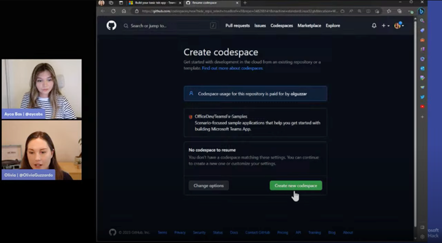](https://aka.ms/hack-together/session2)

In the following segment, Vesa Juvonen (Principal Product Manager Microsoft 365 platform) introduced us to SharePoint Framework – a Microsoft 365-hosted model for building apps for Microsoft Teams, Outlook, Microsoft 365 app, Microsoft Viva and SharePoint. 

 [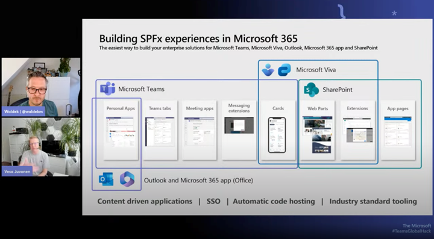](https://aka.ms/hack-together/session2)

Vesa showed us how to create a SharePoint Framework-based Teams app using Teams Toolkit, how to ensure that it’s exposed in Microsoft Teams, Outlook and the Microsoft 365 app. To illustrate what’s possible, Vesa demonstrated a line of business application integrated with custom APIs secured with Azure Active Directory.

 [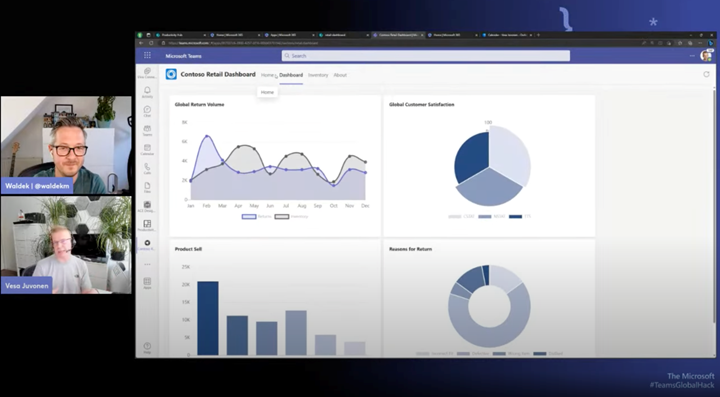](https://aka.ms/hack-together/session2)

[🎥 Watch the session on demand](https://aka.ms/hack-together-teams/session2)

### June 6, 2023 | Introduction to Teams bots and integrating AI into your bot logic 

In this session we explored bots - another type of app for Microsoft Teams and saw how we can infuse them with AI. 

Scott Hanselman (Partner Program Manager Developer Division) and David Rousset (Principal Product Manager Teams Toolkit) started the presentation by introducing Microsoft Teams bots and how you can build them using .NET and Visual Studio. Then, Scott and David showed us how to build a bot connected to Scott’s blood sugar monitor to send rich notifications including a chart using Adaptive Cards to Microsoft Teams. 

 [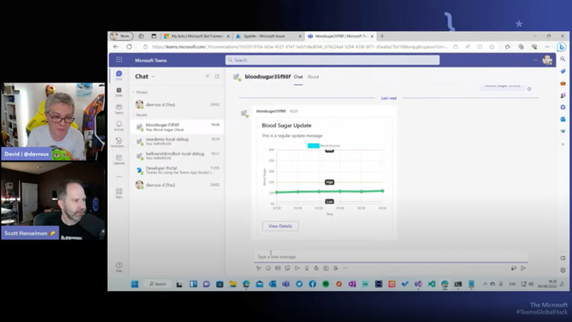](https://aka.ms/hack-together/session3)  

In the next segment, Sid Uppal (Group Engineering Manager Teams AI library) and Joey Glocke (PM Manager Teams AI library) introduced the Teams AI Library – a game changing SDK for building intelligent bots. They showed us how the new features significantly simplify understanding people’s intent making the interaction more natural.

 [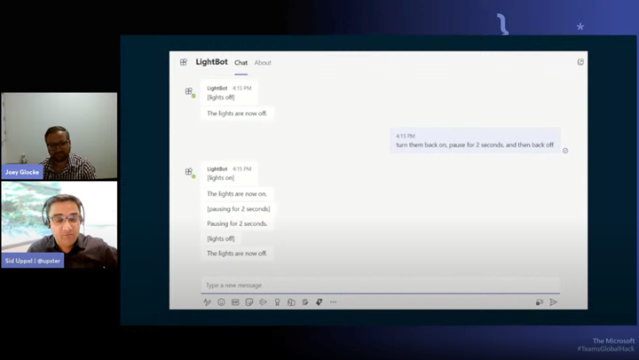](https://aka.ms/hack-together/session3)

Closing the segment, Ayça Baş (Microsoft 365 Developer Advocate) walked us through the demo of how to extend a Teams bot with the Teams AI Library.

 [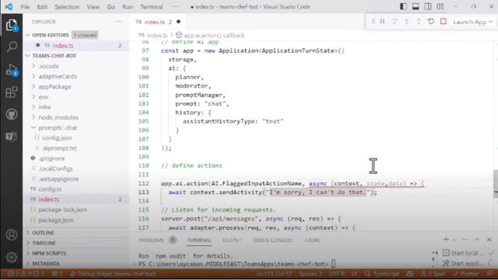](https://aka.ms/hack-together/session3)

[🎥 Watch the session on demand](https://aka.ms/hack-together-teams/session3)

### June 7, 2023 | Introduction to message extensions and make your app intelligent using Microsoft Graph

In this session, we looked at one of the most engaging types of apps for Microsoft Teams – message extensions. We also showed how you can tap into data and insights stored on Microsoft 365 using the Microsoft Graph API.

Tomomi and Sai opened the session showing us what message extensions are and how to use them. We learned that you could use them not only in Microsoft Teams but also in Outlook and soon as the way to build plugins for Microsoft 365 Copilot! 

  [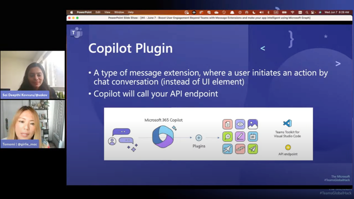](https://aka.ms/hack-together/session4)

Next, Sébastien and Maísa introduced us to Microsoft Graph – the API to access data and insights to Microsoft 365. We’ve learned not only what different data is available but also how to access it. We’ve also seen how we can use Microsoft Graph Toolkit – the collection of reusable components to easily build applications connected to Microsoft 365. 

  [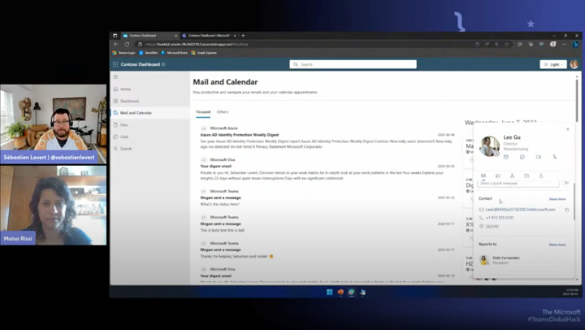](https://aka.ms/hack-together/session4) 

[🎥 Watch the session on demand](https://aka.ms/hack-together-teams/session4)

## What’s next

The first week of the hackathon was exciting with a lot of great energy from all of you. We’re thrilled to hear about all your ideas and can’t wait to see your hacks. For the next week, we’ve got a few more live sessions planned for you and would love you to join us. 

### June 12, 2023, 4PM GMT | Ask the experts: Meet our Engineering Team and Ask Your Pressing Questions!

[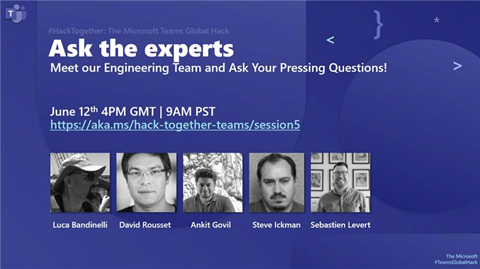](https://aka.ms/hack-together/session5)

On Monday, June 12, we’re bringing together experts from the different product groups at Microsoft to answer all your questions about building apps for Microsoft Teams. We have an awesome line-up so be sure to join us. This is a unique opportunity for you to meet the people who build and manage the Microsoft Teams- and Microsoft 365 platform and tooling. 

[📺 Join us live](https://aka.ms/hack-together-teams/session5)

## June 15, 2023, 4PM GMT | Wrap Up and Take Action: Join Our Community for the Next Big Thing!

[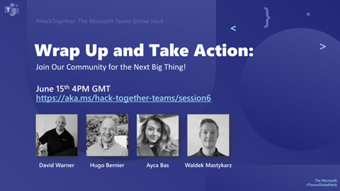](https://aka.ms/hack-together/session6)

As the hackathon ends, your journey doesn’t have to. Meet our community members to learn their stories, how they joined the community, learned from others and share their knowledge to give it back. In this session, you’ll meet Microsoft community leads and Microsoft MVPs. Don’t miss this opportunity to learn about our community and what we’ve got to offer! 

[📺 Join us live](https://aka.ms/hack-together-teams/session6)

## Let’s hack together

We hope that you have a great time hacking on apps for Microsoft Teams. If you haven’t started yet, it’s not too late to join! Build an app for Teams, [submit it](https://aka.ms/htt), and win prizes! And don’t forget to register so that we know where to send the prize to! 😁 

[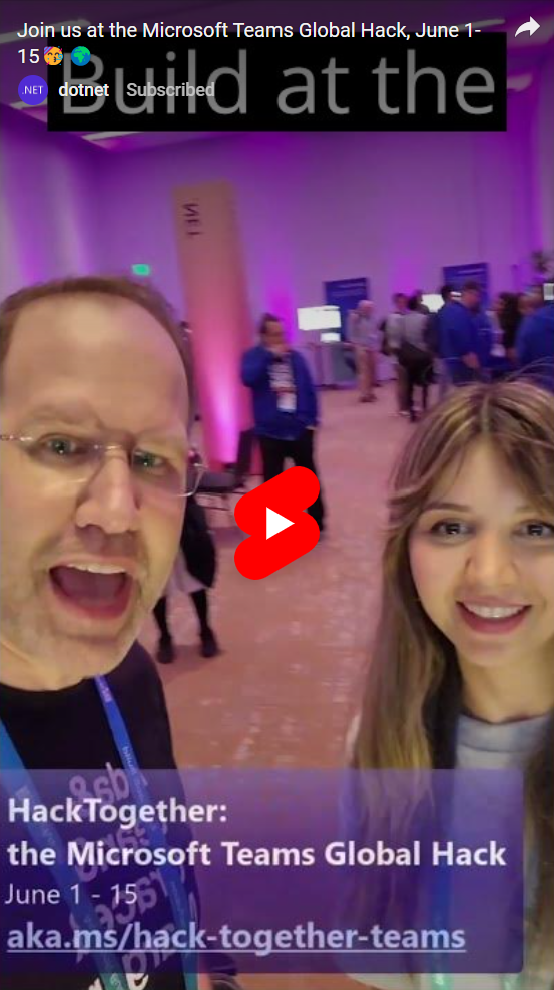](https://www.youtube.com/shorts/wJMntvbb7Xk)