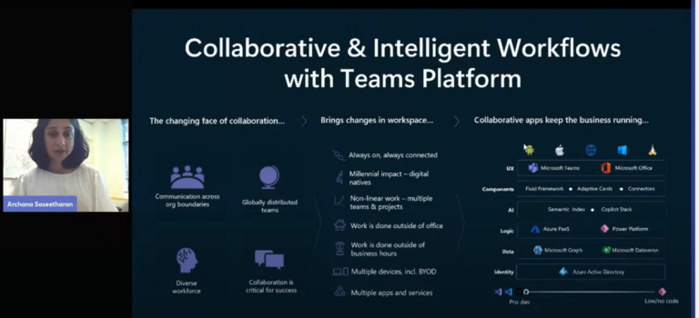
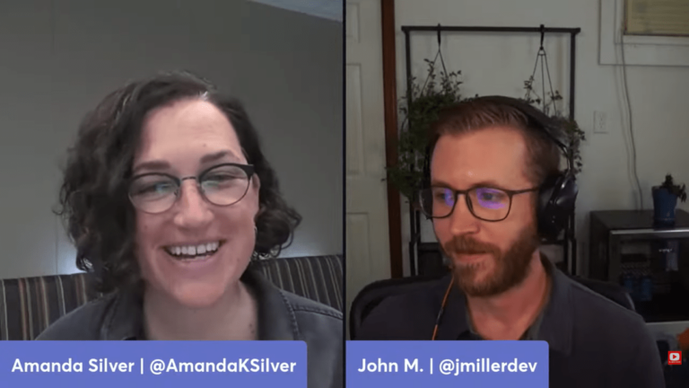
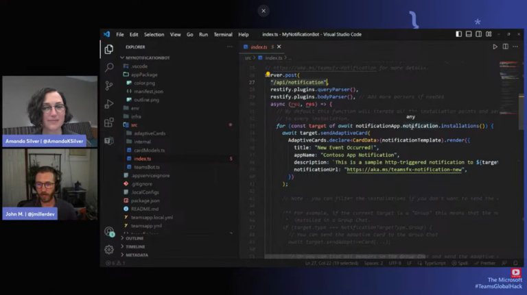
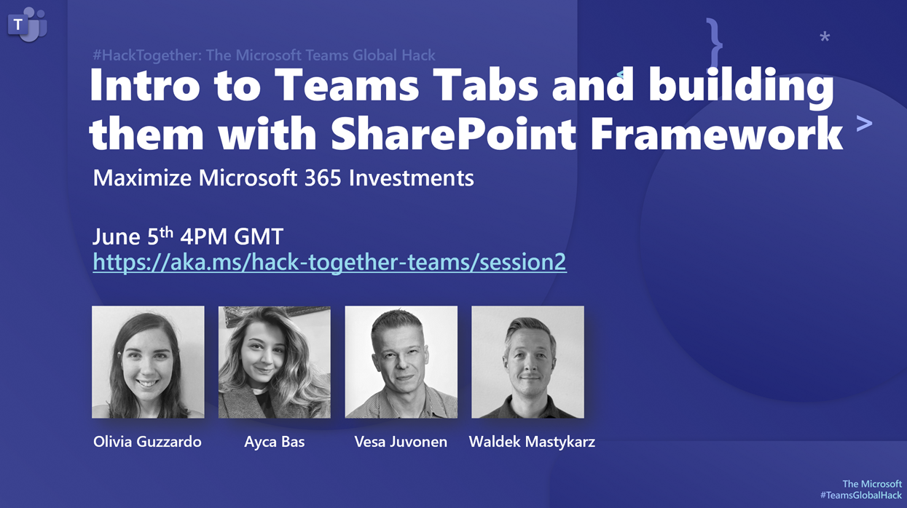
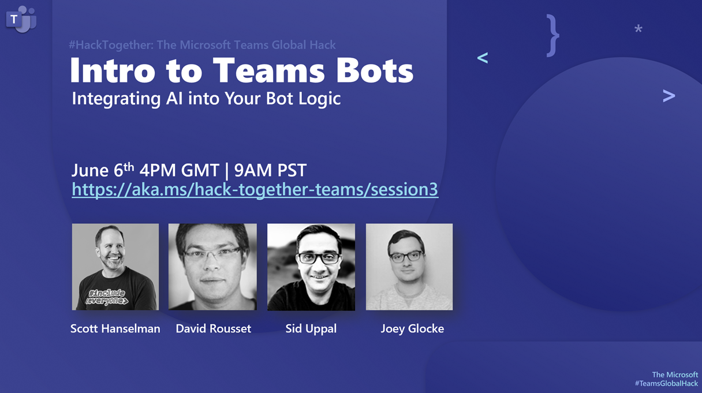
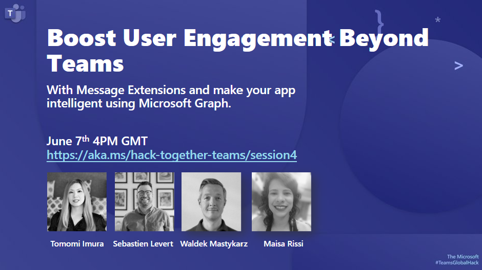

Last week we launched [HackTogether: the Microsoft Teams Global Hack](https://aka.ms/hack-together-teams) – a virtual hackathon all about building apps for Microsoft Teams. Here’s what happened last week and what’s still to come.

## What happened in week 0 of the Microsoft Teams Global Hack?

Last week, we kicked off the virtual hackathon with a keynote by Archana Saseetharan (Group Program Manager Teams Platform), Amanda Silver (CVP of Developer Division) and John Miller (Teams Toolkit Product Manager).

Archana walked us through Microsoft 365 and Teams Platform opportunities for developers and shared a recap of latest announcements from Microsoft Build 2023, particularly Microsoft 365 Copilot extensibility and the Teams AI library.

 

Later in the session, Amanda and John talked about developer experiences for Microsoft Teams and introduced Teams Toolkit, a set of developer tools for creating apps using Teams Platform that includes project templates, automation, and resources to accelerate your app development for tabs, bots, messaging extensions, and more.

 

John also showed how to get started building Teams apps using Teams Toolkit for Visual Studio Code live!

 

[📺 Watch the hackathon keynote on demand](https://aka.ms/hack-together/session1)

## What’s on deck this week?

In this second week of the Microsoft Teams Global Hack, we have series of sessions to introduce tabs, bots and message extensions along with exciting capabilities such as SharePoint Framework, Teams AI library and Microsoft Graph. These are sessions to dive deeper into the Teams app capabilities and get to know the product teams along the way.

### June 5, 2023, 4:00PM GMT | Introduction to Teams Tabs and building them with SharePoint Framework

Join live/Watch on-demand: https://aka.ms/hack-together-teams/session2

#### What’s this session about?

In this session, you’ll learn all about Teams tabs and how to get started building them from scratch using Teams Toolkit. You’ll also discover SharePoint Framework and kick start building Teams tabs with SharePoint Framework.

#### Speakers

* Olivia Guzzardo – Cloud Developer Advocate for Visual Studio Code
* Vesa Juvonen – Product Manager SharePoint Framework
* Ayca Bas – Cloud Developer Advocate for Microsoft 365
* Waldek Mastykarz – Cloud Developer Advocate for Microsoft 365

### June 6, 2023, 4:00PM GMT | Introduction to Teams bots and integrating AI into your bot logic

Join live/Watch on-demand: https://aka.ms/hack-together-teams/session3

#### What’s this session about?

In this session, you’ll learn all about Teams bots and how to get started building them from scratch using Teams Toolkit. You’ll also discover the new Teams AI library and learn how to integrate Teams AI library into your bots.

#### Speakers

* Scott Hanselman – Partner Program Manager Developer Division
* David Rousset – Product Manager Teams Toolkit
* Sid Uppal – Group Engineering Manager Teams AI library
* Joey Glocke – PM Manager Teams AI library

### June 7, 2023, 4:00PM GMT | Introduction to message extensions and make your app intelligent using Microsoft Graph

Join live/Watch on-demand: https://aka.ms/hack-together-teams/session4

#### What’s this session about?

In this session, you’ll learn all about Teams Message Extensions and how to get started building them from scratch using Teams Toolkit. You’ll also discover how to make your app intelligent using Microsoft Graph.

#### Speakers

* Tomomi Imura – Cloud Developer Advocate for Microsoft 365
* Sebastien Levert – Product Manager for Microsoft Graph
* Waldek Mastykarz – Cloud Developer Advocate for Microsoft 365
* Maisa Rissi – Product Manager for Microsoft Graph

## Final word
Although we started last week, it’s still not too late to join us. Head to https://aka.ms/hack-together-teams to learn more about the hackathon and register for a chance to win exciting prizes! We’re looking forward to seeing what you’ll build! 🥳

