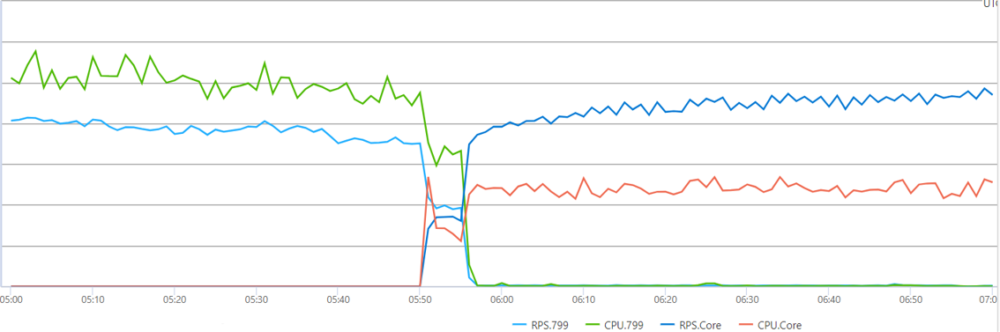

Microsoft Forms is a product for creating surveys and quizzes. It’s widely used in Microsoft365 Business subscribers. Many Microsoft365 Education subscribers use quizzes to do class tests and homework.

<iframe width="752" height="423" src="https://www.youtube.com/embed/RGoclZxokJk" frameborder="0" allowfullscreen>
</iframe>

The Forms backend service has several micro services, which handle various workloads (e.g. serving static & dynamic web content, providing REST APIs for Forms web client & integration parties to consume, etc.). These micro services are built up on .NET (predominantly, ASP.NET WebForm/WebAPI on .NET Framework 4.7.2).

In 2022, we migrated the frontend REST API service to .NET 6, gained near 200% increase in CPU efficiency, and more importantly, refreshed team members’ skillset (e.g. SDK style project file & multi-targeting, ASP.NET Core app development, especially middleware & filters pipeline). Earlier this year, we completed the .NET 6 migration of the backend service, which handles CRUD REST APIs to access data in SQL Azure databases.

## Our approach

We prepared for the migration over a couple years in two stages. We started with targeting `netstandard2.0` or multi-targeting both `net472` & `net6`.

- **First stage**: most references to HttpContext (and System.Web namespace) were removed.
- **Second stage**: most dependencies were upgraded or replaced to allow .NET Core app to consume, and most projects targeted `netstandard2.0` or multi-targeted `net472` & `net6`.

When we finally started migrating the web apps, we found that because of the work spent in stage 1 and 2, little effort was required to remove incompatibilities.

We did, however, need to spend time on the configuration code in the web apps. Previously, configuration data was accessed in an ad-hoc way. Wherever a piece of configuration info was needed, code was written to retrieve it in some way. We took .NET 6 migration as a chance to apply the [options pattern](https://learn.microsoft.com/dotnet/core/extensions/options). Now all code structs access configuration data with injected IOptions<> or IOptionsMonitor<>. We found that in this way code readability & maintainability are improved, and it became quite obvious which configuration data a component consumes.

As time went by, we found that it became more and more problematic to target `netstandard2.0` or to multi-target.

- More and more dependencies removed `net472`, even .NET Framework build, so we had to stick to old versions or add Condition attributes here and there, in project files.
  - And Condition attribute only works for multi-targeting, so we needed to turn more and more `netstandard2.0` to multi-targeting.
  - Sticking to old version doesn’t always work, since old version starts to have bugs that only show up in .NET Core workload. And newer versions even start to be incompatible (at compile time) to old ones.
- Targeting `netstandard2.0` means many .NET Core-only dependencies can’t be used, typically those with better performance & cost.
- Even for multi-targeting projects, conditional compilation is more and more needed here and there, for different perf/cost characteristics of the 2 runtimes. For example, using interpolated string as log content is a bad pattern for `net472`, since that creates a string unconditionally, but for .NET Core, as long as the log method has an overload which accepts interpolated string handler, using interpolated string as log content is the most efficient and expressive way.
- Multi-targeting increases compile time. As we still need `net472` build to run legacy apps, the .NET team suggested to avoid targeting `netstandard2.0` and do multi-targeting more often.
- The progressive migration also brought us another problem – incompatibility in Authentication. To keep existing ASP.NET apps untouched, we chose to migrate quite a lot of OWIN and ASP.NET code to build a compatible authentication stack.

## The results

We migrated several ASP.NET apps to ASP.NET Core, and we found that CPU efficiency (we use RPS/CPU, i.e. RPS per CPU percentage as indicator) improved the most post-migration. We think most improvement was due to updating the hosting model from IIS to Kestrel. We think that’s why the simpler the app, the more CPU efficiency improved. For example, the migration of 2 pretty simple web apps both gave over 400% improvement in CPU efficiency, while the relatively complex backend app, which accesses DB got 100+% improvement (still very prominent, of course).

Another prominent change was the number of threads. We set the minimum worker thread count to 400 for both processes. Previously, the ASP.NET web app pushed it to 400+ in several hours (even quicker sometimes) after startup. Now, the ASP.NET Core app uses 60-80 threads during the entire lifetime.

### Frontend service CPU usage

The improvements to CPU usage have been significant. In the following chart, the red line represents a service that was upgraded to .NET 6. The blue line represents a service that has remained on .NET Framework. You can see the point where the .NET 6 upgrade occurred and the improvement we delivered.

### Frontend service P75 latency of a key API

### Backend net472/net6 service CPU efficiency comparison

Here, you can clearly see the significant CPU efficiency improvements that result from switching from IIS+ASP.NET (light blue line for RPS, green line for process CPU) to the .NET 6 process (blue line for RPS, orange line for process CPU).

In conclusion, you can see prominent CPU efficiency improvement in both frontend and backend, request latency and working set improvements are not as prominent, but also exciting. With these improvements, we have cut down 30+% of our cloud service computation cost.

Most importantly, the team has built new skills upon the modern .NET technology stack. Every team member is happy and excited about that and eagerly pursuing opportunities to take advantage of the new platform, to write more efficient code, and to design and build more attractive features. And now, we’re starting to consider .NET 8!
