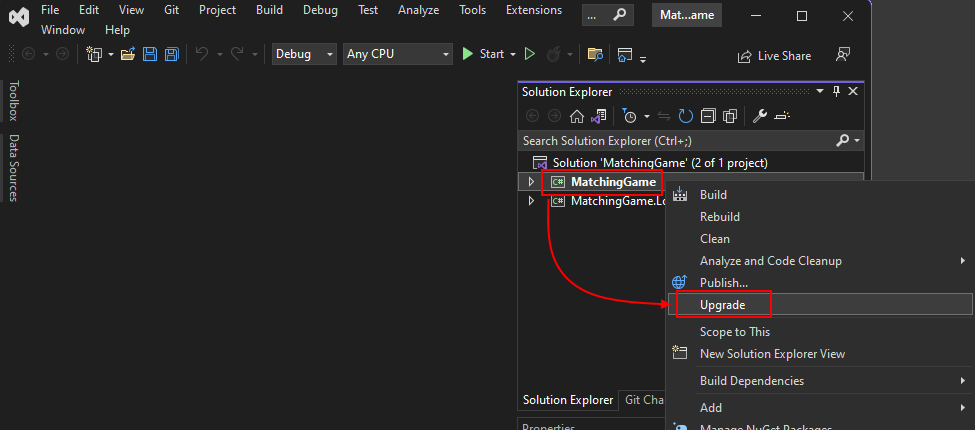

We are happy to announce that we've released a new version of the [Upgrade Assistant CLI tool](https://learn.microsoft.com/dotnet/core/porting/upgrade-assistant-overview#upgrade-with-the-cli-tool)! Now you can port your applications from either Visual Studio or your command line and benefit from all the latest features and improvements of .NET!

The .NET Upgrade Assistant is a tool that helps you upgrade your application to the latest .NET and migrate from older platforms such as Xamarin Forms and UWP to newer offerings. The same functionality is available from both the Visual Studio and command line experiences.

## CLI Experience

We have just updated the [.NET Upgrade Assistant CLI tool](https://learn.microsoft.com/dotnet/core/porting/upgrade-assistant-install#install-the-net-global-tool) with a new engine used in the Visual Studio extension of Upgrade Assistant. Now you can port any type of app and leverage the power of AI in your upgrading journey.

[video src="https://devblogs.microsoft.com/dotnet/wp-content/uploads/sites/10/2023/05/upgrade-assistant-cli.mp4"]

To install this global .NET tool, use the following command:

```console
    dotnet tool install -g upgrade-assistant
```

To update this tool to the latest available version, call:

```console
    dotnet tool update -g upgrade-assistant
```

Now as the tool is installed, you can use it to port your applications. Navigate to the directory that contains the project you want to upgrade and call the command:

```console
    upgrade-assistant upgrade
```

The CLI tool provides an interactive way of choosing which project to upgrade and which version of .NET to target. Use the arrow keys to select an item and press `Enter` to run the item.

For more details, refer to our documentation:
* [Installing the CLI tool](https://learn.microsoft.com/dotnet/core/porting/upgrade-assistant-install#install-the-net-global-tool)

* [Using the CLI tool](https://learn.microsoft.com/dotnet/core/porting/upgrade-assistant-overview#upgrade-with-the-cli-tool)

## Visual Studio experience

If you have read my previous blogs, [Upgrading your .NET projects with Visual Studio](https://devblogs.microsoft.com/dotnet/upgrade-assistant-now-in-visual-studio/) and [Announcing a new version of the .NET Upgrade Assistant with support for .NET MAUI and Azure Functions!](https://devblogs.microsoft.com/dotnet/upgrade-assistant-general-availability/), you might be familiar with the Visual Studio extension for this tool. Once you [install it](https://learn.microsoft.com/dotnet/core/porting/upgrade-assistant-install#install-the-visual-studio-extension), you can upgrade your projects by right-clicking on the project in the **Solution Explorer** window, and selecting **Upgrade**.



For more details, refer to our documentation:

* [Installing the Visual Studio tool](https://learn.microsoft.com/dotnet/core/porting/upgrade-assistant-install)

* [Using the Visual Studio tool](https://learn.microsoft.com/dotnet/core/porting/upgrade-assistant-overview#upgrade-with-the-cli-tool)

## Give us feedback

Please give us your feedback so we can build the right tools for you! Fill out this [brief survey](https://www.surveymonkey.com/r/CX67DS8).

You can also [file issues or feature requests from Visual Studio](https://learn.microsoft.com/visualstudio/ide/suggest-a-feature) by choosing **Help** | **Send Feedback**. Make sure to mention "Upgrade Assistant vsix" in the title.

## Related links

- [.NET Upgrade Assistant website](https://dotnet.microsoft.com/platform/upgrade-assistant)
- [Documentation](https://learn.microsoft.com/dotnet/core/porting/upgrade-assistant-overview)
- [Video on how to use Visual Studio extension](https://youtu.be/3mPb4KAbz4Y)
- [Video series on Upgrade Assistant and ASP.NET](https://www.youtube.com/playlist?list=PLdo4fOcmZ0oWiK8r9OkJM3MUUL7_bOT9z)
