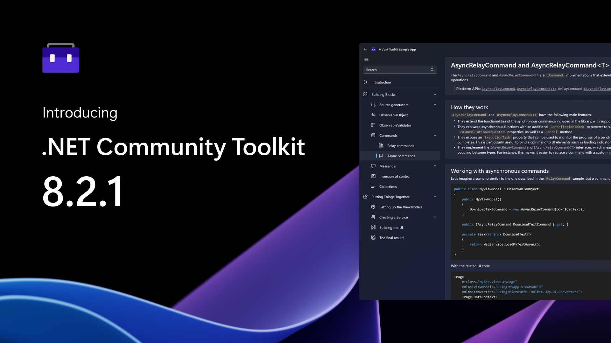
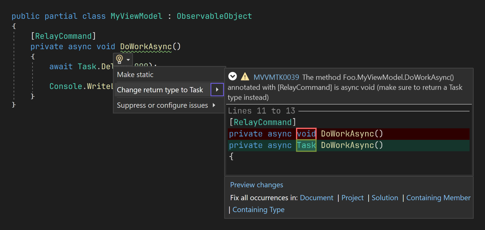

We're happy to announce the official launch of the 8.2.1 release of the .NET Community Toolkit! This new version includes lots of QoL improvements across all libraries, some more performance optimizations to the MVVM Toolkit source generators, new code fixers and improved diagnostics, and more!

We want to give a special thank you to all community members that provided valuable feedbacks to help prioritize work items for this new release. Your contributions and bug reports keep helping us making the .NET Community Toolkit even better with each release — you're the best! 🙌

## What's in the .NET Community Toolkit? 👀

The .NET Community Toolkit includes the following libraries:

- `CommunityToolkit.Common`
- `CommunityToolkit.Mvvm` (aka "Microsoft MVVM Toolkit")
- `CommunityToolkit.Diagnostics`
- `CommunityToolkit.HighPerformance`

> For more details on the history of the .NET Community Toolkit, [here is a link to our previous 8.0.0 announcement post](https://devblogs.microsoft.com/dotnet/announcing-the-dotnet-community-toolkit-800/).

Here is a breakdown of the main changes that are included in this new 8.2.1 release of the .NET Community Toolkit. This release is mostly focused on incremental improvements: there's no new features, but lots of tweaks and fixes!

## New analyzer and code fixer for `[RelayCommand]` 🤖

The `[RelayCommand]` attribute (see docs [here](https://learn.microsoft.com/dotnet/communitytoolkit/mvvm/generators/relaycommand)) can automatically handle asynchronous methods, and it will use the `IAsyncRelayCommand` interfaces in that case (along with the corresponding async command type). This feature was not easily discoverable by developers though, and many would instead just make their command methods `async void`. This also meant that they could not leverage all the additional functionality provided by async commands (such as progress reporting and concurrency control).

To help with this, the 8.2.1 version of the MVVM Toolkit ships with a brand new analyzer, which will emit a diagnostic for `async void` methods annotated with `[RelayCommand]`. And to make things even simpler to use, there's also a new code fixer that will automatically refactor the code for you — just click on the lightbulb icon and let Roslyn do the work for you! 🎉

Here you can see the new generated diagnostic showing up for an `async void` method associated with a command, and its corresponding code fixer UI in Visual Studio featuring a preview of the change. It will also automatically add the necessary `using` statement at the top of your file, in case `Task` is not in scope already. And just like with other code fixers in the MVVM Toolkit, you can also easily apply it to all locations in your entire project or solution, with a single click!

## Other changes and improvements 🚀

- **Fix an AV when indexing a sliced `Memory2D<T>` instance** ([#675](https://github.com/CommunityToolkit/dotnet/pull/675)): in some cases, an access violation could be triggered when indexing elements after slicing a `Memory2D<T>` instance. That is now fixed, thank you [mahalex](https://github.com/mahalex) for reporting this!
- **Fix forwarding attributes with negative enum values** ([#681](https://github.com/CommunityToolkit/dotnet/pull/682)): using enum members with negative values will no longer cause issues with the MVVM Toolkit generators for generated observable properties. Thank you [n-coelho-cerinnov](https://github.com/n-coelho-cerinnov) for reporting this!
- **Fix a generator crash when forwarding invalid attributes** ([#683](https://github.com/CommunityToolkit/dotnet/pull/684)): trying to forward attributes that are not referenced correctly will now fail gracefully and produce an easy to understand error message.
- **Fix `ObservableValidator` generator to detect inherited properties** ([#616](https://github.com/CommunityToolkit/dotnet/pull/692)): the generator to validate properties will no longer accidentally ignore properties from base types for the target viewmodel. Thank you [dgellow](https://github.com/dgellow) for reporting this!
- **Add warning when using packages.config for MVVM Toolkit** ([#695](https://github.com/CommunityToolkit/dotnet/pull/698)): the MVVM Toolkit generators only work when using `<PackageReference>` (it's a known limitation of the SDK and it's by design), but there was previously no clear indication as to why the generators were not running for users trying to use them from a project using `packages.config`. The MVVM Toolkit now ships with improved diagnostics that will produce a useful warning message in that scenario. Thank you [smaugbend](https://github.com/smaugbend) for reporting this!
- **Check for cancellation more often in generators** ([#703](https://github.com/CommunityToolkit/dotnet/pull/704)): this should result in small improvements in the IDE responsiveness when using the MVVM Toolkit.
- **Remove unnecessary temporary array allocation** ([#719](https://github.com/CommunityToolkit/dotnet/pull/719)): another small memory optimizations to the MVVM Toolkit source generators.
- **Handle `[ObservableProperty]` fields with keyword identifiers** ([#710](https://github.com/CommunityToolkit/dotnet/pull/720)): the generator will no longer produce invalid code in case fields annotated with `[ObservableProperty]` are using keyword identifiers that have been escaped in source (eg. `@event`). Thank you [Get0457](https://github.com/Get0457) for reporting this!

> Note: there is a known issue with source generators in older versions of Roslyn that might cause IntelliSense to sometimes not work correctly for generated members (see [#493](https://github.com/CommunityToolkit/dotnet/issues/493), and related [Roslyn tracking issue](https://github.com/dotnet/roslyn/issues/67123)). This has finally been fixed in VS 2022 17.7, which is currently in preview. If you're seeing any issues using the MVVM Toolkit, make sure to try out the latest VS 17.7 Preview!

## Other changes ⚙️

You can see the full changelog for this release from the [GitHub release page](https://github.com/CommunityToolkit/dotnet/releases/tag/v8.2.1).

## Get started today! 🎉

You can find all source code in our [GitHub repo](https://aka.ms/toolkit/dotnet/), some handwritten docs on [MS learn](https://aka.ms/toolkit/docs/), and complete API references in the .NET API browser website. If you would like to contribute, feel free to open issues or to reach out to let us know about your experience! To follow the conversation on Twitter, use the #CommunityToolkit hashtag. All your feedbacks greatly help in shape the direction of these libraries, so make sure to share them!

Happy coding! 💻