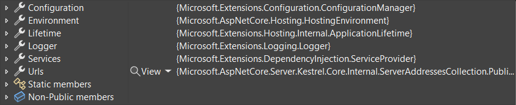
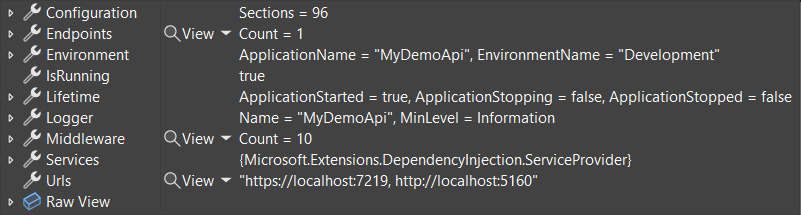
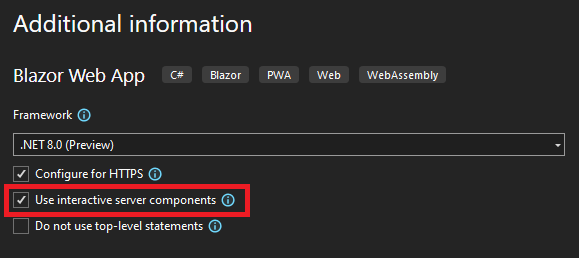

[.NET 8 Preview 6 is now available](https://devblogs.microsoft.com/dotnet/announcing-dotnet-8-preview-6) and includes many great new improvements to ASP.NET Core.

Here's a summary of what's new in this preview release:

- Improved startup debugging experience
- [Blazor](#blazor)
    - Form model binding & validation with server-side rendering
    - Enhanced page navigation & form handling
    - Preserve existing DOM elements with streaming rendering
    - Specify component render mode at the call site
    - Interactive rendering with Blazor WebAssembly
    - Sections improvements
    - Cascade query string values to Blazor components
    - Blazor Web App template option for enabling server interactivity
    - Blazor template consolidation
- [Metrics](#metrics)
    - Testing metrics in ASP.NET Core apps
    - New, improved, and renamed counters
- [API authoring](#api-authoring)
    - Complex form binding support in minimal APIs
- [Servers & middleware](#servers)
    - HTTP.sys kernel response buffering
    - Redis-based output-cache

For more details on the ASP.NET Core work planned for .NET 8 see the full [ASP.NET Core roadmap for .NET 8](https://aka.ms/aspnet/roadmap) on GitHub.

## Get started

To get started with ASP.NET Core in .NET 8 Preview 6, [install the .NET 8 SDK](https://dotnet.microsoft.com/next).

If you're on Windows using Visual Studio, we recommend installing the latest [Visual Studio 2022 preview](https://visualstudio.com/preview). If you're using Visual Studio Code, you can try out the new [C# Dev Kit](https://devblogs.microsoft.com/visualstudio/announcing-csharp-dev-kit-for-visual-studio-code/). Visual Studio for Mac support for .NET 8 previews isn’t available at this time.

## Upgrade an existing project

To upgrade an existing ASP.NET Core app from .NET 8 Preview 5 to .NET 8 Preview 6:

- Update the target framework of your app to `net8.0`.
- Update all Microsoft.AspNetCore.\* package references to `8.0.0-preview.6.*`.
- Update all Microsoft.Extensions.\* package references to `8.0.0-preview.6.*`.

See also the full list of [breaking changes](https://docs.microsoft.com/dotnet/core/compatibility/8.0#aspnet-core) in ASP.NET Core for .NET 8.

## Improved startup debugging experience

Last preview we introduced [debugging improvements to `HttpContext` and friends](https://devblogs.microsoft.com/dotnet/asp-net-core-updates-in-dotnet-8-preview-5/#improved-asp-net-core-debugging-experience). In .NET 8 Preview 6 we've improved the debugging experience for the `WebApplication` type.

`WebApplication` is the default way to configure and start ASP.NET Core apps in `Program.cs`. [Debug customization attributes](https://learn.microsoft.com/visualstudio/debugger/using-the-debuggerdisplay-attribute) have been applied to `WebApplication` to highlight important information, such as configured endpoints, middleware, and `IConfiguration` values in your IDE's debugger.

**.NET 7**



**.NET 8**



See the [ASP.NET Core ❤️ Debugging](https://github.com/dotnet/aspnetcore/issues/48205) GitHub issue for more information about debugging improvements in .NET 8.

<a id="blazor"></a>

## Blazor

### Form model binding & validation with server-side rendering

Blazor's new server-side rendering mode can now model bind and validate HTTP form post values.

To bind data from a form request, apply the `[SupplyParameterFromForm]` attribute to a component property. Data in the request that matches the name of the property will be bound to the property. The property can be a primitive type, complex type, collection, or dictionary. Server-side validation using data annotations is also supported as well.

*Movie.cs*

```csharp
public class Movie
{
    public int Id { get; set; }
    public string? Title { get; set; }
    public DateOnly? ReleaseDate { get; set; }
    public string? Genre { get; set; }
    public decimal Price { get; set; }
}
```

*Pages/Movies/Create.razor*

```razor
@page "/movies/create"
@inject BlazorMovieContext DB

<PageTitle>Create</PageTitle>

<h1>Create</h1>

<h4>Movie</h4>
<hr />
<div class="row">
    <div class="col-md-4">
        <EditForm method="post" Model="Movie" OnValidSubmit="AddMovie">
            <DataAnnotationsValidator />
            <ValidationSummary class="text-danger" />
            <div class="mb-3">
                <label for="title" class="form-label">Title:</label>
                <InputText id="title" @bind-Value="Movie.Title" class="form-control" />
                <ValidationMessage For="() => Movie.Title" class="text-danger" />
            </div>
            <div class="mb-3">
                <label for="release-date" class="form-label">Release date:</label>
                <InputDate id="release-date" @bind-Value="Movie.ReleaseDate" class="form-control" />
                <ValidationMessage For="() => Movie.ReleaseDate" class="text-danger" />
            </div>
            <div class="mb-3">
                <label for="genre" class="form-label">Genre:</label>
                <InputText id="genre" @bind-Value="Movie.Genre" class="form-control" />
                <ValidationMessage For="() => Movie.Genre" class="text-danger" />
            </div>
            <div class="mb-3">
                <label for="price" class="form-label">Price:</label>
                <InputNumber id="price" @bind-Value="Movie.Price" min="0" step="0.01" class="form-control" />
                <ValidationMessage For="() => Movie.Price" class="text-danger" />
            </div>
            <button type="submit" class="btn btn-primary">Create</button>
        </EditForm>
    </div>
</div>

<div>
    @if (movieAdded)
    {
        <span>
            Movie was added.
        </span>
    }
    <a href="/movies">Back to List</a>
</div>

@code {

    [SupplyParameterFromForm]
    public Movie Movie { get; set; } = new();
    
    private bool movieAdded = false;

    public async Task AddMovie()
    {
        DB.Movie.Add(Movie);
        await DB.SaveChangesAsync();
        movieAdded = true;
    }
}
```

If there are multiple forms on a page they can be distinguished using the `Name` parameter, and you can use the `Name` property on the `[SupplyParameterFromForm]` to indicate which form you wish to bind data from.

You no longer need to set up a `CascadingModelBinder` component to enable model binding. It's now set up for you automatically.

### Enhanced page navigation & form handling

Blazor will now enhance page navigation and form handling by intercepting the request in order to apply the response to the existing DOM preserving as much as possible. The enhancement avoids the need to fully load the page and provides a much smoother user experience, similar to a single page app (SPA), even though the app is still being server-side rendered.

In this preview release, enhanced navigation and form handling isn't yet compatible with having interactive (Server or WebAssembly) components on the page at the same time. If your app uses interactive components, enhanced navigation will automatically be disabled. This limitation will be addressed in an upcoming preview before the .NET 8 GA release.

### Preserve existing DOM elements with streaming rendering

Blazor streaming rendering will now preserve existing DOM elements when streaming updates into the page, which provides a faster and smoother user experience.

### Specify component render mode at the call site

You can now specify the render mode for a component instance using the `@rendermode` directive attribute. The render mode will then apply to the component and its children. For example,

```razor
<Counter @rendermode="@RenderMode.Server" />
```

To enable call site `@rendermode` usage, make sure to set the Razor Language Version in the project file to `8.0`. This will be handled internally in the framework and won't be necessary from the next preview release. To do this, edit your project's `.csproj` file, adding the following line into the first `<PropertyGroup>` element:
`<RazorLangVersion>8.0</RazorLangVersion>`

### Interactive rendering with Blazor WebAssembly

You can now enable interactive rendering of components with Blazor WebAssembly. While this option is not *yet* exposed on the Blazor Web App template, you can enable it manually.

To enable support for the WebAssembly render mode in your Blazor project, add the related services by calling `app.Services.AddRazorComponents().AddWebAssemblyComponents()` and add the WebAssembly render mode by calling `app.MapRazorComponents<App>().AddWebAssemblyRenderMode()`. Any components you wish to render on WebAssembly will need to be downloaded along with all of their dependencies to the browser. You'll need to setup a separate Blazor WebAssembly project to handle building any WebAssembly specific code and reference it from your Blazor app.

You can specify the WebAssembly interactive render mode for a component by adding the `[RenderModeWebAssembly]` attribute to the component definition or by specifying `@rendermode="@RenderMode.WebAssembly"` on a component instance. Components that you setup to render on WebAssembly will also be prerendered from the server by default, so be sure either to author your components so they render correctly in either environment or disable prerendering when specifying the render mode: `[RenderModeWebAssembly(prerender: false)]` or `@rendermode="@(new WebAssemblyRenderMode(prerender: false))`.

Here's a [sample](https://github.com/mkArtakMSFT/BlazorWasmClientInteractivity) showcasing how to set up WebAssembly-based interactivity for a `Counter` component that is rendered from the `Index` page.

Note that there's currently a [limitation](https://github.com/dotnet/aspnetcore/issues/49313) where components with routes must be defined in the same assembly as the `App` component passed to `MapRazorComponents<App>()`, so they cannot currently be defined in the client assembly. This will be addressed in a future update.

### Blazor sections improvements

We've made the following improvements to how Blazor sections interact with other Blazor features:

- **Cascading values**: Cascading values will now flow into section content from where the content is defined instead of where it is rendered in a section outlet.
- **Error boundaries**: Unhandled exceptions will now be handled by error boundaries defined around the section content instead of around the section outlet.
- **Streaming rendering**: Whether section content will use streaming rendering is now determined by the component where the section content is defined instead of by the component that defines the section outlet.

### Cascade query string values to Blazor components

You can now receive query string parameter values in any component, not just `@page` components, using the `[SupplyParameterFromQuery]` attribute. For example:

```csharp
[SupplyParameterFromQuery]
public int PageIndex { get; set; }
```

It is no longer necessary to add the `[Parameter]` attribute to any property that declares `[SupplyParameterFromQuery]`.

### Blazor Web App template option for enabling server interactivity

The Blazor Web App template now provides an option in Visual Studio for enabling interactivity using the server render mode:



The same option is already available from the command-line:

```console
dotnet new blazor --use-server
```

### Blazor template consolidation

As part of unifying the various Blazor hosting models into a single model in .NET 8, we're also consolidating the number of Blazor project templates. In this preview release we've removed the Blazor Server template and the "ASP.NET Core hosted" option from the Blazor WebAssembly template. Both of these scenarios will be represented by options when using the new Blazor Web App template.

<a id="metrics"></a>

## Metrics

### Testing metrics in ASP.NET Core apps

In an earlier .NET 8 preview, we [introduced ASP.NET Core metrics](https://devblogs.microsoft.com/dotnet/asp-net-core-updates-in-dotnet-8-preview-4/#metrics). It's now easier to test metrics in ASP.NET Core apps.

ASP.NET Core uses the [`IMeterFactory`](https://github.com/dotnet/runtime/issues/77514) API to create and obtain meters. The meter factory integrates metrics with dependency injection, making isolating and collecting metrics easy. `IMeterFactory` is especially useful for unit testing, where multiple tests can run side-by-side and you want to only gather data for your test.

The sample below shows how to use `IMeterFactory` and `MetricCollector<T>` (a simplified way to collect a counter's data) in an ASP.NET Core functional test:

```csharp
public class BasicTests : IClassFixture<WebApplicationFactory<Program>>
{
    private readonly WebApplicationFactory<Program> _factory;
    public BasicTests(WebApplicationFactory<Program> factory) => _factory = factory;

    [Fact]
    public async Task Get_RequestCounterIncreased()
    {
        // Arrange
        var meterFactory = _factory.Services.GetRequiredService<IMeterFactory>();
        var collector = new MetricCollector<double>(meterFactory, "Microsoft.AspNetCore.Hosting", "http-server-request-duration");
        var client = _factory.CreateClient();

        // Act
        var response = await client.GetAsync("/");

        // Assert
        Assert.Equal("Hello World!", await response.Content.ReadAsStringAsync());

        await collector.WaitForMeasurementsAsync(minCount: 1);
        Assert.Collection(collector.GetMeasurementSnapshot(),
            measurement =>
            {
                Assert.Equal("http", measurement.Tags["scheme"]);
                Assert.Equal("GET", measurement.Tags["method"]);
                Assert.Equal("/", measurement.Tags["route"]);
            });
    }
}
```

### New, improved, and renamed counters

ASP.NET continues to improve its support for metrics by adding new counters and improving existing counters. We want to make ASP.NET Core apps observable in reporting dashboards and to enable custom alerts.

New counters in this preview:

- `routing-match-success` and `routing-match-failure` report how the request was [routed in the app](https://learn.microsoft.com/aspnet/core/fundamentals/routing). If the request successfully matches a route, the counter includes information about the route pattern and whether it was a fallback route.
- `diagnostics-handler-exception` is added to the [exception handling middleware](https://learn.microsoft.com/aspnet/core/fundamentals/error-handling). The counter reports how unhandled exceptions are processed, and includes information about the exception name and handler result.
- `http-server-unhandled-requests` is a new counter in ASP.NET Core hosting. It reports when an HTTP request reaches the end of the middleware pipeline without being handled by the app.
- Various new [rate limiting middleware counters](https://github.com/dotnet/aspnetcore/issues/47745) make it possible to observe the number of requests holding leases, the number of requests queued, queue duration, and more.

Improved counters:

- `kestrel-connection-duration` now includes the connection HTTP protocol and TLS protocol.
- `signalr-http-transport-current-connections` now includes the connection transport type.

Finally, based on testing ASP.NET Core with cloud-native tools, we've [renamed all ASP.NET Core counters](https://github.com/dotnet/aspnetcore/issues/48536) to include more information in the name. Counters were renamed to make them identifiable by name alone and to reduce the chance of naming conflicts. For example, `request-duration` was renamed to `http-server-request-duration`.

## API authoring

### Complex form binding support in minimal APIs

In .NET 8 Preview 4 we [expanded support for form binding in minimal APIs](https://devblogs.microsoft.com/dotnet/asp-net-core-updates-in-dotnet-8-preview-4/#expanded-support-for-form-binding-in-minimal-apis) to handle certain form-based parameters without the need of the `FromForm` attribute.  This was limited to parameter types including
`IFormCollection`, `IFormFile`, and `IFormFileCollection`. Minimal APIs now supports form-binding for more complex scenarios, including:

- Collections, like `List` and `Dictionary`
- Complex types, like `Todo` or `Project`

The sample below showcases a minimal endpoint that binds a multi-part form input to a complex object. It also outlines how to use the anti-forgery services in ASP.NET to support the generation and validation of anti-forgery tokens in minimal APIs. Key points to note in this sample include:

- The target parameter *must* be annotated with the `[FromForm]` attribute to disambiguate from parameters that should be read from the JSON body.
- Binding to `record` types is not currently supported, so complex types must be implemented as a class.
- Recursive binding is not supported, so the `Todo` type does not contain any recursive references.

```csharp
using Microsoft.AspNetCore.Antiforgery;
using Microsoft.AspNetCore.Mvc;

var builder = WebApplication.CreateBuilder(args);

builder.Services.AddAntiforgery();

var app = builder.Build();

app.MapGet("/", (HttpContext context, IAntiforgery antiforgery) =>
{
    var token = antiforgery.GetAndStoreTokens(context);
    var html = $"""
        <html>
            <body>
                <form action="/todo" method="POST" enctype="multipart/form-data">
                    <input name="{token.FormFieldName}" type="hidden" value="{token.RequestToken}" />
                    <input type="text" name="name" />
                    <input type="date" name="dueDate" />
                    <input type="checkbox" name="isCompleted" />
                    <input type="submit" />
                </form>
            </body>
        </html>
    """;
    return Results.Content(html, "text/html");
});

app.MapPost("/todo", async Task<Results<Ok<Todo>, BadRequest<string>>> ([FromForm] todo, HttpContext context, IAntiforgery antiforgery) =>
{
    try
    {
        await antiforgery.ValidateRequestAsync(context);
        return Results.Ok(Todo);
    }
    catch (AntiforgeryValidationException e)
    {
        return TypedResults.BadRequest("Invalid anti-forgery token");
    }
});

app.Run();

class Todo
{
    public string Name { get; set; } = string.Empty;
    public bool IsCompleted { get; set; } = false;
    public DateTime DueDate { get; set; } = DateTime.Now.Add(TimeSpan.FromDays(1));
}
```

<a id="servers"></a>

## Servers & middleware

### HTTP.sys kernel response buffering

You can now enable kernel-based response buffering when using HTTP.sys using the `EnableKernelResponseBuffering` option. This option can improve response times, particularly when writing large responses with lots of small writes to a client with high latency. In affected scenarios, this can drastically improve response times from minutes (or outright failure) to seconds.

### Redis-based output caching

[Output caching](https://learn.microsoft.com/aspnet/core/performance/caching/output) was introduced in .NET 7 and allows entire responses to be cached and replayed, reducing server processing. By default, cached responses are stored in-process, so each server node has a separate and isolated cache that is lost whenever the server process is restarted. As an alternative, we're now introducing the ability to use a Redis backend for output caching, providing consistency between
server nodes via a shared cache that outlives individual server processes.

To setup Redis-based output caching, add a package reference to `Microsoft.Extensions.Caching.StackExchangeRedis` and then configure the required services by calling `app.Services.AddStackExchangeRedisOutputCache(...)`. The available configuration options are identical to the existing [Redis-based distributed caching](https://learn.microsoft.com/aspnet/core/performance/caching/distributed) options. You can provide your own Redis server, or use a hosted offering such as [Azure Cache for Redis](https://azure.microsoft.com/products/cache/).

## Give feedback

We hope you enjoy this preview release of ASP.NET Core in .NET 8. Let us know what you think about these new improvements by filing issues on [GitHub](https://github.com/dotnet/aspnetcore/issues/new).

Thanks for trying out ASP.NET Core!
