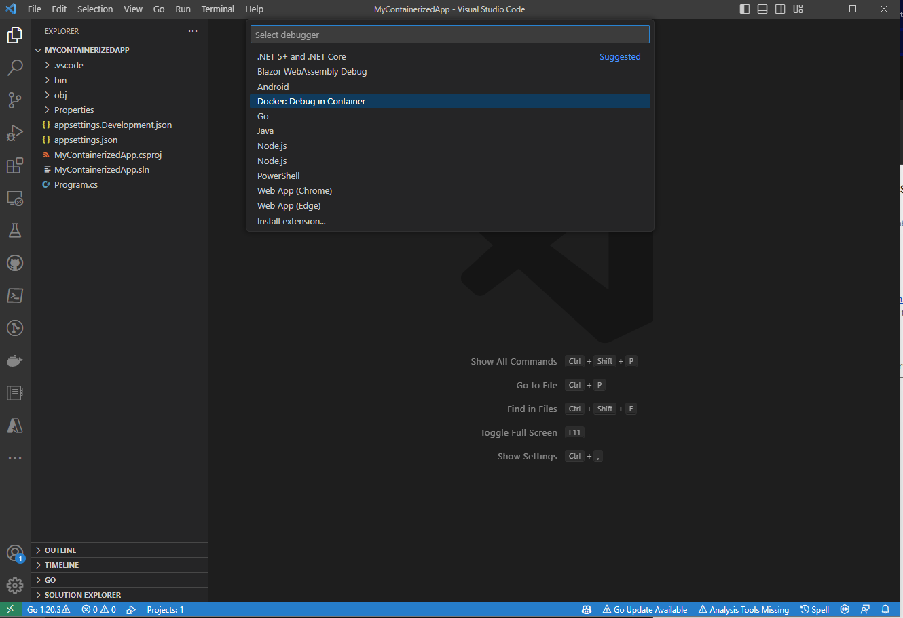
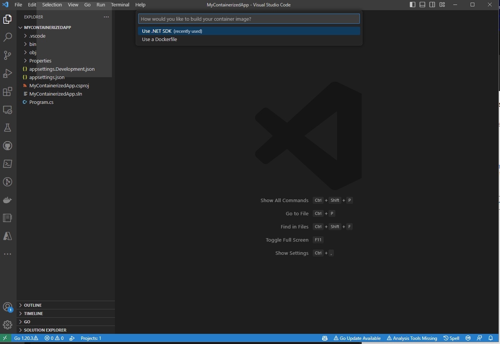
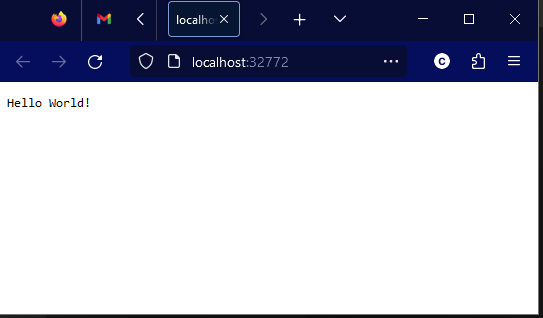

The Docker tools for Visual Studio Code has released version 1.26.0, bringing built-in support for building and debugging container images using the .NET SDK.

## Docker Debugging in VS Code

The Docker tools for Visual Studio Code are a set of tools that make it easy for developers to get started with containers. It provides scaffolding of Dockerfiles, integrations to build, run and debug the containers generated from those Dockerfiles, and provides in-editor access to a number of other Docker- and Container-related tools. You can learn more about this tooling at the [Visual Studio Marketplace](https://marketplace.visualstudio.com/items?itemName=ms-azuretools.vscode-docker).

Previously, the Docker tools provided the ability to scaffold a Dockerfile for a .NET project. This Dockerfile looked something like this:

```dockerfile
FROM mcr.microsoft.com/dotnet/runtime:8.0-preview AS base
WORKDIR /app

USER app
FROM mcr.microsoft.com/dotnet/sdk:8.0-preview AS build
ARG configuration=Release
WORKDIR /src
COPY ["MinimalApiSharp.csproj", "./"]
RUN dotnet restore "MinimalApiSharp.csproj"
COPY . .
WORKDIR "/src/."
RUN dotnet build "MinimalApiSharp.csproj" -c $configuration -o /app/build

FROM build AS publish
ARG configuration=Release
RUN dotnet publish "MinimalApiSharp.csproj" -c $configuration -o /app/publish /p:UseAppHost=false

FROM base AS final
WORKDIR /app
COPY --from=publish /app/publish .
ENTRYPOINT ["dotnet", "MinimalApiSharp.dll"]
```

This is a great foundation for building an efficient container image, but there's a lot to understand out of the box. Users are immediately faced with understanding multi-stage Dockerfiles, container build args, and ensuring that paths align across stages for the build and publish outputs.

## Building containers with the .NET SDK

Starting in .NET 7, the .NET SDK has had the ability to create container images easily via `dotnet publish`. With a single PackageReference (or no package at all if you're using 7.0.300 or later SDKs!), a single `dotnet publish -p PublishProfile=DefaultContainer` command results in a working container image for your application. It has secure defaults out of the box, and lets users customize almost every aspect of the generated container.

However, integrating these generated containers into tooling was a gap. This new version of the Docker tools for Visual Studio Code bridges that gap seamlessly - making it trivial to debug your containerized applications via the launch configuration mechanism in Visual Studio Code.

## Bringing it together

Let's take a look at what it takes to bring the SDK tooling and the Docker tooling together in VSCode.

First, create a new web project using the .NET SDK and open it in Visual Studio Code. I'll be using the .NET 8 preveiw 6 SDK here.

```shell
> dotnet new web -n MyContainerizedApp
The template "ASP.NET Core Empty" was created successfully.

Processing post-creation actions...
Restoring D:\Code\Scratch\MyContainerizedApp\MyContainerizedApp.csproj:
Restore complete (1.0s)

Build succeeded in 1.4s
Restore succeeded.
> cd MyContainerizedApp
> code .
```

After the editor has launched, you should be able to press `F5` (or whatever key combination you've bound to the `workbench.action.debug.start` command) and get a selection menu much like the one below:



The key item to look for on this menu is the `Docker: Debug in Container` launch method. This launch method will build your app into a container, then automatically launch that container with the debugging tools attached! If you select it from this menu, you'll see another important decision:



This is where the new integration with the .NET SDK appears. If you select `Use a Dockerfile` here, then you'll build the container with Docker according to a Dockerfile checked into your repo, but if you select the new `Use .NET SDK` option, the built-in containerization tooling in the .NET SDK will be used to build your container, then Docker will be used to run and debug that container.

As soon as you choose the `Use .NET SDK` option, you should see the tooling building the container. It will appear in the task terminal (typically at the bottom of your editor window), and it'll look something like this:

```text
* Executing task: dotnet-container-sdk: debug

> dotnet publish --os "linux" --arch "x64" -p: PublishProfile=Defau1tContainer --configuration "Debug" -p:ContainerImageTag=dev
<

MSBui1d version 17.7.0+5785ed5c2 for .NET
 Determining projects to restore...
 Restored d:\Code\Scratch\MyContainerizedApp\MyContainerizedApp.csproj (in 2.03 sec).
C:\Progran Files\dotnet\sdk\8.0.100-preview.6.23330.14\Sdks\microsoft.NET.sdk\targets\microsoft.NET.Runtimeldentifierlnference.
targets(314,5): message NETSDK1057: You are using a preview version of .NET. See: https://aka.ms/dotnet-support-policy [d:\Code
\Scratch\MyContainerizedApp\MyContainerizedApp.csproj]
  MyContainerizedApp -> d:\Code\Scratch\MyContainerizedApp\bin\Debug\net8.0\linux-x64\MyContainerizedApp.dll
  MyContainerizedApp -> d:\Code\Scratch\MyContainerizedApp\bin\Debug\net8.0\linux-x64\publish\
  Building image 'mycontainerizedapp' with tags dev on top of base image mcr.microsoft.com/dotnet/aspnet:8.0.0-preview.6
```

The terminal output here shows a few interesting things - the `dotnet publish` command used to build the container, as well as the MSBuild output sharing more about how the app container is being created.

After a brief moment while the container is being built, the VSCode Docker tooling will launch the generated container, and additionally open a browser window pointing to your newly-launched application:



That was pretty easy, don't you think?  From here you can interact with the running container using all of the existing features of the Visual Studio Code Docker tooling.

## What's next?

This is just the beginning for the integration between the Docker tooling for Visual Studio Code and the .NET SDK. Future enhancements to the SDK containers tooling will allow for automatically mapping ports from your SDK-generated containers, and the SDK containers team is looking to deepen the integration with Docker to allow for easier use with Docker Compose.

If you're not containinerizing your applications with the .NET SDK, we'd love to have you give that a try as well! You can learn more about how to [containerize a .NET app with `dotnet publish`](https://learn.microsoft.com/dotnet/core/docker/publish-as-container), and then learn how to [customize the generated container](https://aka.ms/dotnet/containers/customization).

Give the new features of the Docker Extension for Visual Studio code a try and let the team know [what you think](https://github.com/microsoft/vscode-docker/blob/main/SUPPORT.md), and if you have feedback for the .NET SDK Container tooling, make sure to visit the repo and [start a discussion](https://github.com/dotnet/sdk-container-builds/discussions)!
