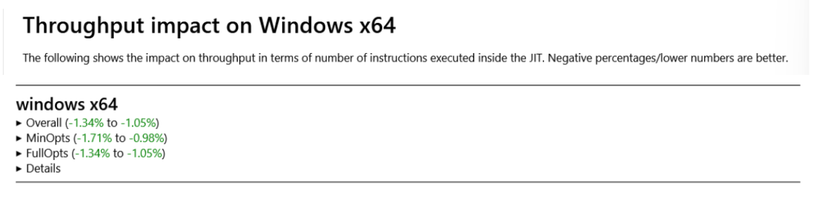
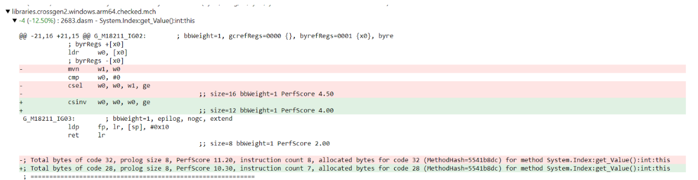

We're delighted to let you know about the latest features and improvements coming with [.NET 8 Preview 6](https://dotnet.microsoft.com/next)! This release is a continuation of the [Preview 5 release](https://devblogs.microsoft.com/dotnet/announcing-dotnet-8-preview-5/), and we're committed to bringing you more enhancements with each monthly release.

Today we have an exciting release incorporated with plenty of library updates, a new WASM mode, more source generators, constant performance improvements, and NativeAOT support on iOS. We hope you enjoy these new features and improvements. Stay tuned for more updates as we continue our journey of making .NET better, together!

You can [download .NET 8 Preview 6](https://dotnet.microsoft.com/download/dotnet/8.0) for Linux, macOS, and Windows.

* [Installers and binaries](https://dotnet.microsoft.com/download/dotnet/8.0)
* [Container images](https://github.com/dotnet/dotnet-docker/blob/main/documentation/supported-tags.md)
* [Release notes](https://github.com/dotnet/core/tree/main/release-notes/8.0)
* [Known issues](https://github.com/dotnet/core/blob/main/release-notes/8.0/known-issues.md)
* [GitHub issue tracker](https://github.com/dotnet/core/issues)

There are several exciting posts you should check out as well:

- [ASP.NET Core](https://devblogs.microsoft.com/dotnet/asp-net-core-updates-in-dotnet-8-preview-6) brings an improved startup debugging experience, Blazor enhancements, and metrics in the Preview 6 release. 
- [C# 12](https://devblogs.microsoft.com/dotnet/new-csharp-12-preview-features) adds three new features for .NET 8 Preview 6: interceptors, inline arrays, and enhancements to the nameof expression.
- [.NET MAUI](https://devblogs.microsoft.com/dotnet/announcing-dotnet-maui-in-dotnet-8-preview-6) resolved 23 high-impact issues and introduces Native AOT for iOS in the Preview 6 release. 
- Finally, today you can now enjoy .NET MAUI in .NET 8 using the [new .NET MAUI extension for Visual Studio Code](https://aka.ms/maui-devkit-blog)
 
Stay current with what's new and coming in [What's New in .NET 8](https://learn.microsoft.com/dotnet/core/whats-new/dotnet-8). It will be kept updated throughout the release.

Now, let's take a look at some new .NET 8 features.

[](https://dotnet.microsoft.com/next)

## System.Text.Json improvements

We made a number of improvements to the System.Text.Json source generator, primarily aimed at making Native AOT on par with the reflection-based serializer.

* Added caching support to the incremental generator, improving IDE performance in large projects. https://github.com/dotnet/runtime/pull/86121
* Improved formatting of source generated code, including fixes to a number of indentation issues https://github.com/dotnet/runtime/pull/86526, https://github.com/dotnet/runtime/pull/87557
* Added a number of new diagnostic warnings https://github.com/dotnet/runtime/pull/87980
* Fixed a number of bugs related to accessibility modifier resolution https://github.com/dotnet/runtime/pull/87136
* Ensures that types of ignored or inaccessible properties are not included by the generator https://github.com/dotnet/runtime/pull/87383
* Fix issues related to `JsonNumberHandling` support https://github.com/dotnet/runtime/pull/87484
* Fix support for recursive collection types https://github.com/dotnet/runtime/pull/87632
* Fix custom converter support for nullable structs https://github.com/dotnet/runtime/pull/84208
* Fix a number of bugs in the compile-time attribute parsing implementation https://github.com/dotnet/runtime/pull/87796
* Add support for nesting `JsonSerializerContext` declarations within arbitrary type kinds https://github.com/dotnet/runtime/pull/87829

### `JsonStringEnumConverter<TEnum>`

This [new converter](https://github.com/dotnet/runtime/pull/87224) complements the existing [`JsonStringEnumConverter`](https://learn.microsoft.com/dotnet/api/system.text.json.serialization.jsonstringenumconverter?view=net-7.0) class, which is not supported in Native AOT.

Users wishing to target Native AOT users should annotate their enum types with the following pattern.

```C#
[JsonConverter(typeof(JsonStringEnumConverter<MyEnum>))]
public enum MyEnum { Value1, Value2, Value3 }

[JsonSerializable(typeof(MyEnum))]
public partial class MyContext : JsonSerializerContext { }
```

### `JsonConverter.Type`

The [new property](https://github.com/dotnet/runtime/pull/87382) allows users to look up the type of a non-generic `JsonConverter` instance:

```C#
Dictionary<Type, JsonConverter> CreateDictionary(IEnumerable<JsonConverter> converters)
    => converters.Where(converter => converter.Type != null).ToDictionary(converter => converter.Type!);
```

The property is nullable since it returns `null` for `JsonConverterFactory` instances and `typeof(T)` for `JsonConverter<T>` instances.

## Stream-based ZipFile CreateFromDirectory and ExtractToDirectory method overloads

We [added new overloads](https://github.com/dotnet/runtime/issues/1555) of `ZipFile.CreateFromDirectory` that allow users to collect all the files included in a directory and zip them, then store the resulting zip file into the provided stream.

Symmetrically, we added the `ZipFile.ExtractToDirectory` overloads that allow users to provide a stream containing a zipped file and extract its contents into the filesystem.

These APIs can avoid having to use the disk as an intermediate step. This can be useful in scenarios where disk space is constrained, like, for example, in cloud-based environments:

- `CreateFromDirectory` does not have to write the zipped result into disk.
- `ExtractToDirectory` does not require the zipped file to be located in disk.

### `ZipFile.CreateFromDirectory` usage

```cs
Stream destinationStream = GetStreamFromSomewhere();

ZipFile.CreateFromDirectory(
    sourceDirectoryName: "/home/username/sourcedirectory/",
    destination: destinationStream,
    compressionLevel: CompressionLevel.Optimal,
    includeBaseDirectory: true,
    entryNameEncoding: Encoding.UTF8);
```

### `ZipFile.ExtractToDirectory` usage

```cs
Stream sourceStream = GetStreamFromSomewhere();

ZipFile.ExtractToDirectory(
    source: sourceStream,
    destinationDirectoryName: "/home/username/destinationdirectory/",
    entryNameEncoding: Encoding.UTF8,
    overwriteFiles: true);
```

## `MetricCollector` Metrics API

[MetricCollector](https://github.com/dotnet/extensions/blob/14917b87e8fc81f10d44ceea52d9b24e50e26550/src/Libraries/Microsoft.Extensions.Telemetry.Testing/Metering/MetricCollector.cs#L22) is a new class that is designed to help test scenarios. It was previously called `InstrumentRecorder`. We've made significant improvements to this class and moved it to the [Microsoft.Extensions.Telemetry.Testing](https://www.nuget.org/packages/Microsoft.Extensions.Telemetry.Testing/) package.

The `MetricCollector` class can now record metric measurements along with timestamps. Additionally, the class offers the flexibility to use any desired time provider for accurate timestamp generation.

The following example demonstrates how to use the feature.

### `MetricCollector` usage

```C#
const string CounterName = "MyCounter";

var now = DateTimeOffset.Now;

var timeProvider = new FakeTimeProvider(now);
using var meter = new Meter(Guid.NewGuid().ToString());
var counter = meter.CreateCounter<long>(CounterName);
using var collector = new MetricCollector<long>(counter, timeProvider);

Assert.Empty(collector.GetMeasurementSnapshot());
Assert.Null(collector.LastMeasurement);

counter. Add(3);

// verify the update was recorded
Assert.Equal(counter, collector.Instrument);
Assert.NotNull(collector.LastMeasurement);

Assert.Single(collector.GetMeasurementSnapshot());
Assert.Same(collector.GetMeasurementSnapshot().Last(), collector.LastMeasurement);
Assert.Equal(3, collector.LastMeasurement.Value);
Assert.Empty(collector.LastMeasurement.Tags);
Assert.Equal(now, collector.LastMeasurement.Timestamp);        
```

## Introducing the options validation source generator

To reduce startup overhead and improve validation feature set, we've [introduced the source code generator](https://github.com/dotnet/runtime/issues/85475) that implements the validation logic.

### Options validation usage

```C#

public class FirstModelNoNamespace
{
    [Required]
    [MinLength(5)]
    public string P1 { get; set; } = string. Empty;

    [Microsoft.Extensions.Options.ValidateObjectMembers(typeof(SecondValidatorNoNamespace))]
    public SecondModelNoNamespace? P2 { get; set; }

    [Microsoft.Extensions.Options.ValidateObjectMembers]
    public ThirdModelNoNamespace? P3 { get; set; }
}

public class SecondModelNoNamespace
{
    [Required]
    [MinLength(5)]
    public string P4 { get; set; } = string. Empty;
}

public class ThirdModelNoNamespace
{
    [Required]
    [MinLength(5)]
    public string P5 { get; set; } = string.Empty;
}

[OptionsValidator]
public partial class FirstValidatorNoNamespace : IValidateOptions<FirstModelNoNamespace>
{
}

[OptionsValidator]
public partial class SecondValidatorNoNamespace : IValidateOptions<SecondModelNoNamespace>
{
}
```

If the app is using dependency injection, it can inject the validation using the following pattern.

```C#

var builder = WebApplication.CreateBuilder(args);
builder.Services.AddControllersWithViews();
builder.Services.Configure<FirstModelNoNamespace>(builder.Configuration.GetSection(...));

builder.Services.AddSingleton<IValidateOptions<FirstModelNoNamespace>, FirstValidatorNoNamespace>();
builder.Services.AddSingleton<IValidateOptions<SecondModelNoNamespace>, SecondValidatorNoNamespace>();
```

## Expanding LoggerMessageAttribute Constructor Overloads for Enhanced Functionality

[New `LoggerMessageAttribute` constructor overloads have been introduced](https://github.com/dotnet/runtime/issues/87254), offering greater flexibility in specifying the required parameters with reduced code. The new constructor overloads include options such as specifying only the LogLevel and message, only the LogLevel, or only the message.

These enhancements make it easier for users to define LoggerMessageAttributes while minimizing unnecessary code.

```C#
    public LoggerMessageAttribute(LogLevel level, string message);
    public LoggerMessageAttribute(LogLevel level);
    public LoggerMessageAttribute(string message);
```

### `LoggerMessage` usage

The following example demonstrate an instantiation of `LoggerMessage` that previously wasn't possible.

```C#
        [LoggerMessage(Level = LogLevel.Warning, Message = "{p1} should be valid")]
        public partial void LogWaraning(string p1);
```

*Note*: In a later preview, for constructors that do not require an event Id, the system will automatically generate the event Id, eliminating the need for users to manually provide it.

## Configuration binding source generator improvements

In [Preview 3](https://devblogs.microsoft.com/dotnet/announcing-dotnet-8-preview-3/#introducing-the-configuration-binding-source-generator), we introduced a new source generator to provide AOT and trim-friendly [configuration in ASP.NET Core](https://learn.microsoft.com/aspnet/core/fundamentals/configuration). The generator is an alternative to the pre-exising reflection-based implementation.  Since then, we've made several improvements based on community feedback and the generator is ready for folks to give it another go using Preview 6.

An [example app](https://gist.github.com/layomia/d0da997f633310c2c6ee00fdca696371) that uses configuration binding and is published with AOT goes from having two (2) AOT analysis warnings during compilation to having none. The app would fail when executed but now it works.

No source code changes are needed to use the generator. It's enabled by default in Native AOT web apps. For other project types it is off by default, but you can control it by adding the following property to your project.

```csproj
<PropertyGroup>
    <EnableConfigurationBindingGenerator>true</EnableConfigurationBindingGenerator>
</PropertyGroup>
```

You can find known issues [here](https://github.com/dotnet/runtime/issues?q=is%3Aopen+is%3Aissue+label%3Aarea-Extensions-Configuration+milestone%3A8.0.0+label%3Asource-generator+label%3Abug).

## Source Generated COM Interop

We now have a new source generator that supports interoperating with COM interfaces using the [source generated interop support](https://learn.microsoft.com/dotnet/standard/native-interop/pinvoke-source-generation) that we started with [`LibraryImportAttribute`](https://learn.microsoft.com/dotnet/api/system.runtime.interopservices.libraryimportattribute?view=net-8.0). You can use the [`System.Runtime.InteropServices.Marshalling.GeneratedComInterfaceAttribute`](https://learn.microsoft.com/dotnet/api/system.runtime.interopservices.marshalling.generatedcominterfaceattribute?view=net-8.0) to mark an interface as a COM interface for the source generator. The source generator will then generate code to enable calling from C# code to unmanaged code, as well as code to enable calling from unmanaged code into C#. This source generator integrates with `LibraryImportAttribute`, and you can use types with the `GeneratedComInterfaceAttribute` as parameters and return types in `LibraryImportAttribute`-attributed methods.

The COM source generator provides a straightforward IDE experience through analyzers and code fixers. This is similar to `LibraryImportAttribute`. Next to each interface that has the [`System.Runtime.InteropServices.ComImportAttribute`](https://learn.microsoft.com/dotnet/api/system.runtime.interopservices.comimportattribute?view=net-8.0), a lightbulb will offer an option to convert to source generated interop. This fix will change the interface to use the `GeneratedComInterfaceAttribute`. Next to every class that implements an interface with the `GeneratedComInterfaceAttribute`, a lightbulb will offer an option to add the `GeneratedComClassAttribute` to the type. Once your types are converted, you can move your `DllImport` methods to use `LibraryImportAttribute` with the existing code fixer there. With these two lightbulbs, it is easy to convert your existing COM interop code to use the new source generated interop. There are also more analyzers to help catch places where you may be mixing source-generated and runtime-based COM interop that may require additional work.

As part of this project, we updated the [System.Transactions library](https://learn.microsoft.com/dotnet/api/system.transactions?view=net-8.0) to use the new source-generated interop! We used this experience to help refine the analyzers and code-fixers to provide a good migration experience.

### `GeneratedComInterface` usage

```csharp
using System.Runtime.InteropServices;
using System.Runtime.InteropServices.Marshalling;

[GeneratedComInterface]
[Guid("5401c312-ab23-4dd3-aa40-3cb4b3a4683e")]
interface IComInterface
{
    void DoWork();
}

internal class MyNativeLib
{
    [LibraryImport(nameof(MyNativeLib))]
    public static partial void GetComInterface(out IComInterface comInterface);
}
```

### `GeneratedComClassAttribute`

The source generator also supports the new [`System.Runtime.InteropServices.Marshalling.GeneratedComClassAttribute`](https://learn.microsoft.com/dotnet/api/system.runtime.interopservices.marshalling.generatedcomclassattribute?view=net-8.0) to enable you to pass your types that implement interfaces with the `System.Runtime.InteropServices.Marshalling.GeneratedComInterfaceAttribute`-attributed interfaces to unmanaged code. The source generator will generate the code necessary to expose a COM object that implements the interfaces and forwards calls to the managed implementation.

### `GeneratedComClassAttribute` usage

```csharp
using System.Runtime.InteropServices;
using System.Runtime.InteropServices.Marshalling;

MyNativeLib.GetComInterface(out IComInterface comInterface);
comInterface.RegisterCallbacks(new MyCallbacks());
comInterface.DoWork();

[GeneratedComInterface]
[Guid("5401c312-ab23-4dd3-aa40-3cb4b3a4683e")]
interface IComInterface
{
    void DoWork();
    void RegisterCallbacks(ICallbacks callbacks);
}

[GeneratedComInterface]
[Guid("88470b56-aabc-46af-bf97-8106a1aa3cf9")]
interface ICallbacks
{
    void Callback();
}

internal class MyNativeLib
{
    [LibraryImport(nameof(MyNativeLib))]
    public static partial void GetComInterface(out IComInterface comInterface);
}

[GeneratedComClass]
internal class MyCallbacks : ICallbacks
{
    public void Callback()
    {
        Console.WriteLine("Callback called");
    }
}
```

### Interacting with `LibraryImportAttribute`

Methods on interfaces with the `GeneratedComInterfaceAttribute` support all the same types as `LibraryImportAttribute`, and `LibraryImportAttribute` gains support for `GeneratedComInterface`-attributed types and `GeneratedComClass`-attributed types in this release.

If your C# code will only be use a `GeneratedComInterfaceAttribute`-attributed interface to either wrap a COM object from unmanaged code or wrap a managed object from C# to expose to unmanaged code, you can use the options in the `GeneratedComInterfaceAttribute.Options` property to customize which code will be generated. This option will enable you to not need to write marshallers for scenarios that you know will not be used.

The source generator uses the new [`System.Runtime.InteropServices.Marshalling.StrategyBasedComWrappers`](https://learn.microsoft.com/dotnet/api/system.runtime.interopservices.marshalling.strategybasedcomwrappers?view=net-8.0) type to create and manage the COM object wrappers and the managed object wrappers. This new type handles providing the expected .NET user experience for COM interop, while providing customization points for advanced users. If your application has its own mechanism for defining types from COM or if you need to support scenarios that source-generated COM does not currently support, you can consider using the new `StrategyBasedComWrappers` type to add the missing features for your scenario and get the same .NET user experience for your COM types.

### Limitations

Currently the COM source generator has the following limitations. We do not expect to address these limitations in .NET 8, but we may in a future version of .NET.

- No support for `IDispatch`-based interfaces.
  - Support for these interfaces may be manually implemented using a local definition of the `IDispatch` interface.
- No support for `IInspectable`-based interfaces.
  - Use the [CsWinRT tool](https://github.com/microsoft/cswinrt) to generate the interop code for these interfaces.
- No support for apartment affinity.
  - All COM objects are assumed to be free-threaded. Support for apartment affinity may be manually implemented using the `StrategyBasedComWrappers` type and custom strategy implementations.
- No support for COM properties.
  - These may be manually implemented as methods on the interface.
- No support for COM events.
  - These may be manually implemented using the underlying COM APIs.
- No support for using the `new` keyword to activate a COM CoClass.
  - Use `LibraryImportAttribute` to P/Invoke to the `CoCreateInstance` API to activate the CoClass.

## Support for HTTPS proxy
https://github.com/dotnet/runtime/issues/31113

While `HttpClient` supported various proxy types for a while, they all allows man-in-the-middle to see what site the client is connecting to. (even for HTTPS URIs) HTTPS proxy allows to create encrypted channel between client and the proxy so all the subsequent request can be handled with full privacy. 

### HTTPS proxy usage

* Unix: `export all_proxy=https://x.x.x.x:3218`
* Windows: `set all_proxy=https://x.x.x.x:3218` 

This can be also controlled programmatically via [WebProxy](https://learn.microsoft.com/dotnet/api/system.net.webproxy?view=net-7.0).

## System.Security: SHA-3 Support

[Support for the SHA-3 hashing primitives](https://github.com/dotnet/runtime/issues/20342) is now available on platforms that offer SHA-3. This is currently Linux with OpenSSL 1.1.1+ and Windows 11 build 25324+.

APIs where SHA-2 is available now offer a SHA-3 compliment. This includes `SHA3_256`, `SHA3_384`, and `SHA3_512` for hashing; `HMACSHA3_256`, `HMACSHA3_384`, and `HMACSHA3_512` for HMAC; `HashAlgorithmName.SHA3_256`, `HashAlgorithmName.SHA3_384`, and `HashAlgorithmName.SHA3_512` for hashing where the algorithm is configurable; and `RSAEncryptionPadding.OaepSHA3_256`, `RSAEncryptionPadding.OaepSHA3_384`, and `RSAEncryptionPadding.OaepSHA3_512` for RSA OAEP encryption.

Using the SHA-3 APIs is similar to SHA-2, with the addition of an `IsSupported` property to determine if the platform offers SHA-3.

```C#
// Hashing example
// Check if SHA-3-256 is supported on the current platform.
if (SHA3_256.IsSupported)
{
    byte[] hash = SHA3_256.HashData(dataToHash);
}
else
{
    // Determine application behavior if SHA-3 is not available.
}

// Signing Example
// Check if SHA-3-256 is supported on the current platform.
if (SHA3_256.IsSupported)
{
     using ECDsa ec = ECDsa.Create(ECCurve.NamedCuves.nistP256);
     byte[] signature = ec.SignData(dataToBeSigned, HashAlgorithmName.SHA3_256);
}
else
{
    // Determine application behavior if SHA-3 is not available.
}
```

Additionally, SHA-3 includes two extendable-output functions (XOFs), SHAKE128 and SHAKE256. These are available as `Shake128` and `Shake256`.

```csharp
if (Shake128.IsSupported)
{
    using Shake128 shake = new Shake128();
    shake.AppendData("Hello .NET!"u8);
    byte[] digest = shake.GetHashAndReset(outputLength: 32);
    
    // Also available as a one-shot:
    digest = Shake128.HashData("Hello .NET!"u8, outputLength: 32);
}
else
{
    // Determine application behavior if SHAKE is not available.
}
```

SHA-3 support is currently aimed at supporting cryptographic primitives. Higher level constructions and protocols are not expected to fully support SHA-3 initially. This includes, but is not limited to, X.509 certificates, `SignedXml`, and COSE. Support for SHA-3 may expand in the future depending on platform support and standards which adopt SHA-3.

SHA-3 was standardized by NIST as FIPS 202 as an alternative to, not successor, to SHA-2. Developers and organizations should decide when or even if adopting SHA-3 is appropriate for them.

## SDK: container publishing performance and compatibility

We've made a few changes to the [generated image](https://devblogs.microsoft.com/dotnet/announcing-builtin-container-support-for-the-dotnet-sdk/) defaults for .NET 8 apps.

* Images now default to using the new [rootless capability of .NET containers](https://devblogs.microsoft.com/dotnet/securing-containers-with-rootless/), making your applications secure-by-default. You can change this at any time by setting your own `ContainerUser`, like `root`.
* Images are tagged as `latest` by default, the same as other container tools.

We've improved the performance of container pushes to remote registries, the reliability of the push operation, and support for a larger range of registries. At the same time, [Tom Deseyn](https://github.com/tmds) of Red Hat was busy improving our support for a range of prevalent container implementations.

This version should see much improved performance for container pushes, especially to Azure registries. This is because of our improved support for pushing layers in one operation. In addition, for registries that don't support atomic uploads, we've implemented a more reliable and re-try-able chunking upload mechanism.

As a side effect of these changes, we also expanded our support matrix for registries. Harbor and Artifactory join the list of known-working registries, and Tom's work enabled Quay.io and Podman pushes as well.

## `HybridGlobalization` mode on WASM

WASM apps can use a new globalization mode that brings lighter ICU bundle and leverages Web API instead. In Hybrid mode, globalization data is partially pulled from ICU bundle and partially from calls into JS. It serves all the [locales supported by WASM](https://github.com/dotnet/icu/blob/dotnet/main/icu-filters/icudt_wasm.json).

### When to consider using `HybridGlobalization`

This option is most suitable for applications that cannot work in `InvariantGlobalization` mode and use localization data from more than one ICU shard (EFIGS, CJK, no-CJK) - so currently using either:
```xml
<BlazorWebAssemblyLoadAllGlobalizationData>true</BlazorWebAssemblyLoadAllGlobalizationData>
```
in Blazor WebAssembly or
```xml
<WasmIncludeFullIcuData>true</WasmIncludeFullIcuData>
```
in WASM Browser.

Apps that were loading no-CJK or CJK shard using the [custom ICU file loading method](https://github.com/dotnet/runtime/blob/main/docs/design/features/globalization-icu-wasm.md):
```xml
<WasmIcuDataFileName>icudt_no_CJK.dat</WasmIcuDataFileName>
```
 might also be interested, because hybrid file is smaller than no-CJK shard by 26% and smaller than CJK by 15%.

### How to use `HybridGlobalization`

Set MsBuild property: `<HybridGlobalization>true</HybridGlobalization>`.  It will load `icudt_hybrid.dat` file that is 46% smaller than originally loaded `icudt.dat`.

### Limitations

Due to limitations of Web API, not all Globalization APIs are supported in Hybrid mode. Some of the supported APIs changed their behavior. To make sure your application is will not be affected, read the section [Behavioral differences for WASM](https://github.com/dotnet/runtime/blob/main/docs/design/features/globalization-hybrid-mode.md).

APIs that obtain the result by calling into JS have worse performance than the non-hybrid version. These APIs are listed in the [documentation](https://github.com/dotnet/runtime/blob/main/docs/design/features/globalization-hybrid-mode.md). The APIs that are not on the "Affected public APIs" lists perform the same as in non-hybrid mode.

## Support for targeting iOS platforms with NativeAOT

We now have [support for targeting iOS-like platforms](https://github.com/dotnet/runtime/issues/80905) with Native AOT. This includes building and running `.NET iOS` and `.NET MAUI` applications with `NativeAOT` on: `ios`, `iossimulator`, `maccatalyst`, `tvos` or `tvossimulator` systems. The motivation of this work is to enable users to explore the possibility of achieving better performance and size savings when targeting such platforms with `NativeAOT`.

This is available as an opt-in feature intended for app deployment, while `Mono` is still used as the default runtime choice for app development and deployment.
This milestone has been reached with a great collaboration between our community members: [@filipnavara](https://github.com/filipnavara) [@AustinWise](https://github.com/AustinWise) and [@am11](https://github.com/am11) who contributed with their work, and joint effort of `NativeAOT`, `Mono` and `Xamarin` teams.

### Current state

The current state has been tested with:

* `.NET iOS app` (`dotnet new ios`)
* `.NET MAUI iOS app` (`dotnet new maui`)

These sample applications show the following preliminary results compared to `Mono`:

| .NET iOS app | Mono-p6     | NativeAOT-p6 | diff (%) |
|-----------------|----------|-----------|----------|
| Size on disk (Mb)        | 11,61 | 6,99   | -40%     |
| .ipa (Mb)       | 4,37  | 2,69   | -39%     |

| .NET MAUI iOS app | Mono-p6     | NativeAOT-p6 | diff (%) | NativeAOT-fix | diff (%) |
|--------------|----------|-----------|----------|-----------|----------|
| Size on disk (Mb)     | 40,24 | 50,13  | 25%      | 27,58  | -31,46%      |
| .ipa (Mb)    | 14,68 | 16,59  | 13%      | 10,23  | -30,32%   |

The `.NET 8 Preview 6` results (marked as `*-p6`) show that the `.NET iOS app` has significant improvements compared to `Mono` where the compressed app bundle (.ipa) is up to `~39%` smaller showing great potential, while the `.NET MAUI iOS app` shows worse results producing `~13%` larger output. However, we have identified the root cause of the size regression with the `.NET MAUI` app and we are currently working on the following list of issues to address the size regression:
1. https://github.com/xamarin/xamarin-macios/pull/18532
2. https://github.com/xamarin/xamarin-macios/issues/18479
3. https://github.com/dotnet/runtime/issues/87924
4. https://github.com/dotnet/runtime/issues/86649

By fixing the identified issues 1-3) we have estimated that `NativeAOT` can reach great results with the `.NET MAUI` app, which is shown in the column `NativeAOT-fix`, where the size of the application bundle is `~30%` smaller compared to `Mono`. Fixing the issue 4) would potentially improve the performance even further, but at this stage we cannot estimate the exact numbers. More information about `.NET MAUI` performance with `NativeAOT` is being tracked in: https://github.com/dotnet/runtime/issues/80907

We would like to point out that conclusions regarding `NativeAOT` performance on iOS-like platforms should not be drawn out from the presented numbers in the table nor from the `.NET 8 Preview 6` release in general. Especially since this is still work-in-progress and only the first step towards making the feature ready for `.NET 9` official release. Therefore, we are actively working on improvements and identifying all the work that will try to bring full `NativeAOT` experience to our customers towards achieving great performance and size savings, which is being tracked in the following list of issues (and their subtasks):

- https://github.com/dotnet/runtime/issues/80905 tracks: Overall progress
- https://github.com/xamarin/xamarin-macios/issues/17339 tracks: `Xamarin` integration improvements
- https://github.com/dotnet/runtime/issues/86649 tracks: Trimming and extension compatibility improvements=

### How to build and run a .NET MAUI application with NativeAOT on an iOS device with .NET CLI

#### Installation

```bash
dotnet workload install maui
```

#### Creating a sample application

```bash
dotnet new maui -n HelloMaui
```

#### Choosing NativeAOT over Mono

The MSBuild properties `PublishAot=true` and `PublishAotUsingRuntimePack=true` (temporary, see below) enable `NativeAOT` deployments.

These two properties are the only notable difference compared to when deploying with `Mono`.
You need to add them in a `PropertyGroup` of the project file of your application:
```xml
<PropertyGroup>
    <PublishAot>true</PublishAot>
    <PublishAotUsingRuntimePack>true</PublishAotUsingRuntimePack>
</PropertyGroup>
```
Which means that every time the app is deployed via `dotnet publish` it will be deployed by using `NativeAOT`.

#### Running your application

```bash
dotnet publish -f net8.0-ios -c Release -r ios-arm64  /t:Run
```

### iOS and NativeAOT compatibility

Not all features in iOS are compatible with NativeAOT. Similarly, not all libraries commonly used in iOS are compatible with NativeAOT. .NET 8 represents the start of work to enable NativeAOT for iOS, your feedback will help guide our efforts during .NET 8 previews and beyond, to ensure we focus on the places where the benefits of NativeAOT can have the largest impact.

The following list includes some limitations when targeting iOS-like platforms that have been encountered so far (and thus might not be the final list):
- Installation and app deployment by using Visual Studio have not been tested yet
- Using `NativeAOT` is only enabled during app deployment - `dotnet publish`
- `Linq.Expressions` library functionality is not fully supported yet
-  The `PublishAotUsingRuntimePack=true` MSBuild property is a temporary workaround required for targeting iOS-like platforms with NativeAOT
    - This requirement will become obsolete by fixing: https://github.com/dotnet/runtime/issues/87060 
- Managed code debugging is only supported with `Mono`

NOTE: The previous list is an extension to the limitations applicable for all platforms with `NativeAOT`: https://github.com/dotnet/runtime/blob/main/src/coreclr/nativeaot/docs/limitations.md

## CodeGen 

### Community PRs (Many thanks to JIT community contributors!) 

- @huoyaoyuan made use of ECMA-335 III.4.6 to optimize type checks involving `Nullable<T>`, [PR#87241](https://github.com/dotnet/runtime/pull/87241). @huoyaoyuan also made a fix for parameter ordering and value in `gtNewColonNode` in [PR#87366](https://github.com/dotnet/runtime/pull/87366). 

- @jasper-d optimized new `Vector3 { X = val1, Y = val2, Z = val3 }` pattern to emit the same codegen as  `Vector3 { val1,val2, val3}` by folding `cost WithElement` to `CNS_VEC`, [PR#84543](https://github.com/dotnet/runtime/issues/84543). 

```c# 
Vector3 Foo1() => new Vector3 { X = 1, Y = 2, Z = 3 }; 
Vector3 Foo2() => new Vector3(1, 2, 3); 
``` 

- @pedrobsaila fused numeric `<` and `==` comparisons to `<=` and `>` and `==` to `>=` and reduced the number of instructions in [#PR78786](https://github.com/dotnet/runtime/pull/78786). 

- @SingleAccretion has been working on internal JIT cleanup to greatly simplify the Internal Representation (IR). He removed `GT_ASG` IR that we had for many years, and it shows about 1 ~ 1.5% of throughput improvements, [PR#85871](https://github.com/dotnet/runtime/pull/85871). 
         
  [](https://github.com/dotnet/runtime/pull/85871)

### AVX-512

Since we enabled Vector512 and AVX512 support in Preview 4, our community members continued to add new features. 

- @DeepakRajendrakumaran accelerated Vector256/512.Shuffle() using AVX512 VBMI that improves performance by reducing data movement from memory to registers and rearranging data in the two memory addresses, [PR#87083](https://github.com/dotnet/runtime/pull/87083).  

- @Ruihan-Yin enabled EVEX feature that embeds broadcast and optimized Vector256.Add() when vector base type is `TYP_FLOAT`, [PR#84821](https://github.com/dotnet/runtime/pull/84821). 

### Arm64

- @SwapnilGaikwad used Conditional Invert (`cinv`) and Conditional Negate (`cneg`) instead of Conditional Select(`csel`) that reduced code size and speed on Arm64 platform, [PR#84926](https://github.com/dotnet/runtime/pull/84926). 
 
  [](https://github.com/dotnet/runtime/pull/84926)

- @SwapnilGaikwad also combined two vector table lookups into one on Arm64 that shows 10-50% of speed-up on microbenchmarks such as `FormatterInt32`, [PR#87126](https://github.com/dotnet/runtime/pull/87126). 

- We changed register allocation to iterate over the registers of interest instead of over all the registers, which improved the JIT’s own throughput for various scenarios by up to 5% on Arm64 and around 2% on x64.

## Community spotlight ([Wraith2](https://github.com/Wraith2))

> I'm a career developer working in a mix of technologies from vb6 to netcore with most things in between. I maintain extend and assist in developing new products. I got started working with .net core using System.IO.Pipelines to efficiently parse a text based custom protocol that was causing performance concerns at work. I was very pleased with results but as soon as I started adding database access to the project suddenly there was a lot going on in performance profiles that didn't seem to be needed. Since the runtime was open source I realized that I could improve what I found.

> I started contributing performance enhancements to the System.Data.SqlClient driver in the dotnet/runtime repository and then once SqlClient was moved out of the runtime into a new project Microsoft.Data.SqlClient I continued to contribute there working with the team to improve the performance and stability of the driver. I've continued to take an interest in the runtime by reviewing code and occasionally adding new features like some new BMI instructions support in the JIT. Working on new and evolving codebase has allowed me to learn a lot about .net runtime and libraries by interacting with enthusiastic and knowledgeable contributors from all over the world.

Do you know anybody who is contributing to .NET that we should feature in future posts? Nominate them at [https://aka.ms/net8contributor](https://aka.ms/net8contributor).

## Summary

.NET 8 Preview 6 contains exciting new features and improvements that would not be possible without the hard work and dedication of a diverse team of engineers at Microsoft and a passionate open-source community. We want to extend our [sincere thanks to everyone who has contributed to .NET 8 so far](https://dotnet.microsoft.com/thanks), whether it was through code contributions, bug reports, or providing feedback.

Your contributions have been instrumental in the making of the .NET 8 Previews, and we look forward to continuing to work together to build a brighter future for .NET and the entire technology community.

Curious about what is coming? [Go see for yourself what's next in .NET!](https://dotnet.microsoft.com/next)
