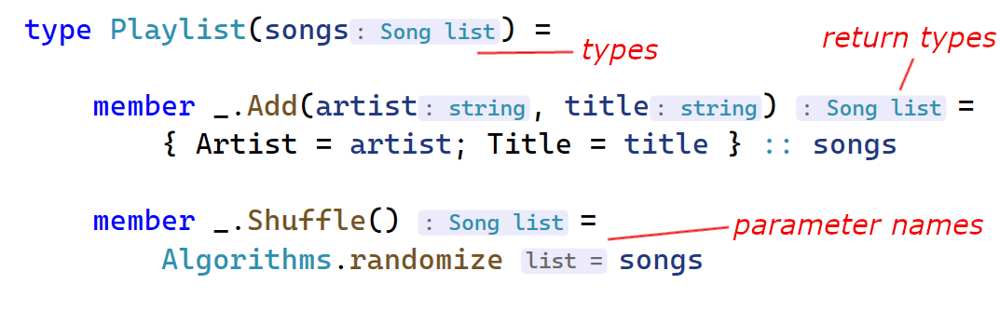
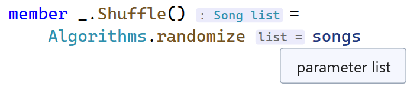
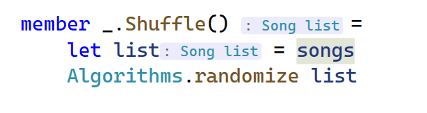
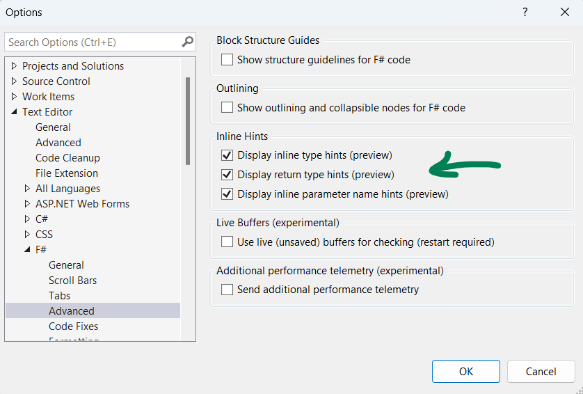

A few months ago, we introduced a preview of [F# hints](https://devblogs.microsoft.com/dotnet/fsharp-inline-hints-visual-studio/) - the type and parameter name hints. Since then, we've fine-tuned them, added return type hints, and incorporated tooltips for all of them.

Explore the entire experience here:
[video src="https://devblogs.microsoft.com/dotnet/wp-content/uploads/sites/10/2023/07/demo.mp4"]

<details>
<summary>Code</summary>

```fsharp
type Song = {
    Artist: string
    Title: string
}

type Playlist(songs) =

    member _.Add(artist, title) =
        { Artist = artist; Title = title } :: songs

    member _.Shuffle() =
        Algorithms.randomize songs

```

</details>

## Overview

In this code, you can spot type hints, return type hints, and parameter name hints.



Note that all hints now feature tooltips:



Also, we refrain from displaying hints for certain obvious scenarios:



## Enabling the Hints 

These hints remain in preview and off by default.

You can configure each of them separately in options (Go to Tools -> Options -> Text Editor -> Advanced):



## Looking Forward and Getting Involved

In the long run, we aim to implement a hotkey for toggling hints, make them less intrusive, and include signature hints. You can find the full roadmap [in this issue](https://github.com/dotnet/fsharp/issues/14157), and all related tickets are available using [this query](https://github.com/dotnet/fsharp/labels/Area-LangService-Hints). Many of them are [good first issues](https://github.com/dotnet/fsharp/issues?q=is%3Aopen+is%3Aissue+label%3A%22good+first+issue%22), and we warmly welcome any contributions!