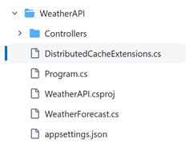
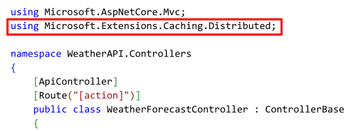
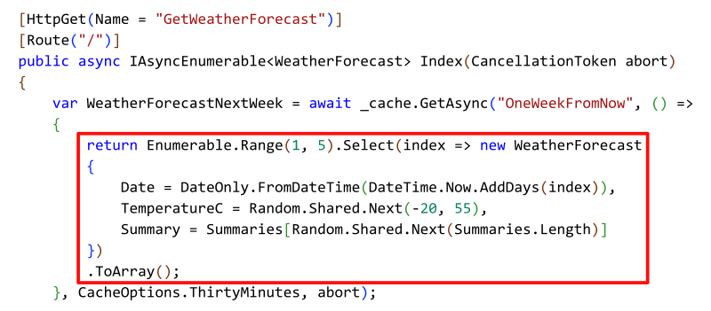

We are improving the caching abstraction in .NET to make it more intuitive and reliable. This blog showcases [a sample project](https://github.com/mgravell/DistributedCacheDemo) with reusable extension methods for [Distributed Caching](https://learn.microsoft.com/aspnet/core/performance/caching/distributed?view=aspnetcore-7.0) to greatly simplify the repetitive code on object serialization when setting cached values. It also provides guidance on best practices so developers can focus on business logic. We are actively working on bringing this experience into the .NET framework, ETA post .NET 8.

## Background

Application developers mostly use distributed caches to improve data query performance and to save web application session objects. While the concept of caching sounds straight forward, we heard from .NET developers that it requires a decent amount of experience to use caching properly. The challenges are:

- The required object serialization code is repetitive and error prone.
- It's still a common error to use sync over async in caching methods with clients such as [StackExchange.Redis](https://stackexchange.github.io/StackExchange.Redis/)
- There is too much overhead from "boilerplate" type of work in .NET caching methods.

Ideally, the developer should only have to specify what to cache, and the framework should take care of the rest. We are introducing a better caching abstraction in .NET to optimize for common distributed caching and session store caching scenarios. We would like to show you a concept of our solution, hoping to solve some immediate problems and receive feedback. The sample extension methods are written by [Marc Gravell](https://github.com/mgravell), the maintainer of the popular [StackExchange.Redis](https://stackexchange.github.io/StackExchange.Redis/). You can copy the [DistributedCacheExtensions.cs](https://github.com/mgravell/DistributedCacheDemo/blob/main/DistributedCacheExtensions.cs) into your ASP.NET core web project, configure a distributed cache in [Program.cs](https://github.com/mgravell/DistributedCacheDemo/blob/9c98c205668aa83347661bed6a8acdcd8886ad35/Program.cs#L4), and follow [example code](https://github.com/mgravell/DistributedCacheDemo/blob/9c98c205668aa83347661bed6a8acdcd8886ad35/Program.cs#L13) to start using the extension methods.

The [extension methods sample code](https://github.com/mgravell/DistributedCacheDemo/blob/main/DistributedCacheExtensions.cs) is very intuitive if you want to jump directly into it. The rest of the blog dives into the detailed implementation behind the extension methods with an example Web API application for a weather forecast.

## Application scenarios for using the new Distributed Cache extension methods

In the [extension methods sample code](https://github.com/mgravell/DistributedCacheDemo/blob/main/DistributedCacheExtensions.cs), only `GetAsync()` methods are exposed. You may wonder where the methods for setting cache values are. The answer is – you don't need the `Set` methods anymore. `Set` methods are abstracted by the `GetAsync()` implementations when reading value from the data source upon a cache miss. The `GetAsync()` methods essentially do the following:

- **Automate the** [**Cache-Aside pattern**](https://learn.microsoft.com/azure/architecture/patterns/cache-aside). This means it always attempts to read from cache. In the case of a cache miss, the method executes a user-specified function to return the value and save it in cache for future reads.
- **Object serialization**. The extension methods allow developers to specify what to cache. No custom serialization code needed. The [sample code](https://github.com/mgravell/DistributedCacheDemo/blob/9c98c205668aa83347661bed6a8acdcd8886ad35/DistributedCacheExtensions.cs#L125) uses Json serializer, but you can edit the code to use [protobuf-net](https://github.com/protobuf-net/protobuf-net) or other custom serializers for performance optimization.
- **Thread management**. All caching methods are designed to be asynchronous and work reliably with synchronous operations that generate the cache values.
- **State management**. The user-specified functions can optionally be stateful with simplified coding syntax, using static lambdas to avoid captured variables and per-usage delegate creation overheads.

## Example for using the sample code

The [WeatherAPI-DistributedCache](https://github.com/CawaMS/WeatherAPI-DistributedCache/tree/main) demo shows how to easily re-use the extension methods, with [Azure Cache for Redis](https://learn.microsoft.com/azure/azure-cache-for-redis/cache-overview) as example.

1. Copy the [DistributedCacheDemo/DistributedCacheExtensions.cs](https://github.com/mgravell/DistributedCacheDemo/blob/main/DistributedCacheExtensions.cs) to your ASP.NET Core project in the same folder directory as the `Program.cs` file. Per **Figure 1,** the `DistributedCacheExtensions.cs` code file is placed alongside `Program.cs` in the project folder.

    **Figure 1: Copy and paste the DistributedCacheExtensions.cs file to your web project**

    

1. Add the [Distributed Cache service](https://github.com/CawaMS/WeatherAPI-DistributedCache/blob/319b4dfca458812ef66dff734ab2a32311033bae/Program.cs#L4) in `Program.cs` by:

1. Adding [Microsoft.Extensions.Caching.StackExchangeRedis](https://www.nuget.org/packages/Microsoft.Extensions.Caching.StackExchangeRedis) to your project
2. Adding the following code:

    ```C#
    builder.Services.AddStackExchangeRedisCache(options =>

    {

    options.Configuration = builder.Configuration.GetConnectionString("MyRedisConStr");

    options.InstanceName = "SampleInstance";

    });
    ```

1. Use the extension methods in [Weather Controller class](https://github.com/CawaMS/WeatherAPI-DistributedCache/blob/main/Controllers/WeatherForecastController.cs) that contains business logic. Per **Figure 2,** include the using statement to access the extension methods.

    **Figure 2: add using statement in the class to access the extension methods**

    

1. Refer to the [sample code](https://github.com/mgravell/DistributedCacheDemo/blob/main/Program.cs) to use the new `GetAsync()` methods. The only code needed is the business logic for generating weather forecast data. All caching operations are abstracted by the extension methods. **Figure 3** shows a user defined method for generating the weather forecast for the next week, which is the only business logic required from developers as the input to use caching methods.

    **Figure 3: define the business logic to use the new GetAsync() extension methods**

    

Notice that no object serialization code is required to get or set an [WeatherForecast](https://github.com/CawaMS/WeatherAPI-DistributedCache/blob/main/WeatherForecast.cs) object in the cache. And in fact, only caching options and cache key name are needed as parameters to use the `GetAsync()` method in a web application. Developers can entirely focus on the business logic without any "boilerplate" efforts to get caching operations to work.

## Next steps

Try out the concept from our [sample code](https://github.com/mgravell/DistributedCacheDemo/blob/main/DistributedCacheExtensions.cs) today! You can provide feedback by leaving comments in this blog post or filing an issue in the [ASP.NET Core repository](https://github.com/dotnet/aspnetcore/issues/new/choose). If you are looking for guidance on using a distributed cache to improve you cloud application's performance, we have an example at [Improving Web Application Performance Using Azure Cache for Redis](https://techcommunity.microsoft.com/t5/azure-developer-community-blog/improving-web-application-performance-using-azure-cache-for/ba-p/3840436).