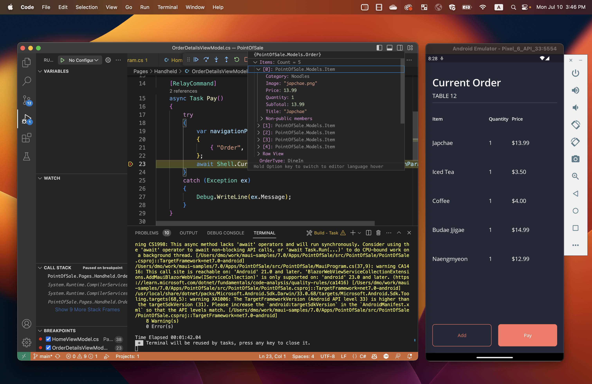
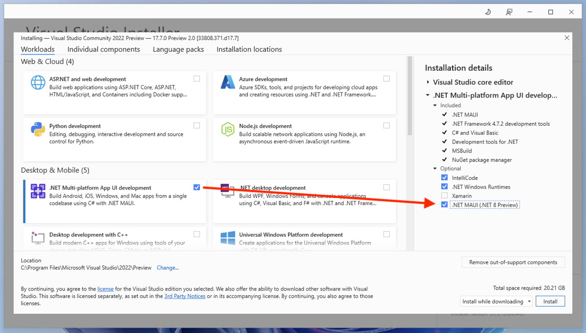
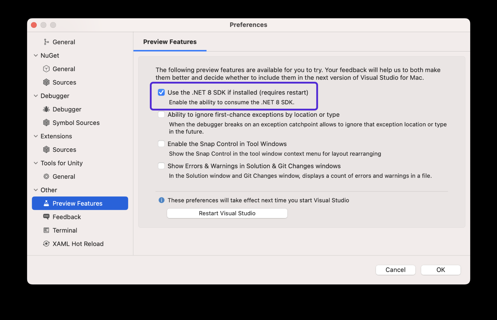

.NET MAUI is now available in .NET 8 Preview 6 resolving 23 high-impact issues, and introducing [Native AOT for iOS](https://devblogs.microsoft.com/dotnet). Additionally, today you can now enjoy .NET MAUI in .NET 8 using the [new .NET MAUI extension for Visual Studio Code](https://aka.ms/maui-devkit-blog), and with the 17.6.1 release of Visual Studio for Mac.

> A new .NET 7 Service Release is also available today. See the [release notes](https://github.com/dotnet/maui/releases) for full details. We are currently focusing on .NET 8 quality which means only the most critical fixes will be released for .NET 7. Once .NET 8 ships GA, we will reevaluate the requirements for which fixes are included in service releases.

## What's fixed and improved in .NET MAUI

Several top desktop issues have been addressed for fonts ([#9104](https://github.com/dotnet/maui/issues/9104), [#13239](https://github.com/dotnet/maui/issues/13239)), navigation ([#7698](https://github.com/dotnet/maui/issues/7698), [#15488](https://github.com/dotnet/maui/issues/15488), [#9938](https://github.com/dotnet/maui/issues/9938)), tabs ([#12386](https://github.com/dotnet/maui/issues/12386), [#13239](https://github.com/dotnet/maui/issues/13239), [#6929](https://github.com/dotnet/maui/issues/6929)), and file picker ([#11088](https://github.com/dotnet/maui/issues/11088)). We also continue our journey to improve memory management and address leaks ([#15062](https://github.com/dotnet/maui/pull/15062), [#15303](https://github.com/dotnet/maui/pull/15303), [#15831](https://github.com/dotnet/maui/pull/15831)). 

.NET 8 preview 6 introduces Native AOT (ahead-of-time compilation) for iOS. Using this opt-in preview feature, we are currently seeing 30-40% reduction in app sizes compared to Mono. If you're excited about the possibility of achieving better performance and size savings when targeting iOS, check out the details in the [.NET 8 preview 6 blog post](https://devblogs.microsoft.com/dotnet).

Thank you to all 25 contributors (bots included) that helped make this release, especially 5 brand new contributors to .NET MAUI: [Michael Cao](https://github.com/expensivecow), [Will Davies](https://github.com/widavies), [@MartyIX](https://github.com/MartyIX), [Larry Ewing](https://github.com/lewing), [Filip Navara](https://github.com/filipnavara), and [Ryan Davis](https://github.com/rdavisau).

For a full list of fixes, check the [release notes](https://github.com/dotnet/maui/releases/). 

## Introducing VS Code (Preview)

Today we have also released the .NET MAUI extension for Visual Studio Code, providing a consistent development experience across Windows, macOS, and Linux. For full details on the extension, check out Maddy Montaquila's [blog post introducing it here](https://aka.ms/maui-devkit-blog).



## How to update

Visual Studio 2022 on Windows now includes .NET 8 previews and the .NET MAUI preview workload. Download the latest preview version (17.7 Preview 3), select the .NET Multi-platform App UI workload, and then check the optional component ".NET MAUI (.NET 8 Preview)".



If you are on macOS, you can now develop using Visual Studio for Mac after enabling the preview feature for .NET 8 in Preferences and installing .NET 8 preview 6 from the installer. 



Download the [.NET 8 preview 6 installer](https://dotnet.microsoft.com/download/dotnet/8.0), and then install .NET MAUI from the command line:

```bash
dotnet workload install maui
```

## Feedback Welcome

We appreciate your feedback and contributions to .NET MAUI. You can [report issues](https://github.com/dotnet/maui/issues/new/choose), [suggest features](https://github.com/dotnet/maui/issues/new?assignees=&labels=proposal%2Fopen%2Ct%2Fenhancement&projects=&template=feature-request.yml), or [submit pull requests](https://github.com/dotnet/maui/blob/main/.github/CONTRIBUTING.md) on our GitHub repository. You can also join our Discord server or follow us on Twitter to stay in touch with the latest news and updates.

Thank you for your support and happy coding!