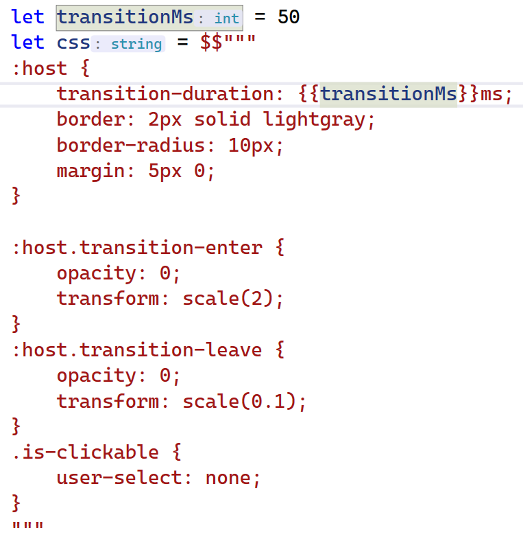
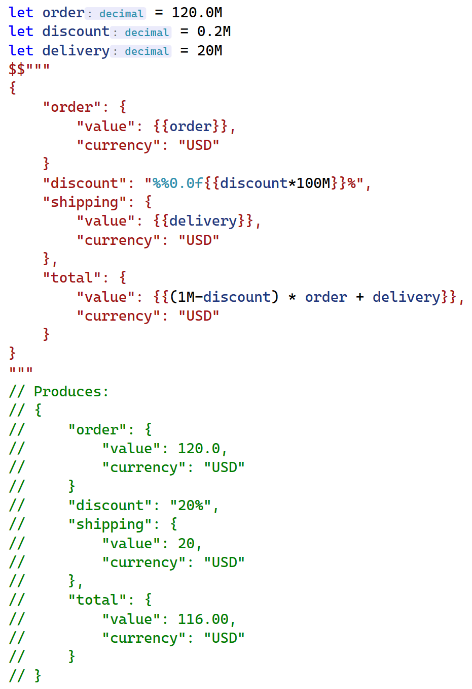
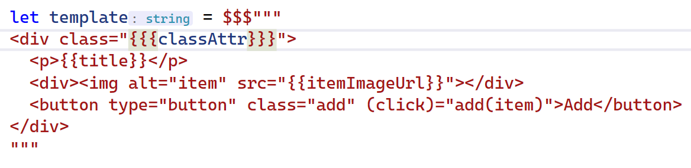

We are excited to announce a new F# syntax feature that is now available in preview, designed to make working with interpolated strings easier than ever before.
This feature is modeled after how interpolation works in C#'s [raw strings](https://learn.microsoft.com/dotnet/csharp/programming-guide/strings/#raw-string-literals), but maintains backwards compatibility with F#'s triple quoted strings.

Interpolated strings are a very convenient way for developers to embed F# expressions into string literals.
However, one scenario where working with interpolated strings can become cumbersome is dealing with text that contains many curly braces.
That's where the new F# interpolation syntax comes in. 

## Overview

One example where this new syntax can be particularly useful is when working with CSS literals in a front-end F# application, such as with [Fable](https://fable.io/).
With the new syntax, you can write your CSS without worrying about escaping curly braces, allowing you to focus on the interpolation expressions themselves.
Here's an example:

Code

<pre><code class="language-fsharp">let transitionMs = 50
let css = $$"""
:host {
    transition-duration: {{transitionMs}}ms;
    border: 2px solid lightgray;
    border-radius: 10px;
    margin: 5px 0;
}

:host.transition-enter {
    opacity: 0;
    transform: scale(2);
}
:host.transition-leave {
    opacity: 0;
    transform: scale(0.1);
}
.is-clickable {
    user-select: none;
}
"""</code></pre>

You don't have to comb through all your string literals looking for `{`, `}` or `%` characters to escape, you can just write (or copy-paste) them as you normally would.
And the end result looks even more like CSS typically does, lessening cognitive effort required for any reader who is already used to reading CSS.

## Syntax

The new syntax is an extension of the existing syntax for interpolated strings.
Previously, you could add a single `$` before a string literal and use `{` and `}` to embed F# expressions within its contents.
You can learn more about interpolated strings in the [F# Language Reference](https://learn.microsoft.com/dotnet/fsharp/language-reference/interpolated-strings).

Now, you can use multiple `$` characters and corresponding numbers of opening and closing curly braces for interpolation, and the same rules also apply to `%` characters, which have special meaning in F# interpolated strings as format specifiers.

Here's an example:

Code

<pre><code class="language-fsharp">let order = 120.0M
let discount = 0.2M
let delivery = 20M
$$"""
{
    "order": {
        "value": {{order}},
        "currency": "USD"
    }
    "discount": "%%0.0f{{discount*100M}}%",
    "shipping": {
        "value": {{delivery}},
        "currency": "USD"
    },
    "total": {
        "value": {{(1M-discount) * order + delivery}},
        "currency": "USD"
    }
}
"""
// Produces:
// {
//     "order": {
//         "value": 120.0,
//         "currency": "USD"
//     }
//     "discount": "20%",
//     "shipping": {
//         "value": 20,
//         "currency": "USD"
//     },
//     "total": {
//         "value": 116.00,
//         "currency": "USD"
//     }
// }</code></pre>

In case you need to create a literal with longer sequences of `{` or `}`, the new syntax can still be used to avoid escaping - just start with more `$`s and use the same number of curly braces for interpolation.

This could come up when working with a templating engine, perhaps something like Angular or Vue.js templates in a hypothetical cross-compile scenario, and it might look something like this:

Code

<pre><code class="language-html">let template = $$$"""
&lt;div class=&quot;{{{classAttr}}}&quot;&gt;
  &lt;p&gt;{{title}}&lt;/p&gt;
  &lt;div&gt;&lt;img alt=&quot;item&quot; src=&quot;{{itemImageUrl}}&quot;&gt;&lt;/div&gt;
  &lt;button type=&quot;button&quot; class=&quot;add&quot; (click)=&quot;add(item)&quot;&gt;Add&lt;/button&gt;
&lt;/div&gt;
"""</code></pre>

Note that now triple curly braces are needed for interpolation, but double or single braces are treated as regular content of the string.

## Give it a go

At the moment to try this feature out, you have to use flag `--langversion:preview` which you can pass to `dotnet fsi` invocation or put it in your `.fsproj` file within `<OtherFlags>`.

## Links to official documentation

- [F# Language Reference](https://learn.microsoft.com/dotnet/fsharp/language-reference/interpolated-strings#extended-syntax-for-string-interpolation)
- [RFC FS-1132 - Extended syntax for interpolated strings](https://github.com/fsharp/fslang-design/blob/main/RFCs/FS-1132-better-interpolated-triple-quoted-strings.md)
