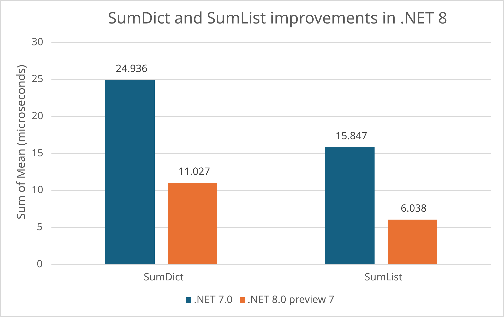

.NET 8 Preview 7 is now available. We're already at the final preview release for .NET 8 and will now shift to release candidates. Almost all new features for the release are in their final shape. System.Text.Json and codegen have the biggest changes in this build. You'll want to take a look at those. Now is great time to pick up and test .NET 8 if you haven't yet. 

The dates for [.NET Conf 2023](https://dotnetconf.net/) have been announced! Join us November 14-16, 2023 to celebrate the .NET 8 release!

[Download .NET 8 Preview 7](https://dotnet.microsoft.com/download/dotnet/8.0) for Linux, macOS, and Windows.

* [Installers and binaries](https://dotnet.microsoft.com/download/dotnet/8.0)
* [Container images](https://hub.docker.com/_/microsoft-dotnet-aspnet/)
* [Release notes](https://github.com/dotnet/core/tree/main/release-notes/8.0)
* [Breaking changes](https://learn.microsoft.com/dotnet/core/compatibility/8.0?toc=%2Fdotnet%2Ffundamentals%2Ftoc.json&bc=%2Fdotnet%2Fbreadcrumb%2Ftoc.json)
* [Known issues](https://github.com/dotnet/core/blob/main/release-notes/8.0/known-issues.md)
* [GitHub issue tracker](https://github.com/dotnet/core/issues)

There are several exciting posts you should check out as well:

- [ASP.NET Core](https://devblogs.microsoft.com/dotnet/asp-net-core-updates-in-dotnet-8-preview-7) describes new token antiforgery middleware with API and Blazor support, identity API updates, native AOT improvements, and more.
- [.NET MAUI](https://devblogs.microsoft.com/dotnet/announcing-dotnet-maui-in-dotnet-8-preview-7) includes enhanced UI Control functionality as well as bug fixes and performance improvements.
- [Visual Studio 2022 17.7](https://devblogs.microsoft.com/visualstudio/visual-studio-2022-17-7-now-available) is now generally available, and includes a number of features for .NET developers including [auto-decompilation for External .NET Code](https://devblogs.microsoft.com/visualstudio/visual-studio-2022-17-7-now-available#auto-decompilation-for-external-net-code) and [new Auto Insights for the CPU Usage Tool](https://devblogs.microsoft.com/visualstudio/visual-studio-2022-17-7-now-available#new-auto-insights-for-the-cpu-usage-tool).
[What's New in .NET 8](https://learn.microsoft.com/dotnet/core/whats-new/dotnet-8) describes all the new features in .NET 8. For a broader view of the platform, read [Why .NET?](https://devblogs.microsoft.com/dotnet/why-dotnet/).

## System.Text.Json improvements

This release includes several new improvements to [System.Text.Json](https://learn.microsoft.com/dotnet/standard/serialization/system-text-json/how-to). 

### `JsonSourceGenerationOptionsAttribute` feature parity https://github.com/dotnet/runtime/pull/88753

[`JsonSourceGenerationOptionsAttribute`](https://learn.microsoft.com/dotnet/api/system.text.json.serialization.jsonsourcegenerationoptionsattribute) now has feature parity with the [`JsonSerializerOptions`](https://learn.microsoft.com/dotnet/api/system.text.json.jsonserializeroptions) class, enabling specifing serialization configuration at compile time.

An example `JsonSourceGenerationOptions` instance.

```C#
[JsonSourceGenerationOptions(JsonSerializerDefaults.Web,
    AllowTrailingCommas = true,
    Converters = new[] { typeof(JsonStringEnumConverter<MyEnum>) },
    DefaultBufferSize =  1024,
    DefaultIgnoreCondition = JsonIgnoreCondition.WhenWritingDefault,
    DictionaryKeyPolicy = JsonKnownNamingPolicy.SnakeCaseUpper,
    IgnoreReadOnlyFields = true,
    IgnoreReadOnlyProperties = true,
    IncludeFields = true,
    MaxDepth = 1024,
    NumberHandling = JsonNumberHandling.WriteAsString,
    PreferredObjectCreationHandling = JsonObjectCreationHandling.Replace,
    PropertyNameCaseInsensitive = true,
    PropertyNamingPolicy = JsonKnownNamingPolicy.KebabCaseUpper,
    ReadCommentHandling = JsonCommentHandling.Skip,
    UnknownTypeHandling = JsonUnknownTypeHandling.JsonNode,
    UnmappedMemberHandling = JsonUnmappedMemberHandling.Disallow,
    WriteIndented = true)]
[JsonSerializable(typeof(MyPoco))]
public partial class MyContext : JsonSerializerContext { }
```

This example generates a `MyContext.Default` property that is preconfigured with all the relevant options set, while taking advantage of source generation.

### Built-in support for `Memory<T>`/`ReadOnlyMemory<T>`

The serializer now has [built-in support for `Memory<T>` and `ReadOnlyMemory<T>` values](https://github.com/dotnet/runtime/pull/88713), with semantics being equivalent to arrays:

- Serializes to [Base64](https://en.wikipedia.org/wiki/Base64) strings for `Memory<byte>`/`ReadOnlyMemory<byte>` values
- Serializes to JSON arrays for other types

You can see that behavior in the folowing examples (the second resulting in a Base64-encoded string).

```C#
JsonSerializer.Serialize<Memory<int>>(new int[] { 1, 2, 3 }); // [1,2,3]
JsonSerializer.Serialize<ReadOnlyMemory<byte>>(new byte[] { 1, 2, 3 }); // "AQID"
```

### Built-in support for `Half`, `Int128` and `UInt128` numeric types

[`Half`](https://learn.microsoft.com/dotnet/api/system.half), [`Int128`](https://learn.microsoft.com/dotnet/api/system.int128), and [`UInt128`](https://learn.microsoft.com/dotnet/api/system.uint128) types now have [built-in serialization support](https://github.com/dotnet/runtime/pull/88713).

```C#
Console.WriteLine(JsonSerializer.Serialize(new object[] { Half.MaxValue, Int128.MaxValue, UInt128.MaxValue }));
// [65500,170141183460469231731687303715884105727,340282366920938463463374607431768211455]
```

### Extending `JsonIncludeAttribute` and `JsonConstructorAttribute` to non-public members

It is now possible to [opt non-public members into the serialization contract](https://github.com/dotnet/runtime/pull/88452) for a given type using [`JsonInclude`](https://learn.microsoft.com/dotnet/api/system.text.json.serialization.jsonincludeattribute) and [`JsonConstructor`](https://learn.microsoft.com/dotnet/api/system.text.json.serialization.jsonconstructorattribute) attribute annotations.

```C#
string json = JsonSerializer.Serialize(new MyPoco(42)); // {"X":42}
JsonSerializer.Deserialize<MyPoco>(json); 

public class MyPoco
{
    [JsonConstructor]
    internal MyPoco(int x) => X = x;

    [JsonInclude]
    internal int X { get; }
}
```

### `IJsonTypeInfoResolver.WithAddedModifier` extension method

This [new extension method](https://github.com/dotnet/runtime/pull/88255) enables making modifications to serialization contracts of arbitrary `IJsonTypeInfoResolver` instances:

```C#
var options = new JsonSerializerOptions
{
    TypeInfoResolver = MyContext.Default
        .WithAddedModifier(static typeInfo =>
        {
            foreach (JsonPropertyInfo prop in typeInfo.Properties)
            {
                prop.Name = prop.Name.ToUpperInvariant();
            }
        })
};

JsonSerializer.Serialize(new MyPoco(42), options); // {"VALUE":42}

public record MyPoco(int value);

[JsonSerializable(typeof(MyPoco))]
public partial class MyContext : JsonSerializerContext { }
```

### Additional JsonNode functionality

`JsonNode` [has significantly updated functionality](https://github.com/dotnet/runtime/pull/87381).

For example, deep cloning.

```C#
JsonNode node = JsonNode.Parse("{\"Prop\":{\"NestedProp\":42}}");
JsonNode other = node.DeepClone();
bool same = JsonNode.DeepEquals(node, other); // true
```

Support for `IEnumerable`.

```csharp
JsonArray jsonArray = new JsonArray(1, 2, 3, 2);

// With the proposed GetValues this is simpler:
IEnumerable<int> values = jsonArray.GetValues<int>().Where(i => i == 2);
```

Credit to [@RaymondHuy](https://github.com/RaymondHuy) for contributing the implementation.

## Microsoft.Extensions.Hosting.IHostedLifecycleService

[Hosted services now have more options](https://github.com/dotnet/runtime/pull/87335) for execution during the application lifecycle.  `IHostedService` provided `StartAsync` and `StopAsync`.  `IHostedLifeCycleService` provides an additional `StartingAsync`, `StartedAsync`, `StoppingAsync`, `StoppedAsync` - which run before and after the existing points respectively. 

### Using `IHostedLifecycleService`

```cs
IHostBuilder hostBuilder = new HostBuilder();
hostBuilder.ConfigureServices(services =>
{
    services.AddHostedService<MyService>();
}

using (IHost host = hostBuilder.Build())
{
    await host.StartAsync();
}

public class MyService : IHostedLifecycleService
{
    public Task StartingAsync(CancellationToken cancellationToken) => /* add logic here */ Task.CompletedTask;
    public Task StartAsync(CancellationToken cancellationToken) => /* add logic here */ Task.CompletedTask;
    public Task StartedAsync(CancellationToken cancellationToken) => /* add logic here */ Task.CompletedTask;
    public Task StopAsync(CancellationToken cancellationToken) => /* add logic here */ Task.CompletedTask;
    public Task StoppedAsync(CancellationToken cancellationToken) => /* add logic here */ Task.CompletedTask;
    public Task StoppingAsync(CancellationToken cancellationToken) => /* add logic here */ Task.CompletedTask;
}
```

## Keyed services support in Microsoft.Extensions.DependencyInjection

[Provides a means for registering and retrieving Dependency Injection (DI) services](https://github.com/dotnet/runtime/pull/87183) using keys.  Keys allow for scoping of registration and consumption of services.  Support has been added to DI abstractions, as well as an implementation in the built in Microsoft.Extensions.DependencyInjection.   

### Using Keyed services

```csharp
using Microsoft.Extensions.Caching.Memory;
using Microsoft.Extensions.Options;

var builder = WebApplication.CreateBuilder(args);

builder.Services.AddSingleton<BigCacheConsumer>();
builder.Services.Addsingleton<SmallCacheConsumer>();

builder.Services.AddKeyedsingleton<IMemoryCache, BigCache>(“big“);
builder.Services.AddKeyedSingleton<IMemoryCache, SmallCache>("small“);

var app = builder.Build();

app.MapGet(“/big", (BigCacheConsumer data) => data.GetData());
app.MapGet(“/small", (SmallCacheConsumer data) => data.GetData());

app.Run();

class BigCacheConsumer([FromKeyedServices("big“)] IMemoryCache cache)
{
    public object? GetData() => cache.Get("data");
}

class SmallCacheConsumer(IKeyedServiceProvider keyedServiceProvider)
{
    public object? GetData() => keyedServiceProvider.GetRequiredKeyedService<IMemoryCache>("small");
}
```

## HTTPS proxy

You can now [use an HTTPS proxy](https://github.com/dotnet/runtime/issues/31113) with `HttpClient`. This can be a significant improvement to protect against [interception attacks](https://en.wikipedia.org/wiki/Man-in-the-middle_attack).

[HTTPS](https://en.wikipedia.org/wiki/HTTPS) is pervasive, effectively a requirement for public internet websites. However, there are plenty of scenarios where raw (unencrypted) HTTP is a fine choice. Those scenarios often pair well with a [proxy](https://en.wikipedia.org/wiki/Proxy_server). An HTTPS proxy establishes an encrypted channel between client and the proxy, establishing complete communication privacy. 

### HTTPS proxy usage

Proxy usage can be also controlled programmatically via [WebProxy](https://learn.microsoft.com/dotnet/api/system.net.webproxy) class.

It can also be controlled via the `all_proxy` environment variable: 

For example, with Docker:

```bash
ENV all_proxy=https://x.x.x.x:3218
```

## `OpenFolderDialog` in WPF

WPF now includes [`OpenFolderDialog`](https://github.com/dotnet/wpf/pull/7244) which allows users to browse and select folders in their application.

Credit to [@miloush](https://github.com/miloush) for contributing extensively to this feature!

### How to use `OpenFolderDialog`

```cs
OpenFolderDialog openFolderDialog = new OpenFolderDialog()
{
    Title = "Select folder to open ...",
    InitialDirectory = Environment.GetFolderPath(Environment.SpecialFolder.ProgramFiles),
};

string folderName = "";
if (openFolderDialog.ShowDialog() == true)
{
    folderName = openFolderDialog.FolderName;
}
```

## HybridGlobalization mode on iOS/tvOS/MacCatalyst platforms

Mobile apps can now use a [new globalization mode](https://github.com/dotnet/runtime/issues/80689) that uses a **34%** smaller [ICU](https://unicode-org.github.io/icu/) bundle, reducing the size of apps. In hybrid mode, globalization data is partially pulled from the ICU bundle and partially from OS APIs. It supports all the [locales supported by Mobile](https://github.com/dotnet/icu/blob/dotnet/main/icu-filters/icudt_mobile.json).

[InvariantGlobalization mode](https://github.com/dotnet/runtime/blob/main/docs/design/features/globalization-invariant-mode.md) was created to eliminate the dependency on ICU (which comes with a large size cost). This mode comes with a significant trade-off, as most globalization functionality is no longer supported. This new feature is a middle ground, significantly reducing size (34% reduction) while maintaining globalization functionality.

### How to use HybridGlobalization

Set the `HybridGlobalization` MsBuild property: 

```xml
<HybridGlobalization>true</HybridGlobalization>
```

It will load icudt_hybrid.dat file instead of icudt.dat.

### Differences from ICU

- Some data that was missing in ICU ( for example CultureInfo.EnglishName, CultureInfo.NativeName), will work correctly using HybridGlobalization mode.
- Some APIs are not supported or have different behavior.

To make sure your application will not be affected, read the section [Behavioral differences for OSX](https://github.com/dotnet/runtime/blob/main/docs/design/features/globalization-hybrid-mode.md).

## CodeGen

The following improvements were made to code generation.

### Community PRs

- [@khushal1996](https://github.com/khushal1996) made their first contribution to dotnet and optimized scalar conversions with AVX512 in [dotnet/runtime #84384](https://github.com/dotnet/runtime/pull/84384).
- [@MichalPetryka](https://github.com/MichalPetryka) made [5 contributions](https://github.com/dotnet/runtime/pulls?q=is%3Apr+is%3Amerged+label%3Aarea-CodeGen-coreclr+closed%3A2023-06-22..2023-07-17++-milestone%3A7.0.x+author%3AMichalPetryka+) in Preview 7. Please see a few PRs to highlight below:
  - [dotnet/runtime #87374](https://github.com/dotnet/runtime/pull/87374) fixed an issue that might lead to undefined behavior when using Unsafe.As on the single dimensional arrays by intrinsifying `Array` typed `GetArrayDataReference`.
  - [dotnet/runtime #88073](https://github.com/dotnet/runtime/pull/88073) converted `Volatile` to JIT intrinsics that removed VM implementation and improved codegen.
- [@Ruihan-Yin](https://github.com/Ruihan-Yin) enabled embedded broadcast for binary operators on AVX-512 system in [dotnet/runtime #87946](https://github.com/dotnet/runtime/pull/87946). The benefit of this PR is that it increases data locality and minimizes the impact to the cache. 

    The supported operators follow:

    ```text
    and, andn, or, xor,
    min, max,
    div, mul, mull, sub,
    variable shiftleftlogical/rightarithmetic/rightlogical
    ```

### Struct Physical Promotion

[dotnet/runtime #88090](https://github.com/dotnet/runtime/pull/88090) enables a new physical promotion optimization pass that generalizes the JIT's ability to promote struct variables. This optimization (also commonly called scalar replacement of aggregates) replaces the fields of struct variables by primitive variables that the JIT is then able to reason about and optimize more precisely.

The JIT already supported this optimization but with several large limitations. Some of the largest limitations of the JIT's existing support was that it was only supported for structs with 4 or fewer fields, and only if each field was of a primitive type, or a very simple struct wrapping a primitive type. Physical promotion removes these limitations which fixes a number of long-standing JIT issues (see the PR for some of the issues closed).

As an example: `foreach` over a `Dictionary<TKey, TValue>` involves a struct enumerator with 5 fields, so before this change the JIT was not able to promote and reason about this enumerator. The JIT was similarly not able to reason about `foreach` over a `List<(int, int)>` (the struct enumerator only has 4 fields, but one field is a `(int, int)` tuple). These cases (and others like it) hae been resolved.

Consider the following benchmarks.

```csharp
private readonly Dictionary<int, int> _dictionary = new(Enumerable.Range(0, 10000).Select(i => KeyValuePair.Create(i, i)));

[Benchmark]
public int SumDict()
{
    int sum = 0;
    foreach ((int key, int value) in _dictionary)
    {
        sum += key;
        sum += value;
    }
    return sum;
}

private readonly List<(int, int)> _list = Enumerable.Range(0, 10000).Select(i => (i, i)).ToList();

[Benchmark]
public int SumList()
{
    int sum = 0;
    foreach ((int key, int value) in _list)
    {
        sum += key;
        sum += value;
    }
    return sum;
}
```

The improvement is significant.



|  Method |  Runtime |      Mean |     Error |    StdDev |    Median | Ratio | RatioSD |
|-------- |--------- |----------:|----------:|----------:|----------:|------:|--------:|
| SumDict | .NET 7.0 | 24.936 us | 0.4918 us | 0.8613 us | 25.350 us |  1.00 |    0.00 |
| SumDict | .NET 8.0 preview 7 | 11.027 us | 0.2180 us | 0.4149 us | 11.249 us |  0.44 |    0.01 |
|         |          |           |           |           |           |       |         |
| SumList | .NET 7.0 | 15.847 us | 0.3044 us | 0.7582 us | 15.794 us |  1.00 |    0.00 |
| SumList | .NET 8.0 preview 7 |  6.038 us | 0.1197 us | 0.2033 us |  6.130 us |  0.39 |    0.02 |

Note: measured on an i9-10885H.

## Containers

We've made some small adjustements to improve container images and container publishing.

[Alpine image dependencies have changed](https://github.com/dotnet/dotnet-docker/discussions/4784), resulting in smaller images and fewer CVEs. This comes with a breaking change if you rely on Kerberos in these images, as the `krb5-libs` package is no longer installed.

[Ubuntu Chiseled images can now be scanned](https://github.com/dotnet/dotnet-docker/discussions/4739) with industry scanning tools. The addition of scanning support is the last step to offering full support for Ubuntu Chiseled images.

[Publishing images to Docker Hub](https://github.com/dotnet/sdk-container-builds/issues/483#issuecomment-1656742008) via `dotnet publish` now works as expected with `docker.io`.

[The UID for `app` was changed](https://github.com/dotnet/dotnet-docker/pull/4715) in Preview 6 and is now [reflected in container images published via the .NET SDK](https://github.com/dotnet/sdk/pull/34128).

## New Platforms for Docker ASP.NET Composite Container Images

In Preview 5, we released a new flavor of our ASP.NET Docker Images: The Composites. These were initially only available on Alpine Linux containers, so as part of the Preview 7 new features, [we present to you two new flavors](https://github.com/dotnet/dotnet-docker/pull/4710) of the composite images:

- Jammy Chiseled
- Mariner Distroless

Here is the original description explaining what the composite images are in more detail, how they work, and where they can be acquired.

### What are the composite images?

As part of the containerization performance efforts, we are now offering a new ASP.NET Alpine-based Docker image with a composite version of the runtime in Preview 5. This composite is built by compiling multiple MSIL assemblies into a single R2R output binary. Due to having these assemblies embedded into a single image, we save jitting time and thus boosting the startup performance of apps. The other big advantage of the composite over the regular ASP.NET image is that the composites have a smaller size on disk. However, all these benefits don't come without a caveat. Since composites have multiple assemblies embedded into one, they have tighter version coupling. This means the final app run cannot use custom versions of framework and/or ASP.NET binaries embedded into the composite one.

### Where can we get the composite images?

Composite images are available as preview in under the `mcr.microsoft.com/dotnet/aspnet` repo. The tags are listed with the `-composite` suffix in the [official nightly Dotnet Docker page](https://hub.docker.com/_/microsoft-dotnet-aspnet).

## Community Contributor

This month's community contributor is Guillaume Delahaye.

Hi, I am Guillaume Delahaye, I'm living in Lille, France, and working at AXA France as a technical leader in the field of customer identity access management. I’m also a member of [Microsoft Tech Group France](https://www.mtg-france.org/) – an association that brings together and supports local tech communities.


"How did you start contributing to .NET?" 

In 2021, I came across a [blog post announcing the release of CoreWCF 0.1.0](https://corewcf.github.io/blog/2021/02/19/corewcf-ga-release), which intrigued me as I had been looking for a migration path to move WCF SOAP services to modern .NET. [CoreWCF](https://github.com/CoreWCF/CoreWCF) is a port to modern .NET of the server side part of WCF. I tested the library, browsed opened issues and decided to start contributing. I began by adding unit tests to cover internal APIs, so they can be exposed as public APIs, then I went to enhance the existing API introducing asynchronous overloads. I was pleasantly surprised to see how responsive the team was and how community contributions were welcomed. At the same time I started to join the project monthly community meetings to discuss features and their implementation. The team was very supportive and helped me to port a feature from the dotnet/wcf repository. Next we focused on modernizing features to bring developers working on a CoreWCF application a similar experience to ASP.NET Core MVC. These features included the support of the Authorize attribute on ServiceContract/OperationContract to secure services, and FromServices attribute support to inject services from DI using a source generator. Today, I’m working on modernizing the CoreWCF API, introducing a new binding, maintaining the codebase, and I'm starting to contribute to other .NET repositories too. For me, contributing is a great experience, providing opportunities to share and learn.

## Summary

The team has transitioned to working on quality and polish as we near the final release in November. Now is a great time to report any issues that you've noticed in Preview 7 and earlier builds. We'd also love to hear your reactions to using these features.
