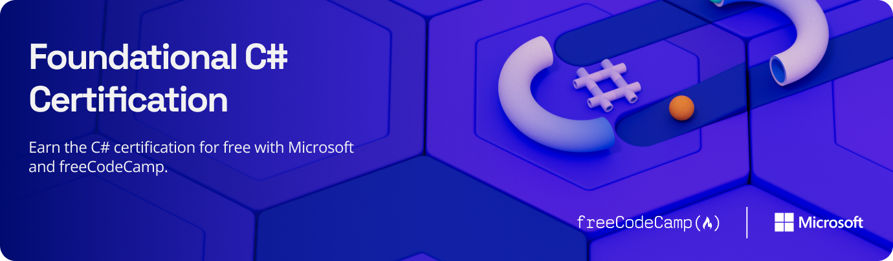
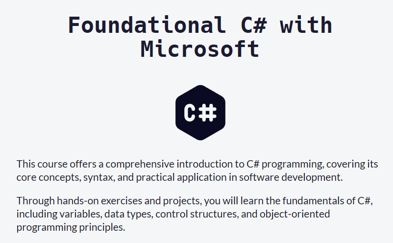
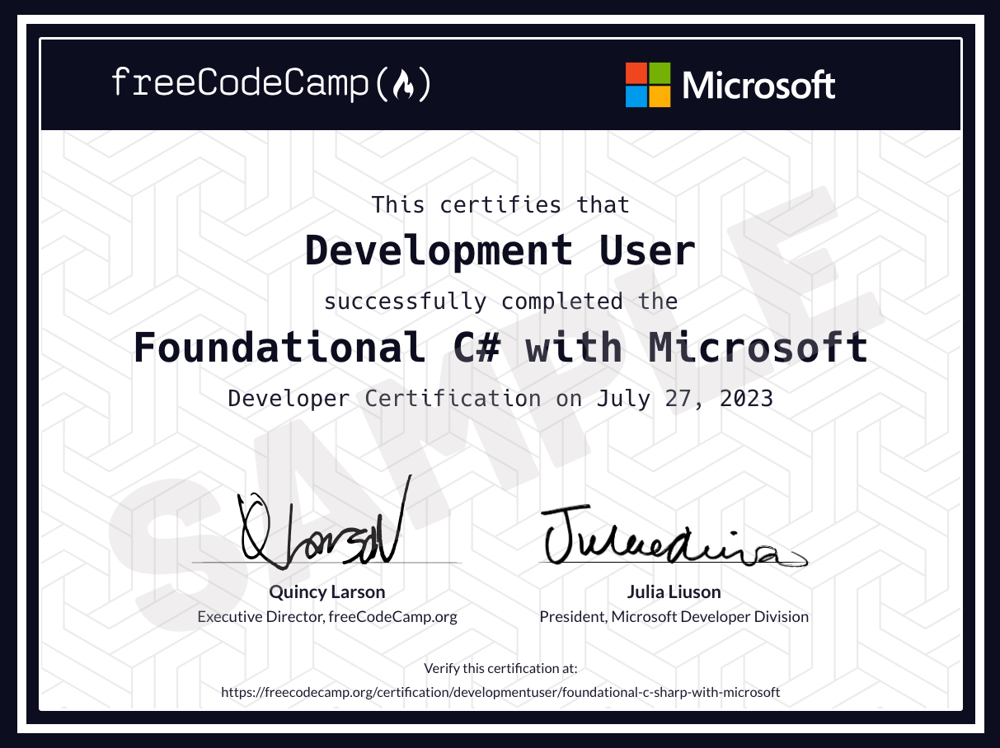

Hello Students and Developers!

We are excited to announce the release of the new [Foundational C# Certification](https://aka.ms/csharp-certification) in collaboration with [freeCodeCamp](https://www.freecodecamp.org/). freeCodeCamp is a charity that creates free learning resources for math, programming, and computer science. The Foundational C# Certification is completely **free**, globally available, and includes a full 35-hour C# training course hosted on [Microsoft Learn](https://aka.ms/selfguidedcsharp).

## Amplify Your C# Career Trajectory

C# continues to shine as a leading programming language, essential in creating dynamic web applications, Unity games, comprehensive enterprise solutions, and more. In the rapidly evolving tech landscape, having tangible proof of your skills and dedication can set you apart.

Our Foundational C# Certification provides just that — a testament to the time and effort you've invested in mastering this versatile language. While no certification can guarantee a job, adding this to your portfolio demonstrates your commitment to continuous growth and your proficiency in C#.

Partnering with the esteemed freeCodeCamp, our certification is not just a badge, but a mark of quality education. It's comprehensive, globally accessible, and free. This ensures that learners everywhere can benefit from a robust C# training on [Microsoft Learn](https://learn.microsoft.com/).

## Why This Certification?

1. **Thorough Knowledge Base:** With a 35-hour training course on [Microsoft Learn](https://aka.ms/selfguidedcsharp), this certification provides a thorough foundation of C#. From core concepts, syntax to practical software development applications – it's all here.
2. **A Credential You Can Showcase:** Existing C# developers, here's your chance to bolster your LinkedIn profile. Display your commitment to continuous learning and expertise to potential employers and peers.
3. **Global and Free:** This certification is free and globally available, ensuring every developer across the globe can access and benefit from it.
4. **A Comprehensive C# Journey:** Partnering with [freeCodeCamp](https://www.freecodecamp.org/), a renowned charity with a world-class learning platform, we've developed a certification that truly stands out. By utilizing resources from [Microsoft Learn](https://aka.ms/selfguidedcsharp), learners will undergo a thorough training program, capped off by an 80-question exam hosted on freeCodeCamp. Master foundational concepts including variables, data types, control structures, and more.

## Earn your certificate

1. Go to the [Foundational C# Certification path on freeCodeCamp](https://aka.ms/csharp-certification). Here you'll find the training content under **Courses**. Press **Expand course** to find all the modules within each course.
2. Click on each module in the course to find the link to the training content for that module.
3. Complete the training content on Microsoft Learn. (Note: If you have previously completed the training content, you do not need to redo it)
4. Once you are done, complete the comprehension check question on freeCodeCamp.
5. At the end of each course, you will receive a Trophy on Microsoft Learn. Each step on freeCodeCamp will show instructions for how you can claim and submit these Trophies.
6. Once you complete all the training, take the exam.
7. Earn your certification!

## Let's Train Together!

- **With Microsoft** : In addition to the training content on Microsoft Learn, we are hosting six office-hour style streaming events to help you succeed. The streams will be September 20 to October 25, every Wednesday at 2:00 pm UTC. In each session, expert presenters will review a training course, walkthrough a guided project, and answer questions. Stay updated with live and on-demand sessions via the [.NET YouTube channel](https://www.youtube.com/dotnet).
- **With freeCodeCamp:** Begin with a [video walkthrough](https://aka.ms/freecodecamp-video) by freeCodeCamp detailing the certification and training journey. For further support, be a part of the vibrant freeCodeCamp community over on the C# section of the freeCodeCamp [Forum](https://forum.freecodecamp.org/c/c-sharp/588).

## Join the challenge

Go beyond certification! Take the C# Challenge and compare your learning journey with global peers. The challenge begins on August 29th! Register here: [https://aka.ms/csharp-challenge](https://aka.ms/csharp-challenge)

## Final Words

Whether you're an aspiring C# developer or a seasoned professional wanting to showcase your expertise, our Foundational C# Certification awaits you. Join us in this enlightening journey and elevate your tech career to unprecedented heights.

[cta-button align='center' text='Get started!' url='https://aka.ms/csharp-certification'  color='#5c33b8']

Happy learning and coding! 🚀👩‍💻👨‍💻