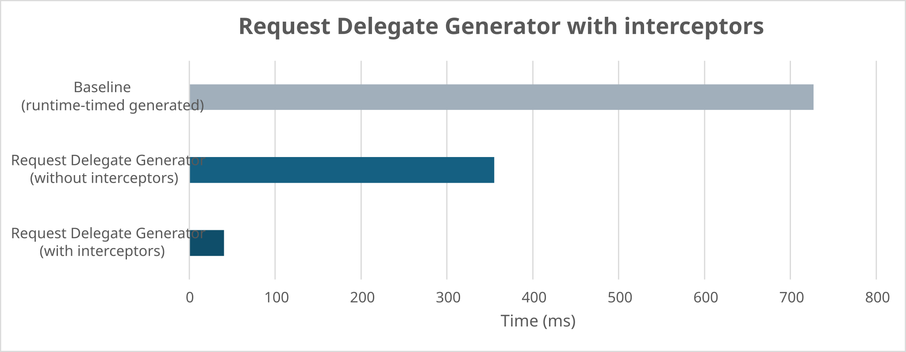
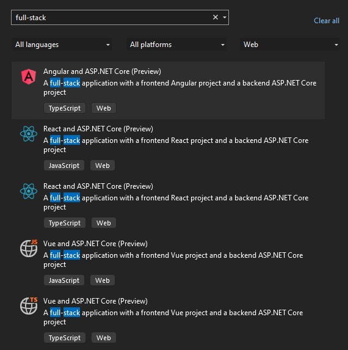

[.NET 8 Preview 7 is now available](https://devblogs.microsoft.com/dotnet/announcing-dotnet-8-preview-7) and includes many great new improvements to ASP.NET Core.

Here's a summary of what's new in this preview release:

- [Servers & middleware](#servers)
    - Antiforgery middleware
- [API authoring](#apis)
    - Antiforgery integration for minimal APIs
- [Native AOT](#native-aot)
    - Request Delegate Generator supports interceptors feature
    - Full TrimMode is used for web projects compiled with trimming enabled
    - `WebApplication.CreateEmptyBuilder`
- [Blazor](#blazor)
    - Antiforgery integration
    - Server-side form handling improvements
    - Auto render mode
    - Register root-level cascading values
    - Improved integration of interactive components with server-side rendering
    - New `EmptyContent` parameter for `Virtualize`
- [Identity](#identity)
    - New bearer token authentication handler
    - New API endpoints
- [Single page apps (SPA)](#spa)
    - New Visual Studio templates

For more details on the ASP.NET Core work planned for .NET 8 see the full [ASP.NET Core roadmap for .NET 8](https://aka.ms/aspnet/roadmap) on GitHub.

## Get started

To get started with ASP.NET Core in .NET 8 Preview 7, [install the .NET 8 SDK](https://dotnet.microsoft.com/next).

If you're on Windows using Visual Studio, we recommend installing the latest [Visual Studio 2022 preview](https://visualstudio.com/preview). If you're using Visual Studio Code, you can try out the new [C# Dev Kit](https://devblogs.microsoft.com/visualstudio/announcing-csharp-dev-kit-for-visual-studio-code/). If you are on macOS, you can now develop using Visual Studio for Mac 17.6.1 after enabling the preview feature for .NET 8 in Preferences.

## Upgrade an existing project

To upgrade an existing ASP.NET Core app from .NET 8 Preview 6 to .NET 8 Preview 7:

- Update the target framework of your app to `net8.0`.
- Update all Microsoft.AspNetCore.\* package references to `8.0.0-preview.7.*`.
- Update all Microsoft.Extensions.\* package references to `8.0.0-preview.7.*`.

See also the full list of [breaking changes](https://docs.microsoft.com/dotnet/core/compatibility/8.0#aspnet-core) in ASP.NET Core for .NET 8.

<a id="servers"></a>
## Servers & middleware

### Antiforgery middleware

This release adds a middleware for validating antiforgery tokens, which are used to mitigate cross-site request forgery attacks. When antiforgery services are registered via the `AddAntiforgery` method, the antiforgery middleware is automatically enabled in the the target application.

```csharp
var builder = WebApplication.CreateBuilder();

builder.Services.AddAntiforgery();

var app = builder.Build();

// Implicitly added by WebApplicationBuilder
// app.UseAntiforgery();

app.Run();
```

The antiforgery middleware itself does _not_ short-circuit the execution of the rest of the request pipeline. Instead the middleware sets the `IAntiforgeryValidationFeature` in the `HttpContext.Features` of the current request. The middleware expects that each framework implementation (minimal APIs, MVC, Blazor, etc.) will react to this feature and short-circuit execution as expected.

The antiforgery token is only validated if:

- The endpoint contains metadata implementing `IAntiforgeryMetadata` where `RequiresValidation=true`.
- The HTTP method associated with the endpoint is a relevant HTTP method (not TRACE, OPTIONS, HEAD, GET).
- The request is associated with a valid endpoint.

Note that the antiforgery middleware must run _after_ the authentication and authorization middleware to avoid inadvertently reading form data when the user is unauthenticated.

<a id="apis"></a>

## API authoring

### Antiforgery integration for minimal APIs

Minimal APIs that accept form data now require antiforgery token validation by default.

In the code sample below:

- Antiforgery services are registered in DI so the antiforgery middleware is automatically enabled.
- Two endpoints are provided for displaying a form: `/antiforgery` which renders a form with a hidden antiforgery token field and `/no-antiforgery` which render a form without the antiforgery token field.
- The `/todo` endpoint processes a `Todo` object from the form and will automatically require antiforgery token validation.

```csharp
using Microsoft.AspNetCore.Antiforgery;
using Microsoft.AspNetCore.Mvc;

var builder = WebApplication.CreateBuilder();

builder.Services.AddAntiforgery();

var app = builder.Build();

app.MapGet("/antiforgery", (HttpContext context, IAntiforgery antiforgery) =>
{
    var token = antiforgery.GetAndStoreTokens(context);
    var html = $"""
        <html>
            <body>
                <form action="/todo" method="POST" enctype="multipart/form-data">
                    <input name="{token.FormFieldName}" type="hidden" value="{token.RequestToken}" />
                    <input type="text" name="name" />
                    <input type="date" name="dueDate" />
                    <input type="checkbox" name="isCompleted" />
                    <input type="submit" />
                </form>
            </body>
        </html>
    """;
    return Results.Content(html, "text/html");
});

app.MapGet("/no-antiforgery", () =>
{
    var html = """
        <html>
            <body>
                <form action="/todo" method="POST" enctype="multipart/form-data">
                    <input type="text" name="name" />
                    <input type="date" name="dueDate" />
                    <input type="checkbox" name="isCompleted" />
                    <input type="submit" />
                </form>
            </body>
        </html>
    """;
    return Results.Content(html, "text/html");
});

app.MapPost("/todo", ([FromForm] Todo todo) => Results.Ok(todo));

app.Run();

class Todo
{
    public string Name { get; set; }
    public bool IsCompleted { get; set; }
    public DateTime DueDate { get; set; }
}
```

submitting the form at `/antiforgery` will result in a successful response. On the other hand, submitting the form at `/no-antiforgery` will produce an exception at runtime because no valid antiforgery token was presented. In `Production` environments, this will produce a log instead of throwing an exception:

```console
Microsoft.AspNetCore.Http.BadHttpRequestException: Invalid antiforgery token found when reading parameter "Todo todo" from the request body as form.
An unhandled exception has occurred while executing the request.
Microsoft.AspNetCore.Http.BadHttpRequestException: Invalid antiforgery token found when reading parameter "Todo todo" from the request body as form.
 ---> Microsoft.AspNetCore.Antiforgery.AntiforgeryValidationException: The required antiforgery request token was not provided in either form field "__RequestVerificationToken" or header value "RequestVerificationToken".
   at Microsoft.AspNetCore.Antiforgery.DefaultAntiforgery.ValidateRequestAsync(HttpContext httpContext)
   at Microsoft.AspNetCore.Antiforgery.Internal.AntiforgeryMiddleware.InvokeAwaited(HttpContext context)
```

 <a id="native-aot"></a>

## Native AOT

### Request Delegate Generator supports interceptors feature

The [Request Delegate Generator](https://devblogs.microsoft.com/dotnet/asp-net-core-updates-in-dotnet-8-preview-3#minimal-apis-and-native-aot) introduced in .NET 8 Preview 3 has been updated to use the new [C# 12 interceptors](https://learn.microsoft.com/dotnet/csharp/whats-new/csharp-12#interceptors) compiler feature to support intercepting calls to minimal API's `Map` action methods with statically generated variants at runtime. As a result of this change, users can expect to see improvements in startup performance for apps compiled with `PublishAot` enabled.

The table below outlines the changes in startup time - the time it takes for routing to process all endpoints in an application - across three scenarios:

- The baseline, where `RequestDelegate`s for endpoints are generated at runtime using reflection and dynamic code generation.
- Endpoints generated at compile-time without the interceptors feature, the default between Preview 3 and Preview 6.
- Endpoints generated at compile-time with the interceptors feature, the default in Preview 7.

| Iteration | Baseline (runtime-timed generated endpoints) | Request Delegate Generator (without interceptors) | Request Delegate Generator (with interceptors) |
| --------- | -------------------------------------------- | ------------------------------------------------- | ---------------------------------------------- |
| 1         | 716.2313ms                                   | 372.5172ms                                        | 31.5255ms                                      |
| 2         | 747.279ms                                    | 355.1435ms                                        | 64.188ms                                       |
| 3         | 730.975ms                                    | 350.5353ms                                        | 32.9315ms                                      |
| 4         | 729.2775ms                                   | 345.8684ms                                        | 34.1169ms                                      |
| 5         | 711.0555ms                                   | 351.2683ms                                        | 38.7152ms                                      |



### Full TrimMode is used for web projects compiled with trimming enabled

In this preview, we introduce a _breaking change_ that will impact Web projects compiled with trimming enabled via `PublishTrimmed=true`. Prior to this release, projects used the `partial` TrimMode by default. Moving forward, `TrimMode=full` will be enabled for all projects that target .NET 8 or above. For more information on this breaking change, see [the announcement](https://github.com/aspnet/Announcements/issues/507).

### `WebApplication.CreateEmptyBuilder`

We've added a new `WebApplicationBuilder` factory method for building small apps that only contain necessary features: `WebApplication.CreateEmptyBuilder(WebApplicationOptions options)`. This `WebApplicationBuilder` is created with no built-in behavior. Your app will contain only the services and middleware that you configure.

Here's an example of using this API to create a small web application:

```C#
var builder = WebApplication.CreateEmptyBuilder(new WebApplicationOptions());
builder.WebHost.UseKestrelCore();

var app = builder.Build();

app.Use(async (context, next) =>
{
    await context.Response.WriteAsync("Hello, World!");
    await next(context);
});

Console.WriteLine("Running...");
app.Run();
```

Publishing this code with native AOT using .NET 8 Preview 7 on a linux-x64 machine results in a self-contained, native executable of about `8.5 MB`.

<a id="blazor"></a>

## Blazor

### Antiforgery integration

Blazor endpoints now require antiforgery protection by default. You can enable antiforgery support using the new antiforgery middleware and using the `AntiforgeryToken` component to generate tokens for rendered forms. The `EditForm` component will add the antiforgery token automatically for you.

Use the `[RequireAntiforgeryToken]` attribute in a Blazor component page to indicate if the component requires antiforgery projection or not. For example, you can disable the antiforgery requirement for a page (not recommended!) like this:

```razor
@using Microsoft.AspNetCore.Antiforgery;
@attribute [RequireAntiforgeryToken(required: false)]
```

### Server-side form handling improvements

You can now build standard HTML forms in Blazor when using server-side rendering and without using `EditForm`. Create a form using the normal HTML `form` tag and specify an `@onsubmit` handler for handling the submitted form request.

```razor
<form method="post" @formname="contact" @onsubmit="AddContact">
    <div>
        <label for="name">Name</label>
        <InputText id="name" @bind-Value="NewContact.Name" />
    </div>
    <div>
        <label for="email">Email</label>
        <InputText id="email" @bind-Value="NewContact.Email" />
    </div>
    <div>
        <InputCheckbox id="send-me-deals" @bind-Value="NewContact.SendMeDeals" />
        <label for="send-me-deals">Send me deals</label>
    </div>
    <button>Submit</button>
    <AntiforgeryToken />
</form>

@code {
    [SupplyParameterFromForm]
    public Contact NewContact { get; set; } = new();

    public class Contact
    {
        public string Name { get; set; }
        public string Email { get; set; }
        public bool SendMeDeals { get; set; }
    }

    private async Task AddContact()
    {
        // Add contact...
        NewContact = new();
    }
}
```

All server-side rendered forms now require a name, which is used to map submitted requests to the appropriate form handler method and for model binding. To specify the name of a plain HTML form, use the new `@formname` attribute. When using `EditForm`, specify the name using the `FormName` parameter.

By default, form names need to be unique, but you can define a scope for form names using the `FormMappingScope` component.

```razor
<FormMappingScope Name="parent-context">
    <ComponentWithFormBoundParameter />
</FormMappingScope>
```

Inputs based on `InputBase<TValue>` will generate form value names that match the names Blazor uses for model binding. You can specify the name Blazor should use to bind form data to the model using the `Name` property on `[SupplyParameterFromForm]`. You can also specify the name of the form whose data should be bound using the `Handler` property (in earlier previews the `Name` property was used for this purpose).

To break a form up into multiple child components, derive your child components from `Editor<T>`. This will ensure that your child components generate the correct form field names based on the model.

**Index.razor**

```razor
<EditForm Model="Customer" method="post" OnSubmit="DisplayCustomer" FormName="customer">
    <div>
        <label>Name</label>
        <InputText @bind-Value="Customer.Name" />
    </div>
    <AddressEditor @bind-Value="Customer.BillingAddress" />
    <button>Send</button>
</EditForm>

@if (submitted)
{
    <!-- Display customer data -->
    <h3>Customer</h3>
    <p>Name: @Customer.Name</p>
    <p>Street: @Customer.BillingAddress.Street</p>
    <p>City: @Customer.BillingAddress.City</p>
    <p>State: @Customer.BillingAddress.State</p>
    <p>Zip: @Customer.BillingAddress.Zip</p>
}

@code {
    public void DisplayCustomer()
    {
        submitted = true;
    }

    [SupplyParameterFromForm] Customer? Customer { get; set; }

    protected override void OnInitialized() => Customer ??= new();

    bool submitted = false;
    public void Submit() => submitted = true;
}
```

**AddressEditor.razor**

```razor
@inherits Editor<Address>

<div>
    <label for="street">Street</label>
    <InputText id="street" @bind-Value="Value.Street" />
</div>
<div>
    <label for="state">State</label>
    <InputText id="state" @bind-Value="Value.State" />
</div>
<div>
    <label id="city">City</label>
    <InputText for="city" @bind-Value="Value.City" />
</div>
<div>
    <label for="zip">Zip</label>
    <InputText id="zip" @bind-Value="Value.Zip" />
</div>
```

Model binding in Blazor now supports binding to the following additional types:

- Recursive types
- Types with constructors
- Enums

You can also now use the `[DataMember]` and `[IgnoreDataMember]` attributes to customize model binding for a type you are authoring. You can use these attributes to rename properties, ignore properties, and mark properties as required. Additional model binding options are available from `RazorComponentOptions` when calling `AddRazorComponents`.

### Auto render mode

The new `Auto` interactive render mode for Blazor web apps combines the strengths of the `Server` and `WebAssembly` render modes into a single dynamic option. The `Auto` render mode uses WebAssembly-based rendering if the .NET WebAssembly runtime can be loaded quickly (within 100ms). This typically is the case when the runtime was previously downloaded and cached, or when using a high speed network. Otherwise, the `Auto` render mode falls back to using the `Server` render mode while the .NET WebAssembly runtime is downloaded in the background.

To use the `Auto` render mode, specify the `@rendermode="@RenderMode.Auto"` attribute on the component instance, or `@attribute [RenderModeAuto]` on the component definition. Note that the component will need to be setup to run from both the server and the browser, so it will need to live in your client project and its implementation must not be tied to either `Server` or `WebAssembly`. Check out the [Blazor Auto render mode](https://github.com/danroth27/Net8BlazorAuto) sample to see how to set this up correctly.

### Register root-level cascading values

Cascading values are a convenient way in Blazor to make state available to a subtree of the component hierarchy. You can now register root-level cascading values so they're available for the entire component hierarchy.

```csharp
// Registers a fixed cascading value
services.AddCascadingValue(sp => new MyCascadedThing { Value = 123 });

// Registers a fixed cascading value by name
services.AddCascadingValue("thing", sp => new MyCascadedThing { Value = 123 });

// Registers a cascading value using CascadingValueSource<TValue>
services.AddCascadingValue(sp =>
{
    var thing = new MyCascadedThing { Value = 456 };
    var source = new CascadingValueSource<MyCascadedThing>(thing, isFixed: false);
    return source;
});
```

### Improved integration of interactive components with server-side rendering

Blazor in .NET 8 has advanced server-side rendering capabilities, like enhanced navigation and form handling. This preview improves the integration of interactive components with server-side rendering. Enhanced navigation, enhanced form handling, and streaming rendering can now add and remove interactive components and set parameters on them.

### New `EmptyContent` parameter for `Virtualize`

The `Virtualize` component now has an `EmptyContent` property that you can use to define what content should be shown when there are no items or when the `ItemsProvider` returns a result with a `TotalItemCount` equal to zero.

Thank you [@etemi](https://github.com/etemi) for this contribution!

<a id="identity"></a>

## Identity

Previously in .NET 8 Preview 4 we added new [Identity API endpoints to register and login users](https://devblogs.microsoft.com/dotnet/asp-net-core-updates-in-dotnet-8-preview-4/#auth) to simplify self-hosted identity management and make it easier to implement and customize identity in Single Page Apps (SPA) and Blazor apps. The default experience is cookie-based, so it "just works" for single domain apps. For scenarios that require tokens, such as accessing your web app from a mobile client, we now provide support for tokens "in the box." These tokens are self-contained and use the same techniques for generation as cookie authentication. It is important to note **these are not JWTs** but self-contained and optimized for first-party apps with no delegated authentication. In multiple-server environments, you will need to configure [data protection](https://learn.microsoft.com/aspnet/core/security/data-protection/configuration/overview) to use shared storage.

### Bearer token authentication handler

The new bearer token authentication handler integrates seamlessly with ASP.NET Core's built-in authentication system. It can be used standalone (without relying on ASP.NET Core identity). It supports issuing and validating tokens. As of Preview 6, it also supports refresh tokens. ASP.NET Core Identity uses the `AddBearerToken` extension to integrate the handler with identity.

### Identity API endpoints

The new .NET 8 set of identity API endpoints provide the HTTP-based APIs to:

- **Register** a new user in the identity system
- **Login** and exchange validated credentials for a cookie or token
- **Refresh** credentials using a refresh token to keep the user logged in without having to re-enter their credentials
- **Confirm email** for extra validation during the registration process
- **Resend confirmation email** if it wasn't received or expired
- **Reset password** to support "forgot password" functionality

There are also protected endpoints that require the user is authenticated to: 

- Manage **two-factor authentication (2FA)**.
- Retrieve or update information in the **user's identity profile**, including claims.

### Get started

The [identity endpoints sample](https://github.com/davidfowl/IdentityEndpointsSample) by David Fowler shows how to configure identity to use the new handler and endpoints. It also contains an [.http file](https://learn.microsoft.com/aspnet/core/test/http-files?view=aspnetcore-8.0) to test the new endpoints inside of Visual Studio.

First, enable the new handler and add authentication and authorization to the app.

```csharp
builder.Services.AddAuthentication().AddBearerToken(IdentityConstants.BearerScheme);
builder.Services.AddAuthorizationBuilder();
```

Next:

- Map the identity model
- Specify a [DbContext](https://learn.microsoft.com/ef/core/dbcontext-configuration/) for the identity store
- Opt-in to use the new endpoints

```csharp
builder.Services.AddIdentityCore<MyUser>()
   .AddEntityFrameworkStores<AppDbContext>()
   .AddApiEndpoints();
```

After calling `Build()`, map the identity endpoints to routes in the application.

```csharp
app.MapIdentityApi<MyUser>();
```

Now you can configure your APIs to use identity. This endpoint accesses identity to return the signed-in user's name and is only available to authenticated users.

```csharp
app.MapGet("/", (ClaimsPrincipal user) => $"Hello {user.Identity!.Name}").RequireAuthorization();
```

This is what an example session might look like:

1. **POST** to the `/register` endpoint to register the user.

    ```json
    {
        "user" : "test",
        "password" : "@T35t!",
        "email" : "test@notadomain.xyz"
    }
    ```

1. **POST** to the `/login?cookieMode=false&persistCookies=false` endpoint to login the user.

    ```json
    {
        "user" : "test",
        "password" : "@T35t!"
    }
    ```

1. Receive the `access_token`, expiration, and `refresh_token`.

    ```json
    {
        "token_type": "Bearer",
        "access_token": "CfDJ9NHobblyWobblyGobblyGoop...",
        "expires_in": 3600,
        "refresh_token": "TokenBabbelYabbaDabbaDoo..."
    }
    ```

1. Call a protected API using the token by setting the `Authentication` header of the request to `Bearer xxx` where `xxx` is the `access_token`.
1. When the user's credentials expire or are about to expire, **POST** to the `/refresh` endpoint and pass the `refresh_token`.

    ```json
    {
        "refreshToken": "TokenBabbelYabbaDabbaDoo..."
    }
    ```
 
1. This will generate a new `access_token`, expiration, and `refresh_token`.
   
These new building blocks make it easier to build authenticated apps that don't delegate authentication.

<a id="spa"></a>

## Single page apps

### New Visual Studio templates

We've been working closely with the Visual Studio team to ensure the [Visual Studio JavaScript & TypeScript development](https://devblogs.microsoft.com/visualstudio/exploring-javascript-and-typescript-development-in-visual-studio/) experience works great for ASP.NET Core developers. Visual Studio includes new project templates for Angular, React, and Vue that are built on the new JavaScript project system (.esproj) and integrate with ASP.NET Core backend projects.



These Visual Studio templates come loaded with functionality for both .NET & JavaScript developers:

- Get started fast with a JavaScript frontend and an ASP.NET Core backend.
- Stay up-to-date with the latest frontend framework versions.
- Integrate with the latest frontend framework command-line tooling.
- Templates for both JavaScript & TypeScript.
- Rich JavaScript & TypeScript code editing experience.
- Clean project separation for the frontend and backend.
- Integrate JavaScript build tools with your .NET build.
- npm dependency management UI.
- Compatible with Visual Studio Code debugging and launch configuration.
- Run frontend unit tests in test explorer using your favorite JavaScript test frameworks.

To focus our efforts on providing the best possible development experience for using frontend JavaScript frameworks with ASP.NET Core, we've removed the existing Angular and React template from the .NET 8 SDK in favor of the new Visual Studio templates. We're working with the Visual Studio team to further improve the new Visual Studio JavaScript with ASP.NET Core templates to support cross-platform development, integration with ASP.NET Core client web assets, simplified publishing, and targeting all supported .NET versions.

You can give the new Visual Studio JavaScript templates a try by installing the latest [Visual Studio preview](https://visualstudio.com/Preview) and then following one of the tutorials for [Angular](https://learn.microsoft.com/visualstudio/javascript/tutorial-asp-net-core-with-angular), [React](https://learn.microsoft.com/visualstudio/javascript/tutorial-asp-net-core-with-react), and [Vue](https://learn.microsoft.com/visualstudio/javascript/tutorial-asp-net-core-with-vue) in the Visual Studio docs. If you have feedback on the new templates you can share it with us using the Visual Studio [Send Feedback](https://learn.microsoft.com/visualstudio/ide/how-to-report-a-problem-with-visual-studio) tool.

## Give feedback

We hope you enjoy this preview release of ASP.NET Core in .NET 8. Let us know what you think about these new improvements by filing issues on [GitHub](https://github.com/dotnet/aspnetcore/issues/new).

Thanks for trying out ASP.NET Core!
