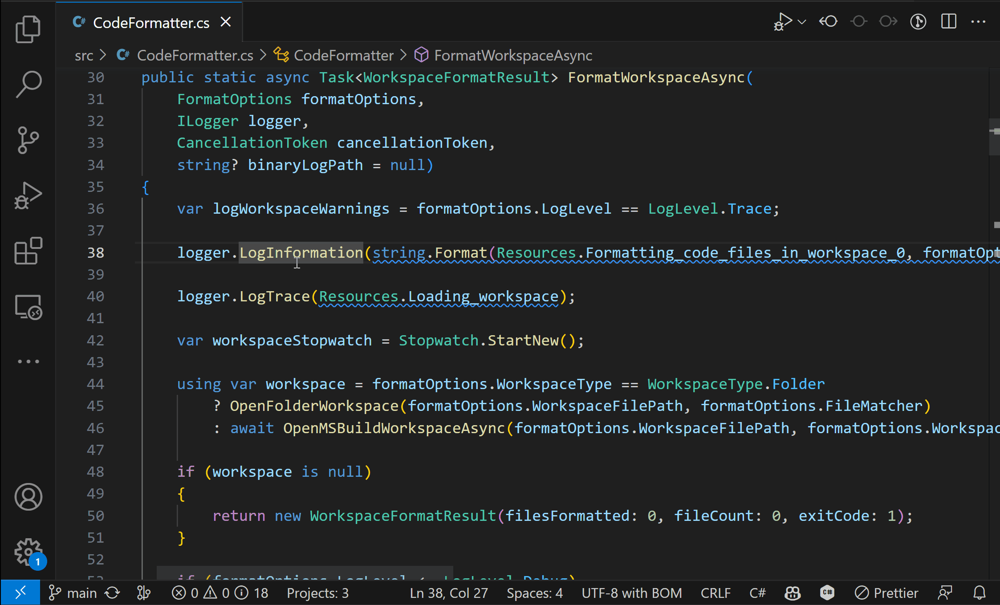

The [C# Dev Kit](https://marketplace.visualstudio.com/items?itemName=ms-dotnettools.csdevkit) for Visual Studio Code experience just got better! Today we released an updated version of the C# extension for Visual Studio Code that provides language server support for C# Dev Kit. In June, we made this available via pre-release, and now you can get this improved user experience powered by a Language Server Protocol (LSP) server which integrates with open source components like [Roslyn](https://github.com/dotnet/roslyn) and [Razor](https://github.com/dotnet/razor), delivering rich type information and a faster, more reliable C# experience.

C# Dev Kit is still in preview, and since our initial release in June, we have been actively listening to your feedback, with a focus on ensuring a high-quality and delightful C# development experience in Visual Studio Code. We sincerely appreciate all the developers who have tried this out and provided us with quick and valuable feedback. Thank you! As a result, we have successfully resolved many issues, and highlights include:

- [.NET MAUI extension preview release](https://devblogs.microsoft.com/visualstudio/announcing-the-dotnet-maui-extension-for-visual-studio-code/)
- Ability to pick a profile when running/debugging
- .NET 8 Support
- Improved unit test discoverability

## Upgrade now to experience the new C# extension

The C# extension, installed as part of C# Dev Kit providing the language service support for the C# developer experience in Visual Studio Code, is now available for general use. You no longer need to install the pre-release version of the C# extension to use C# Dev Kit. This updated open source extension delivers better performance and reliability, so you can focus on what really matters: writing great code. By using the C# extension in conjunction with C# Dev Kit, you can expect faster and more efficient tooling, as well as improved functionality and stability. Whether you're a seasoned developer or just starting out, the updated C# extension and C# Dev Kit will enhance your coding experience and help you write better, more reliable code.

We're committed to continuously improving the C# extension and its features, ensuring a performant and reliable C# language server experience in Visual Studio Code. To learn more about our upcoming features, check out our [feature backlog](https://github.com/dotnet/vscode-csharp/issues/5736). To see the features currently supported in the extension, visit our [documentation](https://code.visualstudio.com/docs/csharp/refactoring). If you need any of the features that are not yet supported by the new C# extension, you can switch back to OmniSharp by following these [instructions](https://github.com/dotnet/vscode-csharp/#how-to-use-omnisharp).

## Let us know what you think!

As we regularly update the C# Dev Kit extension and its features, we encourage you to provide feedback so we can continuously improve and deliver the best possible experience. Download it today from the [Marketplace](https://marketplace.visualstudio.com/items?itemName=ms-dotnettools.csdevkit) or install it directly from the extension gallery in Visual Studio Code.

[cta-button align='center' text='Install C# Dev Kit' url='[https://aka.ms/dotnet-oai-survey-4](https://marketplace.visualstudio.com/items?itemName=ms-dotnettools.csdevkit)'  color='#5c33b8']

Then share your feedback through VS Code’s Help > Report Issue. Select whether it’s a bug, feature request, or performance issue on “An Extension” and select “C# Dev Kit” from the list of extensions. Alternatively, you can also provide feedback directly on [GitHub](https://github.com/microsoft/vscode-dotnettools/issues). We appreciate your input and look forward to hearing from you!
