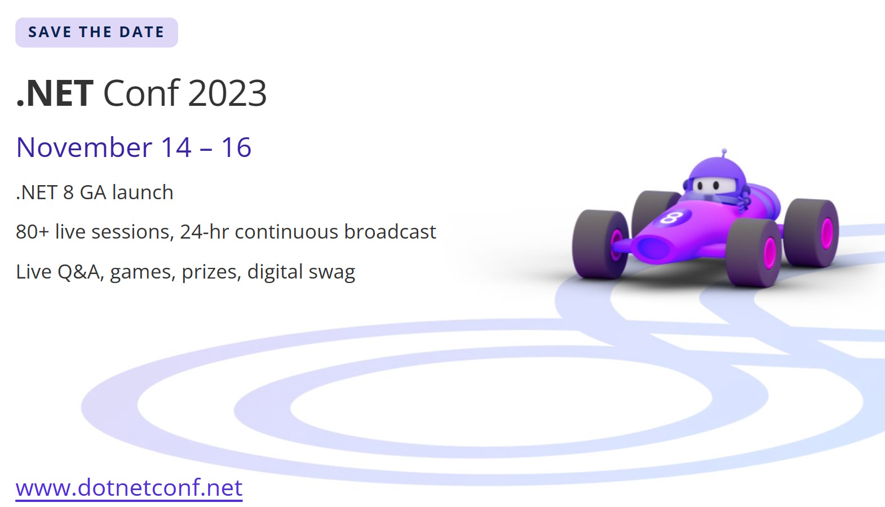

We are thrilled to announce the much-awaited "[.NET Conf 2023](https://www.dotnetconf.net/?utm_campaign=savedate&amp;utm_medium=blog&amp;utm_source=dotnet)," a free, three-day virtual developer event that celebrates the release of .NET 8. Co-organized by the .NET community and Microsoft, this conference has been an annual tradition for the past 12 years, and we are more excited than ever to bring you the best of .NET 8. Get ready to immerse yourself in a world of knowledge, innovation, and fun as we host this remarkable event from November 14th to 16th, 2023.

<a class="cta_button_link" href="https://focus.dotnetconf.net/?utm_campaign=savedate&amp;utm_medium=blog&amp;utm_source=dotnet" style="text-transform: titlecase; display: inline-block; background-color: #5C2D91; color: white; padding: 10px; margin:10px 0; text-decoration: none;" target="_blank">Save the date!</a>

## Embrace the .NET Ecosystem

.NET Conf 2023 is your gateway to exploring the latest advancements in the world of .NET. With the release of .NET 8, we are introducing several groundbreaking features, enhanced performance, and powerful tools that will undoubtedly elevate your development experience. Whether you are a seasoned developer or just starting your journey with .NET, this conference has something in store for everyone.

## A Diverse Array of Live Sessions

Get ready for a dynamic experience with an impressive selection of live sessions featuring renowned speakers from both the .NET community and Microsoft's .NET team. Dive deep into the topics that matter to you the most and stay ahead of the curve with insights and tips from the industry's finest. What's more, we've made it a point to accommodate developers from every corner of the globe by dedicating a portion of the event to a 24-hour continuous broadcast, ensuring everyone can participate, regardless of their time zone.

## Call for Content - Submit Now

The call for content for .NET Conf 2023 is [now open on Sessionize](https://sessionize.com/dotnetconf-2023/)!
  
We are looking for 30 minute talks (including a 5-minute audience Q&A) around .NET, Visual Studio, GitHub, and the Azure Developer Experience. This is your opportunity to share with the .NET community your expertise and learnings on the latest .NET 8 bits.  
 
All sessions MUST be submitted through [Sessionize](https://sessionize.com/dotnetconf-2023/), and we will assemble the best and most interesting sessions to be broadcast live during the event.
  
We're looking forward to your topic submissions that will amaze and excite our .NET developer community!

## Explore Exciting Themes

This year's .NET 8 themes promise to enthrall developers with their relevance and innovation. Topics include:

- **Cloud Native**: Discover how to harness the full potential of .NET in cloud-native environments, unlocking scalability, performance, and resilience.
- **Blazor Full Stack**: Unleash the capabilities of Blazor and explore the seamless integration of client and server-side development.
- **.NET MAUI**: Dive into the world of multi-platform development with .NET MAUI, empowering you to create stunning applications for desktop, mobile, and beyond.
- **Intelligent Apps with .NET**: Explore the fascinating world of AI and machine learning, and learn how to integrate intelligence into your .NET applications.

## Engage and Win Prizes

.NET Conf 2023 is not just about learning; it's about connecting with fellow developers and having fun. Join the excitement on our website, YouTube, and Twitch channels, where you can ask questions live on social media, interact with speakers, and engage in lively discussions. Moreover, don't miss out on our virtual attendee party, where you can win fantastic prizes generously provided by our sponsors.

## Worldwide Local Events

We believe in the power of community, and that's why .NET Conf doesn't stop at the three-day event. We extend our support to organizers worldwide, enabling them to present to their local communities for several months after the conference, ensuring the momentum and knowledge sharing continue.

## Conclusion

.NET Conf 2023 promises to be an extraordinary event, bringing together developers from across the globe to celebrate the release of .NET 8. With its wide selection of live sessions, engaging interactions, and thrilling virtual parties, this conference is an opportunity you don't want to miss. Mark your calendars for November 14th to 16th, and join us as we dive into the future of .NET. Let's come together to learn, connect, and celebrate the incredible achievements of the .NET community.

[cta-button align='center' text='Save the date!' url='https://www.dotnetconf.net'  color='#5c33b8']

Stay tuned for more updates, and don't forget to spread the word among your developer friends and colleagues. Together, let's make .NET Conf 2023 a resounding success!
