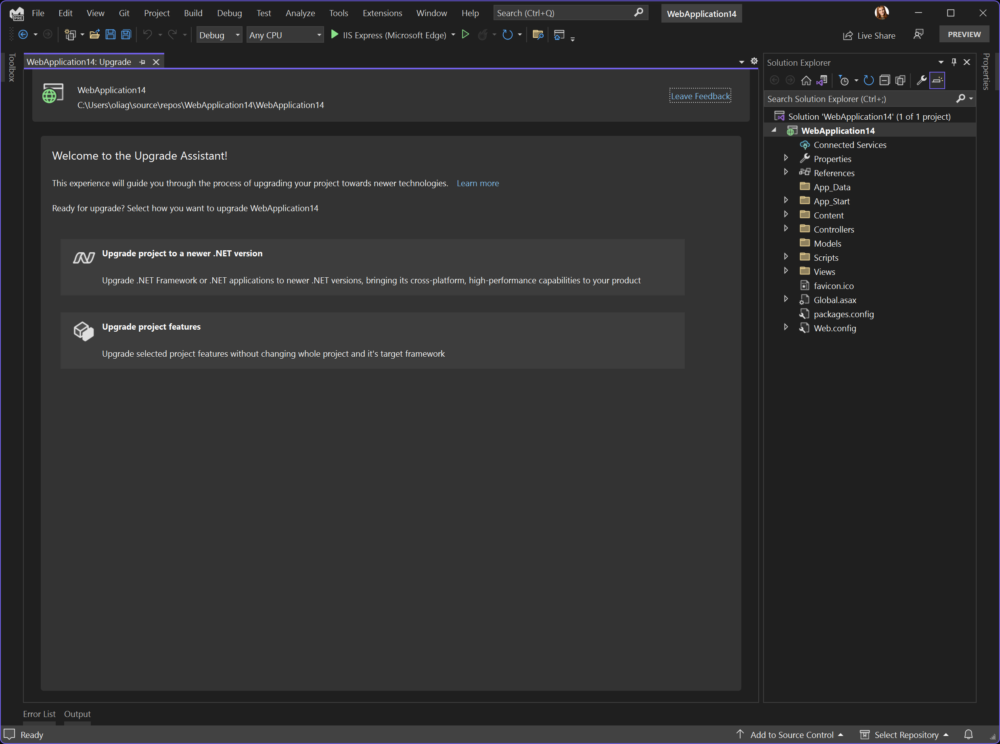
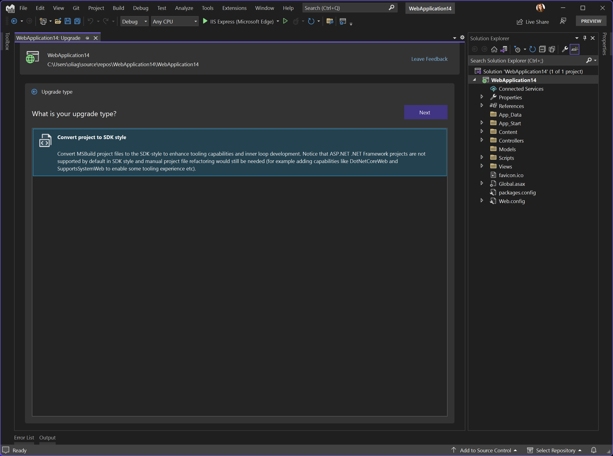
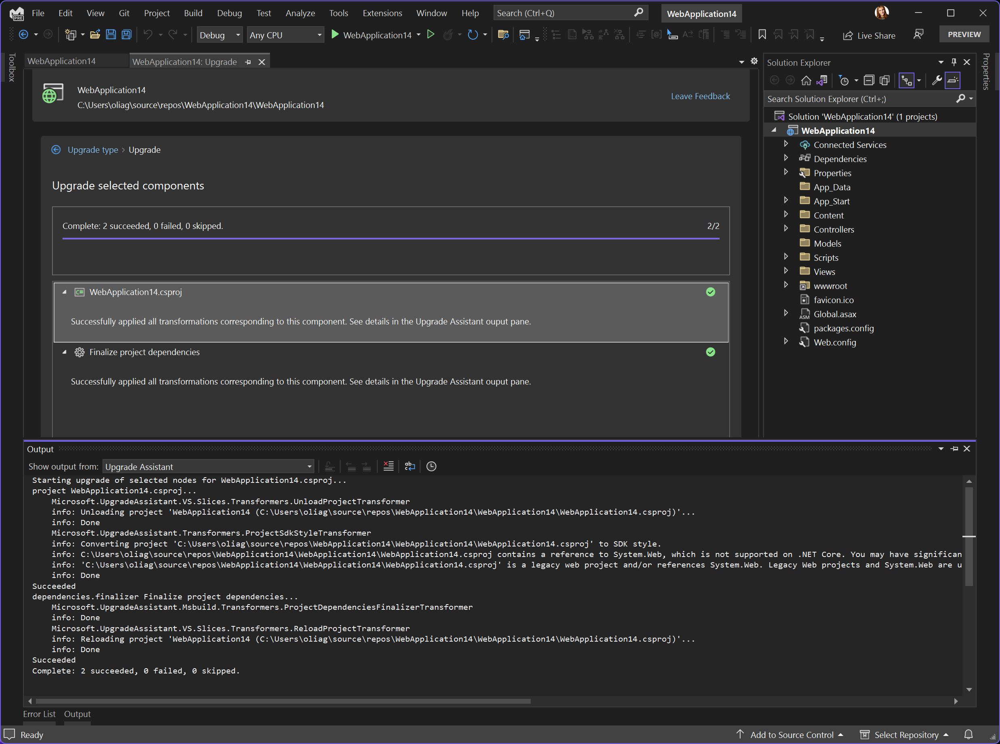
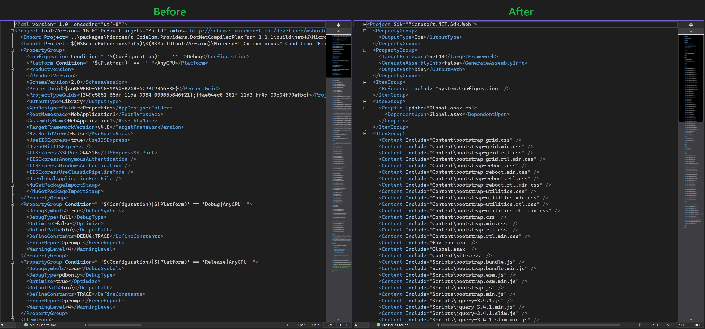
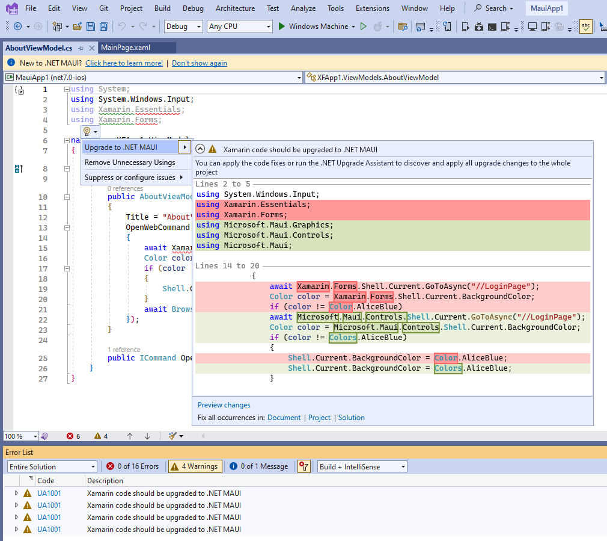

We are happy to announce that we have released a new version of [.NET Upgrade Assistant](https://marketplace.visualstudio.com/items?itemName=ms-dotnettools.upgradeassistant) in Visual Studio that adds the ability to update features of your projects without changing the target framework and has lots of improvements for migrating to .NET MAUI!

The .NET Upgrade Assistant is a tool that helps you upgrade your application to the latest .NET and migrate from older platforms such as Xamarin Forms and UWP to newer offerings. With this new version of the tool you can also upgrade project features without changing the .NET version.

## What's new in this version

### Upgrading project features

We have received feedback that in some cases you wanted to decouple .NET version upgrades from other types of upgrades, for example a very popular request was to enable conversion of the old style project file to the new SDK-style project file without changing the .NET framework version, so you can take an iterative approach in modernizing your applications. Now on the first page of Upgrade Assistant, if there are any projects features upgrades available for your project, you will see two options:
**Upgrade project to a newer .NET version** and **Upgrade project features**.

While the first option leads you to the same experience you've seen in the previous versions of Upgrade Assistant that will help you upgrade your .NET version, the second introduces the new functionality we've added in this release. Once you click on **Upgrade project features** you'll see upgrades available for your project.

Currently there is only one type available - upgrade to SDK-style project file, but we are planning on adding more types here in the future, so do let us know what kind of upgrades you need for your apps (see the section **Give us feedback!** below).

Note that if your project file is already SDK-style, the first page with two options won't be shown to you, and only the .NET version upgrade scenario will be offered.

When you click **Next**, the Upgrade Assistant will convert your project file to the new style while the target framework for your project will remain unchanged.

You can see the project file before and after the upgrade.

### Updates in .NET MAUI migration

We have added many improvements into the .NET MAUI area!

First of all, now you can upgrade your apps on macOS as well using the [CLI version](https://learn.microsoft.com/dotnet/core/porting/upgrade-assistant-overview?WT.mc_id=dotnet-35129-website#upgrade-with-the-cli-tool) of the .NET Upgrade Assistant.

If you prefer to upgrade your Xamarin.Forms to .NET MAUI manually, we have added automatic code fixers to help you update your code. Now you can paste your Xamarin.Forms files into a .NET MAUI project and our new Upgrade Assistant C# analyzer will offer to fix your code to make it compatible with .NET MAUI. You can see a light bulb near Xamarin namespaces that offers to fix the entire document or optionally project or solution.

Besides these two big features we have added numerous bug fixes and infrastrucrure improvements to make the upgrades to .NET MAUI even better. And we will continue work in this area.

## What’s next

We will continue working on improving the quality of upgrades, adding more feature upgrades, improving migration for .NET MAUI and addressing your feedback.

## Learn how to upgrade

We have lots of materials to help you with your upgrade process:

- [Documentation](https://learn.microsoft.com/dotnet/core/porting/upgrade-assistant-overview)
- [Upgrade Assistant website](https://aka.ms/dotnetua)
- [Visual Studio extension installation](https://marketplace.visualstudio.com/items?itemName=ms-dotnettools.upgradeassistant)
- [Video - how to use Visual Studio extension](https://youtu.be/3mPb4KAbz4Y)
- [Video series on Upgrade Assistant and ASP.NET](https://www.youtube.com/playlist?list=PLdo4fOcmZ0oWiK8r9OkJM3MUUL7_bOT9z)
- [CLI Upgrade Assistant](https://learn.microsoft.com/dotnet/core/porting/upgrade-assistant-overview?WT.mc_id=dotnet-35129-website#upgrade-with-the-cli-tool)
- [Tutorial for CLI tool (older version)](https://dotnet.microsoft.com/platform/upgrade-assistant/tutorial/intro)
- [Upgrading Azure Functions](https://learn.microsoft.com/azure/azure-functions/migrate-version-1-version-4?tabs=v4%2Cazure-cli%2Cwindows&pivots=programming-language-csharp)

## Give us feedback

Please give us your feedback so we can build the right tools for you by filling out this [brief survey](https://www.surveymonkey.com/r/CX67DS8).

You can also [file issues or feature requests from Visual Studio](https://learn.microsoft.com/visualstudio/ide/suggest-a-feature) by choosing **Help** | **Send Feedback**. Ensure to mention "Upgrade Assistant vsix" in the title.
