Generative AI, or using AI to create text, images, audio, or basically anything else, has taken the world by storm over the last year. Developers for all manner of applications are now exploring how these systems can be incorporated to the benefit of their users. Yet while the technology advances at a breakneck pace, new models are released every day, and new SDKs constantly pop out of the woodwork, it can be challenging for developers to figure out how to actually get started. There are a variety of polished end-to-end sample applications that .NET developers can use as a reference, for example https://github.com/Azure-Samples/azure-search-openai-demo-csharp/. However, I personally do better when I can build something up incrementally, learning the minimal concepts first, and then expanding on it and making it robust and beautiful later.

To that end, this post focuses on building a simple console-based .NET chat application from the ground up, with minimal dependencies and minimal fuss. The end goal is to be able to ask questions and get answers not only based on the data on which our model was trained, but also on additional data supplied dynamically. Along the way, every code sample shown is a complete application, so you can just copy-and-paste it into a `Program.cs` file, run it, play with it, and then copy-and-paste into your real application, where you can refine and augment it to your heart's content.

## Let's Get Chattin'

To begin, make sure you have .NET 6 or newer installed (though everything discussed here works with .NET Framework as well), and create a simple console app:
```sh
dotnet new console -o chatapp
cd chatapp
```
This creates a new directory `chatapp` and populates it with two files: `chatapp.csproj` and `Program.cs`. We then need to bring in one NuGet package: `Microsoft.SemanticKernel`.
```sh
dotnet add package Microsoft.SemanticKernel --prerelease
```
We could choose to reference specific AI-related packages, like [Azure.AI.OpenAI](https://www.nuget.org/packages/Azure.AI.OpenAI), but I've instead turned to [Semantic Kernel](https://learn.microsoft.com/semantic-kernel/overview/) (SK) as a way to simplify various interactions and more easily swap in and out different implementations in order to more quickly experiment. SK provides a set of libraries that makes it easier to work with Large Language Models (LLMs). It provides abstractions for various AI concepts so that you can code to the abstraction and more easily substitute different implementations. It provides many concrete implementations of those abstractions, wrapping a multitude of other SDKs. It provides support for planning and orchestration, such that you can ask AI to create a plan for how to achieve a certain goal. It provides support for plug-ins. And much more. We'll touch on a variety of those aspects throughout this post, but in this post, I'm primarily using SK for its abstractions.

While for the purposes of this post I've tried to keep dependencies to a minimum, there's one more I can't avoid: you need access to an LLM. The easiest way to get access is via either [OpenAI](https://platform.openai.com/signup) or [Azure OpenAI](https://learn.microsoft.com/azure/ai-services/openai/how-to/create-resource). I'm using Azure OpenAI, but because I'm using SK, switching to use OpenAI instead requires changing just one line in each of the samples. You'll need four pieces of information for the remainder of the post:
- The endpoint. This will be something like `https://whatevernameyouselected.openai.azure.com/`, provided to you in the portal for your service.
- Your API key, provided to you in the portal for your service.
- A deployed "chat" model. I'm using `gpt-35-turbo`, and specifically version 0301, which as of this writing is the default for that model and has a context window of ~16K tokens. We'll talk more about what this is later, but when you deploy one of these in your service, you'll give it a name; I've chosen something incredibly clever: `Gpt35Turbo_0301`.
- A deployed "embedding" model. I'm using `text-embedding-ada-002`, and my deployment's name is `TextEmbeddingAda002_1`.

With that out of the way, we can dive in. Believe it or not, we can create a simple chat app in just a few lines code. You can copy-and-paste this into your `Program.cs`:
```C#
using Microsoft.SemanticKernel;

string aoaiEndpoint = Environment.GetEnvironmentVariable("AZUREOPENAI_ENDPOINT")!;
string aoaiApiKey = Environment.GetEnvironmentVariable("AZUREOPENAI_API_KEY")!;
string aoaiModel = "Gpt35Turbo_0301";

// Initialize the kernel
IKernel kernel = Kernel.Builder
    .WithAzureChatCompletionService(aoaiModel, aoaiEndpoint, aoaiApiKey)
    .Build();

// Q&A loop
while (true)
{
    Console.Write("Question: ");
    Console.WriteLine(await kernel.InvokeSemanticFunctionAsync(Console.ReadLine()!, maxTokens: 2000));
    Console.WriteLine();
}
```
To avoid accidentally leaking my API key (which needs to be protected like you would a password) to the world in this post, I've stored it in an environment variable. Thus, I read in the API key and endpoint via `GetEnvironmentVariable`. I then create a new "kernel" with the SK APIs, asking it to add into the kernel an Azure OpenAI chat completion service. The `Microsoft.SemanticKernel` package we pulled in earlier includes references to both the OpenAI and Azure OpenAI clients, so we don't need anything additional to be able to talk to these services. And with that configured, we can now run our chat app (`dotnet run`), typing out questions and getting answers back from the service:
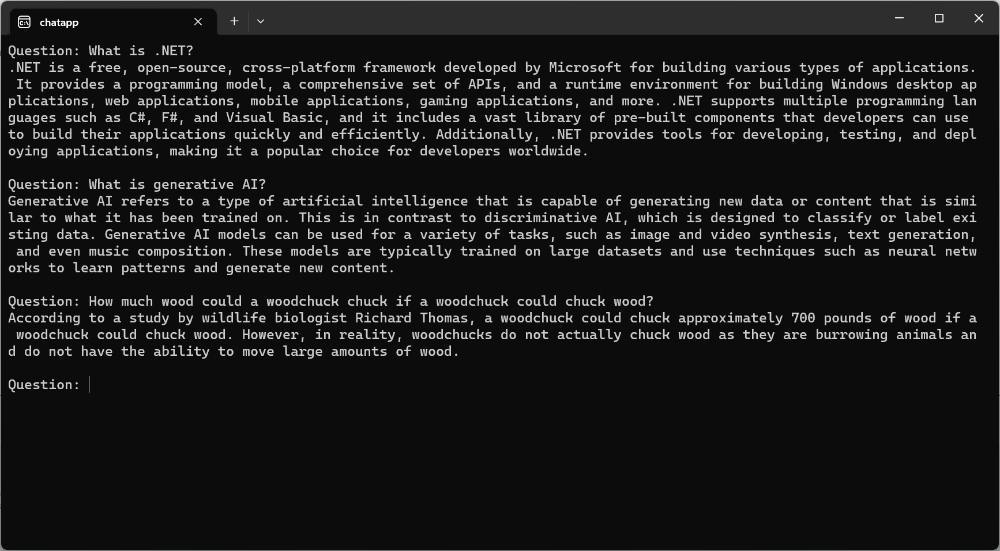

The `await kernel.InvokeSemanticFunctionAsync(Console.ReadLine()!, maxTokens: 2000)` line in there is the entirety of the interaction with the LLM. This reads in the user's question and sends it off to the LLM, getting back a `string` response that'll be limited to at most 2000 tokens (a "token" is the unit at which an LLM operates, sometimes a whole word, sometimes a portion of a word, sometimes a single character). SK supports multiple kinds of functions that can be invoked, including ["semantic functions"](https://learn.microsoft.com/semantic-kernel/ai-orchestration/semantic-functions?tabs=Csharp) (text-based interactions with AI) and ["native functions"](https://learn.microsoft.com/semantic-kernel/ai-orchestration/native-functions?tabs=Csharp) (.NET methods that can do anything C# code can do). The invocation of these functions can be issued directly by the consumer, as we're doing here, but they can also be invoked as part of a ["plan"](https://learn.microsoft.com/semantic-kernel/ai-orchestration/planner?tabs=Csharp): you supply a set of functions, each of which is capable of accomplishing something, and you ask the LLM for a plan for how to use one or more of those functions to achieve some described goal... SK can then invoke the functions according to the plan (we'll see an example of that later).

We can make this isolated function nature a bit clearer by separating the function out into its own entity, via the `CreateSemanticFunction` method. In doing so, we're no longer creating a new function per user input, and thus need some way to parameterize the created function with the user's input. For that, SK includes support for prompt templates, where you supply the prompt but with placeholders that SK will fill in based on the variables and functions available to it. For example, if I run the previous sample again, and this time ask for the current time, the LLM is unable to provide me with an answer:
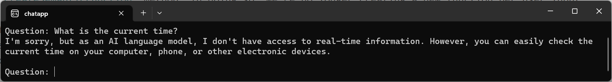
However, if we expect such questions, we can proactively provide the LLM with the information it needs as part of the prompt. Here I've registered with the kernel a native function that returns the current date and time. Then I've created a semantic function, with a prompt template that will invoke this function as part of rendering the prompt, and that will also include the value of the `$input` variable; `$input` is the name of the primary input (additional variables can be named and supplied via a `ContextVariables` dictionary passed to `InvokeAsync`):
```C#
using Microsoft.SemanticKernel;
using Microsoft.SemanticKernel.SkillDefinition;

string aoaiEndpoint = Environment.GetEnvironmentVariable("AZUREOPENAI_ENDPOINT")!;
string aoaiApiKey = Environment.GetEnvironmentVariable("AZUREOPENAI_API_KEY")!;
string aoaiModel = "Gpt35Turbo_0301";

// Initialize the kernel
IKernel kernel = Kernel.Builder
    .WithAzureChatCompletionService(aoaiModel, aoaiEndpoint, aoaiApiKey)
    .Build();

// Register a function with the kernel
kernel.RegisterCustomFunction(SKFunction.FromNativeFunction(() => $"{DateTime.UtcNow:r}", "DateTime", "Now", "Gets the current date and time"));
ISKFunction qa = kernel.CreateSemanticFunction("""
    The current date and time is {{ datetime.now }}.
    {{ $input }}
    """, maxTokens: 2000);

// Q&A loop
while (true)
{
    Console.Write("Question: ");
    Console.WriteLine(await qa.InvokeAsync(Console.ReadLine()!, kernel.Skills));
    Console.WriteLine();
}
```
When that function is invoked, it will render the prompt, filling in those placeholders by invoking the registered `Now` function and substituting its result into the prompt, and similarly by substituting the `input` variable into the prompt. Now when I ask the same question, the answer is more satisfying:
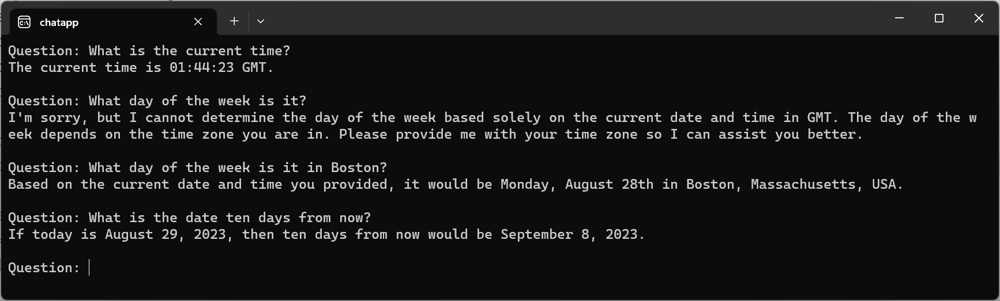

## A Trip Down Memory Lane

We're making good progress: in just a few lines of code, we've been able to create a simple chat agent to which we can repeatedly pose questions and get answers, and we've been able to provide additional information in the prompt to help it answer questions it would have otherwise been unable to answer. However, we've also created a chat agent with no memory, such that it has no concept of things previously discussed:
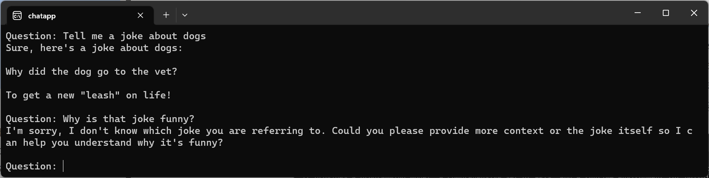

These LLMs are stateless. To address the lack of memory, we need to keep track of our chat history and send it back as part of the prompt on each request. We could do so manually, rendering it into the prompt ourselves, or we could rely on SK to do it for us (and it can rely on the underlying clients for Azure OpenAI, OpenAI, or whatever other chat service is plugged in). This does the latter, getting the registered `IChatCompletion` service, creating a new chat (which is essentially just a list of all messages added to it), and then not only issuing requests and printing out responses, but storing both into the chat history.
```C#
using Microsoft.SemanticKernel;
using Microsoft.SemanticKernel.AI.ChatCompletion;

string aoaiEndpoint = Environment.GetEnvironmentVariable("AZUREOPENAI_ENDPOINT")!;
string aoaiApiKey = Environment.GetEnvironmentVariable("AZUREOPENAI_API_KEY")!;
string aoaiModel = "Gpt35Turbo_0301";

// Initialize the kernel
IKernel kernel = Kernel.Builder
    .WithAzureChatCompletionService(aoaiModel, aoaiEndpoint, aoaiApiKey)
    .Build();

// Create a new chat
IChatCompletion ai = kernel.GetService<IChatCompletion>();
ChatHistory chat = ai.CreateNewChat("You are an AI assistant that helps people find information.");

// Q&A loop
while (true)
{
    Console.Write("Question: ");
    chat.AddUserMessage(Console.ReadLine()!);

    string answer = await ai.GenerateMessageAsync(chat);
    chat.AddAssistantMessage(answer);
    Console.WriteLine(answer);

    Console.WriteLine();
}
```
With that chat history rendered into an appropriate prompt, we then get back much more satisfying results:
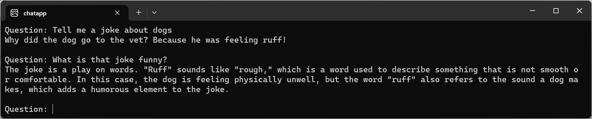

In a real implementation, you'd need to pay attention to many other details, like the fact that all of these language models have limits on the amount of data they're able to process (the "context window"). The model I'm using has a context window of ~16,000 tokens, plus there's a per-token cost associated with every request/response, so once this graduates from experimentation to "let's put this into production," we'd need to start paying a lot more attention to things like how much data is actually in the chat history, clearing out portions of it, etc.

We can also add a tiny bit of code to help make the interaction feel snappier. These LLMs work based on generating the next token in the response, so although up until now we've only been printing out the response when the whole thing has arrived, we can actually stream the results so that we print out portions of the response as it's available. This is exposed in SK via `IAsyncEnumerable<T>`, making it conventient to work with via `await foreach` loops.
```C#
using Microsoft.SemanticKernel;
using Microsoft.SemanticKernel.AI.ChatCompletion;
using System.Text;

string aoaiEndpoint = Environment.GetEnvironmentVariable("AZUREOPENAI_ENDPOINT")!;
string aoaiApiKey = Environment.GetEnvironmentVariable("AZUREOPENAI_API_KEY")!;
string aoaiModel = "Gpt35Turbo_0301";

// Initialize the kernel
IKernel kernel = Kernel.Builder
    .WithAzureChatCompletionService(aoaiModel, aoaiEndpoint, aoaiApiKey)
    .Build();

// Create a new chat
IChatCompletion ai = kernel.GetService<IChatCompletion>();
ChatHistory chat = ai.CreateNewChat("You are an AI assistant that helps people find information.");
StringBuilder builder = new();

// Q&A loop
while (true)
{
    Console.Write("Question: ");
    chat.AddUserMessage(Console.ReadLine()!);

    builder.Clear();
    await foreach (string message in ai.GenerateMessageStreamAsync(chat))
    {
        Console.Write(message);
        builder.Append(message);
    }
    Console.WriteLine();
    chat.AddAssistantMessage(builder.ToString());

    Console.WriteLine();
}
```
Now when we run this, we can see the response streaming in:
[video src="PoemAboutDogs.mp4"]

## Mind the Gap

So, we're now able to submit questions and get back answers. We're able to keep a history of these interactions and use them to influence the answers. And we're able to stream our results. Are we done? Not exactly.

Thus far, the only information the LLM has to provide answers is the data on which it was trained, plus anything we proactively put into the prompt (e.g. the current time in a previous example). That means if we ask questions about things the LLM wasn't trained on or for which it has significant gaps in its knowledgebase, the answers we get back are likely to be unhelpful, misleading, or blatantly wrong (aka "hallucinations"). For example, consider this question and answer:
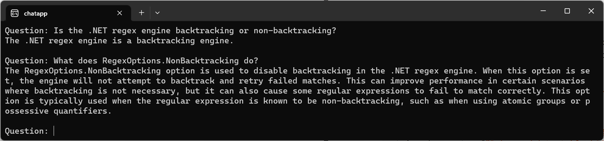
The question is asking about functionality introduced in .NET 7, which was released after the GTP 3.5 Turbo model was trained. It has no information about the functionality, and starts hallucinating and just making up stuff. We need to find a way to teach it about the things the user is asking about.

We've already seen a way of teaching the LLM things: put it in the prompt. So let's try that. The blog post [Performance Improvements in .NET 7](https://devblogs.microsoft.com/dotnet/performance_improvements_in_net_7/), which was also posted after the GTP 3.5 Turbo model was trained, contains a lengthy section on `Regex` improvements in .NET 7, including about that new `RegexOptions.NonBacktracking` option, so if we put it all into the prompt, that should provide the LLM with what it needs. Here I've just augmented the previous example with an additional section of code that downloads the contents of the web page, does a hack job of cleaning up the contents a bit, and then adding that all into a user message.
```C#
using Microsoft.SemanticKernel;
using Microsoft.SemanticKernel.AI.ChatCompletion;
using System.Net;
using System.Text;
using System.Text.RegularExpressions;

string aoaiEndpoint = Environment.GetEnvironmentVariable("AZUREOPENAI_ENDPOINT")!;
string aoaiApiKey = Environment.GetEnvironmentVariable("AZUREOPENAI_API_KEY")!;
string aoaiModel = "Gpt35Turbo_0301";

// Initialize the kernel
IKernel kernel = Kernel.Builder
    .WithAzureChatCompletionService(aoaiModel, aoaiEndpoint, aoaiApiKey)
    .Build();

// Create a new chat
IChatCompletion ai = kernel.GetService<IChatCompletion>();
ChatHistory chat = ai.CreateNewChat("You are an AI assistant that helps people find information.");
StringBuilder builder = new();

// Download a document and add all of its contents to our chat
using (HttpClient client = new())
{
    string s = await client.GetStringAsync("https://devblogs.microsoft.com/dotnet/performance_improvements_in_net_7");
    s = WebUtility.HtmlDecode(Regex.Replace(s, @"<[^>]+>|&nbsp;", ""));
    chat.AddUserMessage("Here's some additional information: " + s); // uh oh!
}

// Q&A loop
while (true)
{
    Console.Write("Question: ");
    chat.AddUserMessage(Console.ReadLine()!);

    builder.Clear();
    await foreach (string message in ai.GenerateMessageStreamAsync(chat))
    {
        Console.Write(message);
        builder.Append(message);
    }
    Console.WriteLine();
    chat.AddAssistantMessage(builder.ToString());

    Console.WriteLine();
}
```
And the result?
```text
Unhandled exception. Microsoft.SemanticKernel.AI.AIException: Invalid request: The request is not valid, HTTP status: 400
 ---> Azure.RequestFailedException: This model's maximum context length is 16384 tokens. However, your messages resulted in 155751 tokens. Please reduce the length of the messages.
Status: 400 (model_error)
ErrorCode: context_length_exceeded
```
Oops! Even without any additional history, we exceeded the context window by almost 10 times. We obviously need to include less information, but we still need to ensure it's relevant information. RAG to the rescue.

"RAG," or Retrieval Augmented Generation, is just a fancy way of saying "look up some stuff and put it into the prompt." Rather than putting all possible information into the prompt, we'll instead index all of the additional information we care about, and then when a question is asked, we'll use that question to find the most relevant indexed content and put just that additional content into the prompt. And to help with that, we need embeddings.

Think of an "embedding" as a vector (array) of floating-point values that represents some content and its semantic meaning. We can ask a model specifically focused on embeddings to create such a vector for a particular input, and then we can store both the vector and the text that seeded it into a database. Later on, when a question is asked, we can similarly run that question through the same model, and we can use the resulting vector to look up the most relevant embeddings in our database. We're not necessarily looking for exact matches, just ones that are close enough. And you can take "close" here literally; the lookups are typically performed using functions that use a distance measure, such as [cosine similarity](https://en.wikipedia.org/wiki/Cosine_similarity). For example, consider this program:
```C#
using Microsoft.SemanticKernel.AI.Embeddings;
using Microsoft.SemanticKernel.Connectors.AI.OpenAI.TextEmbedding;

string aoaiEndpoint = Environment.GetEnvironmentVariable("AZUREOPENAI_ENDPOINT")!;
string aoaiApiKey = Environment.GetEnvironmentVariable("AZUREOPENAI_API_KEY")!;
var embeddingGen = new AzureTextEmbeddingGeneration("TextEmbeddingAda002_1", aoaiEndpoint, aoaiApiKey);

string input = "What is an amphibian?";
string[] examples =
{
    "What is an amphibian?",
    "Cos'è un anfibio?",
    "A frog is an amphibian.",
    "Frogs, toads, and salamanders are all examples.",
    "Amphibians are four-limbed and ectothermic vertebrates of the class Amphibia.",
    "They are four-limbed and ectothermic vertebrates.",
    "A frog is green.",
    "A tree is green.",
    "It's not easy bein' green.",
    "A dog is a mammal.",
    "A dog is a man's best friend.",
    "You ain't never had a friend like me.",
    "Rachel, Monica, Phoebe, Joey, Chandler, Ross",
};

// Generate embeddings for each piece of text
ReadOnlyMemory<float> inputEmbedding = await embeddingGen.GenerateEmbeddingAsync(input);
ReadOnlyMemory<float>[] exampleEmbeddings = await Task.WhenAll(examples.Select(example => embeddingGen.GenerateEmbeddingAsync(example)));

// Print the cosine similarity between the input and each example
float[] similarity = exampleEmbeddings.Select(e => CosineSimilarity(e.Span, inputEmbedding.Span)).ToArray();
similarity.AsSpan().Sort(examples.AsSpan(), (f1, f2) => f2.CompareTo(f1));
Console.WriteLine("Similarity Example");
for (int i = 0; i < similarity.Length; i++)
    Console.WriteLine($"{similarity[i]:F6}   {examples[i]}");

static float CosineSimilarity(ReadOnlySpan<float> x, ReadOnlySpan<float> y)
{
    float dot = 0, xSumSquared = 0, ySumSquared = 0;

    for (int i = 0; i < x.Length; i++)
    {
        dot += x[i] * y[i];
        xSumSquared += x[i] * x[i];
        ySumSquared += y[i] * y[i];
    }

    return dot / (MathF.Sqrt(xSumSquared) * MathF.Sqrt(ySumSquared));
}
```
This uses the Azure OpenAI embedding generation service to get an embedding vector (using the `TextEmbeddingAda002_1` deployment I mentioned at the beginning of the post) for both an input and a bunch of other pieces of text. It then compares the resulting embedding for the input against the resulting embedding for each of those other texts, sorts the results by similarity, and prints them out:
```text
Similarity Example
1.000000   What is an amphibian?
0.937651   A frog is an amphibian.
0.902491   Amphibians are four-limbed and ectothermic vertebrates of the class Amphibia.
0.873569   Cos'è un anfibio?
0.866632   Frogs, toads, and salamanders are all examples.
0.857454   A frog is green.
0.842596   They are four-limbed and ectothermic vertebrates.
0.802171   A dog is a mammal.
0.784479   It's not easy bein' green.
0.778341   A tree is green.
0.756669   A dog is a man's best friend.
0.734219   You ain't never had a friend like me.
0.721176   Rachel, Monica, Phoebe, Joey, Chandler, Ross
```

Let's incorporate this into our chat app. In this iteration, I've augmented the previous chat example with a few things:
- To better help us see what's going on under the covers, I've enable logging in the kernel, by using the `WithLoggerFactory` method to register an `ILoggerFactory` that logs to the console. That also requires us to add a couple of additional packages:
    ```text
    dotnet add package Microsoft.Extensions.Logging
    dotnet add package Microsoft.Extensions.Logging.Console
    ```
- To enable SK to do the embedding generation on our behalf via its abstractions, I've provided the kernel with the service and model to use for embedding generation, with the `WithAzureTextEmbeddingGenerationService` method and the `TextEmbeddingAda002_1` deployment.
- To enable storing the generated embeddings, we need a database. I've used `WithMemoryStorage` to register a `VolatileMemoryStore` instance; while we'll change that later, this will suffice for now. `VolatileMemoryStore` is simply an implementation of SK's `IMemoryStore` abstraction wrapping an in-memory dictionary.
- I've taken the downloaded text, used SK's `TextChunker` to break it fairly arbitrarily into pieces, and then I've used `SaveInformationAsync` to save each of those pieces to the memory store. That call will use the embedding service to generate an embedding for the text and then store the resulting vector and the input text into the aforementioned dictionary.
- Then, when it's time to ask a question, rather than just adding the question to the chat history and submitting that, we first use the question to `SearchAsync` on the memory store. That will again use the embedding service to get an embedding vector for the question, and then search the store for the closest vectors to that input. I've arbitrarily had it return the three closest matches, for which it then appends together the associated text, adds the results into the chat history, and submits that. After submitting the request, I've also then removed this additional context from my chat history, so that it's not sent again on subsequent requests; this additional information can consume much of the allowed context window.

```C#
using Microsoft.Extensions.Logging;
using Microsoft.SemanticKernel;
using Microsoft.SemanticKernel.AI.ChatCompletion;
using Microsoft.SemanticKernel.Memory;
using Microsoft.SemanticKernel.Text;
using System.Net;
using System.Text;
using System.Text.RegularExpressions;

string aoaiEndpoint = Environment.GetEnvironmentVariable("AZUREOPENAI_ENDPOINT")!;
string aoaiApiKey = Environment.GetEnvironmentVariable("AZUREOPENAI_API_KEY")!;
string aoaiModel = "Gpt35Turbo_0301";

// Initialize the kernel
IKernel kernel = Kernel.Builder
    .WithLoggerFactory(LoggerFactory.Create(builder => builder.AddConsole()))
    .WithAzureChatCompletionService(aoaiModel, aoaiEndpoint, aoaiApiKey)
    .WithAzureTextEmbeddingGenerationService("TextEmbeddingAda002_1", aoaiEndpoint, aoaiApiKey)
    .WithMemoryStorage(new VolatileMemoryStore())
    .Build();

// Download a document and create embeddings for it
ISemanticTextMemory memory = kernel.Memory;
string collectionName = "net7perf";
using (HttpClient client = new())
{
    string s = await client.GetStringAsync("https://devblogs.microsoft.com/dotnet/performance_improvements_in_net_7");
    List<string> paragraphs =
        TextChunker.SplitPlainTextParagraphs(
            TextChunker.SplitPlainTextLines(
                WebUtility.HtmlDecode(Regex.Replace(s, @"<[^>]+>|&nbsp;", "")),
                128),
            1024);
    for (int i = 0; i < paragraphs.Count; i++)
        await memory.SaveInformationAsync(collectionName, paragraphs[i], $"paragraph{i}");
}

// Create a new chat
IChatCompletion ai = kernel.GetService<IChatCompletion>();
ChatHistory chat = ai.CreateNewChat("You are an AI assistant that helps people find information.");
StringBuilder builder = new();

// Q&A loop
while (true)
{
    Console.Write("Question: ");
    string question = Console.ReadLine()!;

    builder.Clear();
    await foreach (var result in memory.SearchAsync(collectionName, question, limit: 3))
        builder.AppendLine(result.Metadata.Text);
    int contextToRemove = -1;
    if (builder.Length != 0)
    {
        builder.Insert(0, "Here's some additional information: ");
        contextToRemove = chat.Count;
        chat.AddUserMessage(builder.ToString());
    }

    chat.AddUserMessage(question);

    builder.Clear();
    await foreach (string message in ai.GenerateMessageStreamAsync(chat))
    {
        Console.Write(message);
        builder.Append(message);
    }
    Console.WriteLine();
    chat.AddAssistantMessage(builder.ToString());

    if (contextToRemove >= 0) chat.RemoveAt(contextToRemove);
    Console.WriteLine();
}
```
When I run this, I now see lots of logging happening:
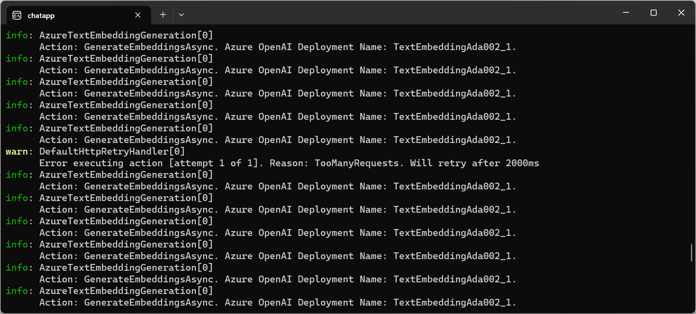
The text chunking code split the document into 163 "paragraphs," leading to 163 embeddings being generated and stored in our database. For one or two of the resulting requests, they were also throttled, with the service sending back an error saying that too many requests were being issued in too short a period of time, and the `HttpClient` used by SK automatically retried after a few seconds, at which point it was able to successfully continue. The cool thing is now with all of those embeddings, when we ask our question, it results in pulling from the database the most relevant material, that additional text is added to the prompt, and now when we ask the same questions we did earlier, we get a much more helpful and accurate response:
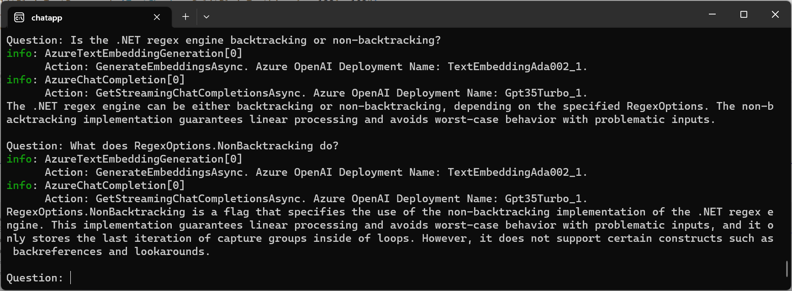
Sweet.

## Persistence of Memory

Of course, we don't want to have to index the material every time the app restarts. Imagine this was a site that was enabling chatting with thousands of documents; reindexing all of that content every time a process was restarted would not only be time consuming, it would be unnecessarily expensive (the [pricing details](https://azure.microsoft.com/pricing/details/cognitive-services/openai-service/) for the Azure OpenAI embedding model I'm using here highlight that at the time of this writing it costs $0.0001 per 1,000 tokens, which means just this one document costs a few cents to index). So, we want to switch to using a database. SK provides a multitude of `IMemoryStore` implementations, and we can easily switch to one that actually persists the results. For example, let's switch to one based on Sqlite. For this, we need another NuGet package:
```sh
dotnet add package Microsoft.SemanticKernel.Connectors.Memory.Sqlite --prerelease
```
and with that, we can change just one line of code to switch from the `VolatileMemoryStore`:
```C#
.WithMemoryStorage(new VolatileMemoryStore())
```
to the `SqliteMemoryStore`:
```C#
.WithMemoryStorage(await SqliteMemoryStore.ConnectAsync("mydata.db"))
```
Sqlite is an embedded SQL database engine that runs in the same process and stores its data in regular disk files. Here, it'll connect to a `mydata.db` file, creating it if it doesn't already exist. Now, if we were to run that, we'd still end up creating the embeddings again, as in our previous example there wasn't any guard checking to see whether the data already existed. Thus, our final change is simply to guard that work:
```C#
IList<string> collections = await memory.GetCollectionsAsync();
if (!collections.Contains("net7perf"))
{
    ... // same code as before to download and process the document
}
```
You get the idea. Here's the full version using Sqlite:
```C#
using Microsoft.Extensions.Logging;
using Microsoft.SemanticKernel;
using Microsoft.SemanticKernel.AI.ChatCompletion;
using Microsoft.SemanticKernel.Connectors.Memory.Sqlite;
using Microsoft.SemanticKernel.Memory;
using Microsoft.SemanticKernel.Text;
using System.Collections;
using System.Net;
using System.Text;
using System.Text.RegularExpressions;

string aoaiEndpoint = Environment.GetEnvironmentVariable("AZUREOPENAI_ENDPOINT")!;
string aoaiApiKey = Environment.GetEnvironmentVariable("AZUREOPENAI_API_KEY")!;
string aoaiModel = "Gpt35Turbo_0301";

// Initialize the kernel
IKernel kernel = Kernel.Builder
    .WithLoggerFactory(LoggerFactory.Create(builder => builder.AddConsole()))
    .WithAzureChatCompletionService(aoaiModel, aoaiEndpoint, aoaiApiKey)
    .WithAzureTextEmbeddingGenerationService("TextEmbeddingAda002_1", aoaiEndpoint, aoaiApiKey)
    .WithMemoryStorage(await SqliteMemoryStore.ConnectAsync("mydata.db"))
    .Build();

// Ensure we have embeddings for our document
ISemanticTextMemory memory = kernel.Memory;
IList<string> collections = await memory.GetCollectionsAsync();
string collectionName = "net7perf";
if (collections.Contains(collectionName))
{
    Console.WriteLine("Found database");
}
else
{
    using HttpClient client = new();
    string s = await client.GetStringAsync("https://devblogs.microsoft.com/dotnet/performance_improvements_in_net_7");
    List<string> paragraphs =
        TextChunker.SplitPlainTextParagraphs(
            TextChunker.SplitPlainTextLines(
                WebUtility.HtmlDecode(Regex.Replace(s, @"<[^>]+>|&nbsp;", "")),
                128),
            1024);
    for (int i = 0; i < paragraphs.Count; i++)
        await memory.SaveInformationAsync(collectionName, paragraphs[i], $"paragraph{i}");
    Console.WriteLine("Generated database");
}

// Create a new chat
IChatCompletion ai = kernel.GetService<IChatCompletion>();
ChatHistory chat = ai.CreateNewChat("You are an AI assistant that helps people find information.");
StringBuilder builder = new();

// Q&A loop
while (true)
{
    Console.Write("Question: ");
    string question = Console.ReadLine()!;

    builder.Clear();
    await foreach (var result in memory.SearchAsync(collectionName, question, limit: 3))
        builder.AppendLine(result.Metadata.Text);
    int contextToRemove = -1;
    if (builder.Length != 0)
    {
        builder.Insert(0, "Here's some additional information: ");
        contextToRemove = chat.Count;
        chat.AddUserMessage(builder.ToString());
    }

    chat.AddUserMessage(question);

    builder.Clear();
    await foreach (string message in ai.GenerateMessageStreamAsync(chat))
    {
        Console.Write(message);
        builder.Append(message);
    }
    Console.WriteLine();
    chat.AddAssistantMessage(builder.ToString());

    if (contextToRemove >= 0) chat.RemoveAt(contextToRemove);
    Console.WriteLine();
}
```
Now when we run that, on first invocation we still end up indexing everything, but after that, the data has all been indexed:
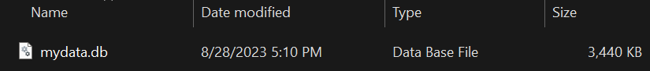
and subsequent invocations are able to simply use it.
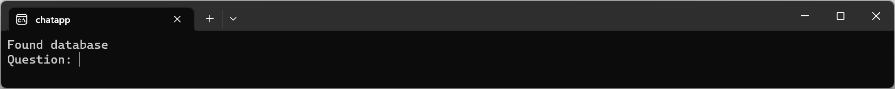

Of course, while Sqlite is an awesome tool, it's not optimized for doing these kinds of searches. In fact, the code for this `SqliteMemoryStore` in SK is simply enumerating the full contents of the database and doing a `CosineSimilarity` check on each:
```C#
// from https://github.com/microsoft/semantic-kernel/blob/013abb79b6e797360f5f91c60d657ebd4d253754/dotnet/src/Connectors/Connectors.Memory.Sqlite/SqliteMemoryStore.cs#L137-L143
await foreach (var record in this.GetAllAsync(collectionName, cancellationToken))
{
    if (record != null)
    {
        double similarity = embedding.Span.CosineSimilarity(record.Embedding.Span);
        ...
```

For real scale, and to be able to share the data between multiple frontends, we'd want a real "vector database," one that's been designed for storing and searching embeddings. There are a multitude of such vector databases now available, including Azure Cognitive Search, Chroma, Milvus, Pinecode, Qdrant, Weaviate, and more, all of which have memory store implementations for SK. We can simply stand up one of those (most of which have docker images readily available), change our `WithMemoryStore` call to use the appropriate connector, and we're cooking with gas.

So let's do that. You can choose whichever of these databases works well for your needs; for the purposes of this post, I've arbitrarily chosen Qdrant. Ensure you have docker up and running, and then issue the following command to pull down the Qdrant image:
```sh
docker pull qdrant/qdrant
```
Once you have that, you can start a container with it:
```sh
docker run -p 6333:6333 -v /qdrant_storage:/qdrant/storage qdrant/qdrant
```
And that's it; we now have a vector database up and running locally. Now we just need to use it instead. I add the relevant SK "connector" to my project:
```sh
dotnet add package Microsoft.SemanticKernel.Connectors.Memory.Qdrant --prerelease
```
and then change two lines of code, from:
```C#
using Microsoft.SemanticKernel.Connectors.Memory.Sqlite;
...
.WithMemoryStorage(await SqliteMemoryStore.ConnectAsync("mydata.db"))
```
to:
```C#
using Microsoft.SemanticKernel.Connectors.Memory.Qdrant;
...
.WithMemoryStorage(new QdrantMemoryStore("http://localhost:6333/", 1536))
```
And that's it! Now when I run it, I see a flurry of logging activity coming from Qdrant as the app stores all the embeddings:
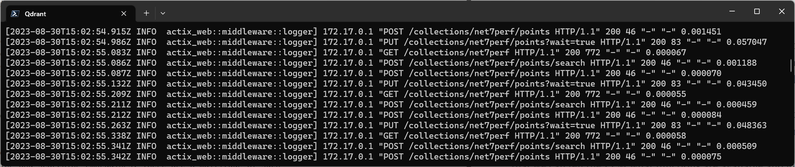
We can use its dashboard to inspect the data that was stored.
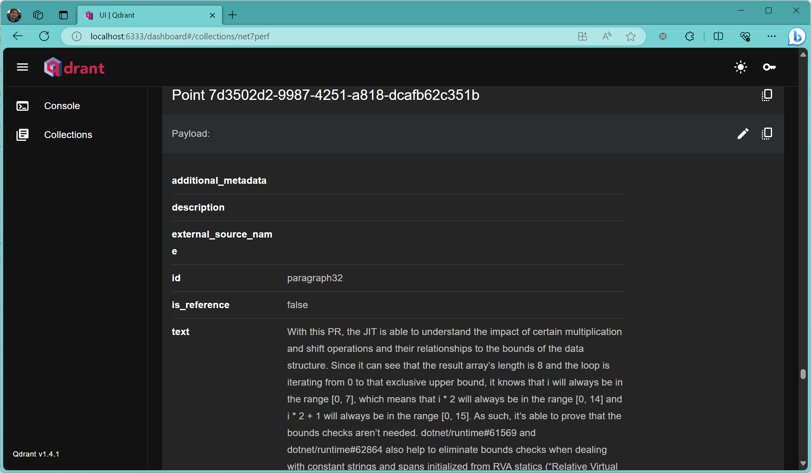
And of course the app continues working happily:
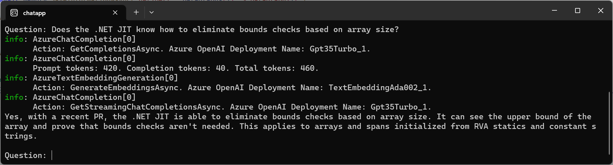

## Best Laid Plans

Now that we've implemented an end-to-end use of embeddings with a vector database, let's loop back around to something I mentioned earlier: plans. We saw how we can search embeddings for data to put into a prompt. And we saw how we can proactively invoke functions to get data to put into a prompt (e.g. the current date and time). What if I wanted to instead reactively put that data into the prompt? After all, I might have many functions that could be invoked, and each of those functions could generate a non-trivial number of tokens; just as with the embeddings, it'd be nice to only include them if they're going to be relevant to answering the user's question. For that, we have orchestration and planning. The idea here is that we can tell the LLM what functions are available and give it a goal to achieve, and ask it to create a plan using those functions to achieve the goal. That plan can then be executed. There are a variety of planners built into SK, and tools to aid in creating other customer planners. The `SequentialPlanner`, for example, is given a goal and creates a list of functions to invoke in sequence along with the arguments to pass to those functions; however, it generally needs a model more powerful than GPT 3.5 Turbo. The `StepwisePlanner` in contrast iteratively makes requests to the LLM, at each turn of the crank moving one step closer to the goal and then evaluating what it should do next. To use it, we need another nuget package:
```sh
dotnet add package Microsoft.SemanticKernel.Planning.StepwisePlanner --prerelease
```
Here's a simple example of it in action:
```C#
using Microsoft.Extensions.Logging;
using Microsoft.SemanticKernel;
using Microsoft.SemanticKernel.Planning;
using Microsoft.SemanticKernel.SkillDefinition;

string aoaiEndpoint = Environment.GetEnvironmentVariable("AZUREOPENAI_ENDPOINT")!;
string aoaiApiKey = Environment.GetEnvironmentVariable("AZUREOPENAI_API_KEY")!;
string aoaiModel = "Gpt35Turbo_0301";

IKernel kernel = Kernel.Builder
    .WithLoggerFactory(LoggerFactory.Create(b => b.AddConsole()))
    .WithAzureChatCompletionService(aoaiModel, aoaiEndpoint, aoaiApiKey)
    .Build();

kernel.RegisterCustomFunction(SKFunction.FromNativeFunction(
    (string personName) => personName switch { "Jane" => 8, _ => 0 },
    "Demographics", "GetAge", "Gets the age of the person whose name is provided"));

var planner = new StepwisePlanner(kernel);
Plan p = planner.CreatePlan("Jane's dog is half her age. How old is the dog?");
Console.WriteLine($"Result: {await kernel.RunAsync(p)}");
```
I've created a kernel with access to GPT 3.5 Turbo and enabled basic console logging. Then I've registered a function that can calculate a person's age (stubbed out to just return data for this example). And then I've created a plan with the `StepwisePlanner` and invoked it. Via the logging, we can see the planner making progress and eventually reaching the goal:
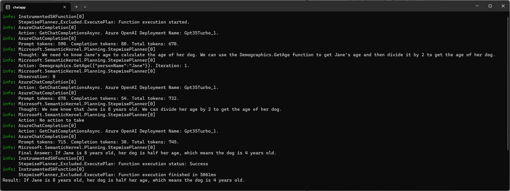

SK also provides an `ActionPlanner`, which is provided with a list of functions and a goal, and may pick one function to execute.  As an exemplar, we'll include that in our chat app. Everything is as it was before, but now in addition to searching our embeddings, we also run the user's query through the `ActionPlanner`, and include its output in the context we submit as part of the prompt.  For this example, I've again included the time function we saw earlier.
```C#
using Microsoft.Extensions.Logging;
using Microsoft.SemanticKernel;
using Microsoft.SemanticKernel.AI.ChatCompletion;
using Microsoft.SemanticKernel.Connectors.Memory.Qdrant;
using Microsoft.SemanticKernel.Memory;
using Microsoft.SemanticKernel.Planning;
using Microsoft.SemanticKernel.SkillDefinition;
using Microsoft.SemanticKernel.Text;
using System.Net;
using System.Text;
using System.Text.RegularExpressions;

string aoaiEndpoint = Environment.GetEnvironmentVariable("AZUREOPENAI_ENDPOINT")!;
string aoaiApiKey = Environment.GetEnvironmentVariable("AZUREOPENAI_API_KEY")!;
string aoaiModel = "Gpt35Turbo_0301";

// Initialize the kernel
IKernel kernel = Kernel.Builder
    .WithLoggerFactory(LoggerFactory.Create(builder => builder.AddConsole()))
    .WithAzureChatCompletionService(aoaiModel, aoaiEndpoint, aoaiApiKey)
    .WithAzureTextEmbeddingGenerationService("TextEmbeddingAda002_1", aoaiEndpoint, aoaiApiKey)
    .WithMemoryStorage(new QdrantMemoryStore("http://localhost:6333/", 1536))
    .Build();

// Register helpful functions with the kernel
kernel.RegisterCustomFunction(SKFunction.FromNativeFunction(
    () => $"The current date and time are {DateTime.UtcNow:r}",
    "DateTime", "Now", "Gets the current date and time."));

// Ensure we have embeddings for our document
ISemanticTextMemory memory = kernel.Memory;
IList<string> collections = await memory.GetCollectionsAsync();
string collectionName = "net7perf";
if (collections.Contains(collectionName))
{
    Console.WriteLine("Found database");
}
else
{
    using HttpClient client = new();
    string s = await client.GetStringAsync("https://devblogs.microsoft.com/dotnet/performance_improvements_in_net_7");
    List<string> paragraphs =
        TextChunker.SplitPlainTextParagraphs(
            TextChunker.SplitPlainTextLines(
                WebUtility.HtmlDecode(Regex.Replace(s, @"<[^>]+>|&nbsp;", "")),
                128),
            1024);
    for (int i = 0; i < paragraphs.Count; i++)
        await memory.SaveInformationAsync(collectionName, paragraphs[i], $"paragraph{i}");
    Console.WriteLine("Generated database");
}

// Create a new chat
IChatCompletion ai = kernel.GetService<IChatCompletion>();
ChatHistory chat = ai.CreateNewChat("You are an AI assistant that helps people find information.");
StringBuilder builder = new();

// Q&A loop
while (true)
{
    Console.Write("Question: ");
    string question = Console.ReadLine()!;

    // Get additional context from embeddings
    builder.Clear();
    await foreach (var result in memory.SearchAsync(collectionName, question, limit: 3))
        builder.AppendLine(result.Metadata.Text);

    // Get additional context from any function the LLM thinks we should invoke
    Plan plan = await new ActionPlanner(kernel).CreatePlanAsync(question);
    string plannerResult = (await kernel.RunAsync(plan)).Result;
    if (!string.IsNullOrEmpty(plannerResult))
    {
        builder.AppendLine(plannerResult);
    }

    int contextToRemove = -1;
    if (builder.Length != 0)
    {
        builder.Insert(0, "Here's some additional information: ");
        contextToRemove = chat.Count;
        chat.AddUserMessage(builder.ToString());
    }

    chat.AddUserMessage(question);

    builder.Clear();
    await foreach (string message in ai.GenerateMessageStreamAsync(chat))
    {
        Console.Write(message);
        builder.Append(message);
    }
    Console.WriteLine();
    chat.AddAssistantMessage(builder.ToString());

    if (contextToRemove >= 0) chat.RemoveAt(contextToRemove);
    Console.WriteLine();
}
```
If I ask a question that has nothing to do with time, then logging shows the time function is never invoked:
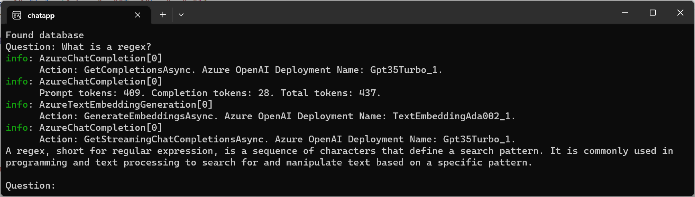
but if I ask a question that requires knowing the current time, then we can see it is in fact invoked:
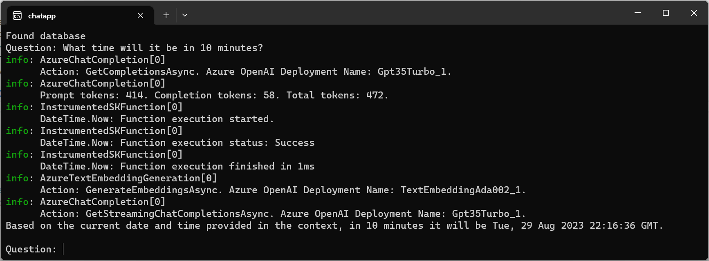

That example has the client using a planner and asking the LLM if there are any functions that should be called to gather more information. However, recent advances in some models enables the actual LLM service to detect an opportunity to invoke a function it's been told exists. See the "Function Calling" section of https://openai.com/blog/function-calling-and-other-api-updates. Essentially, as part of the chat message, you include a schema for any available function the LLM might want to use, and then if the LLM detects an opportunity to use it, rather than sending back a textual response to your message, it sends back a request for you to invoke the function. You then invoke the function and reissue your request, this time with both its function request and your function's response in the chat history.

Let's look at an example. The model I've been using, `gpt-35-turbo` version 0301, doesn't support functions, so I've created an additional deployment of `gpt-35-turbo`, version 0613, which does support functions. At the time I write this, SK also doesn't currently expose this capability via its abstractions (though it's in the works).  This is the nature of abstractions, often representing the lowest-common denominator of all that they can represent and trailing in the functionality available; as such, a good abstracted system also provides a way to "break glass", escaping from the confines of the abstraction and letting you use the underlying capabilities where needed. SK is no exception to this. Thus far, we've been using:
```C#
.WithAzureChatCompletionService("Gpt35Turbo_0301", aoaiEndpoint, aoaiApiKey)
```
where we provide the Azure OpenAI endpoint and associated API key. But there's another overload that instead accepts an `Azure.AI.OpenAI.OpenAIClient`, which is the actual Azure SDK client type. The overload we've been using constructs one of these under the covers, but we can construct one ourselves, pass it to SK so it can use it, but then we can also use it directly, and in doing so, have full access to the raw APIs SK was abstracting over. `OpenAIClient` does expose this function call support, and we can rewrite our sample to take advantage of it:

First, we need to explicitly reference the Azure package:
```sh
dotnet add package Azure.AI.OpenAI --prerelease
```
With that, we can change our kernel initialization to use the specific `OpenAIClient` we create:
```C#
var aoai = new OpenAIClient(new Uri(aoaiEndpoint), new AzureKeyCredential(aoaiApiKey));
IKernel kernel = Kernel.Builder
    .WithLoggerFactory(LoggerFactory.Create(builder => builder.AddConsole()))
    .WithAzureChatCompletionService("Gpt35Turbo_0613", aoai)
    ...
```
Then, instead of SK's `ChatHistory`, we create a `ChatCompletionsOptions` and populate its `Messages` list in a similar manner.
```C#
var chatCompletionsOptions = new ChatCompletionsOptions();
chatCompletionsOptions.Messages.Add(new ChatMessage(ChatRole.System, "You are an AI assistant that helps people find information."));
```
However, we can also tell it about the functions that are available to it, including their name, a description of what they do, and a JSON description of the function's arguments.
```C#
chatCompletionsOptions.Functions.Add(new FunctionDefinition("get_person_age")
{
    Description = "Gets the age of the named person",
    Parameters = BinaryData.FromString("""
                 {
                     "type":"object",
                     "properties":{
                         "name":{ 
                             "type":"string",
                             "description":"The name of a person"
                         }
                     },
                     "required": ["name"]
                 }
                 """)
});
```
Then instead of calling a method on SK's `IChatCompletion` to make the request to the LLM, we use the `OpenAIClient`'s `GetChatCompletionsAsync`. If we weren't involving functions at all, that would also be a simple loop:
```C#
// Q&A loop
while (true)
{
    Console.Write("Question: ");
    chatCompletionsOptions.Messages.Add(new ChatMessage(ChatRole.User, Console.ReadLine()!));

    Response<ChatCompletions> response = await aoai.GetChatCompletionsAsync("Gpt35Turbo_0613", chatCompletionsOptions);
    ChatChoice c = response.Value.Choices[0];
    Console.WriteLine(c.Message.Content);
    chatCompletionsOptions.Messages.Add(c.Message);
}
```
But with functions in the picture, the response that comes back might not signify the end of the response token generation but might instead represent a request from the LLM for a function to be invoked.  We thus need to check the `FinishReason`, and if it stopped due to `CompletionsFinishReason.FunctionCall`, we need to invoke the requested function with the requested arguments, and put both the LLM's function call request and the function call result into the chat history:
```C#
Response<ChatCompletions> response;
ChatChoice c;
while (true)
{
    response = await aoai.GetChatCompletionsAsync("Gpt35Turbo_0613", chatCompletionsOptions);
    c = response.Value.Choices[0];
    if (c.FinishReason == CompletionsFinishReason.FunctionCall)
    {
        switch (c.Message.FunctionCall.Name)
        {
            case "get_person_age":
                int age = JsonNode.Parse(c.Message.FunctionCall.Arguments)?["name"]?.ToString() switch
                {
                    "Elsa" => 21,
                    "Anna" => 18,
                    _ => -1,
                };
                chatCompletionsOptions.Messages.Add(c.Message);
                chatCompletionsOptions.Messages.Add(new ChatMessage(ChatRole.Function, $"{{ \"age\":{age} }}") { Name = "get_person_age" });
                continue;
        }
    }
    break;
}
```
Here I've just hardcoded the results for this function, but obviously code can do anything to get the answer to hand back to the LLM. Putting it altogether, here's our full program, that both fills the prompt with data we retrieve from our vector database and functions that enable us to provide additional information on demand:
```C#
using Azure;
using Azure.AI.OpenAI;
using Microsoft.Extensions.Logging;
using Microsoft.SemanticKernel;
using Microsoft.SemanticKernel.Connectors.Memory.Qdrant;
using Microsoft.SemanticKernel.Memory;
using Microsoft.SemanticKernel.Text;
using System.Net;
using System.Text;
using System.Text.Json.Nodes;
using System.Text.RegularExpressions;

string aoaiEndpoint = Environment.GetEnvironmentVariable("AZUREOPENAI_ENDPOINT")!;
string aoaiApiKey = Environment.GetEnvironmentVariable("AZUREOPENAI_API_KEY")!;
string aoaiModel = "Gpt35Turbo_0613";

// Initialize the kernel
var aoai = new OpenAIClient(new Uri(aoaiEndpoint), new AzureKeyCredential(aoaiApiKey));
IKernel kernel = Kernel.Builder
    .WithLoggerFactory(LoggerFactory.Create(builder => builder.AddConsole()))
    .WithAzureChatCompletionService(aoaiModel, aoai)
    .WithAzureTextEmbeddingGenerationService("TextEmbeddingAda002_1", aoaiEndpoint, aoaiApiKey)
    .WithMemoryStorage(new QdrantMemoryStore("http://localhost:6333/", 1536))
    .Build();

// Ensure we have embeddings for our document
ISemanticTextMemory memory = kernel.Memory;
IList<string> collections = await memory.GetCollectionsAsync();
string collectionName = "net7perf";
if (collections.Contains(collectionName))
{
    Console.WriteLine("Found database");
}
else
{
    using HttpClient client = new();
    string s = await client.GetStringAsync("https://devblogs.microsoft.com/dotnet/performance_improvements_in_net_7");
    List<string> paragraphs =
        TextChunker.SplitPlainTextParagraphs(
            TextChunker.SplitPlainTextLines(
                WebUtility.HtmlDecode(Regex.Replace(s, @"<[^>]+>|&nbsp;", "")),
                128),
            1024);
    for (int i = 0; i < paragraphs.Count; i++)
        await memory.SaveInformationAsync(collectionName, paragraphs[i], $"paragraph{i}");
    Console.WriteLine("Generated database");
}

// Create a new chat
StringBuilder builder = new();
var chatCompletionsOptions = new ChatCompletionsOptions();
chatCompletionsOptions.Messages.Add(new ChatMessage(ChatRole.System, "You are an AI assistant that helps people find information."));
chatCompletionsOptions.Functions.Add(new FunctionDefinition("get_person_age")
{
    Description = "Gets the age of the named person",
    Parameters = BinaryData.FromString("""
                 {
                     "type":"object",
                     "properties":{
                         "name":{ 
                             "type":"string",
                             "description":"The name of a person"
                         }
                     },
                     "required": ["name"]
                 }
                 """)
});

// Q&A loop
while (true)
{
    Console.Write("Question: ");
    string question = Console.ReadLine()!;

    builder.Clear();
    await foreach (var result in memory.SearchAsync(collectionName, question, limit: 3))
        builder.AppendLine(result.Metadata.Text);
    int contextToRemove = -1;
    if (builder.Length != 0)
    {
        builder.Insert(0, "Here's some additional information: ");
        contextToRemove = chatCompletionsOptions.Messages.Count;
        chatCompletionsOptions.Messages.Add(new ChatMessage(ChatRole.User, builder.ToString()));
    }

    chatCompletionsOptions.Messages.Add(new ChatMessage(ChatRole.User, question));

    Response<ChatCompletions> response;
    ChatChoice c;
    while (true)
    {
        response = await aoai.GetChatCompletionsAsync(aoaiModel, chatCompletionsOptions);
        c = response.Value.Choices[0];
        if (c.FinishReason == CompletionsFinishReason.FunctionCall)
        {
            switch (c.Message.FunctionCall.Name)
            {
                case "get_person_age":
                    int age = JsonNode.Parse(c.Message.FunctionCall.Arguments)?["name"]?.ToString() switch
                    {
                        "Elsa" => 21,
                        "Anna" => 18,
                        _ => -1,
                    };
                    chatCompletionsOptions.Messages.Add(c.Message);
                    chatCompletionsOptions.Messages.Add(new ChatMessage(ChatRole.Function, $"{{ \"age\":{age} }}") { Name = "get_person_age" });
                    continue;
            }
        }
        break;
    }

    Console.WriteLine(c.Message.Content);
    chatCompletionsOptions.Messages.Add(c.Message);
    if (contextToRemove >= 0) chatCompletionsOptions.Messages.RemoveAt(contextToRemove);
}
```
And with that, we can see the LLM has access both to the data we proactively sent and to data it requests we send:
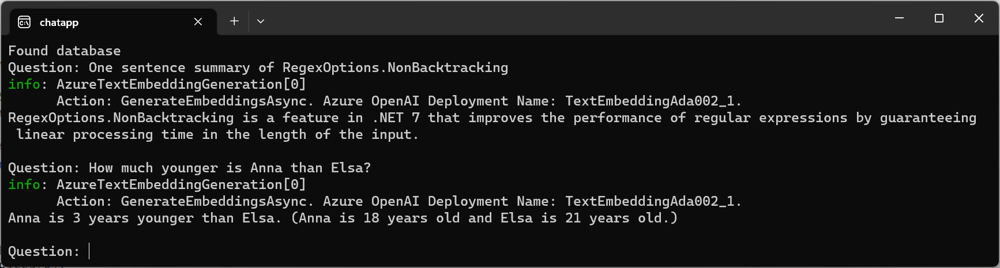

As we're using direct access to the Azure SDK APIs now, we can also utilize more sophisticated functionality from the service that's specific to Azure OpenAI: direct connection with Azure Cognitive Search. Azure Cognitive Search provides a vector database in Azure, and we can use it like we've already seen with `VolatileMemoryStore`, `SqliteMemoryStore`, and `QdrantMemoryStore`, first pulling in the relevant SK package:
```sh
dotnet add package Microsoft.SemanticKernel.Connectors.Memory.AzureCognitiveSearch --prerelease
```
and then changing our `WithMemoryStore` call to use it instead of another provider:
```C#
.WithMemoryStorage(new AzureCognitiveSearchMemoryStore(acsEndpoint, acsApiKey))
```
(for this you'll also need to create an Azure Cognitive Search resource in Azure, and grab from it the provided endpoint URI and API key). The same app we've implemented, where we then search our memory store for the user's query and manually shove the results into the prompt will still "just work".
```C#
using Azure;
using Azure.AI.OpenAI;
using Microsoft.Extensions.Logging;
using Microsoft.SemanticKernel;
using Microsoft.SemanticKernel.Connectors.Memory.AzureCognitiveSearch;
using Microsoft.SemanticKernel.Memory;
using Microsoft.SemanticKernel.Text;
using System.Net;
using System.Text;
using System.Text.RegularExpressions;

string aoaiEndpoint = Environment.GetEnvironmentVariable("AZUREOPENAI_ENDPOINT")!;
string aoaiApiKey = Environment.GetEnvironmentVariable("AZUREOPENAI_API_KEY")!;
string acsEndpoint = Environment.GetEnvironmentVariable("ACS_ENDPOINT")!;
string acsApiKey = Environment.GetEnvironmentVariable("ACS_API_KEY")!;
string aoaiModel = "Gpt35Turbo_0613";

// Initialize the kernel
var aoai = new OpenAIClient(new Uri(aoaiEndpoint), new AzureKeyCredential(aoaiApiKey));
IKernel kernel = Kernel.Builder
    .WithLoggerFactory(LoggerFactory.Create(builder => builder.AddConsole()))
    .WithAzureChatCompletionService(aoaiModel, aoai)
    .WithAzureTextEmbeddingGenerationService("TextEmbeddingAda002_1", aoaiEndpoint, aoaiApiKey)
    .WithMemoryStorage(new AzureCognitiveSearchMemoryStore(acsEndpoint, acsApiKey))
    .Build();

// Ensure we have embeddings for our document
ISemanticTextMemory memory = kernel.Memory;
IList<string> collections = await memory.GetCollectionsAsync();
string collectionName = "net7perf";
if (collections.Contains(collectionName))
{
    Console.WriteLine("Found database");
}
else
{
    using HttpClient client = new();
    string s = await client.GetStringAsync("https://devblogs.microsoft.com/dotnet/performance_improvements_in_net_7");
    List<string> paragraphs =
        TextChunker.SplitPlainTextParagraphs(
            TextChunker.SplitPlainTextLines(
                WebUtility.HtmlDecode(Regex.Replace(s, @"<[^>]+>|&nbsp;", "")),
                128),
            1024);
    for (int i = 0; i < paragraphs.Count; i++)
        await memory.SaveInformationAsync(collectionName, paragraphs[i], $"paragraph{i}");
    Console.WriteLine("Generated database");
}

// Create a new chat
StringBuilder builder = new();
var chatCompletionsOptions = new ChatCompletionsOptions();
chatCompletionsOptions.Messages.Add(new ChatMessage(ChatRole.System, "You are an AI assistant that helps people find information."));

// Q&A loop
while (true)
{
    Console.Write("Question: ");
    string question = Console.ReadLine()!;

    builder.Clear();
    await foreach (var result in memory.SearchAsync(collectionName, question, limit: 3))
        builder.AppendLine(result.Metadata.Text);
    int contextToRemove = -1;
    if (builder.Length != 0)
    {
        builder.Insert(0, "Here's some additional information: ");
        contextToRemove = chatCompletionsOptions.Messages.Count;
        chatCompletionsOptions.Messages.Add(new ChatMessage(ChatRole.User, builder.ToString()));
    }

    chatCompletionsOptions.Messages.Add(new ChatMessage(ChatRole.User, question));

    builder.Clear();
    Response<StreamingChatCompletions> response = await aoai.GetChatCompletionsStreamingAsync(aoaiModel, chatCompletionsOptions);
    await foreach (StreamingChatChoice choice in response.Value.GetChoicesStreaming())
    {
        await foreach (ChatMessage message in choice.GetMessageStreaming())
        {
            builder.Append(message.Content);
            Console.Write(message.Content);
        }
    }

    chatCompletionsOptions.Messages.Add(new ChatMessage(ChatRole.Assistant, builder.ToString()));
    if (contextToRemove >= 0) chatCompletionsOptions.Messages.RemoveAt(contextToRemove);

    Console.WriteLine();
}
```
However, we can take it a step further. The Azure OpenAI service and the Azure Cognitive Search service know about each other, and we can ask Azure OpenAI to perform the search to Azure Cognitive Search on our behalf. Then, rather than us needing to search the memory store, get the resulting embeddings, and put those into the prompt, Azure OpenAI will handle that. That requires just three changes to our previous example:
1) Delete the code that searches the memory store (and that fixes up our chat history after the fact), and just store the user's question directly into the chat message:
```C#
Console.Write("Question: ");
chatCompletionsOptions.Messages.Add(new ChatMessage(ChatRole.User, $"Question: {Console.ReadLine()!}"));
```
2) Inform the `ChatCompletionsOptions` about the Azure Cognitive Search endpoint:
```C#
chatCompletionsOptions.AzureExtensionsOptions = new AzureChatExtensionsOptions
{
    Extensions =
    {
        new AzureCognitiveSearchChatExtensionConfiguration
        {
            SearchEndpoint = new Uri(acsEndpoint),
            SearchKey = new AzureKeyCredential(acsApiKey),
            IndexName = CollectionName,
        }
    }
};
```
3) And switch to using a supported model. Thus far we've been using gpt-3.5-turbo, either version 0301 or version 0613. But as of the time of this writing, supporting using Azure Cognitive Search requires either gpt35-turbo-16k, gpt-turbo-32k, or gpt4, so I've also deployed a gpt35-turbo-16k model named "Gpt35Turbo_16k".

Here's our resulting program:
```C#
using Azure;
using Azure.AI.OpenAI;
using Microsoft.Extensions.Logging;
using Microsoft.SemanticKernel;
using Microsoft.SemanticKernel.Connectors.Memory.AzureCognitiveSearch;
using Microsoft.SemanticKernel.Memory;
using Microsoft.SemanticKernel.Text;
using System.Net;
using System.Text;
using System.Text.RegularExpressions;

string aoaiEndpoint = Environment.GetEnvironmentVariable("AZUREOPENAI_ENDPOINT")!;
string aoaiApiKey = Environment.GetEnvironmentVariable("AZUREOPENAI_API_KEY")!;
string acsEndpoint = Environment.GetEnvironmentVariable("ACS_ENDPOINT")!;
string acsApiKey = Environment.GetEnvironmentVariable("ACS_API_KEY")!;
string aoaiModel = "Gpt35Turbo_16k";

// Initialize the kernel
var aoai = new OpenAIClient(new Uri(aoaiEndpoint), new AzureKeyCredential(aoaiApiKey));
IKernel kernel = Kernel.Builder
    .WithLoggerFactory(LoggerFactory.Create(builder => builder.AddConsole()))
    .WithAzureChatCompletionService(aoaiModel, aoai)
    .WithAzureTextEmbeddingGenerationService("TextEmbeddingAda002_1", aoaiEndpoint, aoaiApiKey)
    .WithMemoryStorage(new AzureCognitiveSearchMemoryStore(acsEndpoint, acsApiKey))
    .Build();

// Ensure we have embeddings for our document
ISemanticTextMemory memory = kernel.Memory;
IList<string> collections = await memory.GetCollectionsAsync();
string collectionName = "net7perf";
if (collections.Contains(collectionName))
{
    Console.WriteLine("Found database");
}
else
{
    using HttpClient client = new();
    string s = await client.GetStringAsync("https://devblogs.microsoft.com/dotnet/performance_improvements_in_net_7");
    List<string> paragraphs =
        TextChunker.SplitPlainTextParagraphs(
            TextChunker.SplitPlainTextLines(
                WebUtility.HtmlDecode(Regex.Replace(s, @"<[^>]+>|&nbsp;", "")),
                128),
            1024);
    for (int i = 0; i < paragraphs.Count; i++)
        await memory.SaveInformationAsync(collectionName, paragraphs[i], $"paragraph{i}");
    Console.WriteLine("Generated database");
}

// Create a new chat
StringBuilder builder = new();
var chatCompletionsOptions = new ChatCompletionsOptions();
chatCompletionsOptions.Messages.Add(new ChatMessage(ChatRole.System, "You are an AI assistant that helps people find information."));
chatCompletionsOptions.AzureExtensionsOptions = new AzureChatExtensionsOptions
{
    Extensions =
    {
        new AzureCognitiveSearchChatExtensionConfiguration
        {
            SearchEndpoint = new Uri(acsEndpoint),
            SearchKey = new AzureKeyCredential(acsApiKey),
            IndexName = collectionName,
            ShouldRestrictResultScope = false,
        }
    }
};

// Q&A loop
while (true)
{
    Console.Write("Question: ");
    chatCompletionsOptions.Messages.Add(new ChatMessage(ChatRole.User, $"Question: {Console.ReadLine()!}"));

    builder.Clear();
    Response<StreamingChatCompletions> response = await aoai.GetChatCompletionsStreamingAsync(aoaiModel, chatCompletionsOptions);
    await foreach (StreamingChatChoice choice in response.Value.GetChoicesStreaming())
    {
        await foreach (ChatMessage message in choice.GetMessageStreaming())
        {
            builder.Append(message.Content);
            Console.Write(message.Content);
        }
    }

    chatCompletionsOptions.Messages.Add(new ChatMessage(ChatRole.Assistant, builder.ToString()));
    Console.WriteLine();
}
```
Notice that we're not explicitly putting into the chat history any information about the thing we're searching for, but that information has still found its way into the response:
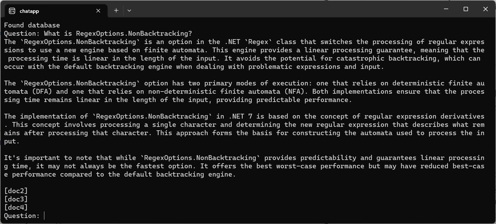

## What's Next?

Whew! I've obviously omitted a lot of important details that any real application will need to consider. How should the data being indexed be cleaned and normalized and chunked? How should errors be handled? How should we restrict how much data is sent as part of each request (e.g. limiting chat history, limiting the size of the found embeddings). And a multitude of others, including making the UI much prettier than my amazing `Console.WriteLine` calls. But even with all of those details missing, it should hopefully be obvious now that you can get started incorporating this kind of functionality into your applications immediately. As mentioned as well, the space is evolving very quickly, and your feedback about what works well and doesn't work well for you would be invaluable for the teams working on these solutions. I encourage you to join the discussions in repos like https://github.com/microsoft/semantic-kernel (more [samples](https://github.com/microsoft/semantic-kernel/tree/991770a7b82459d1a243f2677ecdbfd00ee4d37e/dotnet/samples/KernelSyntaxExamples) are also available in the repo).

Happy coding!