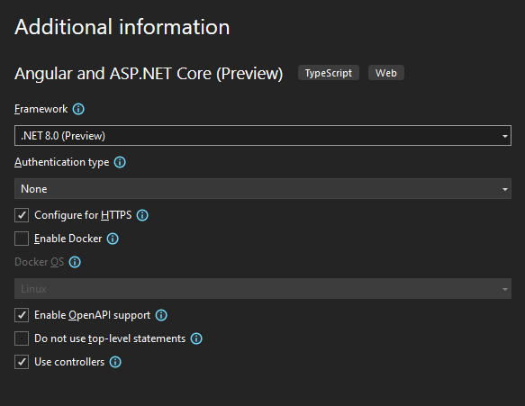

[.NET 8 Release Candidate 1 (RC1) is now available](https://devblogs.microsoft.com/dotnet/announcing-dotnet-8-rc-1) and includes many great new improvements to ASP.NET Core!

This is the first of two release candidates that we plan to share before the final .NET 8 release later this year. Most of the planned features and changes for .NET 8 are part of this release candidate and are ready for you to try out. You can find the full list of [what's new in ASP.NET Core in .NET 8](https://learn.microsoft.com/aspnet/core/release-notes/aspnetcore-8.0) in the docs. A few areas (particularly Blazor) still have some significant changes pending. We expect to complete those changes for the next .NET 8 release candidate.

Here's a summary of what's new in this preview release:

- [Servers & middleware](#servers)
    - HTTP/3 disabled by default
- [API authoring](#apis)
    - Support for keyed services in minimal APIs, MVC, and SignalR
- [Blazor](#blazor)
    - Blazor Web App template updates
    - Discover components from additional assemblies for static server rendering
    - Routing improvements
    - Trigger a page refresh
    - Pass through arbitrary attributes to `QuickGrid`
    - Determine if a form field has associated validation messages
    - Configure the .NET WebAssembly runtime
    - Trim .NET IL after ahead-of-time (AOT) compilation
- [Identity](#identity)
    - Removed `username` property
- [Single page apps (SPA)](#spa)
    - Standard .NET template options
- [Metrics](#metrics)

For more details on the ASP.NET Core work planned for .NET 8 see the full [ASP.NET Core roadmap for .NET 8](https://aka.ms/aspnet/roadmap) on GitHub.

## Get started

To get started with ASP.NET Core in .NET 8 RC1, [install the .NET 8 SDK](https://dotnet.microsoft.com/next).

If you're on Windows using Visual Studio, we recommend installing the latest [Visual Studio 2022 preview](https://visualstudio.com/preview). If you're using Visual Studio Code, you can try out the new [C# Dev Kit](https://devblogs.microsoft.com/visualstudio/announcing-csharp-dev-kit-for-visual-studio-code/).

## Upgrade an existing project

To upgrade an existing ASP.NET Core app from .NET 8 Preview 7 to .NET 8 RC1:

- Update the target framework of your app to `net8.0`.
- Update all Microsoft.AspNetCore.\* package references to `8.0.0-rc.1.*`.
- Update all Microsoft.Extensions.\* package references to `8.0.0-rc.1.*`.

See also the full list of [breaking changes](https://docs.microsoft.com/dotnet/core/compatibility/8.0#aspnet-core) in ASP.NET Core for .NET 8.

<a id="servers"></a>

## Servers & middleware

### HTTP/3 disabled by default

HTTP/3 is no longer enabled by default in Kestrel. This change returns the Kestrel HTTP protocol behavior back to its .NET 7 state, but differs from all .NET 8 previews.

We reverted to the .NET 7 behavior because enabling HTTP/3 caused some anti-virus software to prompt whether network access is allowed when an app is launched with debugging. This isn't a good experience, so we turned HTTP/3 off by default until we can improve the developer experience.

You can re-enable HTTP/3 per endpoint by setting the protocols your endpoint allows:

```csharp
var builder = WebApplication.CreateBuilder(args);

builder.WebHost.ConfigureKestrel((context, options) =>
{
    options.ListenAnyIP(5001, listenOptions =>
    {
        listenOptions.Protocols = HttpProtocols.Http1AndHttp2AndHttp3;
        listenOptions.UseHttps();
    });
});
```

Or, by configuring the default protocols:

```csharp
var builder = WebApplication.CreateBuilder(args);

builder.WebHost.ConfigureKestrel((context, options) =>
{
    options.ConfigureEndpointDefaults(listenOptions =>
    {
        listenOptions.Protocols = HttpProtocols.Http1AndHttp2AndHttp3;
        listenOptions.UseHttps();
    });
});
```

See [Use HTTP/3 with the ASP.NET Core Kestrel web server](https://learn.microsoft.com/aspnet/core/fundamentals/servers/kestrel/http3) for more information about HTTP/3 requirements and configuration.

<a id="apis"></a>

## API authoring

### Support for keyed services in minimal APIs, MVC, and SignalR

In .NET 8 Preview 7, we introduced support for [keyed services in DI](https://devblogs.microsoft.com/dotnet/announcing-dotnet-8-preview-7/#keyed-services-support-in-microsoft-extensions-dependencyinjection). Starting in .NET 8 RC1, it's now possible to use keyed services in apps using minimal APIs, controller-based APIs, and SignalR hubs. To leverage the new keyed services support, annotate the target parameter with the `[FromKeyedServices("keyName")]` attribute.

The following sample showcases this support in minimal APIs and controllers:

```csharp
using Microsoft.AspNetCore.Mvc;

var builder = WebApplication.CreateBuilder(args);

builder.Services.AddKeyedSingleton<ICache, BigCache>("big");
builder.Services.AddKeyedSingleton<ICache, SmallCache>("small");
builder.Services.AddControllers();

var app = builder.Build();

app.MapGet("/big", ([FromKeyedServices("big")] ICache bigCache) => bigCache.Get("date"));

app.MapGet("/small", ([FromKeyedServices("small")] ICache smallCache) => smallCache.Get("date"));

app.MapControllers();

app.Run();

public interface ICache
{
    object Get(string key);
}
public class BigCache : ICache
{
    public object Get(string key) => $"Resolving {key} from big cache.";
}

public class SmallCache : ICache
{
    public object Get(string key) => $"Resolving {key} from small cache.";
}

[ApiController]
[Route("/cache")]
public class CustomServicesApiController : Controller
{
    [HttpGet("big-cache")]
    public ActionResult<object> GetOk([FromKeyedServices("big")] ICache cache)
    {
        return cache.Get("data-mvc");
    }
}

public class MyHub : Hub
{
    public void Method([FromKeyedServices("small")] ICache cache)
    {
        Console.WriteLine(cache.Get("signalr"));
    }
}
```

<a id="blazor"></a>

## Blazor

### Blazor Web App template updates

In .NET 8 we've been adding capabilities to Blazor so that you can use Blazor components full stack for all of your web UI needs. You can now render Blazor components statically from the server in response to requests, progressively enhance the experience with enhanced navigation & form handling, stream server-rendered updates, and add rich interactivity where it's needed using Blazor Server or Blazor WebAssembly. To optimize the app load time, Blazor can also auto-select whether to use Blazor Server or Blazor WebAssembly at runtime.

These new Blazor capabilities are now all setup for you by the Blazor Web App project template. In this release, the Blazor Web App template has been cleaned up and improved with several new options to configure different scenarios.

The Blazor Web App now has the following options:

- **Use interactive WebAssembly components**: Enables support for the interactive WebAssembly render mode, based on Blazor WebAssembly.
- **Use interactive Server components**: Enables support for the interactive Server render mode, based on Blazor Server.
- **Include sample pages**: If this option is selected, the project will include sample pages and a layout based on Bootstrap styling. Disable this option if you just want an empty project to start with.

If both the WebAssembly and Server render modes are selected, then the template will use the Auto render mode. The Auto render model will initially use the Server mode while the .NET runtime and app bundle is download to the browser. Once the runtime is download, Auto will switch to start using the WebAssembly render mode instead.

By default, the Blazor Web App template will enable both static and interactive server rendering using a single project. If you also enable the WebAssembly render mode, then the project will include an additional client project for your WebAssembly-based components. The built output from the client project will be downloaded to the browser and executed on the client. Any components using the WebAssembly or Auto render modes must be built from the client project. 

The Blazor Web App template has a cleaned up folder structure:

- The new *Components* folder contains all the components in the server project.
- The *Components/Layout* folder contains the app layout.
- The *Components/Pages* folder contains the routable page components.

The component names and content have been cleaned up to match their function:

- *Index.razor* -> *Home.razor*
- *Counter.razor* is unchanged
- *FetchData.razor* -> *Weather.razor*

The `App` component is now clean and simple:

```razor
<!DOCTYPE html>
<html lang="en">

<head>
    <meta charset="utf-8" />
    <meta name="viewport" content="width=device-width, initial-scale=1.0, maximum-scale=1.0, user-scalable=no" />
    <base href="/" />
    <link rel="stylesheet" href="bootstrap/bootstrap.min.css" />
    <link rel="stylesheet" href="app.css" />
    <link rel="stylesheet" href="BlazorApp51.styles.css" />
    <link rel="icon" type="image/png" href="favicon.png" />
    <HeadOutlet />
</head>

<body>
    <Routes />
    <script src="_framework/blazor.web.js"></script>
</body>

</html>
```

We made several change to the `App` component to clear it up:

- We removed the Bootstrap icons and switched to custom SVG icons instead.
- We moved the Blazor router to the new `Routes` component and removed its `NotFound` parameter as it is never used.
- We moved the default Blazor error UI to the `MainLayout` component.
- We removed the `surpress-error` attribute on the `script` tag for the Blazor script, as it is no longer required.

The new `Routes` component in the template simplifies making the entire app interactive: simply apply the desired render mode to the `Routes` and `HeadOutlet` components. The root `App` component needs to be static, because it renders the Blazor script and script tags cannot be dynamically removed. You also can't make the Blazor router directly interactive from the `App` component, because it has parameters that are render fragments, which are not serializable. Interactive components rendered from static components must have serializable parameters. The `Routes` component provides an appropriate boundary for enabling interactivity.

### Discover components from additional assemblies for static server rendering

You can now configure additional assemblies to use for discovering routable Blazor components for static server rendering using the `AddAdditionalAssemblies()` method:

```csharp
app.MapRazorComponents<App>()
    .AddAdditionalAssemblies(typeof(Counter).Assembly);
```

### Routing improvements

We've unified the Blazor routing implementation with ASP.NET Core routing. This unification adds to the Blazor router support for the following features:

- [Complex segments](https://learn.microsoft.com/aspnet/core/fundamentals/routing#complex-segments) (`"/a{b}c{d}"`)
- Default values (`"/{tier=free}"`)
- All built-in [route constraints](https://learn.microsoft.com/aspnet/core/fundamentals/routing#route-constraints)

### Trigger a page refresh

You can now call `NavigationManager.Refresh()` to trigger a page refresh. This will refresh the page using an enhanced page navigation if possible. Otherwise, it will trigger a full page refresh. To force a full page refresh, use `NavigationManager.Refresh(forceReload: true)`.

### Pass through arbitrary attributes to `QuickGrid`

The `QuickGrid` component will now pass through any additional attributes to the the rendered `table` element:

```razor
<QuickGrid Items="@FilteredPeople" custom-attribute="somevalue" class="custom-class-attribute">
```

Thank you [@ElderJames](https://github.com/ElderJames) for this contribution!

### Determine if a form field has associated validation messages

The new `EditContext.IsValid(FieldIdentifier)` API can be used to determine if a field is valid without having to get the validation messages.

Thank you [@ElderJames](https://github.com/ElderJames) for this contribution!

### Configure the .NET WebAssembly runtime

You can now configure various .NET runtime options during [startup](https://learn.microsoft.com/aspnet/core/blazor/fundamentals/startup) when running on WebAssembly using the `configureRuntime` function:

```html
<script src="_framework/blazor.webassembly.js" autostart="false"></script>
<script>
  Blazor.start({
    configureRuntime: dotnet => {
        dotnet.withEnvironmentVariable("CONFIGURE_RUNTIME", "true");
    }
  });
</script>
```

The .NET runtime instance can now accessed from `Blazor.runtime`.

For more details on the .NET runtime options and APIs when running on WebAssembly, see https://github.com/dotnet/runtime/blob/main/src/mono/wasm/runtime/dotnet.d.ts.

### Trim .NET IL after ahead-of-time (AOT) compilation

The new `WasmStripILAfterAOT` MSBuild option enables removing the .NET IL for compiled methods after performing ahead-of-time (AOT) compilation to WebAssembly. This new stripping mode reduces the size of _framework folder by 1.7% - 4.2% based on our tests.

```xml
<PropertyGroup>
  <RunAOTCompilation>true</RunAOTCompilation>
  <WasmStripILAfterAOT>true</WasmStripILAfterAOT>
</PropertyGroup>
```

This setting will trim away the IL code for most compiled methods, including methods from libraries and methods in the app. Not all compiled methods can be trimmed, as some are still needed by the .NET interpreter at runtime.

If you hit any issues using this new trimming option for AOT compiled WebAssembly apps, let us know by [opening issues on GitHub in the dotnet/runtime repo](https://github.com/dotnet/runtime/issues/new/choose).

<a id="identity"></a>

## Identity

### Removed `username` property

To simplify the mapped identity APIs and align more closely with the existing Identity UIs, the `username` property has been removed. Username and email are now the same and the field will be named `Email` moving forward (or `NewEmail` in the case of registering a user).

<a id="spa"></a>

## Single page apps (SPA)

### Standard .NET template options

The Visual Studio templates for using ASP.NET Core with popular frontend JavaScript frameworks like Angular, React, and Vue now support the standard .NET template options, including specifying a target .NET framework version, enabling OpenAPI support, and much more.



<a id="metrics"></a>

## Metrics

In .NET 8 RC1, we've renamed new metrics to follow the [OpenTelemetry Semantic Conventions](https://github.com/open-telemetry/semantic-conventions/blob/main/docs/README.md). This change is based on feedback from users and library authors about what to name their own counters. OpenTelemetry is an existing established standard, and it is beneficial for .NET's built-in metrics and the broader .NET ecosystem to follow that standard.

- ASP.NET Core's primary HTTP metrics now exactly match OpenTelemtry's [`http.server.request.duration`](https://github.com/open-telemetry/semantic-conventions/blob/main/docs/http/http-metrics.md#metric-httpserverrequestduration) and [`http.server.active_requests`](https://github.com/open-telemetry/semantic-conventions/blob/main/docs/http/http-metrics.md#metric-httpserveractive_requests) counters.
- Other counters in ASP.NET Core use the semantic convention's naming standard. For example, the rate-limiting middleware has metrics that record the number of HTTP requests waiting for a lease and lease duration.
  - Renamed the lease queue length counter from `rate-limiting-current-queued-requests` to `aspnetcore.rate_limiting.queued_requests`.
  - Renamed the lease queue duration counter from `rate-limiting-queued-request-duration` to `aspnetcore.rate_limiting.request.time_in_queue`.

After updating to .NET 8 RC1, you may need to update to use the names in dashboards and alerts that use them.

For more information about available metrics in .NET 8, including a complete list of the counters available and their names, see [Semantic Conventions for .NET metrics](https://github.com/lmolkova/semantic-conventions/blob/dotnet8-metrics/docs/dotnet/README.md).

## Known Issues

### ASP.NET Redis-based output-cache

There is a known regression in the Redis-based output-cache for ASP.NET (new in .NET 8, announced in Preview 6); this feature will not work in RC1. The cause has been identified and resolved for RC2.

### Blazor Web App template creates multiple counter components

The Blazor Web App uses an unnecessary workaround when enabling interactive WebAssembly components. The template generates two `Counter` components: 1. A `Counter` component in the client project with the render mode attribute, and 2. A `Counter` page in the server project that uses the `Counter` from the client. This workaround is unnecessary. The `Counter` component in the server project can be removed after copying its `@page` directive to the `Counter` in the client project. Then call `AddAdditionalAssemblies(typeof(Counter).Assembly)` in *Program.cs* so that the `Counter` component can be discovered.

## Give feedback

We hope you enjoy this preview release of ASP.NET Core in .NET 8. Let us know what you think about these new improvements by filing issues on [GitHub](https://github.com/dotnet/aspnetcore/issues/new).

Thanks for trying out ASP.NET Core!
