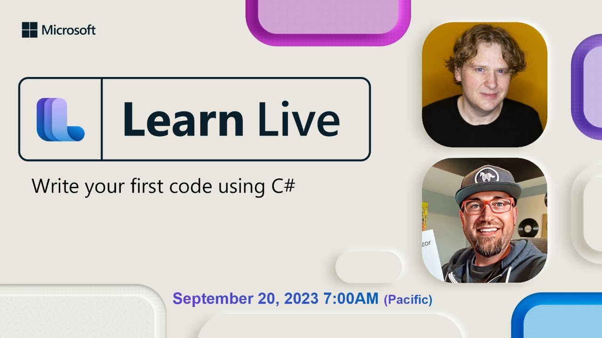

We recently announced the [launch of the new Foundational C# Certification](https://aka.ms/certification-blog) in collaboration with freeCodeCamp. To celebrate, we are hosting [six office-hour style live streaming events](https://aka.ms/learnlive-get-started-with-csharp) to help you succeed. In each session, expert presenters will review the training course, walkthrough examples, and answer questions.

Join us live for an upcoming session, the live streams will be September 20 to October 25, every Wednesday at 2:00 pm UTC.

1. September 20, [Write your first code using C#](https://www.youtube.com/live/KRb7T1LZZj0?si=XkYD_lru3KxtGObn) with Cam Soper and David Pine
2. September 27, [Create and run simple C# console applications](https://aka.ms/learnlive-get-started-with-csharp-Ep2) with Mattias Karlsson and Mark Allan
3. October 4, [Add logic to C# console applications](https://aka.ms/learnlive-get-started-with-csharp-Ep3) with Filip Ekberg and Iris Classon
4. October 11, [Work with variable data in C# console applications](https://aka.ms/learnlive-get-started-with-csharp-Ep4) with Daniel Gomez and Paul Bullock
5. October 18, [Create methods in C# console applications](https://aka.ms/learnlive-get-started-with-csharp-Ep5) with Nitish Kumar and Aditya Oberai
6. October 25, [Debug C# console applications](https://aka.ms/learnlive-get-started-with-csharp-Ep6) with Didou Rebai and Clifford Agius

You will always be able to find all of the sessions at [https://aka.ms/learnlive-get-started-with-csharp](https://aka.ms/learnlive-get-started-with-csharp)

### **First Session Available On-demand Now**

The [first session is now available on-demand](https://www.youtube.com/live/KRb7T1LZZj0?si=XkYD_lru3KxtGObn)! Watch Cam and David as they introduce you to the series and guide you through writing your first C# code.

### **Catch the series in another language**

The series is also running with community members in Korea, China, and Taiwan. Check out the events below:

- [Korea](https://aka.ms/lldnkr/csharp/1/live)
- [China](https://www.huodongxing.com/event/4719377955523)
- [Taiwan](https://developer.microsoft.com/reactor/series/S-1224/)

### **About the Foundational C# Certification**

At the end of August, we announced the [Foundational C# Certification](https://aka.ms/csharp-certification) created by freeCodeCamp and Microsoft. The certification covers the foundations of C# with a robust training course developed by Microsoft and a certification exam developed by freeCodeCamp. The entire catalog of content and the exam are completely free and globally available.

### **Keep up to date**

Stay tuned for more .NET learning opportunities! Be sure to follow the [.NET YouTube](https://www.youtube.com/@dotnet) and [Microsoft Reactor YouTube](https://www.youtube.com/@MicrosoftReactor) for even more developer events.