Developers love .NET's powerful and user-friendly debugging experience. Set a breakpoint in your IDE of choice, launch your app with the debugger attached and step through code and see the state of your .NET app.

In .NET 8, we're investing in improving the debugging experience of commonly used types in .NET apps. These include:

* `HttpContext` and friends
* `WebApplication`
* MVC and Razor Pages
* gRPC
* Endpoint metadata
* Logging
* Configuration

You should be able to find information about your app without having to drill down into the internals of these types. We've added [debug customization attributes](https://learn.microsoft.com/visualstudio/debugger/using-the-debuggerdisplay-attribute) to display debug summaries and provide simplified debug proxies for commonly used .NET types.

## `HttpContext` and friends

`HttpContext`, `HttpRequest` and `HttpResponse` are instantly familiar to developers building web apps with ASP.NET Core. If you want to see the state of an HTTP request, then these are the types that you'd debug.

We've reviewed the properties on ASP.NET Core's HTTP types to make them easy to use with the debugger. Viewing the request and response values, such as headers, cookies, query string, and form values, is much easier. `HttpRequest` and `HttpResponse` also now display a user-friendly summary of the type. Essential information like the HTTP request URL or the HTTP response status code is instantly visible.

The screenshot below shows off improvements to `HttpContext` and associated types:

**.NET 7**

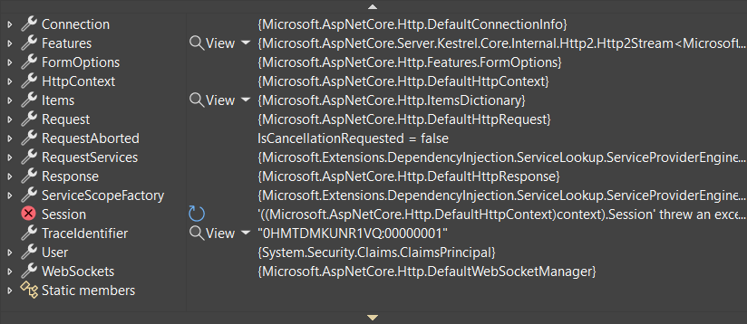

**.NET 8**

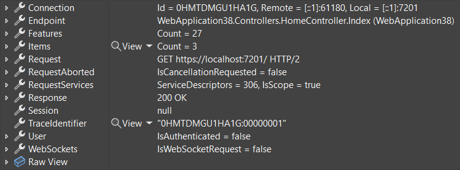

Much better! Although some data is hidden away, nothing is lost. Select `Raw View` to see all fields and properties.

## WebApplication

`WebApplication` is the default way to configure and start ASP.NET Core apps in `Program.cs`. `WebApplication` has been updated to display important information such as configured endpoints, middleware, and `IConfiguration` values in your IDE's debugger.

**.NET 7**

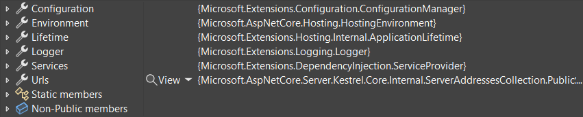

**.NET 8**

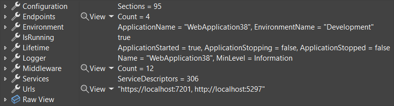

We made similar improvements to the [.NET Generic Host](https://learn.microsoft.com/dotnet/core/extensions/generic-host). The generic host is used to host apps that don't have HTTP endpoints, such as Unix daemons and Windows Services.

## MVC and Razor Pages

ASP.NET Core MVC and Razor Pages are popular frameworks for building web apps. Controllers, views, and Razor Pages receive debugging improvements in .NET 8.

We identified a lot of extra information when debugging these frameworks. Types felt cluttered. In .NET 8, we reviewed each type and asked, "Does this spark joy?". Most MVC and Razor types now work better with debugging, and non-essential types have been hidden away. The screenshots below show off improvements to MVC's controller:

**.NET 7**

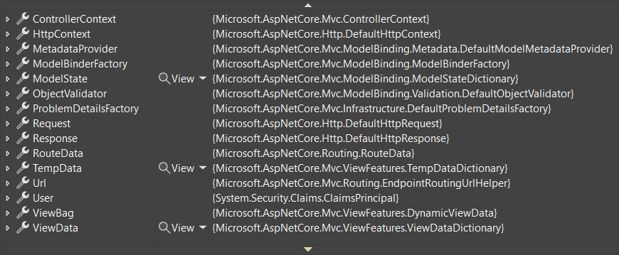

**.NET 8**

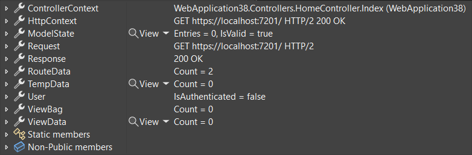

We think you'll agree this tidied-up output is easier to work with.

## gRPC

gRPC is a high-performance library for building RPC services. The latest version of gRPC makes it easier for you to debug gRPC calls from the client. A gRPC call now includes information about its method, status, response headers, and trailers. Additional information about the request/response and streaming depends on the [gRPC call type](https://learn.microsoft.com/aspnet/core/grpc/client#make-grpc-calls). The example below is a unary call.

**grpc-dotnet 2.55.0**

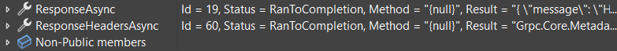

**grpc-dotnet 2.56.0**

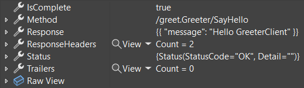

Try these changes by updating [Grpc.Net.Client](https://www.nuget.org/packages/Grpc.Net.Client) to 2.56.0 or later.

## Endpoint metadata

[Endpoints](https://learn.microsoft.com/aspnet/core/fundamentals/routing#endpoints) are a central ASP.NET Core concept. An endpoint represents executable request-handling code. When an app starts up, the endpoints defined in the app are registered with routing. Then, routing matches requests to an endpoint when HTTP requests come into the app. Examples of endpoints include:

* MVC actions
* Razor Pages
* Minimal APIs
* gRPC methods

Endpoints can have metadata, and metadata controls how the request is executed. For example, an `[Authorize]` attribute on an API is saved as endpoint metadata, and the `AuthorizationMiddleware` uses it when processing requests.

In .NET 8, debug text has been added to common metadata. The screenshots below compare debugging [`Endpoint.Metadata`](https://learn.microsoft.com/dotnet/api/microsoft.aspnetcore.http.endpoint.metadata) in .NET 7 and .NET 8. It's easier to understand what metadata has been configured and how requests matched to the endpoint are processed.

**.NET 7**

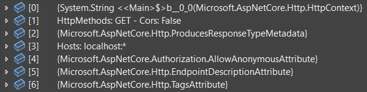

**.NET 8**

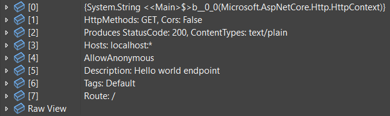

## Logging

[Microsoft.Extensions.Logging](https://learn.microsoft.com/aspnet/core/fundamentals/logging/) is a popular logging library for .NET apps and is used throughout ASP.NET Core. `ILogger` is used by an app to output structured logs.

`ILogger` was never designed for debugging. It's a simple interface for writing logs. That design choice is immediately apparent when debugging an `ILogger` instance. It displays hard-to-understand data structures that are designed for performance.

In .NET 8, it's much easier to find out whether logging is enabled and what logging providers have been configured. `ILogger` displays a user-friendly list of helpful information, such as its name, configured log level, whether it is enabled, and configured logging providers.

**.NET 7**

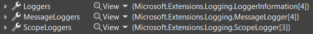

**.NET 8**

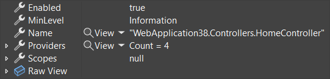

## Configuration

[Microsoft.Extensions.Configuration](https://learn.microsoft.com/dotnet/core/extensions/configuration) is a configuration abstraction used by .NET apps and libraries. `IConfiguration` can load values from configuration providers, such as JSON files, environment variables, Azure Key Value, or third-party providers.

An example of using configuration is in the ASP.NET Core templates. The `appsettings.json` file added by templates configures the app's log levels:

```json
{
  "Logging": {
    "LogLevel": {
      "Default": "Information"
    }
  }
}
```

Until .NET 8, figuring out an app's configuration values could be very difficult. Configuration supports multiple providers, and providers can take precedence over each other. For example, the values in `appsettings.json` are always used, but they are conditionally overridden by `appsettings.Development.json` or `appsettings.Production.json`, depending on how an app is published.

In .NET 8, debugging `IConfiguration` now displays a simple flat list of all configuration keys and values. Precedence is already calculated, so the configuration values you see are the values the app will use.

**.NET 7**

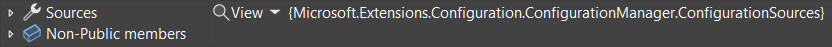

**.NET 8**

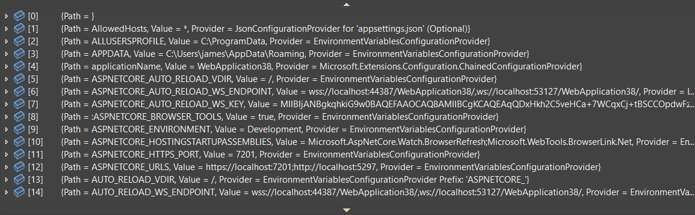

## And more

There are too many improvements to go into detail for each one. Or even list them. But expect to see many more improvements to debugger visualizations in .NET 8:

* Dependency Injection
* `ClaimsPrincipal` and `ClaimsIdentity`
* `StringValues` and `StringSegment`
* `HostString`, `PathString`, `QueryString` and `FragmentString`
* HTTP header collections
* `RouteValueDictionary`
* ASP.NET Core MVC's `ModelState`

## Try it now

.NET 8 debugging enhancements are available now in .NET 8 RC1. Try them today and let us know what you think:

1. Download the latest .NET 8 release.
1. Launch Visual Studio 2022 (or your preferred IDE) and create an ASP.NET Core or Worker Service app.
1. Set breakpoints and hit F5 to run the app with debugging.

Thanks for trying out .NET 8 and .NET 8 debugging enhancements!
