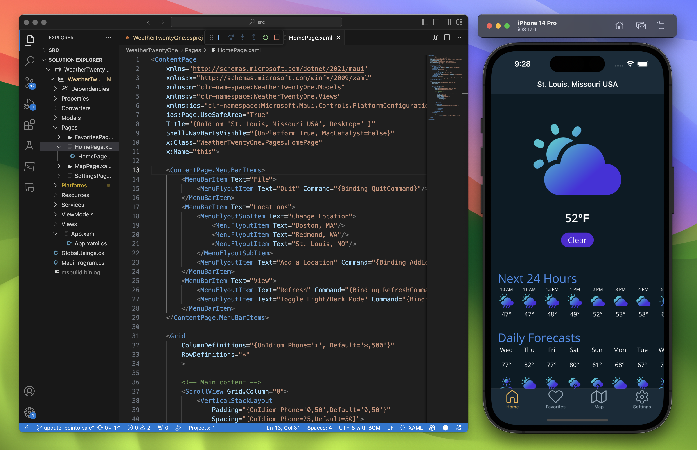

Today, we are very excited to announce the availability of .NET MAUI in .NET 8 release candidate 1 which comes with a go live license so you can confidently use this release for your production application needs today. The dominant theme of our .NET MAUI work in .NET 8 is code quality. We have been addressing defects based on issue engagement scores which focuses our efforts on the issues that benefit you the most. This release also introduces the first steps to Xcode 15 beta support for Apple SDKs.

## Quality Improvements

We prioritize issues based on Issue Engagement Score (IES). This is a weighted scoring methodology that accounts for normal traits identified during triage that indicate severity, and then accounts for the number of users interacting with an issue via comments and reactions. We then also prioritize working on issues that are blocking developers over issues that have reasonable workarounds. Since we April, our team and contributors have reduced the product IES in .NET 8 by 97%! This is an ongoing effort we will carry into .NET 8 servicing.

37 developers contributed to this release, and we thank you all for your hard work including first-time contributors [cat0363](https://github.com/cat0363), [Salar K](https://github.com/salarcode), [Mausam Shrestha](https://github.com/mausam-shrestha), [Diana Soltani](https://github.com/DianaSoltani), [Emanuel Fernandez Dell'Oca](https://github.com/emaf), and [John Hollander](https://github.com/john-hollander).

Highlights from this release:

Certainly, here are the top four themes from the provided release notes:

**Memory Leak Resolutions:**
Several memory leak issues were addressed in various UI controls on the iOS platform. These fixes ensure improved memory management and application stability. Specifically, fixes were made for memory leaks in the Editor, Entry, MauiDoneAccessoryView, RefreshView, SwipeView, TimePicker, Picker, and GraphicsView. ([#16348](https://github.com/dotnet/maui/pull/16348), [#16349](https://github.com/dotnet/maui/pull/16349), [#16380](https://github.com/dotnet/maui/pull/16380), [#16384](https://github.com/dotnet/maui/pull/16384), [#16532](https://github.com/dotnet/maui/pull/16532), [#16589](https://github.com/dotnet/maui/pull/16589), [#16265](https://github.com/dotnet/maui/pull/16265), [#16605](https://github.com/dotnet/maui/pull/16605), [#16614](https://github.com/dotnet/maui/pull/16614), [#16685](https://github.com/dotnet/maui/pull/16685)).

**UI Control Enhancements:**
Various UI control issues were addressed, including CheckBox, RefreshView, SwipeItem, Label, and Button on multiple platforms. These enhancements contribute to a smoother app interaction. ([#16376](https://github.com/dotnet/maui/pull/16376), [#16384](https://github.com/dotnet/maui/pull/16384), [#15883](https://github.com/dotnet/maui/pull/15883), [#16387](https://github.com/dotnet/maui/pull/16387), [#16410](https://github.com/dotnet/maui/pull/16410), [#16458](https://github.com/dotnet/maui/pull/16458), [#16385](https://github.com/dotnet/maui/pull/16385), [#16532](https://github.com/dotnet/maui/pull/16532), [#16589](https://github.com/dotnet/maui/pull/16589), [#16605](https://github.com/dotnet/maui/pull/16605), [#16265](https://github.com/dotnet/maui/pull/16265)).

**Platform-Specific Fixes:**
Platform-specific issues on various platforms, including iOS, Android, Windows, and macOS, were addressed. These fixes ensure a consistent user experience across different platforms, addressing issues like Border clipping, window glitches, and image loading problems. ([#14403](https://github.com/dotnet/maui/pull/14403), [#15832](https://github.com/dotnet/maui/pull/15832), [#14861](https://github.com/dotnet/maui/pull/14861), [#16637](https://github.com/dotnet/maui/pull/16637), [#16593](https://github.com/dotnet/maui/pull/16593), [#16762](https://github.com/dotnet/maui/pull/16762), [#16644](https://github.com/dotnet/maui/pull/16644), [#16678](https://github.com/dotnet/maui/pull/16678), [#16700](https://github.com/dotnet/maui/pull/16700), [#16800](https://github.com/dotnet/maui/pull/16800), [#16560](https://github.com/dotnet/maui/pull/16560), [#16752](https://github.com/dotnet/maui/pull/16752), [#16833](https://github.com/dotnet/maui/pull/16833), [#16853](https://github.com/dotnet/maui/pull/16853), [#16162](https://github.com/dotnet/maui/pull/16162), [#16758](https://github.com/dotnet/maui/pull/16758), [#16633](https://github.com/dotnet/maui/pull/16633), [#16798](https://github.com/dotnet/maui/pull/16798), [#16762](https://github.com/dotnet/maui/pull/16762), [#16678](https://github.com/dotnet/maui/pull/16678)).

**Performance Optimization:**
Performance enhancements were made to improve memory usage and resource generation. These optimizations contribute to smoother app performance and responsiveness. Notable optimizations include improved memory usage of CollectionView, resource generation control, and Android timer issues. ([#16990](https://github.com/dotnet/maui/pull/16990), [#16838](https://github.com/dotnet/maui/pull/16838), [#16941](https://github.com/dotnet/maui/pull/16941), [#16762](https://github.com/dotnet/maui/pull/16762), [#16963](https://github.com/dotnet/maui/pull/16963), [#16845](https://github.com/dotnet/maui/pull/16845), [#16741](https://github.com/dotnet/maui/pull/16741), [#16644](https://github.com/dotnet/maui/pull/16644), [#17062](https://github.com/dotnet/maui/pull/17062)).

Additional information:
* [.NET MAUI release notes](https://github.com/dotnet/maui/releases/)
* [.NET for Android](https://github.com/xamarin/xamarin-android/releases/)
* [.NET for iOS and Mac](https://github.com/xamarin/xamarin-macios/releases/)

## Xcode 15 Support

You can now use Xcode 15 betas as your installation for building apps and managing simulators, and this will be available in the next releases of Visual Studio. In the next release of .NET 8 we will begin to introduce new APIs for Apple SDKs like iOS 17. We have verified this with Xcode 15 Beta 6, though newer releases may work the same.




## How to update

On all platforms you can develop with .NET MAUI using Visual Studio Code. Install the [.NET MAUI extension](https://marketplace.visualstudio.com/items?itemName=ms-dotnettools.dotnet-maui) and [let us know](https://www.surveymonkey.com/r/W789CW2) how we can improve this preview experience for you in the future. 

Download the [.NET 8 RC1 installer](https://dotnet.microsoft.com/download/dotnet/8.0), and then install .NET MAUI from the command line:

```bash
dotnet workload install maui
```

Through the [retirement of Visual Studio for Mac](https://devblogs.microsoft.com/visualstudio/visual-studio-for-mac-retirement-announcement/) you can continute developing using Visual Studio for Mac after enabling the preview feature for .NET 8 in Preferences.

On Windows, update or install Visual Studio 2022 17.8 preview 2 to get .NET 8 RC1 with .NET MAUI. This version will ship soon, and we recommend waiting for this release on Windows if you are using Visual Studio 2022. 

## Feedback Welcome

We appreciate your feedback and contributions to .NET MAUI. You can [report issues](https://github.com/dotnet/maui/issues/new/choose), [suggest features](https://github.com/dotnet/maui/issues/new?assignees=&labels=proposal%2Fopen%2Ct%2Fenhancement&projects=&template=feature-request.yml), or [submit pull requests](https://github.com/dotnet/maui/blob/main/.github/CONTRIBUTING.md) on our GitHub repository. You can also join our Discord server or follow us on Twitter to stay in touch with the latest news and updates.

Thank you for your support and happy coding!