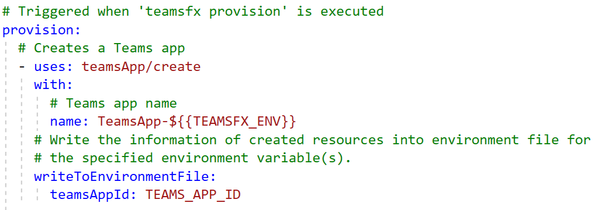
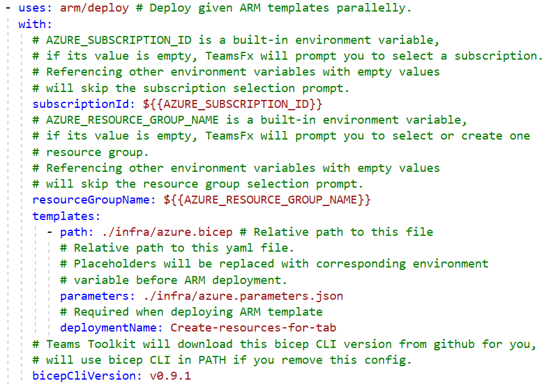
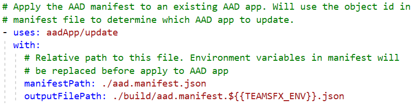
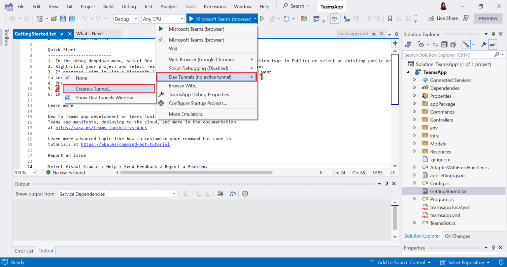
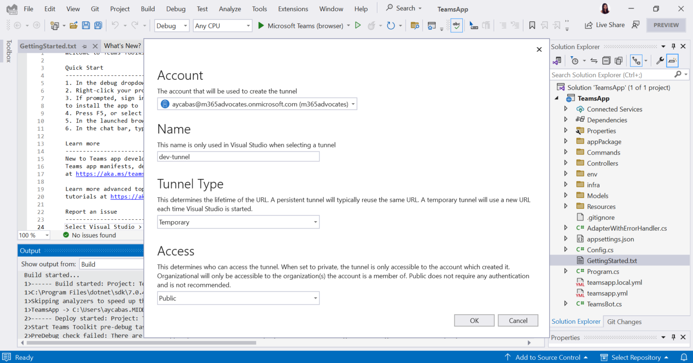
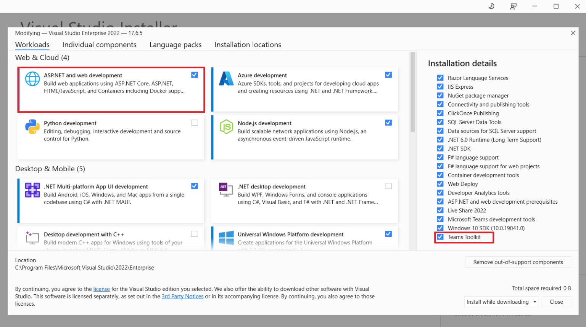

Teams Toolkit for Visual Studio helps .NET developers build, debug, and publish apps for Microsoft Teams. We are thrilled to share that Teams Toolkit for Visual Studio 2022 version 17.7 is packed with exciting capabilities for .NET developers.

In this article, we’ll share more information about the new capabilities announced in the recent release:

* Automate lifecycle of Teams Apps
* Debug bots with built-in tunneling

## Automate lifecycle of Teams apps

Teams Toolkit introduced a new way for .NET developers to create focused tasks to automate setup and other repetitive actions during Teams app development. These tasks are composed into groups as lifecycle of Provision, Deploy, and Publish. If you create a new project using the new version, your project will include `teamsapp.yml` by default.

For your existing project, simply create a new file named `teamsapp.yml` and add it to your project directory. Teams Toolkit will handle the creation of a Teams app registration and save the App ID to an environment file during the Provision step as shown below:

The above example uses the `teamsApp/create` action. You can add many other built-in automation tasks or actions available in this release. Check out our [Guide](https://github.com/OfficeDev/TeamsFx/wiki/Teams-Toolkit-Visual-Studio-Code-v5-Guide) to learn more about available actions.

Note: If you created a Teams app using the previous versions of Teams Toolkit, you’ll be able to automatically upgrade your project to support the latest features.

Here is another example using the `arm/deploy` action. In previous versions, when projects are created by Teams Toolkit, there contains the ARM templates/bicep files that defines the required Azure resources for different Teams app. The ARM templates are predefined and not allowed to be customized by developers. Now, using the new version, developers can use the `arm/deploy` action to specify the bicep file they want to use for ARM deployment. This gives developers more flexibility and transparency of the Azure resources they want to use for the Teams app.

Users can also specify/customize the manifest path of the Teams app, which gives developers further flexibility – a feature not available in the previous version of Teams Toolkit. Previously, Teams Toolkit generated the manifest file in a default path and always used that path, which did not allow users to move the file or specify another path. This latest release allows users to use any path they want.

## Debug bots with built-in tunneling

Debugging bots is even simpler in this release with the power of [Visual Studio dev tunnels](https://learn.microsoft.com/aspnet/core/test/dev-tunnels?view=aspnetcore-7.0). To begin, create a new tunnel by selecting the arrow on the right side of the debug button, select Dev Tunnels and then Create a Tunnel.

Configure the Dev Tunnel Type and Access the way you prefer, select OK and your tunnel will be created.

Using Dev Tunnels by default also brings these advantages to your Teams app development:

1. Enhanced security awareness: receive alerts when connected to Dev Tunnels, helping prevent phishing attacks and accidental disclosure of tunnel endpoints.
1. Microsoft 365 identity authentication: safeguard your tunnel creation by authenticating with your Microsoft 365 identity. This gives you an added layer of protection.
1. Zero context switching: reduce context switching when building Teams apps by using the Dev Tunnels. Save manual work to create a tunneling using other tools.

## Try the new version

It’s easy to get started with Teams Toolkit for Visual Studio. Install [Visual Studio 2022](https://visualstudio.microsoft.com/vs/), select ASP.NET and web development workload and Teams Toolkit from the Installation details.

If you already have Visual Studio 2022 and are excited to try out the new capabilities mentioned above, you can update Visual Studio 2022 with the Visual Studio Installer.

To upgrade Teams apps built using the previous version of Teams Toolkit, simply open your project with the new version and your project will migrate automatically. Learn more about the file changes that will take a place in the new version by reading [Upgrade project to use Teams Toolkit 5.0](https://github.com/OfficeDev/TeamsFx/wiki/Upgrade-project-to-use-Teams-Toolkit-5.0-features) features documentation.

## We’d love to learn from your experience! 💜

We’re excited for you to try the new features and share your feedback! You can build with the Teams Toolkit product team on [GitHub](https://github.com/OfficeDev/TeamsFx/tree/dev), share feedback as an issue, or email the product team directly at [ttkfeedback@microsoft.com](mailto:ttkfeedback@microsoft.com).

To learn more, check out our documentation:

* [Teams Toolkit Visual Studio Overview](https://learn.microsoft.com/microsoftteams/platform/toolkit/toolkit-v4/teams-toolkit-fundamentals-vs?pivots=visual-studio-v17-7)
* [Install Teams Toolkit in Visual Studio](https://learn.microsoft.com/microsoftteams/platform/toolkit/toolkit-v4/install-teams-toolkit-vs?pivots=visual-studio-v17-7)
* [Explore Teams Toolkit in Visual Studio](https://learn.microsoft.com/microsoftteams/platform/toolkit/toolkit-v4/explore-teams-toolkit-vs?tabs=prj&pivots=visual-studio-v17-7)
* [Build your first Teams app with C#](https://learn.microsoft.com/microsoftteams/platform/sbs-gs-csharp)

If you are interested in seeing what's new in Teams Toolkit for Visual Studio 17.7 in action, check out the interview with John Miller and James Montemagno and dive into the new features of Teams Toolkit hands on:
