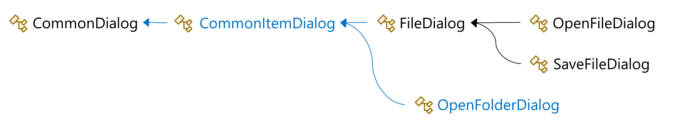
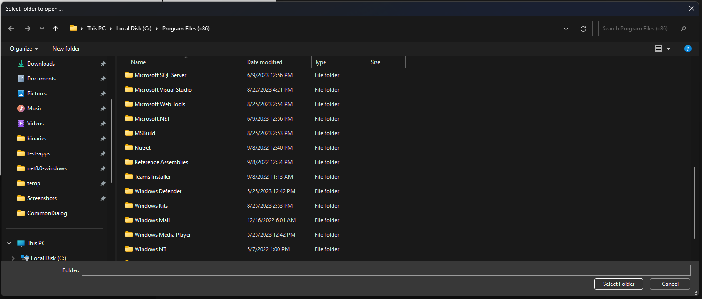
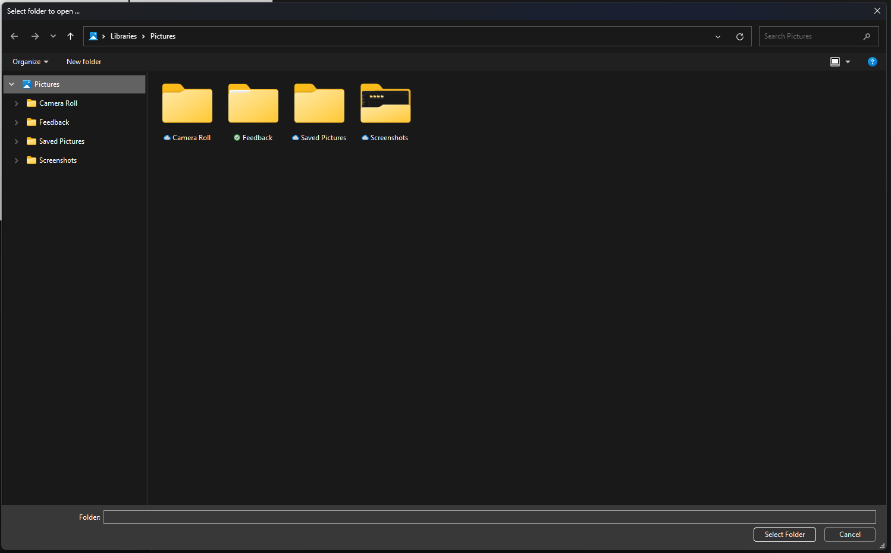

We are thrilled to announce a new set of improvements to the common file dialog API in WPF, starting with .NET 8 Preview 7. This includes the top voted API suggestion in the repository to date – the **OpenFolderDialog** control to allow users to select a folder – as well as several new properties on file dialogs in general, enabling new user scenarios such as separately persisted states, limiting folder navigation etc.

Until now, WPF supported both [Common Item Dialog](https://learn.microsoft.com/windows/win32/shell/common-file-dialog) API introduced in Windows Vista and the legacy [GetOpenFileName](https://learn.microsoft.com/windows/win32/api/commdlg/nf-commdlg-getopenfilenamew) and [GetSaveFileName](https://learn.microsoft.com/windows/win32/api/commdlg/nf-commdlg-getsavefilenamew) functions when running on older operating systems. As a part of this update, the dialog code was cleaned up and infrastructure for the legacy functions was removed, since all Windows versions supported by .NET use the newer API only. Applications running in compatibility mode continue to work, but they will present common dialogs using the Common Item Dialog API instead.

## OpenFolderDialog

One of the [most
requested](https://github.com/dotnet/wpf/issues?q=sort%3Areactions-%2B1-desc+) feature within the WPF community was a dialog for selecting folders. Example use cases include opening a folder in Visual Studio or Visual Studio Code, saving attachments in Outlook or extracting compressed files into a folder of user’s choice. Until now, developers had to use Windows Forms or rely on third-party libraries to be able to provide this experience, introducing unnecessary dependencies without fitting into the existing model of dialogs.

Starting with .NET 8, we are shipping native support for this dialog in WPF. There has been a lot of discussion in the community on how this feature should be integrated into the existing model of file dialogs, trying to balance compatibility requirements, clean architectural design and underlying API structure. Eventually, we decided to introduce a new base class, **CommonItemDialog**, into the inheritance chain, where all the common dialog properties got moved:



This allows us to remain backwards compatible with existing applications. More details on the design and discussion can be found in the [pull request](https://github.com/dotnet/wpf/pull/7244) and [API
proposal](https://github.com/dotnet/wpf/issues/7689).


Using the **OpenFolderDialog** is similar to using the existing file dialogs in WPF:

```cs
var folderDialog = new OpenFolderDialog
{
    Title = "Select Folder",
    InitialDirectory = Environment.GetFolderPath(Environment.SpecialFolder.ProgramFilesX86)
};

if (folderDialog.ShowDialog() == true)
{
    var folderName = folderDialog.FolderName;
    MessageBox.Show($"You picked ${folderName}!");
}
```

where the **ShowDialog** method opens the dialog and waits for user input:



More examples demonstrating the usage of OpenFolderDialog and other file dialogs can be found in the [WPF-Samples](https://github.com/microsoft/WPF-Samples/tree/main/Windows/CommonDialog) repository.

## New Dialog Properties

We also expanded the number of properties to configure the behavior of file dialogs in WPF, covering as much as currently possible of the underlying API. To highlight some of them:

- **ClientGuid** identifies the dialog's persistent state. This allows Windows to remember dialog state such as window size or last used folder separately per dialog, for example for the Save and Save As dialogs.
- Setting **AddToRecent** to false instructs the dialog to not add the opened or saved file or folder to the most recent items list maintained by Windows for the user. This can be for example used to prevent a configuration file from appearing in the Recommended section of the Start menu.
- Setting **CreateTestFile** to false prevents SaveFileDialog to verify user has access to the selected location by creating and deleting a dummy file. This can be useful when access to the location is expected to be expensive. However, the application will have to do all the appropriate error handling when creating the file itself.
- **RootDirectory** limits the folder tree in the dialog to a certain folder and its subfolders. Here is an example of RootDirectory set to user's Pictures folder:




Check the list of all the new properties in the [pull request](https://github.com/dotnet/wpf/pull/7916) or [API proposal](https://github.com/dotnet/wpf/issues/7689). We would like to invite you to try the new features out and provide us feedback.


## What's Next for File Dialogs

There is still room for improvement regarding the file dialogs, such as supporting virtual files or customizing the dialog by including additional controls in the user interface. We have a [pull request](https://github.com/dotnet/wpf/pull/7256) from the community proposing an implementation of the file dialog controls and we would like to invite everyone interested to participate in shaping this proposal and help us prioritize features that matter to you and your applications.

## Community Highlight

Special thanks to Jan Kučera, our community contributor, for his constant efforts in bringing the dialog updates alive. He explored different design options, prepared the API proposal, and implemented the feature end-to-end. Thanks Jan!

In Jan's own words:


Hello everyone, I am Jan, a researcher, developer and a huge WPF fan!

It is now 20 years since Microsoft started publicly talking about WPF, at that time under its codename Avalon (knowledge of which made win my first WinFX book), making it one of the longest available application frameworks using .NET. While it inspired many others, none of them seem to have matched it in features and straightforwardness, which is why WPF has always been my first choice. I especially value its layout system, allowing applications to adapt to their content.

The most enjoyable part of programming for me is interacting with the real world. I was involved in .NET Micro Framework (which brought WPF UI model to embedded devices) as a member of Core Team working with community. In Microsoft Research, I worked in the amazing team of James Scott and Steve Hodges on .NET Gadgeteer. Under their guidance, I became a researcher in Human-Computer Interaction.

Most of my free time is spent volunteering for Unicode, where I am vice-chair of the Unicode’s Script Ad Hoc Group and Keyboard Subcommittee. My passion about internationalization, especially text input and output, allowed me to contribute to the DirectWrite text shaping engine and the design of new keyboard layouts. This work enables me to help more and more communities become represented digitally, and I am hoping we can get WPF up to speed with their needs as well.

I am excited to see continued interest in and development of WPF and can recommend to anyone who is considering it to join the welcoming community and shape its future.
