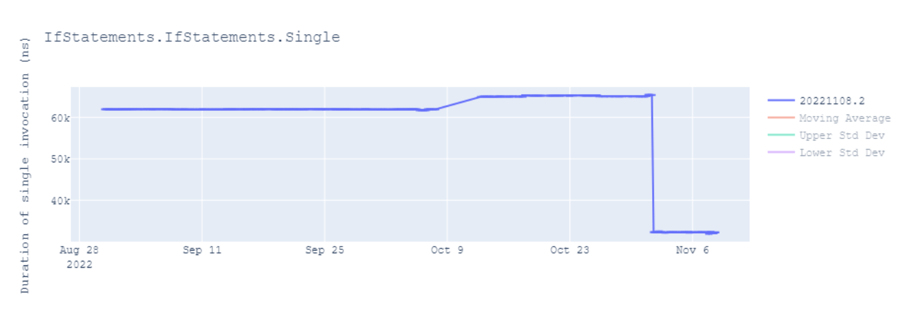
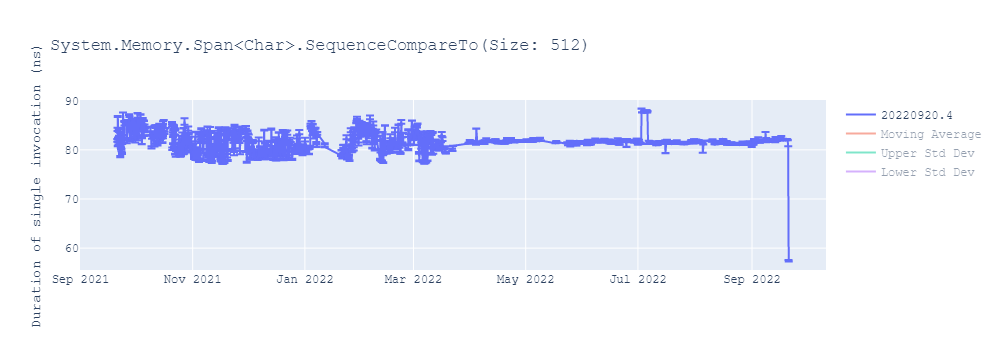
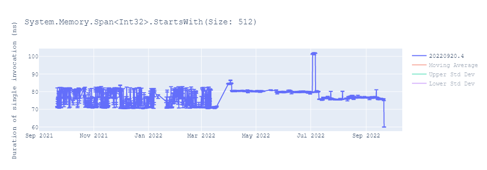
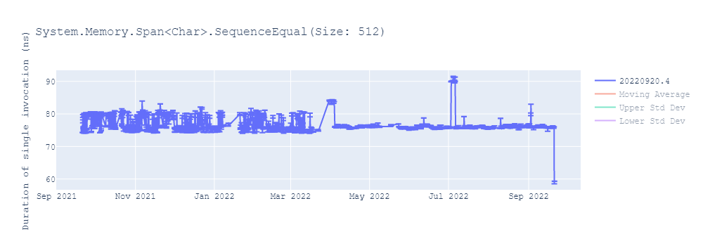
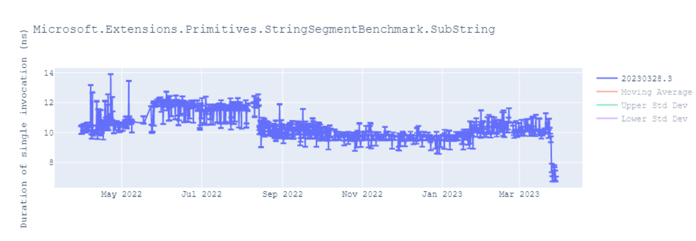
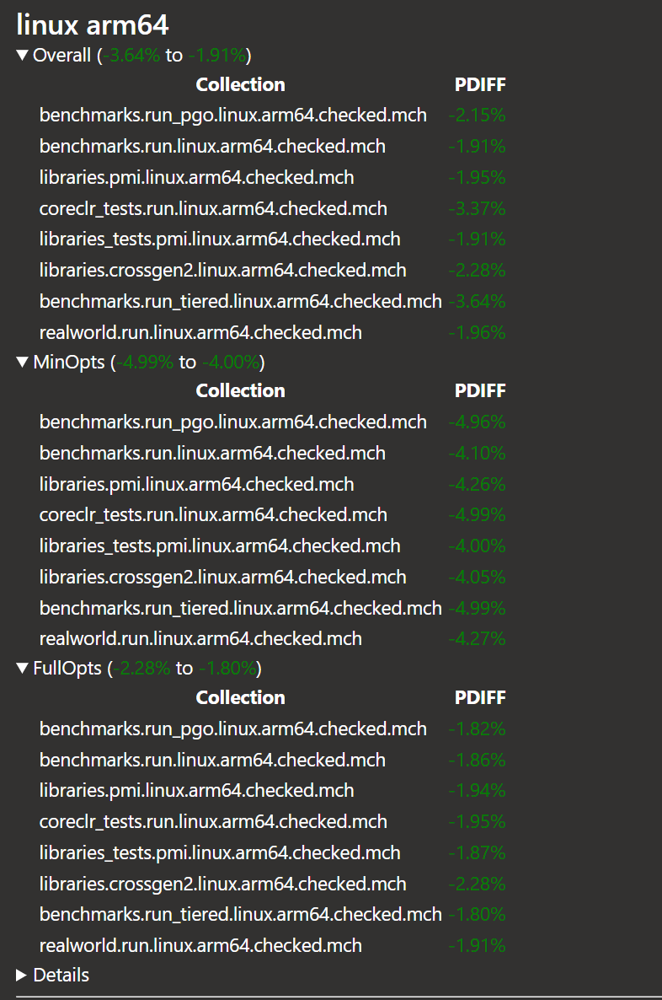
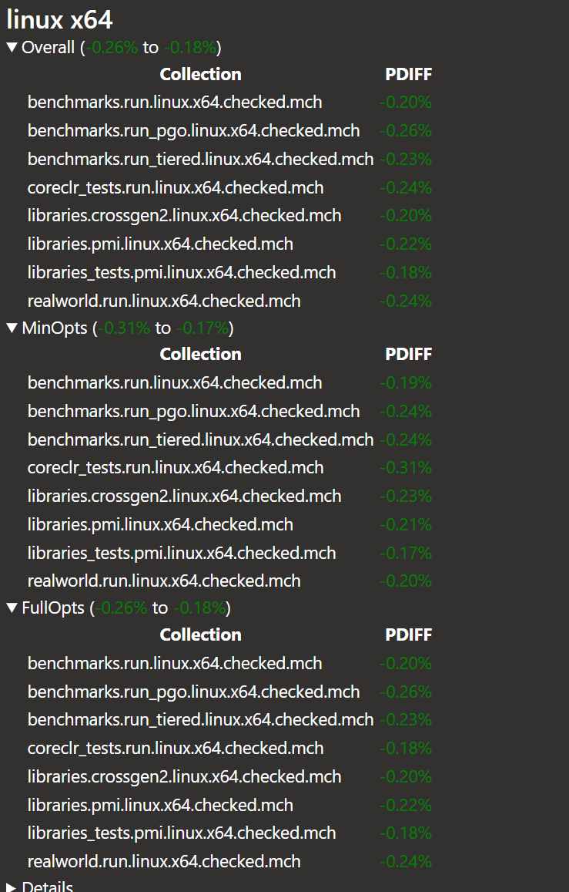

.NET 8 comes with a host of powerful features, enhanced support for cutting-edge architectural capabilities, and a significant boost in performance. For a comprehensive look at the general performance enhancements in .NET 8, be sure to delve into [Stephen Toub's insightful blog post](https://devblogs.microsoft.com/dotnet/performance-improvements-in-net-8/) on the subject.

Building on the foundation laid by previous releases such as [ARM64 Performance in .NET 5](https://devblogs.microsoft.com/dotnet/arm64-performance-in-net-5/) and [ARM64 Performance in .NET 7](https://devblogs.microsoft.com/dotnet/arm64-performance-improvements-in-dotnet-7/), this article will focus on the specific feature enhancements and performance optimizations tailored to ARM64 architecture in .NET 8.

A key objective for .NET 8 was to enhance the performance of the platform on Arm64 systems. However, we also set our sights on incorporating support for advanced features offered by the Arm architecture, thereby elevating the overall code quality for Arm-based platforms. In this blog post, we'll examine some of these noteworthy feature additions before diving into the extensive performance improvements that have been implemented. Lastly, we'll provide insights into the results of our performance analysis on real-world applications designed for Arm64 devices.

## Conditional Selection

Branches within the code can significantly impact the efficiency of the processor pipeline, potentially causing execution delays. While modern processors have made strides in branch prediction to maximize accuracy, they still mispredict branches, resulting in wasted processing cycles. Conditional selection instructions offer an alternative by encoding the necessary conditional flags directly within the instruction, eliminating the need for branch instructions. [This article](https://eclecticlight.co/2021/07/20/code-in-arm-assembly-conditions-without-branches/) offers a comprehensive overview of the various formats of these instructions.

In .NET 8, we've taken on the challenge of addressing all the scenarios outlined in [dotnet/runtime#55364](https://github.com/dotnet/runtime/issues/55364) to implement conditional selection instructions effectively. In [dotnet/runtime#73472](https://github.com/dotnet/runtime/pull/73472), [@a74nh](https://github.com/a74nh) introduced a new "if-conversion" phase designed to generate conditional selection instructions. Let's dig into an illustrative example.

```csharp
if (op1 > 0) { op1 = 5; }
```

In .NET 7, we generated `branch` for such code:

```asm
G_M12157_IG02:
            cmp     w0, #0
            ble     G_M12157_IG04

G_M12157_IG03:
            mov     w0, #5

G_M12157_IG04:
            ...
```

In .NET 8, we introduced the generation of `csel` instructions, illustrated below. The `cmp` instruction sets the flags based on the value in `w0`, determining whether it's greater than, equal to, or less than zero. The `csel` instruction then evaluates the "le" condition (the 4th operand of `csel`) triggered by the `cmp`. Essentially, it checks if `w0 <= 0`. If this condition holds true, it preserves the current value of `w0` (the 2nd operand of `csel`) as the result (the 1st operand of `csel`). However, if `w0 > 0`, it updates `w0` with the value in `w1` (the 3rd operand of `csel`).

```asm
G_M12157_IG02:
            mov     w1, #5
            cmp     w0, #0
            csel    w0, w0, w1, le
```

[dotnet/runtime#77728](https://github.com/dotnet/runtime/pull/77728) extended this work to handle `else` conditions as seen in following example:

 ```csharp
 if (op1 < 7) { op2 = 5; } else { op2 = 9; }
 ```

 Previously, we generated two branch instructions for `if-else` style code:

 ```asm
 G_M52833_IG02:
            cmp     w0, #7
            bge     G_M52833_IG04
 
G_M52833_IG03:
            mov     w1, #5
            b       G_M52833_IG05

G_M52833_IG04:
            mov     w1, #9

G_M52833_IG05:
            ...
 ```

With the introduction of `csel`, there is no longer a need for branches in this example. Instead, we can set the appropriate result value based on the conditional flag encoded within the instruction itself.

 ```asm
 G_M52833_IG02:
            mov     w2, #9
            mov     w3, #5
            cmp     w0, #7
            csel    w0, w2, w3, ge
 ```

As indicated in [this](https://github.com/dotnet/perf-autofiling-issues/issues/9677), [this](https://github.com/dotnet/perf-autofiling-issues/issues/9496) and [this](https://github.com/dotnet/perf-autofiling-issues/issues/9496) reports, we have observed nearly a 50% improvement in such scenarios.



### Conditional Comparison

In [dotnet/runtime#83089](https://github.com/dotnet/runtime/pull/83089), we enhanced the code even further by consolidating multiple conditions separated by the `||` operation into a conditional comparison `ccmp` instruction.

```csharp
[MethodImpl(MethodImplOptions.NoInlining)]
public static int Test3(int a, int b, int c)
{
    if (a < b || b < c || c < 10)
        return 42;

    return 13;
}
```

In the code snippet above, we observe several conditions linked together using the logical OR `||` operator. As a quick reminder, when using `||`, we evaluate the first condition, and if it's true, we don't check the remaining conditions. We only evaluate the subsequent conditions if the preceding ones are `false`.

Prior to .NET 8, our approach involved generating numerous instructions to conduct separate comparisons using `cmp` and storing the result of each comparison in a register. Even if the first condition evaluated to `true`, we still processed all the conditions joined by the `||` operator. The outcomes of these individual comparisons were then combined using the `orr` instruction, and a branch instruction `cbz` was employed to determine whether to jump based on the final result of all the conditions collectively.

```asm
G_M35702_IG02:
            cmp     w0, w1
            cset    x0, lt
            cmp     w1, w2
            cset    x1, lt
            orr     w0, w0, w1
            cmp     w2, #10
            cset    x1, lt
            orr     w0, w0, w1
            cbz     w0, G_M35702_IG05

G_M35702_IG03:
            mov     w0, #42

G_M35702_IG04:
            ldp     fp, lr, [sp],#0x10
            ret     lr

G_M35702_IG05:
            mov     w0, #13
            
G_M35702_IG06:
            ...
```

In .NET 8, we've introduced a more efficient approach. We initiate the process by comparing the values of `w0` and `w1` (as indicated by the `a < b` condition in our code snippet) using the `cmp` instruction. Subsequently, the `ccmp w1, w2, nc, ge` instruction comes into play. This instruction will only compare the values of `w1` and `w2` if the previous `cmp` instruction determined that the condition `ge` (greater than or equal) was met. In simpler terms, `w1` and `w2` are compared only when the `cmp` instruction finds that `w0` is greater than or equal to `w1`, meaning our condition `a < b` is false. If the first condition evaluates to true, there's no need for further condition checks, so the `ccmp` instruction simply sets the `nc` flags. This process is repeated for the subsequent `ccmp` instruction. Finally, the `csel` instruction determines the value (`w3` or `w4`) to place in the result (`w0`) based on the outcome of the `ge` condition. This example illustrates how processor cycles are conserved through the use of the `ccmp` instruction.

```asm
G_M35702_IG02:
            mov     w3, #13
            mov     w4, #42
            cmp     w0, w1
            ccmp    w1, w2, nc, ge
            ccmp    w2, #10, nc, ge
            csel    w0, w3, w4, ge
```

### Conditional Increment, Negation and Inversion

The `cinc` instruction is part of the conditional selection family of instructions, and it serves to increment the value of the source register by `1` if a specific condition is satisfied. 

In [dotnet/runtime#82031](https://github.com/dotnet/runtime/pull/82031), the code sequence was optimized by [@SwapnilGaikwad](https://github.com/SwapnilGaikwad) to generate `cinc` instructions instead of `csel` instructions whenever the code conditionally needed to increase a value by 1. This optimization helps streamline the code and improves its efficiency by directly incrementing the value when necessary, rather than relying on conditional selection for this specific operation.

 ```csharp
public static int Test4(bool c)
{
    return c ? 100 : 101;
}
 ```
Before .NET 8, two registers were required to store the values of both branches. After the `cmp` instruction, a selection would be made to determine which of the two values (`w1` and `w2`) should be stored in the result register `w0`. This approach used additional registers and instructions, which could impact performance and code size.

Here's how the code looked in older releases:

```asm
            mov     w1, #100
            mov     w2, #101
            cmp     w0, #0
            csel    w0, w1, w2, ne
```

With this structure, `w0` would either contain the value of `w1` or `w2` based on the condition, leading to potential register usage inefficiencies.

In .NET 8, we have eliminated the need to maintain an additional register. Instead, we use the `cinc` instruction to increment the value if the `tst` instruction succeeds. This enhancement simplifies the code and reduces the reliance on extra registers, potentially leading to improved performance and more efficient code execution.

```asm
            mov     w1, #100
            tst     w0, #255
            cinc    w0, w1, eq
```

Similarly, in [dotnet/runtime#84926](https://github.com/dotnet/runtime/pull/84926), we introduced support for `cinv` and `cneg` instructions, replacing the use of `csel`. This is demonstrated in the following example:

```csharp
public static int cinv_test(int x, bool c)
{
    return c ? x : ~x;
}

public static int cneg_test(int x, bool c)
{
    return c ? x : -x;
}
```

```asm
            tst     w1, #255
            csinv   w0, w0, w0, ne
            ...
            tst     w1, #255
            csneg   w0, w0, w0, ne
```

 [@a74nh](https://github.com/a74nh) has published a three part deep dive blog series explaining this work that was done in .NET. Read [part 1](https://community.arm.com/arm-community-blogs/b/architectures-and-processors-blog/posts/if-conversion-within-dotnet-part-1), [part 2](https://community.arm.com/arm-community-blogs/b/architectures-and-processors-blog/posts/if-conversion-within-dotnet-part-2) and [part 3](https://community.arm.com/arm-community-blogs/b/architectures-and-processors-blog/posts/if-conversion-within-dotnet-part-3) for more details.

## VectorTableLookup and VectorTableLookupExtension

In .NET 8, we added two new set of APIs under `System.Runtime.Intrinsics.Arm` namespace: `VectorTableLookup` and `VectorTableLookupExtension`. 

```csharp
      public static Vector64<byte> VectorTableLookup((Vector128<byte>, Vector128<byte>) table, Vector64<byte> byteIndexes);
      public static Vector64<byte> VectorTableLookup(Vector64<byte> defaultValues, (Vector128<byte>, Vector128<byte>) table, Vector64<byte> byteIndexes);
 
```

Let us see an example of each these APIs.

```c#
// Vector128<byte> a = 1, 2, 3, 4, 5, 6, 7, 8, 9, 10, 11, 12, 13, 14, 15, 16
// Vector128<byte> b = 10, 20, 30, 40, 50, 60, 70, 80, 90, 100, 110, 120, 130, 140, 150, 160
// Vector64<byte> index = 3, 31, 4, 40, 18, 19, 30, 1

Vector64<byte> ans = VectorTableLookup((a, b), index);

// ans = 4, 160, 5, 0, 30, 40, 150, 2
```

In the example above, the vectors `a` and `b` are treated as a single table with a total of 32 entries (16 from `a` and 16 from `b`), indexed starting from 0. The `index` parameter allows you to retrieve values from this table at specific indices. If an index is out of bounds, such as attempting to access index `40` in our example, the API will return a value of 0 for that out-of-bounds index.

```c#
// Vector64<byte> d = 100, 200, 300, 400, 500, 600, 700, 800
// Vector128<byte> a = 1, 2, 3, 4, 5, 6, 7, 8, 9, 10, 11, 12, 13, 14, 15, 16
// Vector128<byte> b = 10, 20, 30, 40, 50, 60, 70, 80, 90, 100, 110, 120, 130, 140, 150, 160
// Vector64<byte> index = 3, 31, 4, 40, 18, 19, 30, 1

Vector64<byte> ans = VectorTableLookupExtension(d, (a, b), index);

// ans = 4, 160, 5, 400, 30, 40, 150, 2
```

In contrast to the `VectorTableLookup`, when using `VectorTableLookupExtension` method, if an index falls outside the valid range, the corresponding element in the result will be determined by the values provided in the `defaultValues` parameter. It's worth noting that there are other variations of these APIs that operate on 3-entity and 4-entity tuples as well, providing flexibility for various use cases.

In [dotnet/runtime#85189](https://github.com/dotnet/runtime/pull/85189), [@MihaZupan](https://github.com/MihaZupan) leveraged this API to optimize `IndexOfAny`, resulting in a remarkable 30% improvement in performance. Similarly, in [dotnet/runtime#87126](https://github.com/dotnet/runtime/pull/87126), [@SwapnilGaikwad](https://github.com/SwapnilGaikwad) significantly enhanced the performance of the Guid formatter, achieving up to a 40% performance boost. These optimizations demonstrate the substantial performance gains that can be achieved by harnessing this powerful API.

## Consecutive Register Allocation

The `VectorTableLookup` and `VectorTableLookupExtension` APIs utilize the `tbl` and `tbx` instructions, respectively, for table lookup operations. These instructions work with input vectors contained in the `table` parameter, which can consist of 1, 2, 3, or 4 vector entities. It's important to note that these instructions require the input vectors to be stored in consecutive vector registers on the processor. For example, consider the code `VectorTableLookup((a, b, c, d), index)`, which generates the `tbl v11.16b, {v16.16b, v17.16b, v18.16b, v19.16b}, v20.16b` instruction. In this instruction, `v11` serves as the result vector, `v20` holds the value of the `index` variable, and the `table` parameter, represented as the tuple `(a, b, c, d)`, is stored in consecutive registers `v16` through `v19`.

Before .NET 8, RyuJIT's register allocator could only allocate a single register for each variable. However, in [dotnet/runtime#80297](https://github.com/dotnet/runtime/pull/80297), we introduced a new feature in the register allocator to allocate multiple consecutive registers for these types of instructions, enabling more efficient code generation.


To implement this feature, we made adjustments to the existing allocator algorithm and certain data structures to effectively manage variables that belong to a tuple series requiring consecutive registers. Here's an overview of how it works:

1. Tracking Consecutive Register Requirement: The algorithm now identifies the first variable in a tuple series that requires consecutive registers.

2. Register Allocation: Before assigning registers to variables, the algorithm checks for the availability of X consecutive free registers, where X is the number of variables in the `table` tuple.

3. Handling Register Shortages: If there aren't X consecutive free registers available, the algorithm looks for busy registers that are adjacent to some of the free registers. It then frees up these busy registers to meet the requirement of assigning X consecutive registers to the X variables in the `table` tuple.

4. Versatility: The allocation of consecutive registers isn't limited to just `tbl` and `tbx` instructions. It's also used for various load and store instructions that will be implemented in .NET 9. For instance, `ld2`, `ld3`, and `ld4` are load instructions capable of loading 2, 3, or 4 vector registers from memory, respectively. These instructions, as well as store instructions like `st2`, `st3`, and `st4`, all require consecutive registers.

This enhancement in the register allocator ensures that variables involved in tuple-based operations are allocated consecutive registers when necessary, improving code generation efficiency not only for existing instructions but also for upcoming load and store instructions in future .NET versions.

## Peephole optimizations

In .NET 5, we encountered several issues, as documented in [dotnet/runtime#55365](https://github.com/dotnet/runtime/issues/55365), where the application of peephole optimizations could significantly enhance the generated .NET code. Collaborating closely with engineers from Arm Corp., including [@a74nh](https://github.com/a74nh), [@SwapnilGaikwad](https://github.com/SwapnilGaikwad), and [@AndyJGraham](https://github.com/AndyJGraham), we successfully addressed all these issues in .NET 8. In the sections below, I will provide an overview of each of these improvements, along with illustrative examples.

### Replace successive `ldr` and `str` with `ldp` and `stp`

Through the combined efforts of [dotnet/runtime#77540](https://github.com/dotnet/runtime/pull/77540), [dotnet/runtime#85032](https://github.com/dotnet/runtime/pull/85032), and [dotnet/runtime#84399](https://github.com/dotnet/runtime/pull/84399), we've introduced an optimization that replaces successive pairs of load (`ldr`) and store (`str`) instructions with load pair (`ldp`) and store pair (`stp`) instructions, respectively. This enhancement has led to a remarkable reduction in the code size of several of our libraries and benchmark methods, amounting to a decrease of nearly 700KB in bytes.

As a result of this optimization, the following sequence of two `ldr` instructions and two `str` instructions has been streamlined to generate a single `ldp` instruction and a single `stp` instruction:

```diff
- ldr x0, [fp, #0x10]
- ldr x1, [fp, #0x16]
+ ldp x0, x1, [fp, #0x10]
...
- str x12, [x14]
- str x12, [x14, #8]
+ stp x12, [x14]
```

This transformation contributes to improved code efficiency and a reduction in overall binary size.

### Use ldp/stp for SIMD registers

In [dotnet/runtime#84135](https://github.com/dotnet/runtime/pull/84135), we introduced an optimization where a pair of load and store instructions involving SIMD (Single Instruction, Multiple Data) registers were replaced with a single `ldp` (Load Pair) and `stp` (Store Pair) instruction. This optimization is demonstrated in the following example:

```diff
- ldr q1, [x0, #0x20]
- ldr q2, [x0, #0x30]
+ ldp q1, q2, [x0, #0x20]
```

### Replace pair of `str wzr` with `str xzr` 

In [dotnet/runtime#84350](https://github.com/dotnet/runtime/pull/84350), we introduced an optimization that consolidated a pair of stores involving 4-byte zero registers into a single store instruction that utilized an 8-byte zero register. This optimization enhances code efficiency by reducing the number of instructions required, resulting in improved performance and potentially smaller code size.

```diff
- stp wzr, wzr, [x2, #0x08]
+ str xzr, [x2, #0x08]
...
...
- stp wzr, wzr, [x14, #0x20]
- str wzr, [x14, #0x18]
+ stp xzr, xzr, [x14, #0x18]
```


### Replace load with cheaper `mov`

In [dotnet/runtime#83458](https://github.com/dotnet/runtime/pull/83458), we implemented an optimization that replaced a heavier load instruction with a more efficient `mov` instruction in certain scenarios. For example, when the content of memory loaded into register `w1` was subsequently loaded into `w0`, we used the `mov` instruction instead of performing a redundant load operation.

```diff
ldr w1, [fp, #0x28]
- ldr w0, [fp, #0x28]
+ mov w0, w1
```

The same PR also eliminated redundant load instructions when the contents were already present in a register. For instance, in the following example, if `w1` had already been loaded from `[fp + 0x20]`, the second load instruction could be removed.

```diff
ldr w1, [fp, #0x20]
- ldr w1, [fp, #0x20]
```

### Convert mul + neg -> mneg

In [dotnet/runtime#79550](https://github.com/dotnet/runtime/pull/79550), we transformed two operations involving multiplication and negation instruction to a single `mneg` instruction.

## Code quality improvements

In .NET 8, we also implemented various enhancements in other aspects of RyuJIT to enhance the performance of Arm64 code.

### Faster Vector128/Vector64 compare

In [dotnet/runtime#75864](https://github.com/dotnet/runtime/pull/75864), we optimized vector comparisons in commonly used algorithms like `SequenceEqual` or `IndexOf`. Let's take a look at the code generated before these optimizations.

```c#
bool Test1(Vector128<int> a, Vector128<int> b) => a == b;
```

In the generated code, the first step involves comparing two vectors, `a` and `b`, which are stored in vector registers `v0` and `v1`. This comparison is performed using the `cmeq` instruction that compares two vectors bitwise. This instruction compares bytes in each lane of the two vectors, `v0` and `v1`. If the bytes are equal, it sets the corresponding lane to `0xFF`, otherwise, it sets it to `0x00`. Following the comparison, the `uminv` instruction is used to find the minimum byte among all the lanes. It's important to note that the `uminv` instruction has a higher latency because it operates on all lanes after the data for all the lanes is available, and therefore, it does not operate in parallel.

```asm
          cmeq    v16.4s, v0.4s, v1.4s
          uminv   b16, v16.16b
          umov    w0, v16.b[0]
          cmp     w0, #0
          cset    x0, ne
```

In [dotnet/runtime#75864](https://github.com/dotnet/runtime/pull/75864), we made a significant improvement by changing the instruction from `uminv` to `uminp` in the generated code. The `uminp` instruction finds the minimum bytes in pairwise lanes, which allows it to operate more efficiently. After that, the `umov` instruction gathers the combined bytes from the first half of the vector. Finally, the `cmn` instruction checks if those bytes are zero or not. This change results in better performance compared to the previous `uminv` instruction because `uminp` can find the minimum value in parallel.

```asm
          uminp   v16.4s, v16.4s, v16.4s
          umov    x0, v16.d[0]
          cmn     x0, #1
          cset    x0, eq
```

We observed significant improvements in various core .NET library methods as a result of these optimizations, with performance gains of up to 40%. You can find more details about these improvements in [this report](https://github.com/dotnet/perf-autofiling-issues/issues/8660).
  





### Improve vector == Vector128<>.Zero

Thanks to the suggestion from [@TamarChristinaArm](https://github.com/TamarChristinaArm), we made further improvements to vector comparisons with the `Zero` vector in [dotnet/runtime#75999](https://github.com/dotnet/runtime/pull/75999). These optimizations resulted in [significant performance improvements](https://github.com/dotnet/perf-autofiling-issues/issues/8767). In this optimization, we replaced the `umaxv` instruction, which compares the maximum value across all lanes, with the more efficient `umaxp` instruction that performs pairwise comparisons to find the maximum value.

```csharp
static bool IsZero1(Vector128<int> v) => v == Vector128<int>.Zero;
```

In the previous code, we observed that the `umaxv` instruction was generated, which found the maximum value across all lanes and stored it in the 0th lane. Then, the value from the 0th lane was extracted and compared with `0`.

```asm
          umaxv   s16, v0.4s
          umov    w0, v16.s[0]
          cmp     w0, #0
```

Now, we use `umaxp` instruction which has better latency.

```asm
          umaxp   v16.4s, v0.4s, v0.4s
          umov    x0, v16.d[0]
          cmp     x0, #0
```

Here is an example of performance improvement of `SequenceEqual` benchmark.
  

### Unroll Memmove

In [dotnet/runtime#83740](https://github.com/dotnet/runtime/pull/83740), we introduced a feature to unroll the memory move operation in the `Buffer.Memmove` API. Without unrolling, the memory move operations need to be done in a loop that operates on smaller chunks of the memory data to be moved. Unrolling optimizes the operation by reducing the loop overhead and enhancing memory access patterns. By copying larger chunks of data in each iteration, it minimizes the number of loop control instructions and leverages modern processors' ability to perform multiple memory transfers in parallel. This can result in faster and more efficient code execution, especially when working with large data sets or when optimizing critical performance-sensitive code paths. This enhancement is utilized in various APIs such as `TryCopyTo`, `ToArray`, and others.

As demonstrated in [this](https://github.com/dotnet/perf-autofiling-issues/issues/14619) and [this](https://github.com/dotnet/perf-autofiling-issues/issues/14647) performance reports, these optimizations have led to significant performance improvements, with speedups of up to 20%.



 
## Throughput improvements

In our continuous efforts to enhance the quality and performance of our code, we are equally dedicated to ensuring that the time taken to produce code remains efficient. This aspect is particularly crucial for applications where startup time is of paramount importance, such as user interface applications. As a result, we have integrated measures to evaluate the Just-In-Time (JIT) compiler's throughput in our development process. For those unfamiliar, [superpmi](https://github.com/dotnet/runtime/blob/main/src/coreclr/tools/superpmi/readme.md) is an internally developed tool used by RyuJIT for validating the compilation of millions of methods. The `superpmi-diff` functionality is employed to validate changes made to the codebase by comparing the assembly code produced before and after these changes. This comparison not only checks the generated code but also evaluates the time it takes for code compilation. With the recent introduction of our [superpmi-diffs CI pipeline](https://dev.azure.com/dnceng-public/public/_build?definitionId=152&_a=summary), we now systematically assess the JIT throughput impact of every pull request that involves the JIT codebase. This rigorous process ensures that any changes made do not compromise the efficiency of code production, ultimately benefiting the performance of .NET applications.

Efficient throughput is essential for applications with strict startup time requirements. To optimize this aspect, we have implemented several improvements, with a focus on the JIT's register allocation process for generating Arm64 code.

In [dotnet/runtime#85744](https://github.com/dotnet/runtime/pull/85744), we introduced a mechanism to detect whether a method utilizes floating-point variables. If no floating-point variables are present, we skip the iteration over floating-point registers during the register allocation phase. This seemingly minor change resulted in a throughput gain of up to 0.5%.

During register allocation, the algorithm iterates through various access points of both user-defined variables and internally created variables used for storing temporary results. When determining which register to assign at a given access point, the algorithm traditionally iterated through all possible registers. However, it is more efficient to iterate only over the pre-determined set of allocatable registers at each access point. In [dotnet/runtime#87424](https://github.com/dotnet/runtime/pull/87424), we addressed this issue, leading to significant throughput improvements of up to 5%, as demonstrated below:



It's important to note that due to the larger number of registers available in Arm64 compared to x64 architecture, these changes resulted in more substantial throughput improvements for Arm64 code generation as compared to x64 targets.



## Conclusion

In .NET 8, our collaboration with Arm Holdings engineers resulted in significant feature enhancements and improved code quality for Arm64 platforms. We addressed longstanding issues, introduced peephole optimizations, and adopted advanced instructions such as conditional selection. The addition of consecutive register allocation was a crucial feature that not only enabled instructions like `VectorTableLookup` but also paved the way for future instructions like those capable of loading and storing multiple vectors as seen in the API proposal [dotnet/runtime#84510](https://github.com/dotnet/runtime/issues/84510). Looking ahead, our goals also include adding support for advanced architecture features like SVE and SVE2.

We extend our gratitude to the many contributors who have helped us deliver a faster .NET 8 on Arm64 devices.

Thank you for taking the time to explore .NET on Arm64, and please share your feedback with us. Happy coding on Arm64!