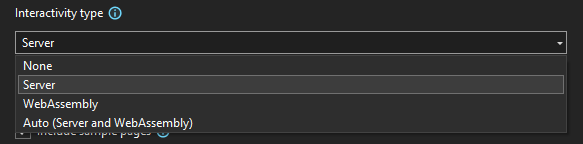
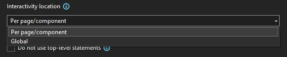
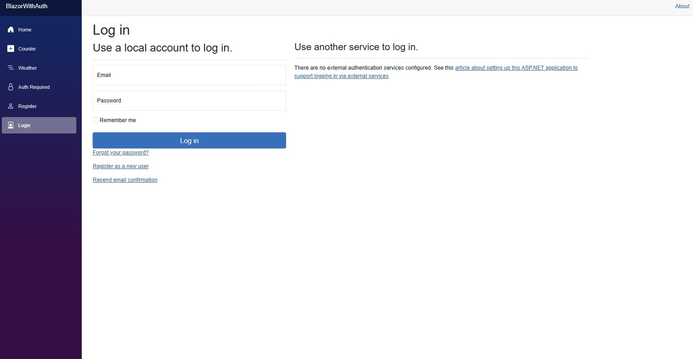
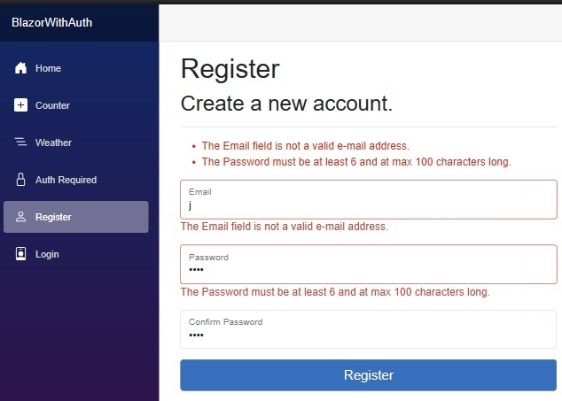
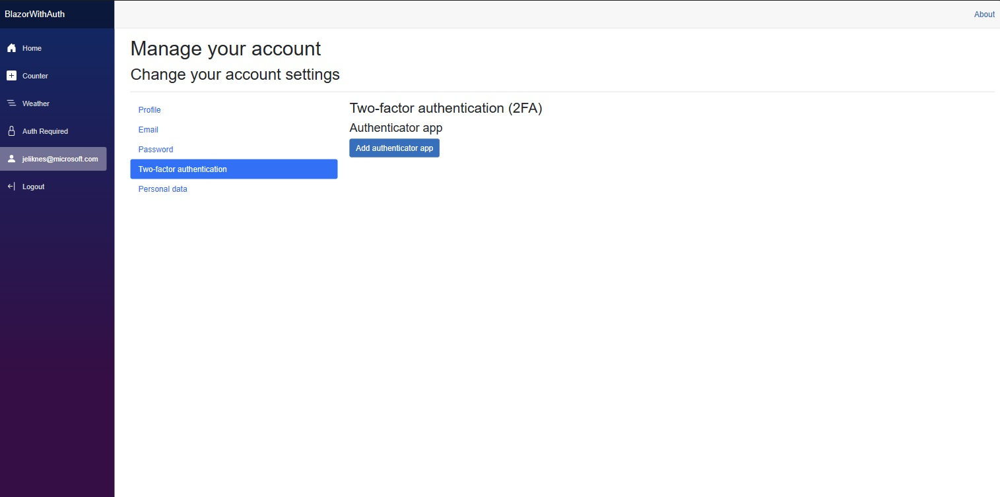

[.NET 8 Release Candidate 2 (RC2) is now available](https://devblogs.microsoft.com/dotnet/announcing-dotnet-8-rc2) and includes many great new improvements to ASP.NET Core!

This is the last release candidate that we plan to share before the final .NET 8 release later this year. Most of the planned features and changes for .NET 8 are part of this release candidate and are ready for you to try out. You can find the full list of [what's new in ASP.NET Core in .NET 8](https://learn.microsoft.com/aspnet/core/release-notes/aspnetcore-8.0) in the docs.

Here's a summary of what's new in this preview release:

- [Servers & middleware](#servers)
    - HTTP logging extensibility
    - Updated to IdentityModel 7x
- [API authoring](#apis)
    - Support for form files in new form binding
- [SignalR](#signalr)
    - Typescript client stateful reconnect support
- [Blazor](#blazor)
    - Global interactivity for Blazor Web Apps
    - Blazor WebAssembly template updates
    - File scoped `@rendermode` Razor directive
    - Enhanced navigation & form handling improvements
    - Close circuits when there are no remaining interactive server components
    - Form model binding improvements
    - Access `HttpContext` as a cascading parameter
    - Persist component state in a Blazor Web App
    - Inject keyed services into components
    - Support for dialog cancel and close events
    - Error page support
- [Identity](#identity)
    - Blazor identity UI
- [Single page apps (SPA)](#spa)
    - Run the new SPA templates from the command-line

For more details on the ASP.NET Core work planned for .NET 8 see the full [ASP.NET Core roadmap for .NET 8](https://aka.ms/aspnet/roadmap) on GitHub.

## Get started

To get started with ASP.NET Core in .NET 8 RC2, [install the .NET 8 SDK](https://dotnet.microsoft.com/next).

If you're on Windows using Visual Studio, we recommend installing the latest [Visual Studio 2022 preview](https://visualstudio.com/preview). If you're using Visual Studio Code, you can try out the new [C# Dev Kit](https://devblogs.microsoft.com/visualstudio/announcing-csharp-dev-kit-for-visual-studio-code/).

## Upgrade an existing project

To upgrade an existing ASP.NET Core app from .NET 8 RC1 to .NET 8 RC2:

- Update the target framework of your app to `net8.0`.
- Update all Microsoft.AspNetCore.\* package references to `8.0.0-rc.2.*`.
- Update all Microsoft.Extensions.\* package references to `8.0.0-rc.2.*`.

In Blazor Web Apps, you'll also need to update any API calls that refer to the interactive render modes to include the new `Interactive` prefix:

.NET 8 RC1 | .NET 8 RC2
--- | ---
`Server` | `InteractiveServer`
`WebAssembly` | `InteractiveWebAssembly`
`Auto` | `InteractiveAuto`

Also, we renamed the `Handler` property on `SupplyParameterFromFormAttribute` to `FormName`.

See also the full list of [breaking changes](https://docs.microsoft.com/dotnet/core/compatibility/8.0#aspnet-core) in ASP.NET Core for .NET 8.

<a id="servers"></a>

## Servers & middleware

### HTTP logging extensibility

The HTTP logging middleware has several [new capabilities](https://github.com/dotnet/aspnetcore/pull/50163/):

- `HttpLoggingFields.Duration`: When enabled, this emits a new log at the end of the request/response measuring the total time in milliseconds taken for processing. This has been added to the `HttpLoggingFields.All` set.
- `HttpLoggingOptions.CombineLogs`: When enabled, the middleware will consolidate all of its enabled logs for a request/response into one log at the end. This includes the request, request body, response, response body, and duration.
- `IHttpLoggingInterceptor`: A new service that can be implemented and registered (`AddHttpLoggingInterceptor<T>`) to receive per request/response callbacks for customizing what details get logged. Any endpoint specific log settings are applied first and can then be overridden in these callbacks. The implementation can inspect a request/response, enable or disable any/all `HttpLoggingFields`, adjust how much of the request/response body is logged, and add custom parameters to the logs. Multiple `IHttpLoggingInterceptor`'s will be run in the order registered.

### Updated to IdentityModel 7x

We've updated ASP.NET Core to use the latest version of the IdentityModel libraries, [IdentityModel 7x](
https://github.com/AzureAD/azure-activedirectory-identitymodel-extensions-for-dotnet/wiki/IdentityModel-7x
), which includes leveraging the more performant JsonWebTokenHandler. These libraries enable improved performance and API consistency as well as full Native AOT compatibility.

<a id="apis"></a>

## API authoring

### Support for form files in new form binding

In .NET 8 Preview 6, we introduced support for complex form binding to minimal APIs, using a mapping infrastructure shared by Blazor. In RC2, this form binding implementation now supports binding types that contains an `IFormFile` property.

The following sample provides access to the uploaded file via the `DocumentUpload.Document` property.

```csharp
var app = WebApplication.Create();

app.MapPost("/upload", ([FromForm] DocumentUpload document) =>
{
    return Results.Ok();
});

app.Run();

public class DocumentUpload
{
    public string Name { get; set; } = "Uploaded Document";
    public string? Description { get; set; }
    public IFormFile? Document { get; set; }
}
```
<a id="signalr"></a>

## SignalR

### Typescript client stateful reconnect support

In earlier .NET 8 previews, we added support for stateful reconnect in the .NET client. The feature is now available in the TypeScript client.

This feature aims to reduce the perceived downtime of clients that have a temporary hiccup in their network connection, due to switching network connections, driving through a tunnel, etc. It achieves this by temporarily buffering data on the server and client and ack-ing messages sent by both sides, as well as recognizing when a connection is returning and replaying messages that may have been sent while the connection was down.

To opt-in to the feature, update your TypeScript/JavaScript client code to enable the option:

```ts
const builder = new signalR.HubConnectionBuilder()
    .withUrl("/hubname")
    .withStatefulReconnect({ bufferSize: 1000 }); // optional options, defaults to 100,000
const connection = builder.build();
```

The server also needs to enable support on the endpoint being accessed by the client:

```csharp
app.MapHub<MyHub>("/hubName", options =>
{
    options.AllowStatefulReconnects = true;
});
```

<a id="blazor"></a>

## Blazor

### Global interactivity for Blazor Web Apps

The Blazor Web App template has new options to enable an interactive render mode for the entire app instead of just for individual pages. Enabling an interactive render mode globally means the entire app becomes interactive including the router and layout. Page navigations benefit from client-side routing and every page can use interactive features. This option is very similar in functionality to how existing Blazor Server and Blazor WebAssembly apps function.

When creating a Blazor Web App you can select which interactive render modes you want to enable using the new interactivity type dropdown list (goodbye checkboxes!):



You can then specify the interactivity location to be enabled per page/component, or globally for the entire app:



If you enable interactivity globally, then any components in the root `App` component will use the selected render mode. For example, if you enable the auto render mode globally, then your *App.razor* will look like this:

```razor
<!DOCTYPE html>
<html lang="en">

<head>
    <meta charset="utf-8" />
    <meta name="viewport" content="width=device-width, initial-scale=1.0" />
    <base href="/" />
    <link rel="stylesheet" href="bootstrap/bootstrap.min.css" />
    <link rel="stylesheet" href="app.css" />
    <link rel="stylesheet" href="BlazorApp14.styles.css" />
    <link rel="icon" type="image/png" href="favicon.png" />
    <HeadOutlet @rendermode="@RenderMode.InteractiveAuto" />
</head>

<body>
    <Routes @rendermode="@RenderMode.InteractiveAuto" />
    <script src="_framework/blazor.web.js"></script>
</body>

</html>
```

If your app uses a WebAssembly-based interactive render mode (WebAssembly or Auto), then all the components and their dependencies will be moved to the client project.

### Blazor WebAssembly template updates

In .NET 8 we've been working to consolidate the Blazor project templates around the new full stack web UI support. Most Blazor scenarios are now handled by the Blazor Web App template, which combines the strengths of server and client based web UI development into a single cohesive model. But there are still cases where you may need to host a Blazor app as a static site without an ASP.NET Core server. For example, you may want to host a Blazor app on GitHub Pages or on Azure Static Web Apps. For static sites, Blazor WebAssembly is still the right solution.

In .NET 8 RC2 we've made the following updates to the Blazor WebAssembly project templates:

- Renamed the Blazor WebAssembly App template to Blazor WebAssembly Standalone App to reflect that it no longer has an ASP.NET Core hosted option in .NET 8. To create an ASP.NET Core hosted Blazor app use the Blazor Web App template with the WebAssembly interactive render mode enabled.
- Removed the Blazor WebAssembly App Empty project template and instead added an option to the Blazor WebAssembly template for including the sample page content.
- Cleaned up the template content to use the same names and structure as the Blazor Web App template.

### File scoped `@rendermode` Razor directive

The `@rendermode` Razor directive can now be applied at the file scope to specify a render mode on a component definition instead of using the existing render mode attributes.

The `@rendermode` directive takes a single parameter of type `IComponentRenderMode`, just like it does when used as a Razor directive attribute on a component instance. The `RenderMode` static class provides convenience properties for the currently supported render modes: `InteractiveServer`, `InteractiveWebAssembly`, and `InteractiveAuto`. You can use a `using static` directive in your *_Imports.razor* file to simplify access to these render mode properties.

*_Imports.razor*

```razor
@using static Microsoft.AspNetCore.Components.Web.RenderMode
```

*Counter.razor*

```razor
@rendermode InteractiveServer
```

You can also reference static render mode instances instantiated directly with custom configuration, like with prerendering disabled.

```razor
@rendermode renderMode

@code {
    static IComponentRenderMode renderMode = new InteractiveWebAssemblyRenderMode(prerender: false);
}
```

Here's how the existing render mode attributes map to the new Razor syntax:

`[RenderModeXxx]` attribute | `@rendermode` directive
--- | ---
`@attribute [RenderModeInteractiveServer]` | `@rendermode InteractiveServer`
`@attribute [RenderModeInteractiveWebAssembly]` | `@rendermode InteractiveWebAssembly`
`@attribute [RenderModeInteractiveAuto]` | `@rendermode InteractiveAuto`

The Blazor Web App template hasn't been updated yet to use the new `@rendermode` syntax in place of the existing render mode attributes, but we plan to make this change for the final .NET 8 release.

### Enhanced navigation & form handling improvements

Blazor in .NET 8 enhances navigation and form handling by intercepting the requests and intelligently updating the DOM with the statically rendered content from the server. In this release, we've made some improvements to how enhanced navigation & form handling works so that you have more control over when the enhancements are applied and so the enhancements integrate well with other non-Blazor pages.

**Control when enhanced navigation is used**

Enhanced navigation is enabled by default for pages within the app when you add the Blazor script (*blazor.web.js*). Enhanced navigation is only supported with Blazor-based pages. When navigating within the app to a non-Blazor endpoint, Blazor will retry the request without enhanced navigation. To avoid this duplicate request, you can control whether clicking on a link results in an enhanced navigation by applying the `data-enhance-nav` attribute to the anchor tag or any ancestor element.

```html
<a href="my-non-blazor-page" data-enhance-nav="false">My Non-Blazor Page</a>
```

**Enable enhanced form handling**

Enhanced form handling is not enabled by default in this release to avoid issues with forms that redirect to a non-Blazor page. To enable enhanced form handling, use the `data-enhance` attribute on the `form` element or using the `Enhance` parameter on `EditForm`.

```razor
<form method="post" @onsubmit="() => submitted = true" @formname="name" data-enhance>
    <AntiforgeryToken />
    <InputText @bind-Value="Name" />
    <button>Submit</button>
</form>

@if (submitted)
{
    <p>Hello @Name!</p>
}

@code{
    bool submitted;

    [SupplyParameterFromForm]
    public string Name { get; set; } = "";
}
```

```razor
<EditForm method="post" Model="NewCustomer" OnValidSubmit="() => submitted = true" FormName="customer" Enhance>
    <DataAnnotationsValidator />
    <ValidationSummary/>
    <p>
        <label>
            Name: <InputText @bind-Value="NewCustomer.Name" />
        </label>
    </p>
    <button>Submit</button>
</EditForm>

@if (submitted)
{
    <p id="pass">Hello @NewCustomer.Name!</p>
}

@code {
    bool submitted = false;

    [SupplyParameterFromForm]
    public Customer? NewCustomer { get; set; }

    protected override void OnInitialized()
    {
        NewCustomer ??= new();
    }

    public class Customer
    {
        [StringLength(3, ErrorMessage = "Name is too long")]
        public string? Name { get; set; }
    }
}
```

Enhanced forms that redirect to a non-Blazor endpoint will result in an error.

**Preserve content with enhanced navigation & form handling**

Blazor's enhanced navigation & form handing may undo any dynamic changes to the DOM if the updated content is not part of the server rendering. To indicate that the content of an element should be preserved, use the new `data-permanent` attribute.

```html
<div data-permanent>
    This div gets updated dynamically by a script when the page loads!
</div>
```

**Enhanced load event**

Once Blazor has started on the client, you can use the `enhancedload` event to listen for enhanced page updates, including streaming updates. This allows for reapplying changes to the DOM that may have been undone by an enhanced page update.

```js
Blazor.addEventListener('enhancedload', () => console.log('Enhanced update occurred!'));
```

### Close circuits when there are no remaining interactive server components

Interactive server components handle web UI events using a real-time connection with the browser called a circuit. A circuit and its associated state are setup when a root interactive server component is rendered. In .NET 8 RC2, the circuit will now be closed when there are no remaining interactive server components on the page, which frees up server resources.

### Form model binding improvements

Form model binding in Blazor will now honor the data contract attributes (`[DataMember]`, `[IgnoreDataMember]`, etc.) for customizing how the form data is bound to the model.

```razor
<EditForm method="post" Model="NewCustomer" OnValidSubmit="() => submitted = true" FormName="customer" Enhance>
    <DataAnnotationsValidator />
    <ValidationSummary/>
    <p>
        <label>
            Name: <InputText @bind-Value="NewCustomer.Name" />
        </label>
    </p>
    <input type="hidden" name="Parameter.Id" value="1" />
    <button>Submit</button>
</EditForm>

@if (submitted)
{
    <p id="pass">Hello @NewCustomer.Name!</p>
}

@code {
    bool submitted = false;

    [SupplyParameterFromForm]
    public Customer? NewCustomer { get; set; }

    protected override void OnInitialized()
    {
        NewCustomer ??= new();
    }

    public class Customer
    {
        [IgnoreDataMember]
        public int Id { get; set; }

        [StringLength(3, ErrorMessage = "Name is too long")]
        [DataMember(Name = "FirstName")]
        public string Name { get; set; }
    }
}
```

### Access `HttpContext` as a cascading parameter

You can now access the current `HttpContext` as a cascading parameter from a static server component.

```csharp
[CascadingParameter]
public HttpContext? HttpContext { get; set; }
```

Accessing the `HttpContext` from a static server component may be useful for inspecting and modifying headers or other properties.

### Persist component state in a Blazor Web App

You can now persist and read component state in a Blazor Web App using the existing `PersistentComponentState` service. This is useful for [persisting component state during prerendering](https://learn.microsoft.com/aspnet/core/blazor/components/prerender?view=aspnetcore-8.0#persist-prerendered-state). Blazor Web Apps will automatically persist any registered state during prerendering, removing the need for the  `persist-component-state` tag helper.

### Inject keyed services into components

Blazor now supports injecting keyed services using the `[Inject]` attribute. Keys allow for scoping of registration and consumption of services when using dependency injection. Use the new `InjectAttribute.Key` property to specify the key for the service to inject:

```csharp
[Inject(Key = "my-service")]
public IMyService MyService { get; set; }
```

The `@inject` Razor directive doesn't support keyed services yet, but that's something we are [tracking](https://github.com/dotnet/razor/issues/9286) to improve in a future release.

### Support for dialog cancel and close events

Blazor now supports the `cancel` and `close` events on the `dialog` HTML element:

```razor
<div>
    <p>Output: @message</p>

    <button onclick="document.getElementById('my-dialog').showModal()">
        Show modal dialog
    </button>

    <dialog id="my-dialog" @onclose="OnClose" @oncancel="OnCancel">
        <p>Hi there!</p>
        <form method="dialog">
            <button>Close</button>
        </form>
    </dialog>
</div>

@code {
    string message;
    void OnClose(EventArgs e) => message += "onclose,";
    void OnCancel(EventArgs e) => message += "oncancel,";
}
```

Thank you [@campersau](https://github.com/campersau) for this contribution!

### Error page support

Blazor Web Apps can now define a custom error page for use with the [ASP.NET Core exception handling middleware](https://learn.microsoft.com/aspnet/core/fundamentals/error-handling#exception-handler-page). We've updated the Blazor Web App project template to include a default error page (*Components/Pages/Error.razor*) with similar content to the one used in MVC & Razor Pages apps. When the Blazor Web App error page is rendered in response to a request from the exception handling middleware, the error page always renders as a static server component even if interactivity is otherwise enabled.

<a id="identity"></a>

## Identity

## Blazor identity UI

.NET 8 RC2 includes support to generate a full Blazor-based Identity UI when you choose the authentication option for "Individual Accounts." You can either select the option for "Individual Accounts" in the new project dialog for Blazor Web Apps from Visual Studio, or pass the option from the command line when you create a new project, like this:

```bash
dotnet new blazor -au Individual
```

In Visual Studio, the Blazor Web App template will scaffold identity code for a SQL Server database. The command line version uses SQLite by default and includes a pre-created SQLite database for identity.



The template handles the following things for you:

- Adds the identity-related packages and dependencies
- References the identity packages in `_Imports.razor`
- Creates a custom identity class called `ApplicationUser'
- Creates and registers an EFCore DbContext
- Adds and routes the built-in identity endpoints
- Adds all identity UI components and related logic
- Includes identity validation and business logic



The UI components also support advanced identity concepts such as multi-factor authentication using a third-party app and email confirmations.



The team is also working to build authentication samples for other app types, including Blazor WebAssembly and single page apps (Angular, React).

We encourage you to try out these new capabilities and let us know how we're doing and what we can do better. Please note there are a few [known issues](#know-issues) with the Blazor identity UI in the RC2 release that are listed at the end of this post. 

<a id="spa"></a>

## Single page apps (SPA)

### Run the new SPA templates from the command-line

Apps created using the new ASP.NET Core SPA templates in Visual Studio can now be run from the .NET command-line interface on both Windows and non-Windows platforms. To run the app, use `dotnet run --launch-profile https` to run the server project, which will then automatically start the frontend JavaScript development server. Note that currently using the `https` launch profile is required.

## Known Issues

There are a few known issues in this release that we expect to address for the upcoming .NET 8 release.

- **[Blazor Web App template fails to compile when enabling the WebAssembly or Auto interactive render mode globally](https://github.com/dotnet/aspnetcore/issues/50980)**: When creating a new Blazor Web App with either the WebAssembly or Auto interactive render modes enabled globally, the template fails to compile because the new error page is incorrectly generated in the client project. To workaround this issue, move *Pages/Error.razor* from the client project to the server project.
- **[Error when submitted form in Blazor Web App: The POST request does not specify which form is being submitted](https://github.com/dotnet/razor/issues/9323)**: When submitted a valid form in a Blazor Web App you may receive an error response stating "The POST request does not specify which form is being submitted. To fix this, ensure `<form>` elements have a `@formname` attribute with any unique value, or pass a `FormName` parameter if using `<EditForm>`". This is due to an issue with how the `@formname` directive attribute is handled in this release and will be fixed for the upcoming .NET 8 release. To workaround the issue you can use `EditForm` instead, or use the following patched version of the Razor compiler (but be sure to remove this reference when upgrading to the final .NET 8 release):

    ```xml
    <PackageReference Include="Microsoft.Net.Compilers.Razor.Toolset" Version="7.0.0-preview.23512.5">
      <PrivateAssets>all</PrivateAssets>
      <IncludeAssets>runtime; build; native; contentfiles; analyzers</IncludeAssets>
    </PackageReference>
    ```
    
- **[Error when building .cshtml files: The #line directive value is missing or out of range](https://github.com/dotnet/razor/issues/9359)**: Compiling .cshtml files may fail if a closing parenthesis is formatted onto a separate line. To workaround this issue, add a package reference for the patched version of the Razor compiler referred to above above (again, be sure to remove this reference when upgrading to the final .NET 8 release).
- **Blazor identity UI issues**: The following known issues in the Blazor identity UI implementation will be addressed by the final .NET 8 release:
    - If you choose authentication with no interactivity, you'll be missing a using directive for the `MyNamespace.Identity` namespace in *Program.cs* that causes the project to fail to compile. You can workaround the issue by adding the missing using directive, which is Visual Studio's suggested auto-fix.
    - The Blazor identity UI doesn't work with global interactivity enabled (i.e. `--all-interactive`). If you enable both authentication and global interactivity in a Blazor Web App, the project creation will succeed but interactivity will only be enabled per page.
    - If you use SQL server, the "Apply Migrations" link on the DatabaseErrorPage will not work. To work around this you can either: call `app.UseMigrationsEndPoint()` in `Program.cs` to fix it, run `dotnet ef database update` like the error page suggests, or use SQLite where we generate a pre-migrated `app.db` file for you.
    - Logout currently fails in a Blazor Web App with the error: "The POST request does not specify which form is being submitted" due to the `@formname` issue mentioned previously. This issue will be fixed for the upcoming .NET 8 release. To force the logout during development, clear the authentication cookie using the browser dev tools.

## Give feedback

We hope you enjoy this preview release of ASP.NET Core in .NET 8. Let us know what you think about these new improvements by filing issues on [GitHub](https://github.com/dotnet/aspnetcore/issues/new).

Thanks for trying out ASP.NET Core!
